<div align="center">
  

  **Your agents forget. Exarchos doesn't.**<br>
  A local-first SDLC workflow harness — structured, durable state for coding agents.

  [](https://github.com/lvlup-sw/exarchos/actions/workflows/ci.yml)
  [](https://www.npmjs.com/package/@lvlup-sw/exarchos)
  [](LICENSE)
  [](https://nodejs.org)

  [Install](#install) · [What you get](#what-you-get) · [Architecture](#agent-first-architecture) · [Workflows](#workflows) · [Docs](https://lvlup-sw.github.io/exarchos/)
</div>

---

## You already manage this by hand

A plan file per feature, CLAUDE.md updated between sessions, summaries written out before `/clear` so the next context window has something to work with. Maybe you enforce your own phases — design, plan, implement, review. It works. It's also manual, and nothing holds the agent to it once the window gets long enough that your instructions start getting ignored.

## Your plan.md workflow, with teeth

Exarchos is a local-first SDLC workflow harness. It gives your agent structured, durable state that lives outside the context window. Phase transitions are enforced by a state machine. Deterministic convergence gates run as TypeScript checks against your diff and git history, not prompts. You approve the design, you approve the merge — everything between runs on its own.

`/clear` whenever you want. `/rehydrate` when you're back. State persists.

It ships as a Claude Code plugin and a standalone MCP server with a CLI adapter. Install it and run `/ideate`.

<div align="center">
  <a href="docs/assets/architecture.svg">
    
  </a>
  <br>
  <sub>Architecture: workflow phases, agent dispatch, convergence gates.</sub>
</div>

## Install

**Claude Code plugin:**
```bash
/plugin marketplace add lvlup-sw/.github
/plugin install exarchos@lvlup-sw
```

> **No SSH key?** Use the HTTPS URL: `https://github.com/lvlup-sw/.github.git`

**Standalone MCP server:**
```bash
npx @lvlup-sw/exarchos mcp
```

### Installing skills for your agent

Exarchos ships its skills as platform-agnostic source. To materialize the
rendered bundle for a specific agent runtime, use `install-skills`:

```bash
exarchos install-skills --agent claude
exarchos install-skills --agent codex
exarchos install-skills --agent opencode
exarchos install-skills --agent copilot
exarchos install-skills --agent cursor
exarchos install-skills --agent generic
exarchos install-skills             # auto-detect from PATH + env vars
```

Auto-detection checks for known agent binaries on your `PATH` and for
runtime-specific environment variables. If nothing is found, the generic
bundle is installed and a message explains the fallback. If multiple
agents are detected, an interactive prompt asks which one to target (or
you can pass `--agent` explicitly).

<details>
<summary>Development setup</summary>

```bash
git clone https://github.com/lvlup-sw/exarchos.git && cd exarchos
npm install && npm run build
claude --plugin-dir .
```

Requires Node.js >= 20.
</details>

## What you get

Four workflow types (feature, debug, refactor, oneshot) with enforced phase transitions. You approve the design and you approve the merge. Everything between auto-continues. For trivial changes, `oneshot` skips straight to plan → implement with an opt-in PR path.

**Checkpoint and resume.** `/checkpoint` saves mid-task. `/rehydrate` restores it in ~2-3k tokens.

**Typed agent teams.** Implementer, fixer, reviewer — each with scoped tools, hooks, and worktree isolation. Fixers resume failed tasks with full context instead of starting over.

**Runbooks.** Machine-readable orchestration sequences served via MCP. Agents request the steps for a given phase, get back ordered tool calls with schemas and gate semantics. Any MCP client can use them.

**Two-stage review.** Spec compliance first (does it match the design?), then code quality (is it well-written?). Deterministic convergence gates, not prompts.

**Audit trail.** Every transition, gate result, and agent action goes into an append-only event log. When something breaks, trace what happened.

**Token-efficient.** Lazy schema registration keeps MCP startup under 500 tokens. Field projection trims state queries by 90%. Review sends diffs, not full files.

### Agent-first architecture

Exarchos ships as a single binary (`exarchos`) with an `mcp` subcommand. Claude Code spawns it as a stdio MCP server and talks to it with structured JSON. Four composite tools cover the surface:

| Tool | What it does |
|------|-------------|
| `exarchos_workflow` | Workflow lifecycle: init, get, set, cancel, cleanup, reconcile |
| `exarchos_event` | Append-only event store: append, query, batch |
| `exarchos_orchestrate` | Team coordination: task dispatch, review triage, runbooks, agent specs |
| `exarchos_view` | CQRS projections: pipeline status, task boards, stack health |

All four tools support lazy schema loading via `describe`. At startup, only slim descriptions and action enums are registered. Full schemas load on demand.

Every tool input is a Zod-validated discriminated union keyed on `action`. The same `dispatch()` function backs both the MCP transport and the CLI, so `exarchos workflow get --featureId my-feature` from a terminal returns the same result the agent gets.

Structured input over natural language. Strict schema validation over loose parsing. One binary, same behavior whether an agent or a human is driving it.

Exarchos supports both MCP-native hosts (Claude Code, Cursor, Codex) and CLI-only hosts (OpenCode, Copilot, generic runtimes). Each runtime selects its preferred invocation facade automatically. Remote/hosted MCP deployment is planned as a future axis. See the [Facade and Deployment Choices](https://lvlup-sw.github.io/exarchos/facade-and-deployment) documentation for details.

### Works well alongside

Exarchos focuses on workflow governance — it doesn't duplicate code-analysis or documentation-retrieval MCP servers. If you want those, install them yourself alongside Exarchos; your agent can use them independently. Exarchos does not bundle, install, or vendor any of them.

## Workflows

> Commands shown in short form (`/ideate`). As a plugin, they're namespaced: `/exarchos:ideate`, `/exarchos:plan`, etc.

**Start a workflow:**

| When you need to... | Command | What it does |
|:---------------------|:--------|:-------------|
| Build a feature | `/ideate` | Design exploration, TDD plan, parallel implementation |
| Fix a bug | `/debug` | Triage, investigate, fix, validate (hotfix or thorough) |
| Improve code | `/refactor` | Assess scope, brief, implement (polish or full overhaul) |
| Make a trivial change | `/oneshot` | Lightweight in-session plan → implementing → direct-commit (or opt-in PR) |

**Lifecycle commands:**

| Command | What it does |
|:--------|:-------------|
| `/plan` | Create TDD implementation plan from a design doc |
| `/delegate` | Dispatch tasks to agent teammates in worktrees |
| `/review` | Run two-stage review (spec compliance + code quality) |
| `/synthesize` | Create PR from feature branch |
| `/shepherd` | Push PRs through CI and reviews to merge readiness |
| `/cleanup` | Resolve merged workflow to completed state |
| `/prune` | Interactively bulk-cancel stale non-terminal workflows |
| `/checkpoint` | Save workflow state for later resumption |
| `/rehydrate` | Restore workflow state after compaction or session break |
| `/reload` | Re-inject context after degradation |
| `/autocompact` | Toggle autocompact or set threshold |
| `/tag` | Attribute current session to a feature or project |
| `/tdd` | Plan implementation using strict Red-Green-Refactor |

## Build & test

```bash
npm run build          # tsc + bun → dist/
npm run test:run       # vitest single run
npm run typecheck      # tsc --noEmit
npm run validate       # Validate plugin structure
```

## License

Apache-2.0 — see [LICENSE](LICENSE).
