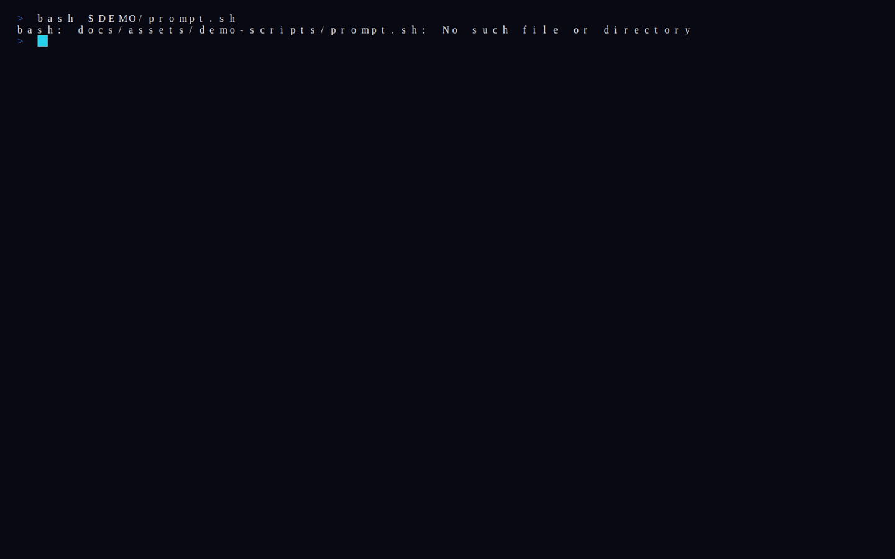
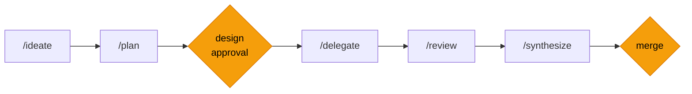
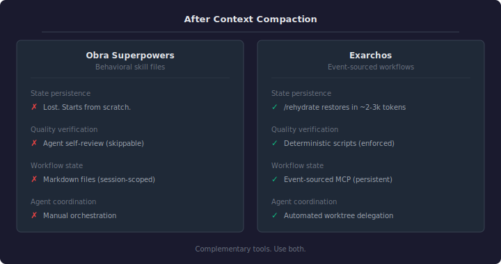

<div align="center">
  

  **Your agents forget. Exarchos doesn't.**<br>
  Durable SDLC workflows for Claude Code — checkpoint any task, rehydrate in seconds, ship verified code.

  [](LICENSE)
  [](https://nodejs.org)

  [Install](#install) · [How It Works](#how-it-works) · [Workflows](#workflows) · [Docs](docs/)
</div>

---

<!-- TODO: Hero demo — uncomment the block below after creating docs/assets/demo-rehydrate.gif
     What to record:
       1. Mid-feature workflow: show /checkpoint saving state
       2. New session: show /rehydrate restoring phase, tasks, artifact pointers
       3. Agent continues exactly where it left off
     Tools: vhs (https://github.com/charmbracelet/vhs) or asciinema + agg
     Specs: 720px wide, 15-20s, dark terminal, no typing delays > 50ms
     See docs/assets/PRODUCTION-GUIDE.md for full instructions

<div align="center">
  <a href="docs/assets/demo-rehydrate.gif">
    
  </a>
  <br>
  <sub>Checkpoint mid-feature. Rehydrate next day. Full workflow restored in ~2k tokens.</sub>
</div>
-->

## You probably already do this

You have a plan.md. Maybe a spec file per feature. You iterate with Claude, tell it to execute, commit the artifacts alongside the code. It works.

Until context compaction wipes the session halfway through. Or the agent drifts from the spec and you don't catch it until review. Or you come back tomorrow and spend 30 minutes re-explaining what the agent already knew.

Developers keep reinventing this on their own: iterate on a plan file, execute it, commit the artifacts. The most popular attempt to systematize it, [Obra Superpowers](https://github.com/obra/superpowers), shapes agent behavior through 20+ markdown skill files. But it's stateless. Nothing persists across context compaction, suggestions get ignored as conversations grow, and there's no verification that the agent followed through.

The plan-file workflow is the right instinct. Markdown files just can't persist state across sessions, enforce phase gates, or prove that the agent actually did what you asked.

## Your plan.md workflow, with teeth

Exarchos saves workflow state to an event-sourced MCP server, not markdown files or conversation history. When context compaction hits (or you close your laptop and come back Monday), run `/rehydrate`. Your workflow picks up where it left off.

```
# Friday afternoon, mid-feature
/checkpoint                  → state saved to event store

# Monday morning, fresh session
/rehydrate                   → restored in ~2-3k tokens
                               phase: delegate (3/5 tasks complete)
                               design: docs/designs/auth-redesign.md
                               next action: dispatch remaining tasks
```

Design docs, plans, and PR links persist as references — never inlined into context. State size stays constant regardless of how many artifacts your workflow generates.

## Install

```bash
# From the Claude Code marketplace
/plugin marketplace add lvlup-sw/exarchos
/plugin install exarchos@lvlup-sw
```

That's it. Installs the MCP server, all workflow commands, lifecycle hooks, and validation scripts.

**Dev companion** (optional — adds GitHub, Serena, Context7, Microsoft Learn MCP servers):
```bash
npx @lvlup-sw/exarchos-dev
```

<details>
<summary>Development setup</summary>

```bash
git clone https://github.com/lvlup-sw/exarchos.git && cd exarchos
npm install && npm run build
claude --plugin-dir .
```

Requires Node.js >= 20. Migrating from the legacy installer? See the [migration guide](docs/migration-from-legacy-installer.md).
</details>

## What you get

**Structured SDLC workflows.** Design, plan, implement, review, ship. Three workflow types (feature, debug, refactor) with enforced phase transitions. You approve twice: the design and the merge. Everything between auto-continues.

**Checkpoint + rehydrate.** Save mid-task, resume days later. `/rehydrate` restores full awareness in ~2-3k tokens instead of re-explaining your project from scratch.

**Agent teams.** Delegate to parallel Claude Code instances, each in its own git worktree. Two approvals, not eight tmux panes.

**Two-stage review.** Spec compliance first (does it match the design?), then code quality (is it well-written?). Deterministic verification scripts, not vibes.

**Audit trail.** Every transition, gate result, and agent decision goes into an append-only event log. When something breaks, you trace what happened.

**Token-efficient.** State queries use field projection (90% fewer tokens). Code review sends diffs, not full files (97% savings on large repos). Context economy is a quality gate: code too complex for LLM context can't ship.

## Workflows

> Commands shown in short form (`/ideate`). As a plugin, they're namespaced: `/exarchos:ideate`, `/exarchos:plan`, etc.

| Start here | Command | What it does |
|:-----------|:--------|:-------------|
| New feature | `/ideate` | Design exploration → TDD plan → parallel implementation |
| Bug fix | `/debug` | Triage → investigate → fix → validate (hotfix or thorough) |
| Code improvement | `/refactor` | Scope → brief → implement (polish or full overhaul) |
| Resume anything | `/rehydrate` | Restore workflow state after compaction or session break |
| Save progress | `/checkpoint` | Persist current state for later resumption |

### Feature workflow



Phase commands auto-chain between the two human checkpoints (amber). Debug and refactor workflows follow similar patterns — see [workflow docs](docs/).

## How it works

Your Claude Code session is the orchestrator. Exarchos manages state; you make decisions at each checkpoint. Teammates execute in isolated git worktrees.

<div align="center">
  <a href="docs/assets/architecture.svg">
    
  </a>
  <br>
  <sub>Click to view animated version — task dispatch, progress, PR review, convergence gates.</sub>
</div>

### Integrations

| Component | Source | Purpose |
|-----------|--------|---------|
| **Exarchos** | Core plugin | Workflow orchestration, event log, team coordination, quality gates |
| **GitHub** | [Dev companion](companion/) | PRs, issues, code search, stacked PR management |
| **Serena** | [Dev companion](companion/) | Semantic code analysis |
| **Context7** | [Dev companion](companion/) | Up-to-date library documentation |
| **Microsoft Learn** | [Dev companion](companion/) | Official Azure/.NET documentation |

## Compared to alternatives

<div align="center">
  
</div>

<details>
<summary>Full comparison matrix</summary>

|  | Exarchos | Superpowers | Task Master | Auto-Claude | Raw Claude Code |
|:--|:--:|:--:|:--:|:--:|:--:|
| Durable state (survives compaction) | **Yes** | No | Partial | No | No |
| Phase-gated SDLC workflows | **Yes** | Partial | No | Partial | No |
| Automated quality gates | **5 dimensions** | No | No | No | No |
| Parallel agent teams | **Yes** | Partial | No | Yes | Yes |
| Checkpoint + resume | **Yes** | No | No | No | No |
| Event-sourced audit trail | **Yes** | No | No | No | No |
| Enforced vs. suggested | **Enforced** | Suggested | N/A | N/A | N/A |
| Free & open-source | Yes | Yes | Yes | Yes | N/A |

</details>

Superpowers shapes behavior; Exarchos persists and verifies it. They're complementary — use both.

<!-- ## Scaling Up

Exarchos runs entirely on your local machine. For teams that need cloud
execution in secure sandboxes, multi-provider model routing, and
enterprise observability, see [Basileus](https://basileus.dev) — the
platform that Exarchos workflows connect to. -->

## Build & test

```bash
npm run build          # tsc + bun → dist/
npm run test:run       # vitest single run
npm run typecheck      # tsc --noEmit
npm run validate       # Validate plugin structure
```

## License

Apache-2.0 — see [LICENSE](LICENSE).
