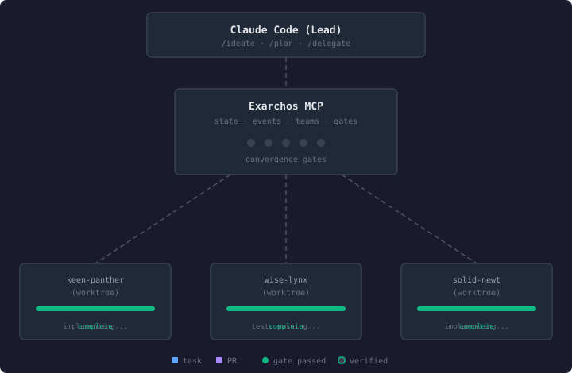

<div align="center">
  
  
  **Your agents forget. Exarchos doesn't.**<br>
  Persistent SDLC state for any AI coding agent. Survives `/clear`, auto-compaction, and context overflow.<br>
  First-class with Claude Code, Codex, Cursor, OpenCode, Copilot; works with any agent that can run a CLI.

  [](https://github.com/lvlup-sw/exarchos/actions/workflows/ci.yml)
  [](https://www.npmjs.com/package/@lvlup-sw/exarchos)
  [](LICENSE)

  [Install](#install) · [What's different](#whats-different) · [What you get](#what-you-get) · [Architecture](#agent-first-architecture) · [Docs](https://lvlup-sw.github.io/exarchos/)
</div>

---

## You already manage this by hand

A `plan.md` per feature. `CLAUDE.md` rewritten between sessions. Summaries scrawled before `/clear` so the next session has something to start from. Phases enforced by you reminding the agent. It works. It's also manual, and one long context window away from the agent ignoring all of it.

## Survives `/clear`

Return to any suspended workflow by running `/rehydrate`.

```text
❯ /exarchos:rehydrate payments-v2-migration

Workflow Rehydrated: payments-v2-migration

  Phase: implementing | Type: feature

  Task Progress
    4 of 7 complete · last commit on feature/payments-v2

  Artifacts
    Design: docs/designs/payments-v2.md
    Plan:   docs/plans/payments-v2.md
    PR:     not yet created

  Next Action
    Continue task 5 (gates pending). Run /delegate or pick up manually.
```

State doesn't live in your conversation. It lives in an append-only event log. `/rehydrate` is a projection that rebuilds the workflow document for a fresh context window. The whole thing fits in about 2,500 tokens.

## Your plan.md workflow, with teeth

A state machine owns phase transitions, not a paragraph in `CLAUDE.md`. Convergence between phases ("is this implemented?", "does it match the design?") runs as TypeScript checks against your diff and git history, not prompts the agent can talk itself out of. You approve the design and you approve the merge. The middle runs on its own.

Run `/ideate` to start.

<div align="center">
  <a href="docs/assets/architecture.svg">
    
  </a>
  <br>
  <sub>Architecture: workflow phases, agent dispatch, convergence gates.</sub>
</div>

## Works with your agent

The CLI is the universal surface. Each runtime talks to it through whichever invocation it speaks natively.

| Runtime | Transport | Skill rendering | Slash commands |
|---------|-----------|-----------------|----------------|
| **Claude Code** | Plugin + MCP | First-class (rendered + hooks) | Yes (`/ideate`, `/plan`, etc.) |
| **Codex CLI** | MCP | First-class | Via Codex's command surface |
| **Cursor** | MCP | First-class | Via Cursor's MCP integration |
| **OpenCode** | CLI | First-class | Via OpenCode's runtime |
| **GitHub Copilot CLI** | CLI | First-class | Via Copilot's runtime |
| Anything else | CLI | Generic bundle | Whatever your agent supports |

## Install

The CLI works universally. For Claude Code, the recommended install path is the plugin.

**Standalone CLI / MCP server (any agent, any runtime):**

```bash
# Unix (macOS / Linux)
curl -fsSL https://lvlup-sw.github.io/exarchos/get-exarchos.sh | bash

# Windows (PowerShell)
irm https://lvlup-sw.github.io/exarchos/get-exarchos.ps1 | iex
```

### Verification
```bash
exarchos --version
exarchos doctor
exarchos mcp	// starts MCP server over stdio
```

### Onboard

```bash
exarchos onboard
```

One command drives the repo to a green `doctor`: it detects the runtimes + VCS on your `PATH`, writes/reconciles agent config, installs the matching skills, registers the SessionStart binding, then verifies. It is **idempotent** — re-running reconciles drift only.

| Flag | Effect |
|---|---|
| `--new <name>` | Scaffold a fresh project in `<name>/`, then onboard it. |
| `--dry-run` | Print the reconcile plan; write nothing, emit no events. |
| `--force` | Overwrite hand-edited config (preserved otherwise). |
| `--no-hooks` | Skip the SessionStart hook binding. |
| `--runtime <id>` | Target an explicit runtime (`claude`, `codex`, `opencode`, `copilot`, `cursor`, `generic`); bypasses detection. |

To re-check (without writing) at any time, run `exarchos doctor`; to re-apply just the remediable diff, run `exarchos doctor --fix`.

If a step fails (e.g. an offline skills/deps install), `onboard` exits non-zero and prints a **forward-only** advisory: already-applied steps are kept (reconcile never rolls back), so the recovery is to fix the cause and **re-run** — `onboard` resumes from the residual diff.

> **Renamed in v2.10.2:** the old `init`, `install-skills`, and `new-project` verbs were consolidated into `onboard` (use `onboard --new` for greenfield). They survive one release as error stubs that print `renamed → use 'exarchos onboard'` and are removed at v3.0.

### Claude Code plugin

```bash
/plugin marketplace add lvlup-sw/.github
/plugin install exarchos@lvlup-sw
```

Same binary underneath. Adds Claude Code slash commands, hooks, and rendered skills.

> **No SSH key?** Use the HTTPS URL: `https://github.com/lvlup-sw/.github.git`

For two-step (download + inspect + run), channel selection, validation, update, and uninstall: see the [full install guide](https://lvlup-sw.github.io/exarchos/guide/installation).

## What's different

Other approaches in this space optimize for different things. None are wrong. They answer different questions.

| Approach | What it gives you | Best for |
|----------|-------------------|----------|
| Plan files in repo (manual) | A surface to write context to | Solo, short-lived projects, simple tasks |
| Memory layers | Re-injection of relevant past conversation slices | Cross-session chat continuity |
| Spec-driven toolkits | Artifacts (spec, plan, tasks) as deliverables | Greenfield work where the spec is the deliverable |
| Multi-agent simulators | Many specialized AI personas in concert | Enterprise greenfield with heavy planning |
| Workflow DAG engines | A general-purpose runner for any DAG you write | Custom orchestration across your own pipelines |
| **Workflow harness (Exarchos)** | **Enforced SDLC + event log + rehydratable state** | **Solo and team SDLC work that needs to survive `/clear`** |

A harness is opinionated about the shape of work. An engine isn't. Exarchos's shape is the SDLC, and the state survives `/clear` because it lives in an event log instead of the context window.

## What you get

**`/clear` no longer costs you anything.** State lives in an append-only event log. `/checkpoint` saves mid-task; `/rehydrate` restores the full workflow document (phase, design, task table, gate results) in about 2,500 tokens. If state and reality drift, reconcile from any point in history.

**Phases that enforce themselves.** A state machine owns transitions across four workflow types: `feature`, `debug`, `refactor`, `oneshot`. The agent can't skip review because the context got long. The state machine refuses the transition.

**Convergence gates run as code.** Two-stage review. Spec compliance first ("does this match the approved design?"), code quality second ("is it well-written?"). Both are TypeScript checks against your diff and git history, with exit codes. No "the model should evaluate."

**Typed agent teams in worktrees.** Three roles, scoped tools. Implementer writes code via TDD. Fixer resumes failed tasks with the failure event in context, not a fresh start. Reviewer is read-only and can't edit files. Each role runs in its own git worktree.

Audit trail comes free. Every transition, gate result, and agent action lands in the event log.

Token-efficient by construction. ≤500 tokens to register the MCP surface. Lazy schema loading. Field projection trims state queries by ~90%. Review sends diffs only.

### Agent-first architecture

Exarchos ships as a single binary (`exarchos`) with an `mcp` subcommand. Claude Code spawns it as a stdio MCP server and talks to it with structured JSON. Four composite tools cover the surface:

| Tool | What it does |
|------|-------------|
| `exarchos_workflow` | Workflow lifecycle: init, get, set, cancel, cleanup, reconcile |
| `exarchos_event` | Append-only event store: append, query, batch |
| `exarchos_orchestrate` | Team coordination: task dispatch, review triage, runbooks, agent specs |
| `exarchos_view` | CQRS projections: pipeline status, task boards, stack health |

All four tools support lazy schema loading via `describe`. At startup, only slim descriptions and action enums are registered. Full schemas load on demand.

`exarchos_view`'s telemetry actions accept correlation filter args — `operationId`, `correlationId`, `causationId` — so an agent can scope telemetry to the active workflow. Inside an active dispatch context, the filter auto-defaults to the chain anchor; explicit args always win. See [`docs/runbooks/correlation-filters.md`](docs/runbooks/correlation-filters.md) for the surface.

Every tool input is a Zod-validated discriminated union keyed on `action`. The same `dispatch()` function backs both the MCP transport and the CLI, so `exarchos workflow get --featureId my-feature` from a terminal returns the same result the agent gets.

Structured input over natural language and strict schema validation over loose parsing. One binary with the same behavior whether an agent or a human is driving it.

### Works well alongside

Exarchos focuses on workflow structure. It doesn't duplicate code-analysis or documentation-retrieval MCP servers. If you want those, install them yourself alongside Exarchos; your agent can use them independently. Exarchos does not bundle, install, or vendor any of them.

## Workflows

> Commands shown in short form (`/ideate`). As a plugin, they're namespaced: `/exarchos:ideate`, `/exarchos:plan`, etc.

**Start a workflow:**

| When you need to... | Command | What it does |
|:---------------------|:--------|:-------------|
| Build a feature | `/ideate` | Design exploration, TDD plan, parallel implementation |
| Fix a bug | `/debug` | Triage, investigate, fix, validate (hotfix or thorough) |
| Improve code | `/refactor` | Assess scope, brief, implement (polish or full overhaul) |
| Make a trivial change | `/oneshot` | Lightweight in-session plan → implementing → direct-commit (or opt-in PR) |

**Lifecycle commands:**

| Command | What it does |
|:--------|:-------------|
| `/plan` | Create TDD implementation plan from a design doc |
| `/delegate` | Dispatch tasks to agent teammates in worktrees |
| `/review` | Run two-stage review (spec compliance + code quality) |
| `/synthesize` | Create PR from feature branch |
| `/shepherd` | Push PRs through CI and reviews to merge readiness |
| `/cleanup` | Resolve merged workflow to completed state |
| `/prune` | Interactively bulk-cancel stale non-terminal workflows |
| `/checkpoint` | Save workflow state for later resumption |
| `/rehydrate` | Restore workflow state after compaction or session break |
| `/reload` | Re-inject context after degradation |
| `/autocompact` | Toggle autocompact or set threshold |
| `/tag` | Attribute current session to a feature or project |
| `/tdd` | Plan implementation using strict Red-Green-Refactor |

## Build & test

```bash
npm run build          # tsc + 5 cross-compiled binaries via `bun build --compile` → dist/bin/
npm run build:binary   # binaries only (skips tsc + skill render)
npm run test:run       # vitest single run
npm run typecheck      # tsc --noEmit
npm run version:check  # verify version is in sync across the 7 derived call sites
npm run validate       # validate plugin structure
```

## License

Apache-2.0. See [LICENSE](LICENSE).
