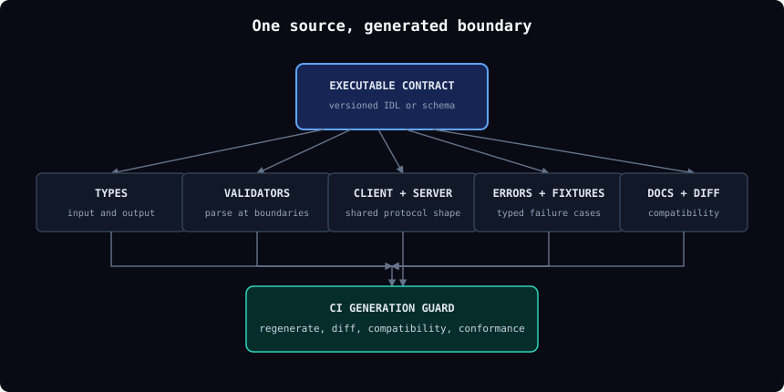
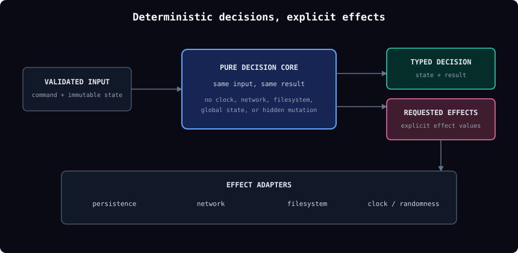
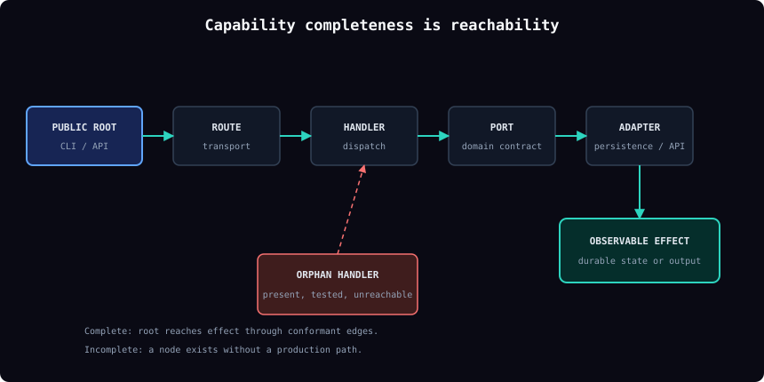
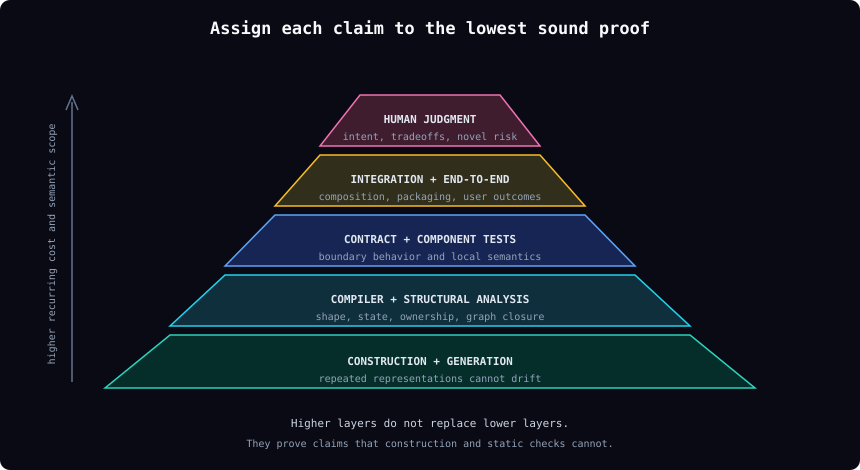

# Seven structural principles for AI-driven development

## Premise

Code is now cheap to produce. Proof is not.

AI can generate a large implementation before a reviewer has reconstructed the problem, mapped the dependencies, or identified the relevant invariants. If the codebase relies on handwritten synchronization, hidden wiring, mutable shared state, and broad end-to-end tests, verification cost rises with every generated component.

The response is architectural:

> Move correctness claims into structures that are cheap to re-prove: generated contracts, algebraic types, pure functions, explicit module boundaries, enumerable integration graphs, layered proofs, and permanent ratchets.

Functional programming supplies several of these structures. Algebraic data types reduce invalid states. Pure functions make behavior deterministic. Immutable values and explicit effects make dependencies visible. These techniques are necessary but not sufficient. Purity cannot prove that a handler is registered, a client matches a server, or the shipped artifact contains the intended feature. The seven principles combine functional techniques with contract generation and integration proof.

## Definitions

Let:

- \(O(C)\) be the set of correctness obligations for a codebase \(C\);
- \(M(p)\) be the sound methods available to prove an obligation \(p\);
- \(\operatorname{cost}(m)\) be the recurring cost of applying proof method \(m\).

The design objective is:

\[
V(C) = \sum_{p \in O(C)} \min_{m \in M(p)} \operatorname{cost}(m)
\]

This is not a predictive cost model. It is a design test. For each correctness claim, use the cheapest sound proof. A compiler check is preferable to a repeated test. A generated artifact is preferable to synchronized copies. A local contract proof is preferable to reconstructing a monolith.

The preferred proof order is:

1. construction and generation;
2. compiler and type system;
3. deterministic structural analysis;
4. contract and component tests;
5. production-path integration tests;
6. human judgment.

## Principle 1: Generate every boundary from one contract

### Statement

Each boundary has one executable, versioned contract. Static types, runtime validators, clients, server interfaces, errors, fixtures, compatibility metadata, and reference documentation are generated from it.



> **Lemma 1 (representation consistency).** If \(n\) boundary representations can change independently, the system carries \(n\) source-conformance obligations and up to \(n(n-1)/2\) pairwise consistency relationships. If all \(n\) representations are deterministic products of one source \(S\), maintenance reduces to validating \(S\), the generators, and semantic implementation conformance.

**Argument.** Independent representations can drift in any direction. Tests may compare some pairs, but every untested pair remains a possible contradiction. Generation removes independent editability. The generated artifacts may still be wrong if the source or generator is wrong, but the number of moving facts falls sharply.

### Code rules

- Author APIs, commands, events, persisted records, configuration, and error envelopes in an IDL or schema language.
- Generate both input and output types.
- Generate runtime parsers at trust boundaries. Static types do not validate network, file, or database input.
- Generate client and provider conformance fixtures.
- Generate compatibility metadata and documentation from the same source.
- Keep handwritten business behavior behind generated server interfaces.
- Ban authoritative copies of field names, enum values, event names, and error codes.

Typical pipeline:

```text
contract
  -> static types
  -> runtime validators
  -> client SDK
  -> server interface
  -> error union
  -> fixtures
  -> compatibility report
  -> reference documentation
```

### Required proof

CI must:

1. regenerate all contract artifacts;
2. fail if generation changes the working tree;
3. compare the contract with the target branch;
4. reject forbidden compatibility breaks;
5. run generated provider and consumer conformance suites.

A generated request type paired with a handwritten response object does not satisfy the principle. Half the boundary remains synchronized by convention.

## Principle 2: Make domain behavior algebraic and effects explicit

### Statement

Represent valid domain states with algebraic types. Express decisions as pure functions. Move I/O, time, randomness, persistence, and external mutation behind typed effect ports.



> **Lemma 2 (state-space reduction).** A representation with \(m\) independent booleans admits \(2^m\) configurations before additional constraints. A sum type with \(k\) legal constructors admits exactly the \(k\) represented modes, excluding invalid combinations by construction.

**Argument.** Verification effort grows with reachable state. Boolean flags, nullable fields, sentinel values, and partial objects admit combinations the domain never intended. Algebraic types encode the legal alternatives directly. Pure functions then map explicit input and state to explicit output without hidden dependencies, making the same input reproducible.

### Code rules

- Use discriminated unions or sealed hierarchies instead of related booleans.
- Use nominal or branded identifiers instead of plain strings.
- Use validated value objects for paths, versions, money, digests, and timestamps.
- Use non-empty collection types when emptiness is invalid.
- Require exhaustive pattern matching. Avoid catch-all branches over closed domains.
- Return typed results such as `Result`, `Either`, or a discriminated error union.
- Pass clocks, random sources, environment, filesystem, network, and persistence through explicit ports.
- Keep state immutable inside the decision layer.
- Represent lifecycle changes as typed commands and state transitions, not field assignment.

Example:

```ts
type GateResult =
  | { kind: "passed"; evidence: EvidenceRef }
  | { kind: "failed"; reason: FailureReason }
  | { kind: "indeterminate"; cause: InfrastructureFailure };
```

This type prevents a caller from treating missing evidence as success. A structure such as `{ passed: boolean; error?: string }` does not.

### Required proof

- Strict compiler settings are mandatory.
- Closed unions require exhaustive handling.
- Raw transport and persistence values are parsed before entering domain code.
- Pure decisions are covered by property, model-based, or exhaustive tests.
- Effect adapters pass contract tests.
- Transition admission and persistence are atomic where concurrency matters.
- Commands that may repeat are idempotent.

Functional programming carries most of this principle. The purpose is not stylistic purity. The purpose is a smaller state space and cheaper local proof.

## Principle 3: Modularize around independently provable units

### Statement

A module owns a coherent set of invariants, exposes a narrow contract, declares every dependency and effect, and can be verified through its public boundary.

> **Lemma 3 (compositional verification).** Suppose modules \(A_1, \ldots, A_n\) have complete contracts, no hidden shared state, and interactions only through those contracts. System verification decomposes into module conformance plus contract composition. If interactions bypass contracts, consumers must reason about provider internals and the decomposition is unsound.

**Argument.** A useful module boundary lets verification stop. Once a provider proves its contract, each consumer can rely on that contract instead of rechecking the provider's implementation. Hidden database writes, global state, reflection-based coupling, and internal imports destroy this property because behavior crosses the boundary without appearing in its contract.

### Code rules

Each module declares:

- public inputs and outputs;
- owned invariants;
- owned state;
- allowed effects;
- dependencies;
- failure modes;
- compatibility policy.

Enforce:

- directional dependencies;
- no dependency cycles;
- no direct writes to another module's state;
- no internal imports across module boundaries;
- adapters for external systems;
- public test seams instead of privileged access to internals.

Prefer a functional core inside each module. The module boundary then contains the effects while the core remains deterministic.

### Required proof

- Architecture checks enforce allowed imports and ownership.
- Every implementation passes its module contract suite.
- Reverse dependencies can be computed from declared contracts.
- A module can be tested through its public interface.
- Replacement implementations can be checked with the same conformance suite.

If a module cannot be verified without reaching into its internals, its public contract is incomplete or its responsibilities are mixed.

## Principle 4: Make integration completeness a graph property

### Statement

Represent the production composition as a directed graph. A capability is complete only when the required path from public entry point to observable effect exists, every edge is implemented, and the path is exercised through the shipped composition root.



> **Lemma 4 (presence does not imply reachability).** Let \(G = (N, E)\) be a directed integration graph, \(r\) a public root, and \(q\) a required effect. The presence of all intended nodes in \(N\) does not imply that \(q\) is reachable from \(r\). Capability completeness requires a valid path \(r \leadsto q\) and conformance of every edge on that path.

**Argument.** Unit tests can prove that each node works in isolation while the production feature remains dead. A handler may have no route. A provider may never be selected. A generated client may target a shape the server does not expose. Reachability is a separate property and must be proved directly.

### Code rules

Materialize integration in typed registries or generated manifests:

```text
operation -> route -> handler -> domain port -> adapter
event -> producer -> schema -> registry -> consumer
command -> parser -> validator -> handler -> serializer
plugin -> capability -> implementation -> activation path
```

Generate or validate the graph during the build. Do not leave required wiring implicit in file names, reflection, scattered imports, or prose.

Maintain a ship-surface manifest:

| Capability | Public root | Required effect | Shipped artifact | Proof fixture |
|---|---|---|---|---|
| Create task | CLI/API | task persisted | CLI/server bundle | fixture ID |
| Transition state | API | projection updated | server bundle | fixture ID |
| Install plugin | bootstrap | files installed | release archive | fixture ID |

### Required proof

Static closure checks fail on:

- public operations without handlers;
- handlers without reachable callers;
- capabilities without implementations;
- implementations never selected by the composition root;
- events without schemas;
- required consumers that are absent;
- configuration reads without declarations;
- gates with no production caller.

Static closure is followed by a small production-path test that uses the real public entry point, transport, dependency graph, persistence, configuration, and packaged artifact.

Exarchos [PR #1424](https://github.com/lvlup-sw/exarchos/pull/1424), [issue #1436](https://github.com/lvlup-sw/exarchos/issues/1436), and [issue #1451](https://github.com/lvlup-sw/exarchos/issues/1451) demonstrate the failure: schemas, helpers, adapters, and unit tests existed, but the production path never fired.

## Principle 5: Assign every claim to the cheapest sound proof

### Statement

Every acceptance criterion names one primary proof layer. Higher-cost layers verify only claims that lower-cost layers cannot establish.



> **Lemma 5 (proof-layer dominance).** If method \(a\) soundly enforces property \(p\) for every construction and has lower recurring cost than method \(b\), repeatedly applying \(b\) to recheck \(p\) adds cost without increasing detection for \(p\). Method \(b\) remains useful only for properties outside the scope of \(a\).

**Argument.** A compiler can prove exhaustiveness on every build. An end-to-end test can sample only chosen paths. Using the end-to-end suite to re-prove enum closure is slower and weaker. The reverse mistake is also common: static types cannot prove that a distributed side effect occurred or that the packaged program starts. Each claim belongs at the lowest layer that can soundly prove it.

### Code rules

| Layer | Claims it should own |
|---|---|
| Generation | repeated representation consistency |
| Compiler | shape, exhaustiveness, ownership, illegal state |
| Structural analysis | dependency direction, graph closure, forbidden APIs |
| Contract tests | provider and consumer agreement |
| Component tests | module semantics under controlled effects |
| Integration tests | transport, persistence, composition, packaging |
| End-to-end tests | a small set of valuable user outcomes |
| Human review | intent, tradeoffs, maintainability, novel risk |

Use property-based, model-based, fuzz, differential, and metamorphic tests when the obligation describes a behavior space rather than a few examples. Use mutation testing to check whether the suite detects representative faults.

### Required proof

Each acceptance criterion records:

- the property being claimed;
- the primary proof layer;
- the artifact or fixture that implements the proof;
- the failure signal;
- the reason a cheaper layer is insufficient.

A criterion without a named proof is incomplete. A test count or coverage percentage is not a proof assignment.

## Principle 6: Make every change proof-carrying and bounded

### Statement

A change includes machine-readable evidence of its affected contracts, reverse dependencies, selected checks, generated artifacts, production-path proofs, and rollback boundary. Evidence is bound to the exact revision and artifact.

> **Lemma 6 (impact closure).** If all dependencies are explicit in graph \(G\), the reverse transitive closure of a changed contract contains every component that may depend on that contract. Test selection over this closure is sound with respect to declared dependencies. Hidden edges make the selection unsound.

**Argument.** Reviewers should not reconstruct the blast radius from a large diff. The dependency graph already contains most of the answer if the architecture has honest boundaries. A change can then carry its own proof plan. Hidden dependencies are not merely untidy; they prevent sound impact analysis.

### Code rules

For each change, derive:

```text
changed contract
  -> compatibility classification
  -> reverse dependency closure
  -> generated diff
  -> selected conformance and component checks
  -> required production-path fixtures
  -> packaged artifact
  -> rollback or disable path
```

Keep changes small enough that this closure remains reviewable. Use directional dependencies, isolated state ownership, stable adapters, and feature switches at contract boundaries.

Bind all evidence to:

- source revision;
- contract digest;
- generator and tool versions;
- policy or suite version;
- artifact digest;
- execution environment.

### Required proof

- The affected set is generated from the dependency graph.
- Contract changes receive an explicit compatibility classification.
- Evidence from another revision is rejected as stale.
- The packaged artifact is the subject of the final production-path proof.
- High-consequence changes have a tested rollback or disable path.

A green check without a subject binding is evidence that something passed, not that this change passed.

## Principle 7: Convert verification discoveries into structural ratchets

### Statement

When review, testing, or production reveals a defect class, encode the lesson at the earliest structural layer that can prevent recurrence. Pair each ratchet with a fixture that proves the control fails on the old defect.

> **Lemma 7 (ratchet break-even).** Let \(g\) be the one-time cost of a structural guard, \(p\) the probability that a defect class recurs per change, \(r\) the cost of detecting and repairing one recurrence, and \(N\) the expected number of future changes. The guard reduces expected cost when \(g < Npr\), before accounting for escaped defects.

**Argument.** Manual review charges the same reasoning cost on every change and still misses cases. A type, generator, architecture check, or adversarial fixture pays once and runs repeatedly. The second occurrence of the same defect class is evidence that the current proof system is too weak.

### Code rules

Choose the earliest sound ratchet:

1. constructor or algebraic type;
2. generated contract;
3. state-machine restriction;
4. dependency or integration-graph check;
5. generated conformance fixture;
6. property, mutation, or fault-injection test;
7. production-path regression;
8. human checklist only when the rule cannot be encoded.

Failures must be explicit and typed. Do not allow:

- broad catches that convert failure into a default;
- skipped checks reported as passing;
- stale state used as a success fallback;
- warning text inside a success result;
- logs as the only failure channel;
- infrastructure uncertainty collapsed into product failure.

Every gate has three outcomes: pass, fail, and indeterminate. For protected actions, fail and indeterminate both block promotion, but they produce different remediation.

### Required proof

- The old defect is preserved as a kill fixture.
- The new guard fails on that fixture.
- The guard runs on every protected path.
- Its own execution failure cannot become success.
- Its scope, subject, and resource limits are explicit.
- Temporary exceptions have an owner and expiry.

Exarchos [issue #1701](https://github.com/lvlup-sw/exarchos/issues/1701) and [issue #1721](https://github.com/lvlup-sw/exarchos/issues/1721) show why gates need these guarantees. A required job could be skipped and treated as passing; another gate scanned the wrong checkout and exhausted memory.

## Repository application

### Minimum module contract

Every module provides:

- one generated public contract;
- explicit invariant and state ownership;
- algebraic domain types;
- a pure decision core where practical;
- typed effect ports;
- generated provider conformance tests;
- property or model-based tests for its state space;
- typed failures;
- a compatibility policy.

### Minimum public capability record

Every public capability has:

- an entry in the integration graph;
- one public root;
- one declared observable effect;
- a reachable production path;
- a packaged-artifact fixture;
- a rollback or disable mechanism when consequence is high.

### CI order

Run checks from cheapest to most expensive:

1. regenerate contracts and require a clean tree;
2. compile with strict and exhaustive checks;
3. validate module ownership and dependency direction;
4. validate integration-graph closure;
5. compare contracts with the target branch;
6. run generated conformance suites;
7. run affected property and component tests;
8. run mutation or fault-injection checks for critical logic;
9. run the smallest production-path suite that proves shipped composition;
10. bind the results to the produced artifact.

### Definition of done

A change is complete when:

- every changed boundary has one versioned source;
- repeated representations are generated;
- invalid domain states are excluded where the language permits;
- domain decisions are deterministic or expose their effects;
- affected modules are independently verifiable;
- all required integration edges are reachable;
- the shipped artifact proves the intended outcome;
- proof selection matches the affected obligations;
- evidence is bound to the exact revision and artifact;
- recurring defect classes have structural ratchets;
- the blast radius and rollback boundary are known.

## Evidence and sources

Repository evidence:

- [E2E testing strategy](docs/research/2026-04-19-e2e-testing-strategy.md)
- [Event-sourced task-store audit](docs/research/2026-05-16-event-sourced-task-store-audit.md)
- [Methodology drift audit](docs/research/2026-06-21-methodology-drift-audit.md)
- [Phase-gate redesign strategy](docs/research/2026-07-21-phase-gate-redesign-strategy.md)
- [Issue #1370](https://github.com/lvlup-sw/exarchos/issues/1370): prose and state-transition drift
- [Issue #1696](https://github.com/lvlup-sw/exarchos/issues/1696): repeated authoritative claims
- [Issues #1436](https://github.com/lvlup-sw/exarchos/issues/1436) and [#1451](https://github.com/lvlup-sw/exarchos/issues/1451): components present without a working production path
- [Issues #1701](https://github.com/lvlup-sw/exarchos/issues/1701) and [#1721](https://github.com/lvlup-sw/exarchos/issues/1721): verification controls that did not reliably verify

Supporting research:

- Anthropic, [Building effective agents](https://www.anthropic.com/engineering/building-effective-agents)
- Anthropic, [Effective context engineering for AI agents](https://www.anthropic.com/engineering/effective-context-engineering-for-ai-agents)
- Anthropic, [Writing effective tools for AI agents](https://www.anthropic.com/engineering/writing-tools-for-agents)
- Anthropic, [Demystifying evals for AI agents](https://www.anthropic.com/engineering/demystifying-evals-for-ai-agents)
- OpenAI, [Harness engineering: leveraging Codex in an agent-first world](https://openai.com/index/harness-engineering/)
- Princeton, [SWE-agent: Agent-Computer Interfaces Enable Automated Software Engineering](https://arxiv.org/abs/2405.15793)
- NIST, [Secure Software Development Framework 1.1](https://csrc.nist.gov/pubs/sp/800/218/final)
- SWE-bench, [Verified dataset](https://www.swebench.com/verified.html)
