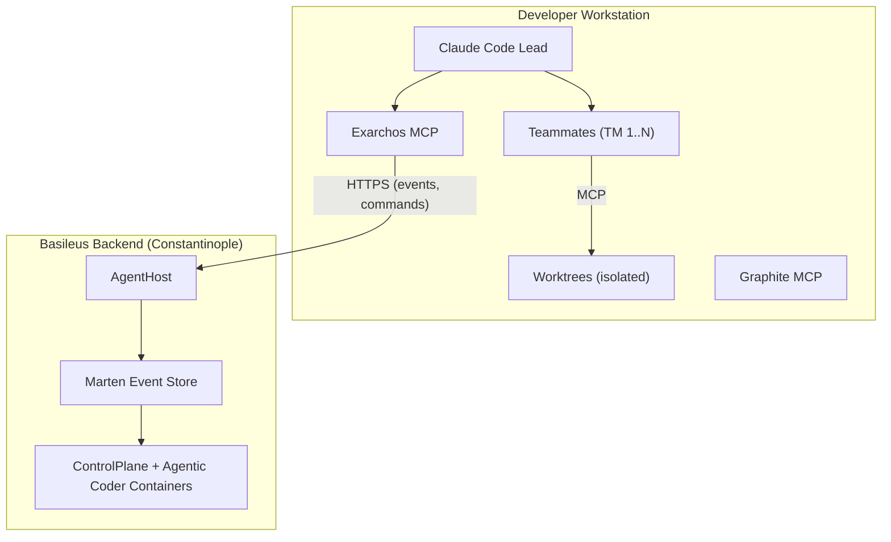
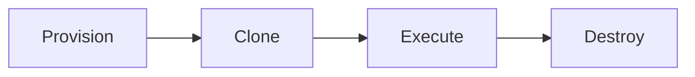
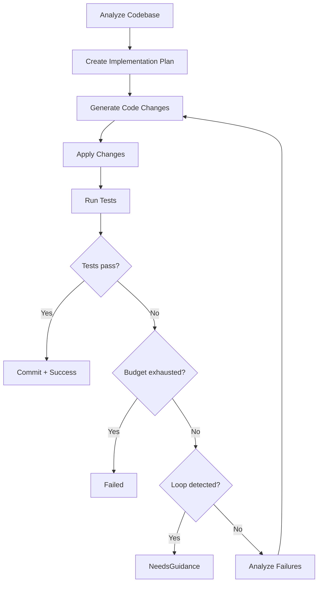
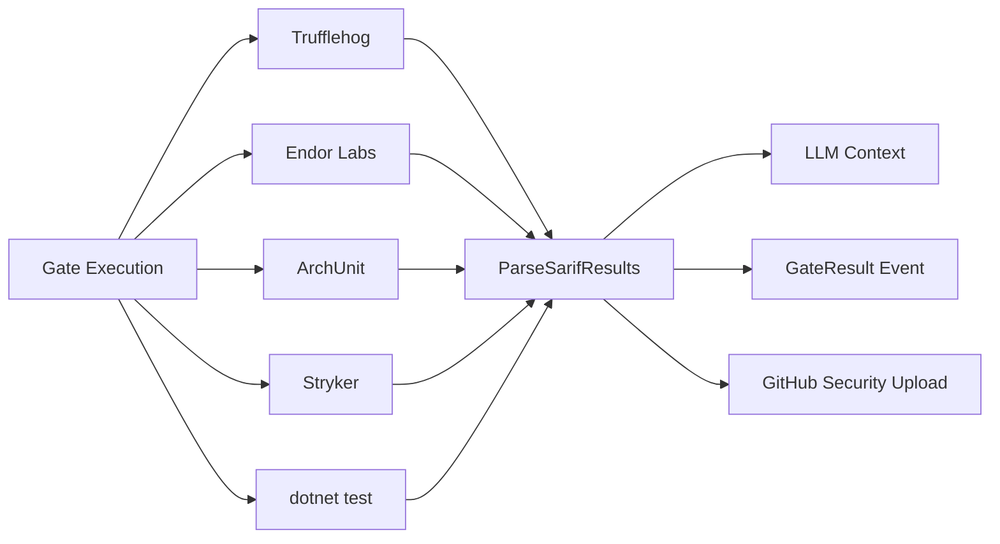

# Distributed SDLC Pipeline

A consolidated design for the distributed agentic SDLC workflow — merging the tiered orchestration vision with Exarchos local agent governance into a single reference document.

---

## Table of Contents

1. [Vision](#1-vision)
2. [Problem Statement](#2-problem-statement)
3. [Architecture Overview](#3-architecture-overview)
4. [Local Tier: Exarchos](#4-local-tier-exarchos)
5. [Task Router](#5-task-router)
6. [Remote Tier: Agentic Coder](#6-remote-tier-agentic-coder)
7. [Unified Event Stream](#7-unified-event-stream)
8. [CQRS Views](#8-cqrs-views)
9. [Invocation Paths](#9-invocation-paths)
10. [Concurrent Feature Pipeline](#10-concurrent-feature-pipeline)
11. [Layered Quality Gates](#11-layered-quality-gates)
12. [Basileus Integration](#12-basileus-integration)
13. [Skill Integration](#13-skill-integration)
14. [Configuration](#14-configuration)
15. [Testing Strategy](#15-testing-strategy)
16. [Implementation Phases](#16-implementation-phases)

---

## 1. Vision

The development workflow today involves two complementary systems operating in isolation:

1. **Exarchos** (local) — Claude Code agent teams coordinated by a bridge MCP server, operating on the developer's machine with git worktrees for isolation and local workflow-state for persistence.
2. **Agentic Coder** (remote) — Autonomous coding agents running in containerized environments on the Basileus backend, with Wolverine sagas for durable state and Marten event sourcing for audit trails.

Combined, these systems unlock a distributed agentic SDLC pipeline where multiple features progress concurrently through design, implementation, review, and delivery — with minimal human checkpoints. The developer's role shifts from writing code to **steering a fleet of agents**.

### Target Outcome

- **Multiple features in flight simultaneously**, each progressing through the full SDLC pipeline
- **Developer-led mode**: Exarchos coordinates local agent teams, delegates heavy tasks to Basileus
- **Autonomous mode**: CI events trigger Basileus directly for bug fixes, dependency updates, and routine tasks
- **Unified observability**: one event stream, one set of views, regardless of where work executes
- **Human checkpoints only** at plan approval and merge confirmation

### Developer Role

The developer does not write code. The developer:

- Initiates features via `/ideate`
- Approves implementation plans
- Monitors progress through CQRS views
- Intervenes when agents request guidance
- Approves final PRs for merge

Everything between plan approval and PR creation is autonomous — local teammates and remote containers execute concurrently, coordinated through a unified event stream.

---

## 2. Problem Statement

The current orchestration model (lvlup-claude) coordinates parallel SDLC workflows using subagents (Task tool) and Jules, with git worktrees for isolation and a local workflow-state MCP server for persistence. This model has three specific limitations motivating the Exarchos design:

1. **No inter-agent collaboration** -- subagents report back to the orchestrator but cannot discuss findings, challenge each other, or coordinate independently.
2. **Context window pressure** -- subagent results return to the main conversation, consuming context. Complex features with many tasks exhaust the orchestrator's window.
3. **Local-only coordination** -- all state lives on the local filesystem. There is no way to coordinate Claude Code sessions across machines or integrate with the Basileus agentic-engine backend.

Claude Code's experimental "agent teams" feature addresses (1) and (2) by giving each teammate its own full session with independent context. This design addresses all three by bridging agent teams with the Basileus event-sourcing infrastructure to enable remotely coordinated multi-agent SDLC workflows.

---

## 3. Architecture Overview

### Combined Architecture Diagram



| Zone | Component | Responsibilities |
|------|-----------|-----------------|
| Developer Workstation | Claude Code Lead | Orchestrator — runs /ideate, /plan, /delegate, /review, /synthesize |
| | Exarchos MCP (unified) | Workflow HSM (state machine transitions + guards), Team Coordinator (spawn/message/shutdown teammates), Event Store (local JSONL + outbox), Task Router (local vs. remote dispatch), View Materializer (merged CQRS views). Single server exposes 27 MCP tools. |
| | Teammates | Parallel implementation and review agents, each with independent context |
| | Worktrees | Isolated git worktrees per task branch |
| | Graphite MCP | Stack management, PR submission, merge queue integration |
| Basileus Backend | AgentHost | Workflow Registry (all active workflows), Agentic Coder Sagas, Cross-Session Coordinator (dependency resolution, resource allocation) |
| | Marten Event Store | Unified stream per workflow (local + remote events), CQRS Projections (PipelineView, UnifiedTaskView, WorkflowStatusView, TeamStatusView, TaskDetailView) |
| | ControlPlane + Containers | Container per coding task — cloned repo, dev tooling, MCP tools, autonomous plan-code-test-review loop, emits CodingEvents |

> **Note:** The original design envisioned separate `workflow-state-mcp` and `exarchos-mcp` servers. These have been unified into a single `exarchos-mcp` server that handles both HSM state transitions and event sourcing/team coordination. See [section 13](#13-skill-integration) for the updated skill mapping.

### Tiered Orchestration Model

The pipeline uses two coordination models, each optimized for its execution environment:

- **Local tier (Exarchos):** Choreography. Claude Code teammates react to events autonomously. Fast, interactive, context-rich. Optimized for the developer-in-the-loop.
- **Remote tier (Basileus):** Orchestration. Wolverine sagas manage Agentic Coder container lifecycle. Durable, recoverable, auditable. Optimized for autonomous execution.
- **Unified tier (Marten):** Shared event stream. Both tiers emit events to the same stream. CQRS materialized views present a single picture regardless of where work executes.

The event stream is the unifying abstraction — not a shared coordination model. Teammates and containers are both event producers/consumers. CQRS views make local and remote work indistinguishable to the consumer.

Progressive stacking via Graphite replaces the monolithic PR model. Instead of producing a single large PR per feature, each feature decomposes into a stack of small, focused, independently-reviewable PRs that merge in order through a stack-aware merge queue. This enables progressive review (early finishers get reviewed immediately) and eliminates the `/integrate` phase — its responsibilities are absorbed by progressive stacking within `/delegate` and per-PR/per-stack CI gates. See [Graphite Stacked PR Integration](../designs/2026-02-07-graphite-sdlc-integration.md) for the full design.

### Operational Modes

| Mode | Behavior | When |
|------|----------|------|
| `local` | Events written to local files only. Views materialized from local events. No remote dependency. | Default, or when Basileus is unreachable |
| `remote` | Events projected to remote Marten store. Views materialized from remote projections. | When Basileus is running and connected |
| `dual` | Events written locally AND remotely. Views prefer remote but fall back to local. | Production — resilient to network partitions |

---

## 4. Local Tier: Exarchos

Exarchos is the local agent governance layer — a bridge MCP server that connects Claude Code agent teams to the Basileus backend using CQRS + Event Sourcing patterns.

### Naming and Identity

**Exarchos** (Greek: Exarchos) takes its name from the Byzantine Exarch — a governor of a distant imperial province. Exarchs represented imperial authority in remote territories, commanded local forces autonomously, and maintained communication with Constantinople. When the connection was slow or severed, the exarch governed independently; when restored, they reconciled with the central administration.

This is the exact role of the bridge service: govern local Claude Code agent teams autonomously, project events to the Basileus backend when connected, and reconcile when reconnected after offline work.

**Naming family:**

| Component | Name | Theme | Metaphor |
|-----------|------|-------|----------|
| Platform/Engine | **Basileus** | Byzantine | The Emperor — supreme authority |
| Workflow Library | **Strategos** | Byzantine | The General — orchestrates campaigns |
| Channel Infrastructure | **Bifrost** | Norse | The Bridge — connects realms |
| Agent Governance | **Exarchos** | Byzantine | The Exarch — governs the province |

### MCP Server Structure

Exarchos is a TypeScript MCP server that exposes tools for team coordination, event projection, and CQRS views. All teammates and the lead access the same server instance.

**Package structure:**

```text
plugins/exarchos/
  servers/exarchos-mcp/
    src/
      index.ts                    # MCP server entry point, per-module registration
      format.ts                   # Shared tool result formatting helpers
      workflow/
        state-machine.ts          # Types/interfaces, transition algorithm, HSM registry
        guards.ts                 # Guard definitions (26 guards), Guard/GuardResult types
        hsm-definitions.ts        # createFeatureHSM(), createDebugHSM(), createRefactorHSM()
        tools.ts                  # CRUD operations (init, list, get, set, checkpoint)
        next-action.ts            # Auto-continue logic, phase-to-action mapping
        cancel.ts                 # Saga compensation and workflow cancellation
        query.ts                  # Summary, reconcile, and transitions handlers
        types.ts                  # Shared workflow type definitions
        schemas.ts                # Workflow state Zod schemas
        state-store.ts            # File-based state persistence
        events.ts                 # Workflow event emission helpers
        checkpoint.ts             # Checkpoint creation logic
        circuit-breaker.ts        # Fix-cycle circuit breaker
        compensation.ts           # Saga compensation steps
        migration.ts              # State file migration support
      event-store/
        schemas.ts                # Event type definitions (Zod)
        store.ts                  # Local event store (JSONL file-based)
        tools.ts                  # event_append, event_query tools
      views/
        materializer.ts           # Event -> view projection engine
        pipeline-view.ts          # Pipeline aggregation view
        workflow-status-view.ts   # Workflow progress view
        team-status-view.ts       # Team composition view
        task-detail-view.ts       # Per-task detail view
        unified-task-view.ts      # Backend-agnostic task view
        snapshot-store.ts         # View snapshot persistence
        tools.ts                  # view_pipeline, view_tasks, view_workflow_status, view_team_status tools
      team/
        coordinator.ts            # Spawn, message, shutdown lifecycle
        roles.ts                  # Role definitions + spawn prompts
        composition.ts            # Team sizing strategy
        tools.ts                  # team_spawn, team_message, team_broadcast, team_shutdown, team_status tools
      tasks/
        tools.ts                  # task_claim, task_complete, task_fail tools
      stack/
        tools.ts                  # stack_status, stack_place tools
      sync/
        config.ts                 # Sync configuration
        outbox.ts                 # At-least-once delivery outbox
        conflict.ts               # Conflict resolution strategies
        sync-state.ts             # Sync state tracking
        types.ts                  # Sync type definitions
      __tests__/                  # Co-located Vitest test suites
    package.json
    tsconfig.json
    vitest.config.ts
  agents/
    implementer.md                # Subagent definition for implementers
    reviewer.md                   # Subagent definition for reviewers
    integrator.md                 # Subagent definition for integrators
```

> **Note:** The server uses a per-module tool registration pattern. Each module directory exports a `registerXTools(server, stateDir)` function (e.g., `registerWorkflowTools`, `registerQueryTools`, `registerEventTools`). The entry point (`index.ts`) imports and invokes all registration functions, keeping the server bootstrap minimal (~85 lines).

### MCP Tools (27 Tools)

All teammates and the lead access these tools via the shared MCP server instance. The unified server combines workflow state management (HSM transitions), event sourcing, CQRS views, team coordination, and task management into a single tool surface.

#### Workflow Tools (10)

| Tool | Purpose | Access | Module |
|------|---------|--------|--------|
| `exarchos_workflow_init` | Initialize a new workflow state file | Lead only | `workflow/tools.ts` |
| `exarchos_workflow_list` | List all active workflow state files with staleness info | Any agent | `workflow/tools.ts` |
| `exarchos_workflow_get` | Query state via dot-path or get full state | Any agent | `workflow/tools.ts` |
| `exarchos_workflow_set` | Update fields and/or transition phase (HSM-validated) | Lead only | `workflow/tools.ts` |
| `exarchos_workflow_checkpoint` | Create explicit checkpoint, reset operation counter | Lead only | `workflow/tools.ts` |
| `exarchos_workflow_summary` | Get structured summary of progress, events, circuit breaker | Any agent | `workflow/query.ts` |
| `exarchos_workflow_reconcile` | Verify worktree paths/branches match state; optional repair | Lead only | `workflow/query.ts` |
| `exarchos_workflow_transitions` | Get available HSM transitions for a workflow type | Any agent | `workflow/query.ts` |
| `exarchos_workflow_next_action` | Determine next auto-continue action based on phase and guards | Lead only | `workflow/next-action.ts` |
| `exarchos_workflow_cancel` | Cancel workflow with saga compensation and cleanup | Lead only | `workflow/cancel.ts` |

#### Event Tools (2)

| Tool | Purpose | Access | Module |
|------|---------|--------|--------|
| `exarchos_event_append` | Append event to workflow stream with optimistic concurrency | Any agent | `event-store/tools.ts` |
| `exarchos_event_query` | Query events by stream, type, or time range | Any agent | `event-store/tools.ts` |

#### View Tools (4)

| Tool | Purpose | Access | Module |
|------|---------|--------|--------|
| `exarchos_view_pipeline` | Read pipeline view aggregating all workflows | Any agent | `views/tools.ts` |
| `exarchos_view_tasks` | Read task detail view (with optional filters) | Any agent | `views/tools.ts` |
| `exarchos_view_workflow_status` | Read workflow status with phase and task counts | Any agent | `views/tools.ts` |
| `exarchos_view_team_status` | Read team status with teammate composition | Any agent | `views/tools.ts` |

#### Team Tools (5)

| Tool | Purpose | Access | Module |
|------|---------|--------|--------|
| `exarchos_team_spawn` | Create teammate with role, worktree, and spawn prompt | Lead only | `team/tools.ts` |
| `exarchos_team_message` | Send message to specific teammate | Any agent | `team/tools.ts` |
| `exarchos_team_broadcast` | Send message to all teammates | Lead only | `team/tools.ts` |
| `exarchos_team_shutdown` | Request teammate shutdown | Lead only | `team/tools.ts` |
| `exarchos_team_status` | Get team composition and health status | Any agent | `team/tools.ts` |

#### Task Tools (3)

| Tool | Purpose | Access | Module |
|------|---------|--------|--------|
| `exarchos_task_claim` | Claim a task from the shared ledger | Teammates | `tasks/tools.ts` |
| `exarchos_task_complete` | Mark task complete with artifacts | Teammates | `tasks/tools.ts` |
| `exarchos_task_fail` | Report task failure with diagnostics | Teammates | `tasks/tools.ts` |

#### Stack Tools (2)

| Tool | Purpose | Access | Module |
|------|---------|--------|--------|
| `exarchos_stack_status` | Read current stack state (positions, PRs, CI status) | Any agent | `stack/tools.ts` |
| `exarchos_stack_place` | Place completed task work at designated stack position | Lead only | `stack/tools.ts` |

#### Sync Tools (1)

| Tool | Purpose | Access | Module |
|------|---------|--------|--------|
| `exarchos_sync_now` | Trigger immediate sync with Basileus (stub) | Lead only | `index.ts` |

> **Note:** `exarchos_sync_now` is currently a stub returning `NOT_IMPLEMENTED`. Remote sync will be implemented in Phase 4.

> **Note:** `exarchos_task_complete` is enhanced to trigger stack placement evaluation — when a teammate marks a task complete, the lead evaluates whether the completed work can be placed into the Graphite stack at its designated position.

### Team Coordinator

The Team Coordinator manages the full teammate lifecycle: spawn, message, and shutdown.

**Spawn:** The lead determines team composition during the `/delegate` phase based on the implementation plan. Each teammate receives its own full Claude Code session with independent context, its own worktree for file isolation, and Exarchos MCP access for coordination.

**Message:** Teammates communicate through the Exarchos event stream. Direct messages target a specific teammate; broadcasts reach all teammates. Message types include `finding`, `question`, `challenge`, and `handoff`.

**Shutdown:** When a teammate completes its task (or needs to be terminated), the lead issues a shutdown request. The coordinator verifies that the teammate's work has been committed, then terminates the session.

**Phase flow with agent teams:**

```text
/delegate
  +-- Read plan, extract tasks and stackOrder
  +-- Create worktrees for each task
  +-- Determine team composition
  +-- Initialize Graphite stack (gt init if needed)
  +-- exarchos_team_spawn(implementer_1, { worktree, task, model: "opus" })
  +-- exarchos_team_spawn(implementer_2, { worktree, task, model: "opus" })
  +-- exarchos_team_spawn(implementer_N, ...)
  +-- exarchos_event_append(TeamFormed)
  +-- Enable delegate mode (lead coordinates only)
  +-- Monitor via exarchos_view_progress + exarchos_stack_status
  |   +-- On TaskCompleted:
  |   |     +-- Evaluate stack position from stackOrder
  |   |     +-- If all lower positions filled -> exarchos_stack_place -> gt submit -> PR created
  |   |     +-- If lower positions missing -> queue for deferred placement
  |   |     +-- gt restack (rebase higher positions if needed)
  |   |     +-- Emit StackPositionFilled event
  |   +-- On TaskFailed -> decide: retry, reassign, or escalate
  |   +-- On all positions filled -> gt restack if needed -> exarchos_team_shutdown all -> /review
  +-- Circuit breaker: max 3 fix cycles before human checkpoint
```

### Team Composition Strategy

The lead determines team composition based on the implementation plan. Team size scales with task count and complexity.

**Role types:**

| Role | Capabilities | Model | Worktree |
|------|-------------|-------|----------|
| `implementer` | Full write access, TDD enforcement, task execution | opus | Dedicated per task |
| `reviewer` | Read-only, spec compliance + code quality analysis | sonnet | Shared (read-only) |
| `integrator` | Merge operations, test orchestration | opus | Integration branch |
| `researcher` | Read-only, documentation + architecture exploration | haiku | None (read-only) |
| `specialist` | Domain-specific (frontend, backend, database, etc.) | opus | Dedicated per task |

**Spawn prompt template:**

```markdown
You are a {{role}} teammate in an agent team for feature "{{featureId}}".

## Your Role
{{roleDescription}}

## Working Directory
{{worktreePath}}

## Current Workflow State
{{materializedView}}

## Your Task
{{taskDescription}}

## Coordination
- Use `exarchos_event_append` to report progress (especially TDD phase transitions)
- Use `exarchos_team_message` to communicate findings to other teammates
- Use `exarchos_task_complete` or `exarchos_task_fail` when finished
- Query `exarchos_view_progress` for current workflow state

## TDD Requirements
Follow strict Red-Green-Refactor. Report each phase transition via events.

## Files to Modify
{{fileList}}
```

### Delegation Phase Integration

The `/delegate` skill supports agent teams as an alternative to Task-tool subagents:

```text
IF tasks.length >= 3 AND tasks are independent AND agent_teams_enabled:
    Use agent teams (concurrent orchestration)
ELIF tasks require inter-agent discussion (review, debugging):
    Use agent teams (group chat orchestration)
ELSE:
    Use existing Task-tool subagents (backward compatible)
```

### Concurrency Model

**Event append:** Optimistic concurrency via sequence numbers. Each agent tracks its expected next sequence. On conflict (sequence already taken), the agent refreshes and retries with the next available sequence.

**Task claiming:** File-locking via Claude Code's native task list mechanism, augmented with a `TaskClaimed` event for the audit trail.

**View reads:** Eventually consistent. Views may lag behind the event stream by up to `refreshIntervalMs` (default 5s). Agents tolerate stale reads.

**Worktree isolation:** Each implementer teammate works in its own git worktree. No two teammates modify the same files. The integrator merges branches after all tasks complete.

---

## 5. Task Router

The Task Router in Exarchos decides whether a task executes locally or remotely. This is the key intelligence that makes the tiered model transparent to the developer.

### Routing Criteria

| Factor | Favors Local | Favors Remote |
|--------|-------------|---------------|
| Codebase context needed | High (teammate has full repo) | Low (mechanical change) |
| Task complexity | High (needs reasoning) | Low (well-defined steps) |
| Execution environment | Standard (CLI tools suffice) | Special (needs services, DBs) |
| Security sensitivity | High (credentials, secrets) | Low (public dependencies) |
| Developer interaction | Likely (questions, decisions) | Unlikely (autonomous) |
| Cost sensitivity | Lower priority | Higher priority (container cost) |
| File count | Few files, tightly coupled | Many files, mechanical changes |
| Test scope | Needs existing test infrastructure | Self-contained test suite |

### Decision Function

```typescript
function routeTask(task: PlanTask, context: WorkflowContext): "local" | "remote" {
  // Always remote if no local capacity
  if (context.localTeammateCount >= context.maxLocalTeammates) return "remote";

  // Always local if Basileus is unavailable
  if (!context.basileusConnected) return "local";

  // Score-based routing
  const localScore =
    (task.requiresCodebaseContext ? 3 : 0) +
    (task.complexity === "high" ? 2 : 0) +
    (task.likelyNeedsHumanInput ? 2 : 0) +
    (task.securitySensitive ? 3 : 0);

  const remoteScore =
    (task.mechanical ? 3 : 0) +
    (task.needsSpecialEnvironment ? 3 : 0) +
    (task.wellDefined ? 2 : 0) +
    (task.independentOfOtherTasks ? 1 : 0);

  return localScore >= remoteScore ? "local" : "remote";
}
```

### Developer Override Annotations

The developer can override routing via task annotations in the plan:

| Annotation | Effect |
|------------|--------|
| `[local]` | Force task to execute locally (Claude Code teammate) |
| `[remote]` | Force task to execute remotely (Agentic Coder container) |
| `[auto]` | Use the score-based router (default) |

When the developer annotates a task with `[local]` or `[remote]` in the implementation plan, the router respects the override without evaluating scores.

---

## 6. Remote Tier: Agentic Coder

The remote tier executes coding tasks in isolated containerized environments on the Basileus backend. This section summarizes the Agentic Coder design; see [the full design document](../designs/2026-01-18-agentic-coder.md) for implementation details.

### Container Lifecycle

Each remote coding task follows a four-phase lifecycle:



1. **Provision** — A container is created with the appropriate base image (dotnet/sdk + node + python + git), resource limits (CPU, memory, disk), and mounted credentials. Two implementations exist: `DockerDevEnvironmentService` for local/Aspire development and `KubernetesDevEnvironmentService` for K3s staging/production.

2. **Clone** — The target repository is cloned at the base branch and a working branch is created for the task.

3. **Execute** — The `AutonomousCodingAgent` runs inside the container, executing its plan-code-test-review loop (see below).

4. **Destroy** — The container is cleaned up. Artifacts (commits, test results, event logs) have already been persisted to the Marten event stream.

### AutonomousCodingAgent Loop

The core agent implements a bounded iterative loop:



The agent uses **tiered model selection** for cost control: Opus for high-stakes decisions (analysis, planning, failure analysis), Sonnet for high-volume iterations (code generation, test analysis), and Haiku for simple operations (file discovery).

Each action emits a `CodingEvent` to the Marten event stream, providing full observability through SSE.

### Integration with the Pipeline

Remote tasks are dispatched by the Task Router (see [section 5](#5-task-router)) via `POST /api/workflows/{id}/tasks/{taskId}/execute`. The Agentic Coder container:

- Receives the task description, repository URL, base branch, and workflow stream ID
- Emits events to the shared Marten stream (mapped to the unified event taxonomy in [section 7](#7-unified-event-stream))
- Returns results (commit SHA, test results, artifacts) that flow back into the CQRS views

For the full technical design including C# workflow definitions, MCP tools, DevEnvironment service contracts, and container implementations, see [`docs/designs/2026-01-18-agentic-coder.md`](../designs/2026-01-18-agentic-coder.md).

### Tiered Context Assembly

Context assembly is the Agentic Coder's first phase, determining the quality of the implementation plan. Two tiers produce a unified context object consumed by the planning phase.

**Tier 1: Deterministic Context (Always Runs)**

Direct reads from the repository and GitHub API, with zero external dependencies beyond the DevContainer and git credentials:

- Parse GitHub issue: title, body, labels, linked PRs, assignees
- Extract file references from issue body (paths, line numbers, code blocks)
- Read referenced files from workspace via MCP file tools
- Analyze project structure (build files, solution structure, test locations)
- Recent git history on affected paths (last 20 commits)
- Project conventions (`CLAUDE.md`, `CONTRIBUTING.md`, `.editorconfig`)

**Tier 2: Semantic Context (Runs When Available)**

RAG queries against the Knowledge domain via `IVectorSearchAdapter`. Gracefully degrades if the Knowledge system is unavailable:

- Architectural guidance from indexed ADRs and design docs (`architecture-docs` collection)
- Prior coding session results from the `coding-sessions` collection
- Domain-specific patterns and conventions from the `codebase-patterns` collection

The NLP Sidecar provides embedding generation for Tier 2 queries and text segmentation for large issue bodies.

**Context Quality Scoring**

After both tiers complete, a scoring step evaluates context sufficiency:

| Quality Level | Score | Action |
|---------------|-------|--------|
| High | >= 0.7 | Proceed to planning with full confidence |
| Sufficient | >= 0.4 | Proceed to planning; note missing context areas |
| Low | >= 0.2 | Proceed with reduced scope; flag for human review post-PR |
| Insufficient | < 0.2 | Emit `NeedsGuidance`; escalate to Exarchos |

Tier 1 contributes up to 0.7 of the score (issue parsed, files read, structure analyzed, conventions found). Tier 2 adds up to 0.3 (architectural guidance, prior work, domain patterns). This ensures the agent can always proceed with Tier 1 alone for straightforward tasks, while complex tasks benefit from RAG enrichment.

Context quality scoring integrates with the existing confidence routing pattern in Agentic.Workflow — low context quality triggers the same escalation path as low agent confidence.

### DevContainer Image Strategy

The Agentic Coder containers use a **baked-in** Universal Agent image with core tooling pre-installed for fast startup:

```dockerfile
FROM mcr.microsoft.com/dotnet/sdk:10.0 AS base

# Core tooling
RUN apt-get update && apt-get install -y \
    git curl jq python3 python3-pip nodejs npm \
    && rm -rf /var/lib/apt/lists/*

# Agent-side gate tools (baked in for fast execution)
RUN curl -sSfL https://raw.githubusercontent.com/trufflesecurity/trufflehog/main/scripts/install.sh \
    | sh -s -- -b /usr/local/bin

WORKDIR /workspace
```

**Rationale:** Baked-in over dynamic installation — startup time matters more than image size for agent sessions. The image is served from Harbor on Logothetes with pre-pull on K3s nodes, and NVMe-backed storage minimizes pull latency.

**Maintenance:** Automated weekly rebuild via GitHub Actions, tagged with date (`YYYY-MM-DD`). Sessions pin to a specific image tag for reproducibility. Security advisory triggers force immediate rebuild.

**Image size:** ~2GB compressed. Acceptable given the local registry and pre-pull strategy.

---

## 7. Unified Event Stream

All participants — local teammates, remote containers, Exarchos, Basileus — emit events to the same Marten stream per workflow. This is the canonical event taxonomy for the entire pipeline.

### Base Event Interface

```typescript
interface WorkflowEvent {
  streamId: string;         // workflow ID (e.g., "user-auth")
  sequence: number;         // monotonic ordering
  timestamp: string;        // ISO 8601
  type: string;             // discriminated union tag
  correlationId: string;    // traces across agents
  causationId: string;      // what caused this event
  agentId: string;          // which agent emitted this
  agentRole: string;        // "lead" | "implementer" | "reviewer" | etc.
  source: "local" | "remote" | "merged";
}
```

### Event Taxonomy

Events are organized into six categories. Each event extends the base `WorkflowEvent` interface.

#### Workflow-Level Events

Emitted by the lead orchestrator to track overall workflow progress.

```typescript
type WorkflowStarted = WorkflowEvent & {
  type: "WorkflowStarted";
  featureId: string;
  designPath: string;
  planPath: string;
};

type TeamFormed = WorkflowEvent & {
  type: "TeamFormed";
  teammates: Array<{
    name: string; role: string; model: string; worktree: string;
  }>;
};

type PhaseTransitioned = WorkflowEvent & {
  type: "PhaseTransitioned";
  from: string;
  to: string;
  trigger: string;
};

type TaskAssigned = WorkflowEvent & {
  type: "TaskAssigned";
  taskId: string;
  assignee: string;
  description: string;
  worktree: string;
  branch: string;
};
```

#### Task-Level Events

Emitted by teammates (local) or Agentic Coder containers (remote) during task execution.

```typescript
type TaskClaimed = WorkflowEvent & {
  type: "TaskClaimed";
  taskId: string;
};

type TaskProgressed = WorkflowEvent & {
  type: "TaskProgressed";
  taskId: string;
  phase: "red" | "green" | "refactor";  // TDD phase
  detail: string;
};

type TestResult = WorkflowEvent & {
  type: "TestResult";
  taskId: string;
  passed: number;
  failed: number;
  coverage: number;
};

type TaskCompleted = WorkflowEvent & {
  type: "TaskCompleted";
  taskId: string;
  branch: string;
  commitSha: string;
  artifacts: string[];
};

type TaskFailed = WorkflowEvent & {
  type: "TaskFailed";
  taskId: string;
  reason: string;
  diagnostics: string;
};
```

#### Inter-Agent Events

Emitted when agents communicate or transfer control.

```typescript
type AgentMessage = WorkflowEvent & {
  type: "AgentMessage";
  from: string;
  to: string | "broadcast";
  content: string;
  messageType: "finding" | "question" | "challenge" | "handoff";
};

type AgentHandoff = WorkflowEvent & {
  type: "AgentHandoff";
  from: string;
  to: string;
  taskId: string;
  reason: string;
  context: string;  // summarized context for the receiving agent
};
```

#### Routing Events

Emitted by the Task Router when dispatch decisions are made.

```typescript
type TaskRouted = WorkflowEvent & {
  type: "TaskRouted";
  taskId: string;
  destination: "local" | "remote";
  reason: string;        // human-readable routing rationale
  scores: { local: number; remote: number };
};
```

#### Remote Execution Events

Emitted by Basileus when managing Agentic Coder containers.

```typescript
type ContainerProvisioned = WorkflowEvent & {
  type: "ContainerProvisioned";
  taskId: string;
  containerId: string;
  image: string;
  resourceLimits: { cpu: string; memory: string };
};

type CodingAttemptStarted = WorkflowEvent & {
  type: "CodingAttemptStarted";
  taskId: string;
  attemptNumber: number;
  containerId: string;
};

type CodingAttemptCompleted = WorkflowEvent & {
  type: "CodingAttemptCompleted";
  taskId: string;
  attemptNumber: number;
  outcome: "success" | "tests_failed" | "budget_exhausted" | "loop_detected";
  testResults?: { passed: number; failed: number; coverage: number };
  commitSha?: string;
};

type ContainerDestroyed = WorkflowEvent & {
  type: "ContainerDestroyed";
  taskId: string;
  containerId: string;
  totalDuration: number;
  totalTokens: number;
};
```

#### Cross-Tier Coordination Events

Emitted when workflows depend on each other across tiers or sessions.

```typescript
type DependencyBlocked = WorkflowEvent & {
  type: "DependencyBlocked";
  taskId: string;
  blockedBy: string;       // task ID in another workflow
  blockedByWorkflow: string;
};

type DependencyResolved = WorkflowEvent & {
  type: "DependencyResolved";
  taskId: string;
  resolvedBy: string;
  resolvedByWorkflow: string;
};
```

#### Context Assembly Events

Emitted during the Agentic Coder's context assembly phase (see [section 6](#6-remote-tier-agentic-coder)).

```typescript
type ContextAssembled = WorkflowEvent & {
  type: "ContextAssembled";
  tier1Available: boolean;
  tier2Available: boolean;
  qualityScore: number;
  qualityLevel: "high" | "sufficient" | "low" | "insufficient";
  issueReference: string;
  referencedFiles: string[];
  ragDocumentsRetrieved: number;
};
```

#### Quality Gate Events

Emitted during gate execution, both agent-side and CI-side (see [section 11](#11-layered-quality-gates)).

```typescript
type GateExecuted = WorkflowEvent & {
  type: "GateExecuted";
  gate: string;
  layer: number;
  context: "agent-side" | "ci-side";
  passed: boolean;
  duration: number;
  findingsCount: number;
  sarifPath?: string;
};

type GateSelfCorrected = WorkflowEvent & {
  type: "GateSelfCorrected";
  gate: string;
  finding: string;
  correctionApplied: string;
  attempt: number;
};
```

#### Remediation Events

Emitted during CI auto-remediation of agent-authored PRs (see [section 11](#11-layered-quality-gates)).

```typescript
type RemediationStarted = WorkflowEvent & {
  type: "RemediationStarted";
  prUrl: string;
  failedGates: string[];
  triggerSource: "ci-pipeline";
};

type RemediationAttempted = WorkflowEvent & {
  type: "RemediationAttempted";
  attemptNumber: number;
  strategy: string;
  fixesApplied: string[];
  testsPassed: boolean;
};

type RemediationExhausted = WorkflowEvent & {
  type: "RemediationExhausted";
  prUrl: string;
  failedGates: string[];
  attempts: number;
  escalationTarget: "exarchos" | "human";
  suggestedAction: "local-teammate" | "human-guidance" | "re-dispatch";
};
```

#### Stack Events

Emitted during progressive stacking within the `/delegate` phase.

```typescript
type StackPositionFilled = WorkflowEvent & {
  type: "StackPositionFilled";
  position: number;
  taskId: string;
  branch: string;
  prNumber: number;
  prUrl: string;
};

type StackRestacked = WorkflowEvent & {
  type: "StackRestacked";
  trigger: string;        // which position filling caused restack
  affectedPositions: number[];
};

type StackEnqueued = WorkflowEvent & {
  type: "StackEnqueued";
  mergeQueueId: string;
  prNumbers: number[];
};
```

### Event Taxonomy Summary

| Category | Events | Primary Emitter | Implementation Status |
|----------|--------|-----------------|----------------------|
| Workflow-level | `WorkflowStarted`, `TeamFormed`, `PhaseTransitioned`, `TaskAssigned` | Lead orchestrator | Implemented |
| Task-level | `TaskClaimed`, `TaskProgressed`, `TestResult`, `TaskCompleted`, `TaskFailed` | Teammates / Agentic Coder | Implemented |
| Inter-agent | `AgentMessage`, `AgentHandoff` | Any agent | Implemented |
| Routing | `TaskRouted` | Exarchos Task Router | Implemented |
| Remote execution | `ContainerProvisioned`, `CodingAttemptStarted`, `CodingAttemptCompleted`, `ContainerDestroyed` | Basileus | Deferred (Phase 4-5) |
| Cross-tier coordination | `DependencyBlocked`, `DependencyResolved` | Either tier | Deferred (Phase 5) |
| Context assembly | `ContextAssembled` | Agentic Coder | Implemented |
| Quality gates | `GateExecuted`, `GateSelfCorrected` | Agentic Coder / CI pipeline | Implemented |
| Remediation | `RemediationStarted`, `RemediationAttempted`, `RemediationExhausted` | Basileus | Partial (`RemediationStarted` implemented; `RemediationAttempted`, `RemediationExhausted` deferred to Phase 4-5) |
| Stack | `StackPositionFilled`, `StackRestacked`, `StackEnqueued` | Lead orchestrator / Agentic Coder | Implemented |

> **Implementation note:** 19 of 28 event types are implemented with Zod schemas and JSONL persistence in the local event store. Deferred events are remote-only types that will be added when Basileus integration (Phases 4-5) is implemented. The local event store uses dot-notation for type names (e.g., `workflow.started`) while this ADR uses PascalCase — the mapping is 1:1.

### Event Projection: Local to Remote

Events flow bidirectionally between the local JSONL event log and the remote Marten event store.

**Outbound (local to remote):**

```text
Local JSONL -> Exarchos sync engine -> HTTP POST -> Basileus API -> Marten append
```

Events are batched and sent on phase transitions or every 30 seconds (configurable). Failed sends are queued in the local outbox and retried with exponential backoff (1s, 2s, 4s, 8s, max 60s).

**Inbound (remote to local):**

```text
Basileus API (polling) -> Exarchos sync engine -> Append to local JSONL -> Rebuild views
```

The bridge polls the Basileus event query endpoint for new events since the last high-water mark. Remote events from Jules, other Claude Code sessions, or Basileus agents are appended to the local log with `source: "remote"`.

**Event schema mapping:**

```typescript
// Local event -> Basileus EventMessage
function toRemote(local: WorkflowEvent): EventMessage {
  return {
    eventType: local.type,
    correlationId: local.streamId,
    timestamp: local.timestamp,
    data: local,
    operationName: local.type,
    source: "exarchos",
    requestCorrelationId: local.correlationId,
  };
}

// Basileus EventMessage -> local event
function toLocal(remote: EventMessage, sequence: number): WorkflowEvent {
  return {
    ...(remote.data as WorkflowEvent),
    sequence,
    source: "remote",
  };
}
```

**Outbox pattern for reliable delivery:**

```typescript
interface OutboxEntry {
  id: string;
  event: WorkflowEvent;
  status: "pending" | "sent" | "confirmed";
  attempts: number;
  lastAttemptAt?: string;
  createdAt: string;
}
```

Events first land in the outbox, are sent to Basileus, and only marked `confirmed` after HTTP 2xx. Failed sends retry with exponential backoff.

**Conflict resolution:**

Events are immutable facts — true conflicts are rare. When local and remote diverge:

1. **Phase divergence**: The more-advanced phase wins (remote usually has broader cross-session context)
2. **Task status divergence**: `completed` wins over `in_progress` (local has more accurate filesystem view)
3. **Concurrent transitions**: Both events are kept with a `conflict` metadata tag; the orchestrator resolves at the next checkpoint

---

## 8. CQRS Views

Views merge local and remote activity into a single picture. The consumer cannot tell (and does not need to know) whether a task executed locally or remotely. Views are projections of the event stream optimized for querying, rebuilt on demand or refreshed periodically (default 5s).

### PipelineView

The primary developer dashboard — shows all active features across the entire pipeline.

```typescript
interface PipelineView {
  // Active workflows
  workflows: Array<{
    featureId: string;
    phase: string;
    invocationPath: "developer-led" | "autonomous";
    tasksTotal: number;
    tasksCompleted: number;
    localTasks: number;
    remoteTasks: number;
    estimatedCompletion?: string;
    stack?: {
      totalPositions: number;
      filledPositions: number;
      prsCreated: number;
      prsPassingCI: number;
      mergeQueueStatus: "not-enqueued" | "enqueued" | "validating" | "merged";
    };
  }>;

  // Resource utilization
  resources: {
    localTeammates: { active: number; max: number };
    remoteContainers: { active: number; max: number };
    tokenBudget: { used: number; allocated: number };
  };

  // Recent activity (cross-workflow)
  recentEvents: WorkflowEvent[];
}
```

**Answers:** "What is the fleet doing right now?"

### UnifiedTaskView

Per-task view that abstracts execution backend — the same shape whether the task runs locally or remotely.

```typescript
interface UnifiedTaskView {
  taskId: string;
  workflowId: string;
  title: string;
  status: "pending" | "routed" | "in_progress" | "completed" | "failed";
  execution: {
    backend: "local" | "remote";
    assignee: string;            // teammate name or container ID
    worktree?: string;           // local only
    containerId?: string;        // remote only
    branch: string;
    attempts: number;
    tddPhase?: "red" | "green" | "refactor";
  };
  testResults?: { passed: number; failed: number; coverage: number };
  stackPosition?: number;
  prNumber?: number;
  prUrl?: string;
  prCiStatus?: "pending" | "passing" | "failing";
  artifacts: string[];
  events: WorkflowEvent[];       // task-scoped event history
}
```

**Answers:** "What is happening with this specific task?"

### WorkflowStatusView

Per-workflow progress summary.

```typescript
interface WorkflowStatusView {
  featureId: string;
  phase: string;
  teamSize: number;
  tasksTotal: number;
  tasksCompleted: number;
  tasksFailed: number;
  tasksInProgress: number;
  lastEvent: string;
  lastEventTimestamp: string;
  fixCycleCount: number;
  circuitBreakerOpen: boolean;
}
```

**Answers:** "Where are we on this feature?"

### TeamStatusView

Team composition and activity.

```typescript
interface TeamStatusView {
  teammates: Array<{
    name: string;
    role: string;
    status: "active" | "idle" | "shutdown";
    currentTask: string | null;
    tasksCompleted: number;
    lastActivity: string;
  }>;
  unclaimedTasks: number;
  messageCount: number;
}
```

**Answers:** "Who is doing what?"

### TaskDetailView

Task-scoped event history for deep inspection.

```typescript
interface TaskDetailView {
  taskId: string;
  title: string;
  assignee: string | null;
  status: "pending" | "claimed" | "in_progress" | "completed" | "failed";
  tddPhase: "red" | "green" | "refactor" | null;
  testResults: { passed: number; failed: number; coverage: number } | null;
  branch: string;
  worktree: string;
  events: WorkflowEvent[];  // task-scoped event history
}
```

**Answers:** "Show me the full history of this task."

---

## 9. Invocation Paths

Two invocation paths produce the same event types to the same Marten stream. CQRS views are identical regardless of invocation path.

### Path A: Developer-Led (Exarchos-First)

The developer runs Claude Code locally. Exarchos coordinates the SDLC pipeline. Some tasks execute locally (Claude Code teammates), others are delegated to Basileus (Agentic Coder containers). Progressive stacking creates PRs incrementally as tasks complete.

```text
Developer: /ideate "user authentication feature"
  |
  v
Exarchos: Initialize workflow, register with Basileus
  |
  v
/plan: Create implementation plan (5 tasks) with stackOrder: [T1, T2, T3, T4, T5]
  |
  v
[HUMAN CHECKPOINT: approve plan]
  |
  v
/delegate: Exarchos Task Router evaluates each task:
  |
  +-- Task 1 (JWT middleware): Complex, needs codebase context -> LOCAL teammate
  +-- Task 2 (DB migrations): Mechanical, well-defined -> REMOTE Agentic Coder
  +-- Task 3 (API endpoints): Complex, needs codebase context -> LOCAL teammate
  +-- Task 4 (Unit tests): Mechanical, well-defined -> REMOTE Agentic Coder
  +-- Task 5 (Integration tests): Needs running services -> REMOTE Agentic Coder
  |
  v
All 5 tasks execute concurrently with progressive stacking:
  - 2 local Claude Code teammates (Tasks 1, 3)
  - 3 Agentic Coder containers (Tasks 2, 4, 5)
  - All emit events to same Marten stream
  - Progressive stacking (within /delegate):
    +-- T1 completes -> placed at position 1 -> gt submit -> PR #1 created
    +-- T4 completes -> queued (T2, T3 not yet placed)
    +-- T2 completes -> placed at position 2 -> gt submit -> PR #2
    |                -> place queued T3 -> gt submit -> PR #3
    |                -> gt restack -> place T4 -> gt submit -> PR #4
    +-- T5 completes -> placed at position 5 -> gt submit -> PR #5
    +-- All positions filled, all PRs created
  |
  v
/review: Verify all per-PR gates passed, apply 'stack-ready' label,
  trigger Layer 4 advisory reviews on full stack, stack coherence review
  |
  v
/synthesize: Present stack summary, gt merge --confirm (enqueue in merge queue)
  |
  v
[HUMAN CHECKPOINT: approve merge]
  |
  v
Merge queue: per-stack deterministic gates -> fast-forward merge to main
```

### Path B: Fully Autonomous (Basileus-First)

A CI event (GitHub issue, scheduled task, Renovate PR) triggers Basileus directly. No developer session needed. Basileus runs the full pipeline using Agentic Coder containers with Graphite stack submission.

```text
CI Event: "Bug fix: null reference in workflow step"
  |
  v
Basileus: Create workflow, plan single task, stackOrder: [T1]
  |
  v
Agentic Coder container:
  - Autonomous coding loop (plan -> code -> test -> review)
  - On success: gt create gt/fix/01-null-ref-fix -> gt submit -> PR #1
  - All events emitted to Marten stream
  |
  v
Basileus: Apply 'agentic-coder' + 'stack-ready' labels
  |
  v
Layer 4 advisory reviews (if configured for auto-PRs)
  |
  v
gt merge (enqueue in merge queue)
  |
  v
[HUMAN CHECKPOINT: approve merge (or auto-merge if configured)]
```

Both paths share the event taxonomy defined in [section 7](#7-unified-event-stream) and the CQRS views defined in [section 8](#8-cqrs-views). A developer monitoring the PipelineView sees both developer-led and autonomous workflows in the same dashboard.

> **Note:** `/integrate` has been eliminated. Its responsibilities -- branch merge, combined tests, conflict resolution, build verification -- are absorbed by progressive stacking within `/delegate` (agents work in parallel, completed work placed into the Graphite stack, conflicts resolved via `gt restack`) and per-PR/per-stack CI gates (build verification, unit tests, integration tests run automatically on each PR and on the assembled stack in the merge queue).

---

## 10. Concurrent Feature Pipeline

The ultimate goal: multiple features progressing simultaneously through the SDLC pipeline.

### Timeline Visualization

```mermaid
gantt
    title Concurrent Feature Pipeline
    dateFormat X
    axisFormat %s

    section Feature A
    ideate           :a1, 0, 1
    plan             :a2, 1, 2
    APPROVE          :milestone, a3, 2, 0
    delegate (3 PRs) :a4, 2, 5
    review           :a5, 5, 6
    merge queue      :a6, 6, 7

    section Feature B
    ideate           :b1, 1, 2
    plan             :b2, 2, 3
    APPROVE          :milestone, b3, 3, 0
    delegate (2 PRs) :b4, 3, 5
    review           :b5, 5, 6
    merge queue      :b6, 6, 7

    section Feature C
    CI trigger       :c1, 3, 4
    auto-code (1 PR) :c2, 4, 5
    merge            :c3, 5, 6

    section Feature D
    ideate           :d1, 4, 5
    plan             :d2, 5, 6
    APPROVE          :milestone, d3, 6, 0
    delegate (2 PRs) :d4, 6, 8
```



All features emit to a **shared Marten Event Stream** — local events (Exarchos) and remote events (Agentic Coder) interleave in a single stream. CQRS PipelineView materializes all features, phases, stacked PRs, and merge queue status into a unified view.

The developer monitors progress through Exarchos views and intervenes only at human checkpoints. Each feature's event stream is independent but visible through the shared PipelineView.

### Cross-Workflow Coordination Protocol

When Feature A depends on Feature B (e.g., A needs an API that B is building):

1. A's teammate emits `DependencyBlocked { blockedBy: "B:task-3" }`
2. Basileus Cross-Session Coordinator detects the dependency
3. Basileus elevates B:task-3 priority
4. When B:task-3 completes, Basileus emits `DependencyResolved`
5. A's teammate resumes

This coordination happens through the event stream — no direct communication between Exarchos instances. Basileus acts as the mediator.

### Dependency Resolution

**File-level conflicts:** Each task operates in its own worktree (local) or container (remote). No two tasks modify the same files. Progressive stacking via `gt restack` detects and resolves merge conflicts as each task is placed into the stack.

**Branch strategy (dual-branch model):** Agent work branches are temporary -- they exist during parallel execution and are consumed when placed into the Graphite stack. The `gt/` prefixed branches are the Graphite-managed stack. Naming convention: `gt/<feature-id>/<NN>-<task-slug>`.

```text
main
  ├── gt/user-auth/01-jwt-middleware (stack position 1, PR #1)
  │     └── gt/user-auth/02-db-migrations (stack position 2, PR #2)
  │           └── gt/user-auth/03-api-endpoints (stack position 3, PR #3)
  │                 └── gt/user-auth/04-unit-tests (stack position 4, PR #4)
  │                       └── gt/user-auth/05-integration-tests (stack position 5, PR #5)
  │
  ├── feat/user-auth/task-1-jwt (agent work branch, temporary)
  ├── feat/user-auth/task-2-migrations (agent work branch, temporary)
  └── ...
```

The numeric prefix in the `gt/` branch names ensures sort order matches stack order. Graphite tracks the parent-child relationships internally. Agent work branches (`feat/` prefix) are created when agents start working and are consumed (cherry-picked/rebased) into the stack when placed at their designated position. After placement, the temporary agent branches can be cleaned up.

---

## 11. Layered Quality Gates

Quality enforcement uses a layered gate model with intentional redundancy between agent-side (pre-PR) and CI-side (post-PR) execution. The Agentic Coder runs high-impact, fast gates during its inner loop as shift-left enforcement. The CI pipeline runs the full gate suite on every PR as the trust-but-verify safety net.

Deterministic gates (Layers 1-3) run inside the coder and in CI. Agent-based gates (Layer 4) run exclusively post-PR as separate workflows and never auto-remediate.

### Gate Stratification Model

Quality gates are stratified into three tiers based on when they execute:

1. **Per-PR Gates** (`pull_request` event) — Fast, focused, task-specific. Run on every individual PR in the stack. Budget: < 3 minutes.
2. **Per-Stack Deterministic Gates** (`merge_group` event) — Comprehensive validation of the assembled feature. Run once when the full stack is enqueued in the merge queue. Budget: ~15-30 minutes.
3. **Per-Stack Advisory Gates** (pre-approval) — Agent-based reviews on the full stack. Triggered when all per-PR gates pass and the `stack-ready` label is applied.

This stratification replaces the single monolithic CI pipeline with two GitHub Actions workflows (per-PR and per-stack) and a label-triggered advisory workflow. Fast gates catch issues early on individual PRs; comprehensive gates validate the assembled feature before merge.

### Gate Taxonomy

#### Agent-Side Gates (Pre-PR, Inside CoderWorkflow)

These gates run inside the Agentic Coder's DevContainer as part of the plan-code-test-review loop. They are fast, deterministic, and high-impact.

| Gate | Tool | Layer | Runs During | Failure Action |
|------|------|-------|-------------|----------------|
| **Secret Scanning** | Trufflehog | 1 (Security) | Post-commit, pre-PR | Self-correct: remove secret, rotate if possible |
| **Build Verification** | `dotnet build` / `npm run build` | Implicit | Every code iteration | Self-correct: fix compilation errors |
| **Unit Tests** | `dotnet test` / `npm test` | 2 (Governance) | Every code iteration (TDD loop) | Self-correct: fix failing tests |
| **Observability Grep** | Custom script | 5 (Operability) | Post-refactor phase | Self-correct: add missing `ILogger`/`ActivitySource` |

Total agent-side gate overhead: < 2 minutes per iteration (dominated by test execution).

#### CI-Side Gates (Post-PR, GitHub Actions)

These gates run in CI as the comprehensive safety net. Each gate is assigned to a tier that determines when it executes (see [Gate Stratification Model](#gate-stratification-model)).

| Gate | Tool | Layer | Tier | Cost/Duration | Failure Action |
|------|------|-------|------|---------------|----------------|
| **Secret Scanning** | Trufflehog | 1 (Security) | Per-PR | Fast (~30s) | Block merge; auto-remediate if agent-authored |
| **Build Verification** | `dotnet build` | Implicit | Per-PR | Fast (~1-2 min) | Block merge; auto-remediate if agent-authored |
| **Unit Tests** | TUnit / Vitest | 2 (Governance) | Per-PR (changed projects) | Medium (~2-5 min) | Block merge; auto-remediate if agent-authored |
| **Format Check** | `dotnet format` | 2 (Governance) | Per-PR | Fast (~30s) | Block merge; auto-remediate if agent-authored |
| **Supply Chain/SAST** | Endor Labs | 1 (Security) | Per-Stack | Medium (~2-5 min) | Block merge; auto-remediate if agent-authored |
| **Architecture Tests** | ArchUnitNET | 2 (Governance) | Per-Stack | Medium (~1-3 min) | Block merge; auto-remediate if agent-authored |
| **Full Unit Tests** | TUnit / Vitest | 2 (Governance) | Per-Stack | Medium (~2-5 min) | Block merge; auto-remediate if agent-authored |
| **Mutation Testing** | Stryker | 2 (Governance) | Per-Stack | Slow (~10-30 min) | Block merge; auto-remediate if agent-authored |
| **Policy Evaluation** | Kyverno | 2 (Governance) | Per-Stack | Fast (~30s) | Block merge; auto-remediate if agent-authored |
| **DB Migration Sandbox** | Testcontainers | 3 (Integration) | Per-Stack | Medium (~3-5 min) | Block merge; auto-remediate if agent-authored |
| **API Contract Drift** | Orval/OpenAPI | 3 (Integration) | Per-Stack | Fast (~1 min) | Block merge; auto-remediate if agent-authored |
| **Integration Tests** | Alba / Vitest | 3 (Integration) | Per-Stack | Medium (~3-10 min) | Block merge; auto-remediate if agent-authored |
| **Code Review** | CodeRabbit/Graphite Diamond | 4 (Review) | Per-Stack Advisory | Agent-based | Advisory; never auto-remediate |
| **Red Team** | Basileus adversarial workflow | 4 (Review) | Per-Stack Advisory | Agent-based | Advisory; escalate to human |
| **Scope Drift** | Basileus PM agent | 4 (Review) | Per-Stack Advisory | Agent-based | Advisory; escalate to human |
| **Architect** | Basileus Architect/SRE agent | 4 (Review) | Per-Stack Advisory | Agent-based | Advisory; escalate to human |

#### Gate Redundancy Matrix

The agent runs a subset of gates pre-PR; CI re-runs the full suite. Redundancy is intentional for high-impact, low-cost gates.

| Gate | Agent-Side | CI-Side | Rationale |
|------|:----------:|:-------:|-----------|
| Secret Scanning | Yes | Yes | Catastrophic if missed; fast to run twice |
| Unit Tests | Yes | Yes | Core TDD loop; validates merge doesn't regress |
| Build Verification | Yes | Yes | Implicit in both contexts |
| Observability Grep | Yes | No | Lightweight; CI has no equivalent |
| Supply Chain SAST | No | Yes | Requires Endor Labs infrastructure |
| Architecture Tests | No | Yes | Requires full ArchUnit test suite |
| Mutation Testing | No | Yes | Too slow for inner loop (10-30 min) |
| Policy Evaluation | No | Yes | Requires Kyverno cluster context |
| DB Migrations | No | Yes | Requires Testcontainers infrastructure |
| API Contract Drift | No | Yes | Requires schema generation pipeline |
| Integration Tests | No | Yes | Requires running services |
| Agent-Based Review | No | Yes | Post-PR only; separate workflows |

### SARIF Integration

All gate results use SARIF (Static Analysis Results Interchange Format) as the standard output format, enabling unified reporting across agent-side and CI-side execution.



The Agentic Coder's `AnalyzeTestFailures` step parses SARIF output to construct structured failure context for the LLM, replacing raw log parsing with precise location and rule information. SARIF files from CI are attached as artifacts and consumed by the auto-remediation pipeline.

### Auto-Remediation Pipeline

When CI gates fail on an agent-authored PR (identified by the `agentic-coder` label), Basileus orchestrates bounded auto-remediation.

**Escalation Path:**

```text
CI Failure Detected
    │
    ├── Layer 4 (agent-based)? ──YES──> Escalate to human (never auto-fix)
    │
    NO (Layers 1-3, deterministic)
    │
    ├── Attempt 1: Analyze SARIF + logs, generate targeted fix, test
    │   └── Pass? ──YES──> Push fix, comment on PR
    │       NO
    ├── Attempt 2: Broader analysis, alternative fix strategy
    │   └── Pass? ──YES──> Push fix, comment on PR
    │       NO
    ├── Attempt 3: Full re-analysis with enriched context
    │   └── Pass? ──YES──> Push fix, comment on PR
    │       NO
    └── Escalate to Exarchos session
        ├── Emit RemediationExhausted event to Marten stream
        ├── If Exarchos online: notify via polling endpoint
        └── If Exarchos offline: GitHub PR comment + issue label
```

**Remediation budget:** 3 attempts (configurable per-repository). Each attempt provisions a fresh Agentic Coder container with the PR branch, SARIF reports, and CI logs as enriched context.

**Exarchos escalation:** When auto-remediation exhausts its attempts, the system escalates to the developer's Exarchos session — not directly to the human. Exarchos can spawn a local teammate with full repository context to investigate, request human guidance if the teammate also fails, or dispatch a new Agentic Coder session with manually-enriched context. The human remains the last resort.

### CI Pipeline Definitions

The CI pipeline is split into two workflows aligned with the gate stratification model. Per-PR gates run on every individual PR for fast feedback. Per-stack gates run once when the full stack enters the merge queue.

#### Per-PR Gates Workflow

```yaml
# .github/workflows/per-pr-gates.yml
name: Per-PR Gates

on:
  pull_request:
    branches: [main]

jobs:
  # ── SECURITY ──────────────────────────────────────────────
  security:
    runs-on: ubuntu-latest
    steps:
      - uses: actions/checkout@v4
        with:
          fetch-depth: 0

      - name: Secret Scanning (Trufflehog)
        uses: trufflesecurity/trufflehog@main
        with:
          extra_args: --results=verified,unknown
          output-format: sarif
          output-file: trufflehog.sarif

  # ── GOVERNANCE ────────────────────────────────────────────
  governance:
    runs-on: ubuntu-latest
    needs: security
    steps:
      - uses: actions/checkout@v4

      - name: Setup .NET
        uses: actions/setup-dotnet@v4
        with:
          dotnet-version: "10.0.x"

      - name: Build Verification
        run: dotnet build basileus.slnx

      - name: Unit Tests (changed projects only)
        run: >
          dotnet test
          --filter "Category!=Integration&Category!=E2E"
          --logger "sarif;LogFileName=unit-tests.sarif"

      - name: Format Check
        run: dotnet format basileus.slnx --verify-no-changes

  # ── AUTO-REMEDIATION (per-PR failures) ────────────────────
  remediation:
    runs-on: ubuntu-latest
    needs: [security, governance]
    if: failure() && contains(github.event.pull_request.labels.*.name, 'agentic-coder')
    steps:
      - name: Collect SARIF Reports
        uses: actions/download-artifact@v4

      - name: Dispatch Remediation Workflow
        uses: actions/github-script@v7
        with:
          script: |
            await fetch('${{ secrets.BASILEUS_API_URL }}/api/workflows', {
              method: 'POST',
              headers: {
                'Authorization': 'Bearer ${{ secrets.BASILEUS_API_TOKEN }}',
                'Content-Type': 'application/json'
              },
              body: JSON.stringify({
                type: 'ci-remediation',
                scope: 'per-pr',
                prNumber: context.payload.pull_request.number,
                repository: context.repo.repo,
                failedJobs: ['security', 'governance']
                    .filter(job => needs[job]?.result === 'failure'),
                sarifArtifacts: true
              })
            });
```

#### Per-Stack Gates Workflow

```yaml
# .github/workflows/per-stack-gates.yml
name: Per-Stack Gates

on:
  merge_group:

jobs:
  # ── SECURITY ──────────────────────────────────────────────
  security:
    runs-on: ubuntu-latest
    steps:
      - uses: actions/checkout@v4
        with:
          fetch-depth: 0

      - name: Supply Chain SAST (Endor Labs)
        uses: endorlabs/github-action@v1
        with:
          sarif_file: endor.sarif

      - name: Upload SARIF
        uses: github/codeql-action/upload-sarif@v3
        with:
          sarif_file: "*.sarif"

  # ── GOVERNANCE ────────────────────────────────────────────
  governance:
    runs-on: ubuntu-latest
    needs: security
    steps:
      - uses: actions/checkout@v4

      - name: Setup .NET
        uses: actions/setup-dotnet@v4
        with:
          dotnet-version: "10.0.x"

      - name: Architecture Tests (ArchUnitNET)
        run: dotnet test --filter "Category=ArchUnit" --logger "sarif;LogFileName=archunit.sarif"

      - name: Full Unit Tests (TUnit)
        run: >
          dotnet test
          --filter "Category!=Integration&Category!=E2E&Category!=ArchUnit"
          --logger "sarif;LogFileName=unit-tests.sarif"

      - name: Mutation Testing (Stryker)
        run: dotnet stryker --reporters "['sarif']" --threshold-high 80 --threshold-low 60

      - name: Policy Evaluation (Kyverno)
        uses: kyverno/action-install-cli@v0.2

  # ── INTEGRATION ───────────────────────────────────────────
  integration:
    runs-on: ubuntu-latest
    needs: governance
    services:
      postgres:
        image: postgres:16
        env:
          POSTGRES_PASSWORD: test
        ports:
          - 5432:5432
    steps:
      - uses: actions/checkout@v4

      - name: DB Migration Sandbox
        run: dotnet test --filter "Category=Migration" --logger "sarif;LogFileName=migration.sarif"

      - name: API Contract Drift
        run: npm run sync:schemas -- --check

      - name: Integration Tests
        run: dotnet test --filter "Category=Integration" --logger "sarif;LogFileName=integration.sarif"

  # ── AUTO-REMEDIATION (per-stack failures) ─────────────────
  remediation:
    runs-on: ubuntu-latest
    needs: [security, governance, integration]
    if: failure() && contains(github.event.pull_request.labels.*.name, 'agentic-coder')
    steps:
      - name: Collect SARIF Reports
        uses: actions/download-artifact@v4

      - name: Dispatch Remediation Workflow
        uses: actions/github-script@v7
        with:
          script: |
            await fetch('${{ secrets.BASILEUS_API_URL }}/api/workflows', {
              method: 'POST',
              headers: {
                'Authorization': 'Bearer ${{ secrets.BASILEUS_API_TOKEN }}',
                'Content-Type': 'application/json'
              },
              body: JSON.stringify({
                type: 'ci-remediation',
                scope: 'per-stack',
                prNumber: context.payload.pull_request.number,
                repository: context.repo.repo,
                failedJobs: ['security', 'governance', 'integration']
                    .filter(job => needs[job]?.result === 'failure'),
                sarifArtifacts: true
              })
            });
```

#### Per-Stack Advisory Review Workflow

```yaml
# .github/workflows/stack-advisory-review.yml
name: Stack Advisory Review

on:
  pull_request:
    types: [labeled]
    branches: [main]

jobs:
  review:
    if: contains(github.event.pull_request.labels.*.name, 'stack-ready')
    runs-on: ubuntu-latest
    steps:
      # CodeRabbit / Graphite Diamond runs automatically via GitHub App integration

      - name: Trigger Basileus Review Agents
        if: contains(github.event.pull_request.labels.*.name, 'agentic-coder')
        uses: actions/github-script@v7
        with:
          script: |
            await fetch('${{ secrets.BASILEUS_API_URL }}/api/reviews', {
              method: 'POST',
              headers: {
                'Authorization': 'Bearer ${{ secrets.BASILEUS_API_TOKEN }}',
                'Content-Type': 'application/json'
              },
              body: JSON.stringify({
                prNumber: context.payload.pull_request.number,
                repository: context.repo.repo,
                owner: context.repo.owner,
                agents: ['red-team', 'scope-drift', 'architect'],
                reviewScope: 'stack'
              })
            });
```

> **Remediation note:** Per-PR failures are handled by agent self-correction during the `/delegate` phase -- the authoring agent fixes its own PR, pushes an update, and per-PR CI re-runs. After 3 self-correction attempts, the lead escalates. Per-stack failures in the merge queue follow the existing auto-remediation pipeline (3 attempts, then Exarchos escalation).

---

## 12. Basileus Integration

Exarchos connects to the Basileus backend via HTTPS. This section describes the API surface, authentication, and resilience model.

### API Endpoints

| Method | Endpoint | Purpose |
|--------|----------|---------|
| `POST` | `/api/workflows` | Register a new workflow (creates Marten stream) |
| `GET` | `/api/workflows/{id}` | Get workflow state |
| `GET` | `/api/workflows/{id}/events?since={seq}` | Get events since high-water mark |
| `POST` | `/api/workflows/{id}/events` | Batch-append events |
| `POST` | `/api/workflows/{id}/tasks/{taskId}/execute` | Dispatch a task to Agentic Coder |
| `GET` | `/api/pipeline` | Aggregate PipelineView across all active workflows |
| `POST` | `/api/coordination/dependencies` | Register cross-workflow dependencies |
| `GET` | `/api/coordination/pending?exarchosId={id}` | Poll for cross-session commands |
| `POST` | `/api/coordination/commands` | Post coordination commands |

### Authentication

Token-based, following the existing Basileus MCP token pattern (`McpTokenGenerator` / `McpAuthenticationHandler`):

1. Developer obtains a long-lived API token from Basileus
2. Stored as `EXARCHOS_API_TOKEN` environment variable (never in state files)
3. Included as Bearer token in all HTTPS requests
4. Each Exarchos instance identified by `(developerId, machineId, sessionId)`

### Offline Resilience

When Basileus is unreachable:

1. Exarchos continues all local operations normally (mode falls back to `local`)
2. Events accumulate in the local JSONL log and outbox
3. When connection is restored, the sync engine performs catch-up:
   - Sends all locally-accumulated events since last successful sync
   - Receives all remotely-accumulated events
   - Reconciles using the conflict resolution strategy from [section 7](#7-unified-event-stream)
4. The local workflow-state HSM remains authoritative — Exarchos never blocks local workflow progress for remote connectivity

Local-first is the governing principle: the developer's productivity is never gated on network availability.

### Cross-Session Coordination

When multiple developers' Claude Code sessions need coordination:

```text
Exarchos (Dev A) --POST event: task-blocked (needs API from Dev B)--> Basileus
                                                                        |
Basileus evaluates cross-session dependency                             |
                                                                        |
Exarchos (Dev B) <--GET pending: prioritize-task (API endpoint)-------- |
                                                                        |
Dev B teammate reacts to priority change                                |
                                                                        |
Exarchos (Dev B) --POST event: task-complete (API endpoint)-----------> |
                                                                        |
Exarchos (Dev A) <--GET pending: dependency-resolved--------------------
```

Since Exarchos runs behind NAT, Basileus uses a **polling model**: it queues commands and Exarchos polls for them every 30 seconds. A future enhancement could use WebSocket upgrade for lower latency.

---

## 13. Skill Integration

All concerns are handled by the unified `exarchos-mcp` server (the originally-envisioned separate `workflow-state-mcp` server was consolidated into `exarchos-mcp` during implementation):

| Concern | Tools | Module |
|---------|-------|--------|
| HSM state transitions | `exarchos_workflow_init`, `exarchos_workflow_set`, `exarchos_workflow_get` | `workflow/tools.ts` |
| Auto-continue logic | `exarchos_workflow_next_action` | `workflow/next-action.ts` |
| Query and diagnostics | `exarchos_workflow_summary`, `exarchos_workflow_reconcile`, `exarchos_workflow_transitions` | `workflow/query.ts` |
| Cancellation | `exarchos_workflow_cancel` | `workflow/cancel.ts` |
| Event log | `exarchos_event_append`, `exarchos_event_query` | `event-store/tools.ts` |
| CQRS views | `exarchos_view_pipeline`, `exarchos_view_tasks`, `exarchos_view_workflow_status`, `exarchos_view_team_status` | `views/tools.ts` |
| Teammate lifecycle | `exarchos_team_spawn`, `exarchos_team_message`, `exarchos_team_broadcast`, `exarchos_team_shutdown`, `exarchos_team_status` | `team/tools.ts` |
| Task management | `exarchos_task_claim`, `exarchos_task_complete`, `exarchos_task_fail` | `tasks/tools.ts` |
| Stack management | `exarchos_stack_status`, `exarchos_stack_place` | `stack/tools.ts` |
| Sync with Basileus | `exarchos_sync_now` (stub) | `index.ts` |

### Skill Mapping

Each SDLC skill maps to the pipeline as follows:

| Skill | Pipeline Integration | Changes from Baseline |
|-------|---------------------|----------------------|
| `/ideate` | Runs before teams are formed. No pipeline changes. | None |
| `/plan` | Enhanced to produce `stackOrder` array with dependency-aware topological sort. Each task includes stack position metadata. | Stack order planning |
| `/delegate` | Extended to spawn agent teams when criteria met (>= 3 independent tasks). **Progressive stacking** places completed work into Graphite stack. PRs created incrementally via `gt submit`. Task Router dispatches local vs. remote. | Agent teams + Task Router + Progressive stacking |
| `/review` | Refocused for stack-based review. Verifies all per-PR gates passed, applies `stack-ready` label, triggers Layer 4 advisory reviews on full stack. Stack coherence review. | Stack-based review |
| `/synthesize` | Simplified -- no longer creates PR (PRs already exist from `/delegate`). Enqueues stack in Graphite merge queue via `gt merge`. Human checkpoint for merge approval. | Merge queue enqueue |
| `/debug` | Extended for competing hypothesis investigation via concurrent teammates. | Concurrent investigation |
| `/refactor` (overhaul) | Extended to use agent teams for parallel refactoring tasks via the standard delegation pipeline. | Agent team delegation |

> **Note:** `/integrate` has been eliminated. Its responsibilities are absorbed by progressive stacking within `/delegate` (branch merge, conflict resolution) and CI gate stratification (combined tests, build verification). See [Graphite Stacked PR Integration](../designs/2026-02-07-graphite-sdlc-integration.md) for the full design.

---

## 14. Configuration

### Bridge Configuration (`bridge-config.json`)

The Exarchos bridge is configured via a JSON file that controls operational mode, remote connectivity, sync behavior, view refresh, and team constraints:

```json
{
  "mode": "local",
  "remote": {
    "apiBaseUrl": "https://basileus.local/api",
    "auth": {
      "type": "token",
      "tokenEnvVar": "EXARCHOS_API_TOKEN"
    }
  },
  "projection": {
    "strategy": "dual-write",
    "localPath": "docs/workflow-state/",
    "syncIntervalMs": 30000,
    "conflictResolution": "last-writer-wins"
  },
  "views": {
    "refreshIntervalMs": 5000,
    "snapshotEveryNEvents": 50
  },
  "team": {
    "staleAfterMinutes": 15,
    "maxTeammates": 5,
    "defaultModel": "opus"
  }
}
```

### File Storage Conventions

Events are stored in a separate append-only JSONL file alongside the HSM state file managed by workflow-state-mcp:

```text
docs/workflow-state/
  my-feature.state.json    # HSM state (managed by workflow-state-mcp)
  my-feature.events.jsonl  # Append-only event log (managed by exarchos-mcp)
  my-feature.outbox.json   # Sync outbox (managed by exarchos-mcp)
```

The `.state.json` file is unchanged from the existing workflow-state-mcp server. The `.events.jsonl` file contains the full event history for sync purposes (the `_events` array in the state file is capped at 100 entries). The `.outbox.json` file tracks pending event deliveries to the Basileus backend.

### CI/CD Integration

The autonomous invocation path (Path B) integrates with CI/CD systems:

- **GitHub Actions workflow dispatches** to Basileus for the autonomous path -- issue events, scheduled tasks, and Renovate PRs can trigger `POST /api/workflows` to create autonomous coding workflows
- **PR events can trigger review workflows** -- when a PR is opened or updated, Basileus can dispatch review tasks to Agentic Coder containers or notify Exarchos instances
- **Merge events update PipelineView** -- successful merges emit `WorkflowCompleted` events that update the PipelineView CQRS projection for pipeline-wide visibility

---

## 15. Testing Strategy

### Unit Tests

#### Exarchos (Local Tier)

- Event schema validation (Zod parsing and serialization roundtrip)
- View materialization from event sequences (WorkflowStatusView, TeamStatusView, TaskDetailView)
- Optimistic concurrency conflict detection and resolution
- Team composition strategy (role selection, model assignment based on task characteristics)
- Spawn prompt generation from template + materialized view state
- Event schema mapping (local WorkflowEvent to Marten EventMessage and back)
- Outbox retry logic (exponential backoff, max retries, dead-letter behavior)

#### Distributed Pipeline

- Task Router scoring and decision logic (local vs. remote routing)
- Event schema mapping between Exarchos and Agentic Coder event types
- View materialization with mixed local + remote events (PipelineView, UnifiedTaskView)
- Cross-workflow dependency detection (DependencyBlocked/DependencyResolved)

#### Quality Gates

- Context quality scoring across all quality levels (parameterized tests)
- Gate execution steps with mocked tool invocations and SARIF parsing
- Failure classification logic (Layer 4 failures never auto-remediate)
- Remediation workflow escalation logic (bounded attempts, Exarchos escalation)
- SARIF roundtrip: generate findings, parse, verify structured output

### Integration Tests

#### Exarchos (Local Tier)

- End-to-end event flow: append event to JSONL, project to views, verify materialized state
- Local-only mode operation (no remote dependency, all views from local events)
- Remote projection with mock Basileus API (outbox drain, HTTP POST, confirmation)
- Conflict resolution under concurrent writes (multiple agents appending simultaneously)
- Circuit breaker triggering after repeated failures (3 fix cycles)

#### Distributed Pipeline

- End-to-end developer-led flow: Exarchos initialization, task routing, mixed local/remote execution, branch merge
- End-to-end autonomous flow: CI event trigger, Basileus workflow creation, Agentic Coder execution, PR creation
- Offline resilience: local tasks continue when Basileus is unreachable, events accumulate, catch-up sync on reconnection
- Cross-workflow coordination: DependencyBlocked emission, priority elevation, DependencyResolved, blocked task resumption
- End-to-end context assembly with a real repository clone (Tier 1 deterministic + Tier 2 RAG with mock Knowledge system)
- Gate execution in a Docker DevContainer (Trufflehog secret scan, dotnet test)
- Auto-remediation loop: inject known CI failures, verify fix application and escalation

### Smoke Tests

#### Exarchos (Local Tier)

- Spawn a 2-teammate team, assign tasks, verify coordination via event trail
- Verify worktree isolation (no cross-contamination between teammate workspaces)
- Verify TDD enforcement via event trail (TaskProgressed with red/green/refactor phases)
- Test graceful degradation when Basileus is unavailable (fallback to local mode)

#### Distributed Pipeline

- 2-feature concurrent pipeline with mixed local/remote tasks, verify interleaved execution
- Verify PipelineView shows both features accurately with correct task counts and phases
- Verify event stream contains interleaved events from both backends with correct `source` tags

---

## Implementation Status

| Phase | Status | Summary |
|-------|--------|---------|
| Phase 1: Foundation | **Complete** | Unified exarchos-mcp server with 27 MCP tools, local JSONL event store (19 event types), Zod schemas, HSM state machine with 26 guards across feature/debug/refactor workflows |
| Phase 2: Team Coordinator | **Complete** | Team spawn/message/broadcast/shutdown/status lifecycle, task claim/complete/fail, role definitions and composition strategy |
| Phase 3: Materialized Views | **Complete** | CQRS views (PipelineView, UnifiedTaskView, WorkflowStatusView, TeamStatusView, TaskDetailView), view materialization from event sequences, snapshot persistence |
| Phase 4: Remote Projection | **Planned** | Basileus HTTP client, outbox delivery, event schema mapping, `sync_now` implementation, Task Router score-based routing |
| Phase 5: Bidirectional Sync | **Planned** | Remote event polling, conflict resolution, cross-session coordination, dual-write mode, Agentic Coder container dispatching |

> **Note:** Phases 1-3 are fully implemented and operational in local mode. The `exarchos_sync_now` tool exists as a stub. Remote-only event types (`ContainerProvisioned`, `CodingAttemptStarted`, `CodingAttemptCompleted`, `ContainerDestroyed`, `DependencyBlocked`, `DependencyResolved`, `RemediationAttempted`, `RemediationExhausted`) will be added to the event schema when Phases 4-5 are implemented.

---

## 16. Implementation Phases

### Phase 1: Foundation

**Scope:** Repository rename + bridge scaffolding

- Rename `lvlup-claude` to `exarchos`
- Create `plugins/exarchos/` directory structure
- Scaffold exarchos-mcp server with MCP SDK setup
- Implement local event store (JSONL file operations)
- Add Zod schemas for all event types and read models
- Implement `exarchos_event_append` and `exarchos_event_query`

**Deliverable:** Running MCP server that reads/writes local event logs.

### Phase 2: Team Coordinator

**Scope:** Teammate lifecycle management

- Implement `TeamCoordinator` for spawn/message/shutdown
- Implement `exarchos_team_*` and `exarchos_task_*` tools
- Integrate with existing worktree conventions from delegation skill
- Add teammate-specific event types
- Implement health checking and stale teammate detection
- Extend `/delegate` skill for agent teams decision logic

**Deliverable:** Teammates can be spawned, monitored, and shut down via MCP tools.

### Phase 3: Materialized Views

**Scope:** CQRS read model projections

- Implement `ViewMaterializer` with all five view types (PipelineView, UnifiedTaskView, WorkflowStatusView, TeamStatusView, TaskDetailView)
- Implement `exarchos_view_*` tools
- Add event-driven projection (views auto-update on new events)
- Wire views into spawn prompts (teammates see current state)

**Deliverable:** Teammates query pre-computed views for workflow state, remaining work, and team activity.

### Phase 4: Remote Projection

**Scope:** Local to remote event sync

- Implement `BridgeClient` for Basileus HTTP communication
- Implement outbox pattern for reliable delivery
- Implement event schema mapping (local to Marten EventMessage)
- Add `exarchos_sync_now` tool
- Implement sync engine with high-water mark tracking
- Implement Task Router with score-based routing

**Deliverable:** Events flow from local to remote. Workflows registered with Basileus get a Marten stream.

**Dependency:** Basileus API endpoints (can be mocked for local development).

### Phase 5: Bidirectional Sync and Cross-Session Coordination

**Scope:** Remote to local sync + multi-developer coordination

- Implement polling for remote events
- Implement conflict resolution
- Implement cross-session command polling
- Add dual-write mode
- Cache invalidation when remote events arrive
- Implement Agentic Coder container dispatching via Task Router

**Deliverable:** Full bidirectional event projection between local and Basileus. Multi-developer workflows coordinated through shared event stream.

### Open Questions with Recommendations

| Question | Options | Recommendation |
|----------|---------|----------------|
| **Resource allocation** — When multiple features compete for remote containers, how does Basileus prioritize? | FIFO queue, priority-based, token budget per developer | Start with FIFO; add priority scoring in Phase 5 based on feature urgency and developer budget |
| **Task Router learning** — Should routing decisions improve over time? | Static heuristics, learned from task completion data | Collect completion data (success rate, duration, cost by backend) from Phase 4. Add adaptive scoring in a later release. |
| **Partial remote failure** — If a remote container fails mid-task, should Exarchos retry locally? | Basileus retry, local fallback, hybrid | Basileus retries remotely up to 2 times, then falls back to local if Exarchos is available |
| **Token cost visibility** — Should PipelineView show per-task token costs? | Aggregate only, per-task breakdown | Include per-task breakdown with local/remote split to help developers optimize routing |
| **Multi-developer coordination** — How do Exarchos instances discover each other? | Direct discovery, shared event stream | Through the shared Marten event stream + Basileus Cross-Session Coordinator (no direct communication) |
| **Event store separation** — Separate JSONL log or reuse workflow-state `_events`? | Shared, separate | Separate — the `_events` array is capped at 100 entries, insufficient for full sync history |
| **Push vs. pull for inbound events** — Can Basileus push to Exarchos? | Push (WebSocket), pull (polling) | Polling (30s interval) since Exarchos runs behind NAT. WebSocket upgrade as future enhancement. |
| **Teammate MCP discovery** — Will teammates in worktrees discover the Exarchos MCP server? | Project-level `.mcp.json`, user-level `~/.claude.json` | May need user-level configuration; investigate during Phase 2 |
| **Session resumption** — Agent teams cannot resume sessions. | Spawn replacements, replay from checkpoint | Detect orphaned teammates via event heartbeats. Spawn replacements and replay from last checkpoint. |
| **Token budget** — Agent teams consume significantly more tokens. | No limit, per-teammate budgets, team budget | Enforce per-teammate token budgets via the existing workflow budget algebra |
| **Jules interop** — Can Jules tasks appear as "virtual teammates" in the team status view? | Separate tracking, unified model | The bridge could emit `TaskAssigned`/`TaskCompleted` events for Jules sessions to unify the coordination model. This would make Jules tasks visible in TeamStatusView and PipelineView alongside local teammates and remote containers. |

---

## Related Documents

| Document | Relationship |
|----------|-------------|
| [System Index](./system-index.md) | Entry-point reference mapping concepts to authoritative locations |
| [Platform Architecture](./platform-architecture.md) | Three-tier runtime, Agentic.Workflow, event sourcing, deployment, resources |
| [`docs/designs/2026-01-18-agentic-coder.md`](../designs/2026-01-18-agentic-coder.md) | Full Agentic Coder design (remote tier) |
| [`docs/designs/2026-02-07-graphite-sdlc-integration.md`](../designs/2026-02-07-graphite-sdlc-integration.md) | Graphite Stacked PR Integration design |

## References

### Microsoft Learn

1. **Saga Pattern:** Microsoft. [Cloud Design Patterns: Saga](https://learn.microsoft.com/en-us/azure/architecture/patterns/saga) -- "choreography for simple local flows, orchestration for complex cross-service flows."
2. **AI Agent Orchestration Patterns:** Microsoft. [AI Agent Design Patterns](https://learn.microsoft.com/en-us/azure/architecture/ai-ml/guide/ai-agent-design-patterns) -- "Magentic orchestration for complex generalist multi-agent collaboration."
3. **CQRS + Event Sourcing:** Microsoft. [CQRS Pattern](https://learn.microsoft.com/en-us/azure/architecture/patterns/cqrs) -- append-only event store as write model, materialized views as read model.
