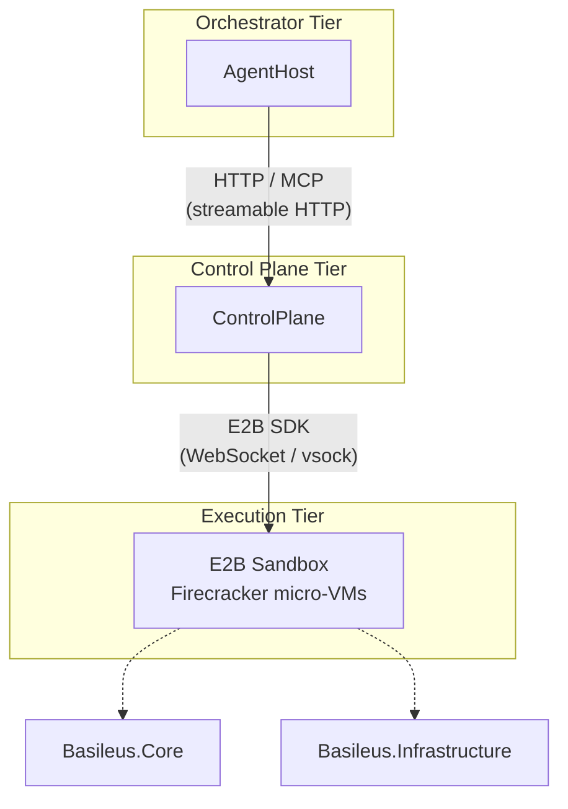
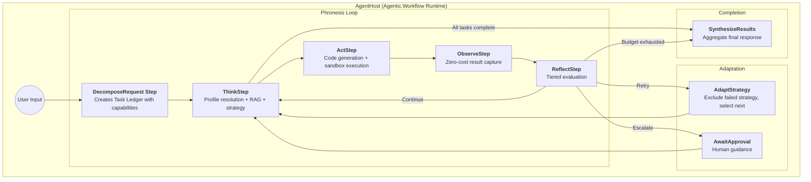
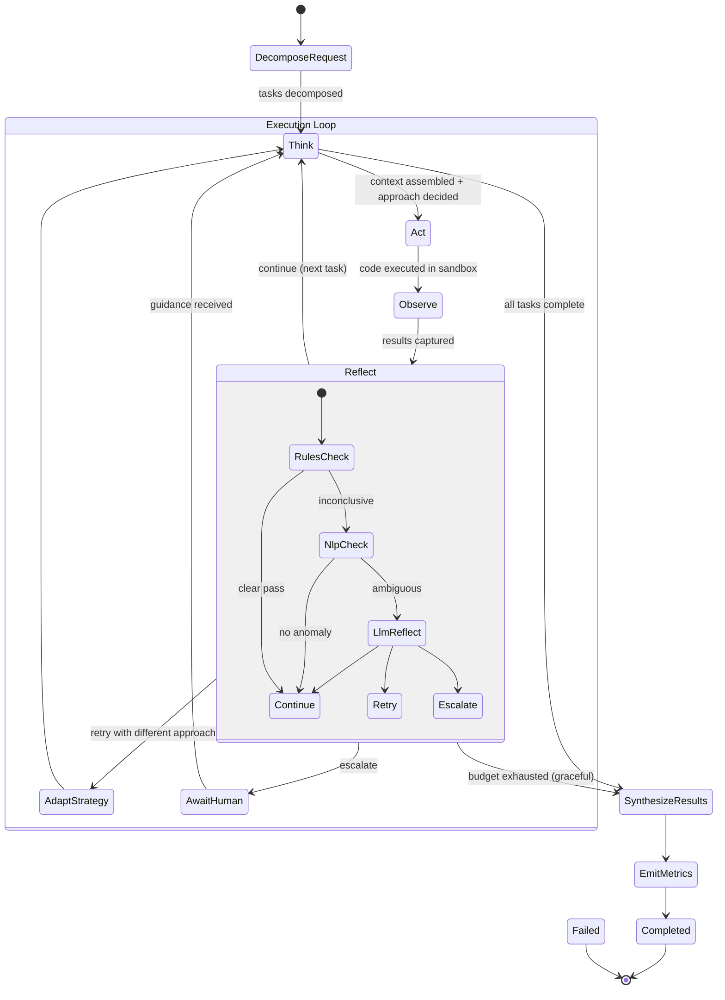
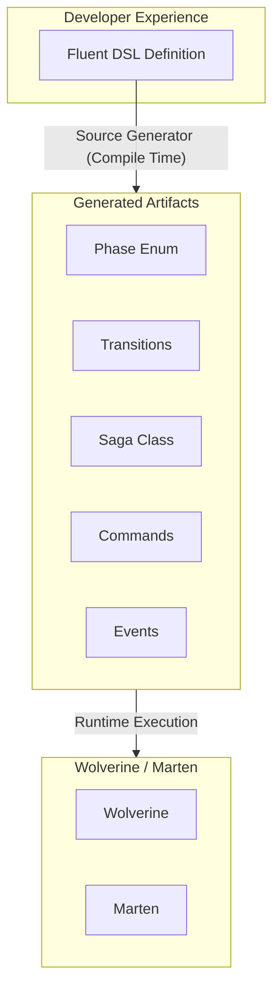
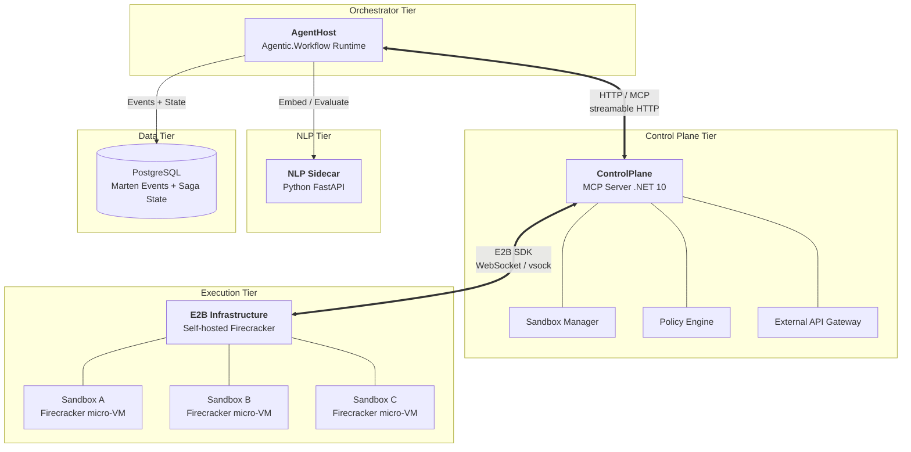
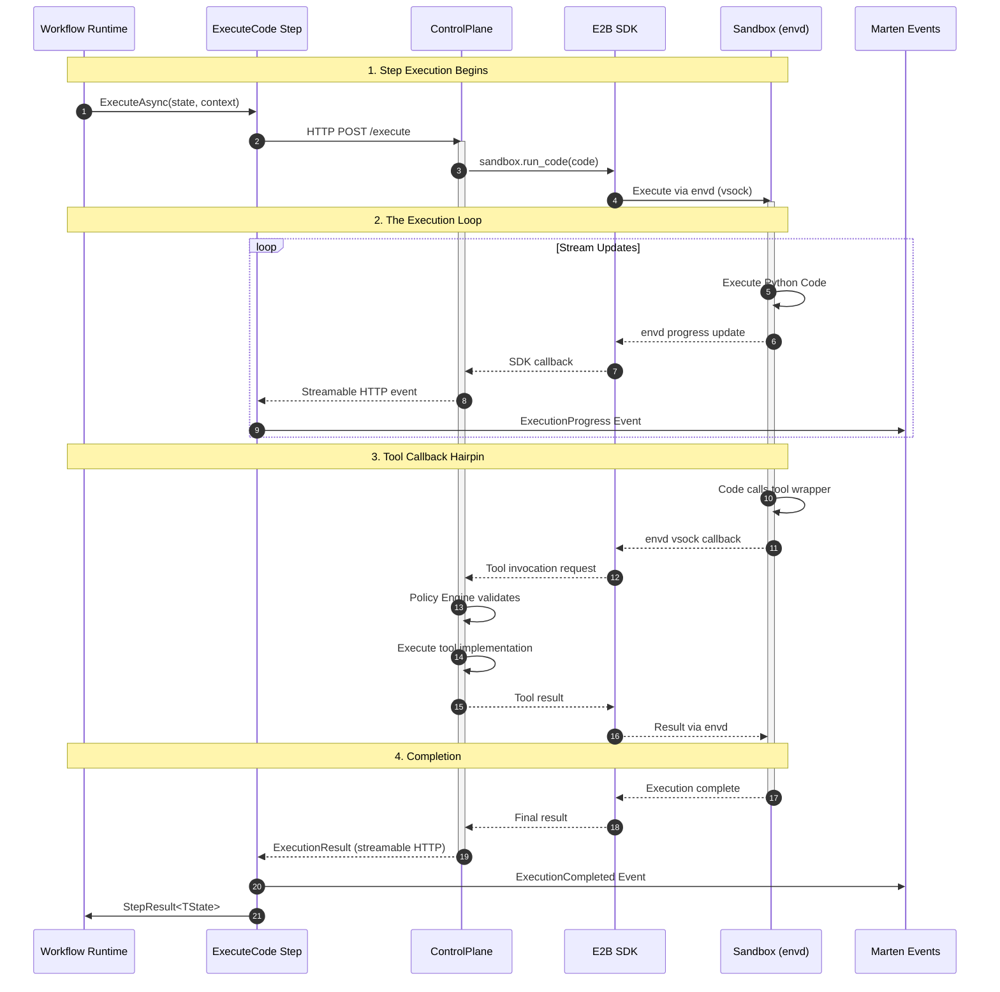

# Platform Architecture: Basileus

A consolidated reference for the Basileus agentic workflows platform -- covering the three-tier runtime, the Agentic.Workflow library, event sourcing, security model, deployment topology, and resource management.

Version 3.0 | Phronesis Orchestration Pattern | Replaces Magentic-One

---

## Table of Contents

1. [System Overview](#1-system-overview)
2. [Core Concepts & Terminology](#2-core-concepts--terminology)
3. [Application Layer: Phronesis Pattern](#3-application-layer-phronesis-pattern)
4. [Agentic.Workflow Library](#4-agenticworkflow-library)
5. [Infrastructure Layer](#5-infrastructure-layer)
6. [End-to-End Request Flow](#6-end-to-end-request-flow)
7. [Event Sourcing & State Durability](#7-event-sourcing--state-durability)
8. [Security Model](#8-security-model)
9. [Deployment & Infrastructure](#9-deployment--infrastructure)
10. [Resource Management](#10-resource-management)
11. [Agent Framework Integration](#11-agent-framework-integration)
12. [Deferred Features and Consumer Responsibilities](#12-deferred-features-and-consumer-responsibilities)
13. [Future Considerations](#13-future-considerations)

---

## 1. System Overview

The Basileus platform is a multi-tier architecture designed to orchestrate AI agents, execute agent-generated code securely in isolated Firecracker micro-VMs, and provide tool access through the Model Context Protocol (MCP). Five design principles govern the system:

1. **Security Isolation** -- Agent orchestration is completely isolated from code execution. The ControlPlane acts as a mandatory security boundary; AgentHost never communicates directly with the Sandbox. Sandboxes run in ephemeral Firecracker micro-VMs with zero outbound internet access.
2. **Tool Abstraction** -- Execution environments have no knowledge of tool backend implementations. Tools are accessed through a filesystem-based progressive disclosure system, enriched with ontology schemas (Object Types, Actions, Links) to provide typed semantic discovery and constrain the valid action space. All tool invocations route back to the ControlPlane via envd callbacks; sandboxes never hold credentials or connect to external services directly.
3. **Credential Isolation** -- API keys, database credentials, and OAuth tokens live exclusively in Azure Key Vault, accessed only by the ControlPlane. Secrets are injected at call time and never enter the sandbox.
4. **Centralized Observability** -- All execution requests and tool invocations flow through a single control point, providing complete audit trails via event sourcing.
5. **Semantic Type Safety** -- A compile-time ontology (Agentic.Ontology) maps domain types into a unified type graph of Object Types, Properties, Links, Actions, and Interfaces. Domain assemblies remain independent -- the ontology maps them, not owns them. A Roslyn source generator validates the type graph at build time, produces cross-domain link resolution, and generates typed tool stubs for progressive disclosure. Agents plan against the ontology rather than flat tool lists, directly reducing the CMDP action space ([AI Theory, &sect;2.3](../ai-theory/agentic-workflow-theory.md)).

### Three-Tier Architecture



| Tier | Component | Responsibilities |
|------|-----------|-----------------|
| Orchestrator | AgentHost | Agentic.Workflow runtime, Phronesis pattern via fluent DSL, Wolverine sagas, Marten event sourcing, Code Execution Bridge, Workflow MCP Server (event streaming to external clients) |
| Inference | InferenceGateway | Unified OpenAI-compatible model inference with multi-provider routing, caching, and budget enforcement |
| Control Plane | ControlPlane | Security boundary, MCP server hosting tools, streamable HTTP streaming, E2B sandbox lifecycle management, policy enforcement |
| Execution | E2B Sandbox | Firecracker micro-VMs, stateless code execution, envd agent for SDK communication, tool callbacks via vsock |
| Shared | Basileus.Core | Contracts, primitives, events |
| Shared | Basileus.Infrastructure | WorkOrchestrator, autoscaling, health checks |

### System Components

**Orchestrator Tier (AgentHost)**
- Hosts the Agentic.Workflow runtime for reflective agent orchestration
- Implements the Phronesis pattern via workflow definitions (Plan, Think, Act, Observe, Reflect, Synthesize)
- Processes user requests and maintains Task/Progress Ledgers
- Hosts the Workflow MCP Server — a second MCP server (separate from ControlPlane) that exposes workflow event streams and command interfaces to external MCP clients (Exarchos instances). Uses Marten `ISubscription` → `Channel<T>` → SSE for real-time event delivery. See [Remote Notification Bridge](../designs/2026-02-19-remote-notification-bridge.md).
- Never directly communicates with the Execution Tier

**Control Plane Tier (ControlPlane)**
- .NET 10 MCP server hosting all tool implementations (database, APIs, file I/O)
- Security validation and authorization enforcement via the Policy Engine
- Sandbox lifecycle management via the Sandbox Manager (E2B SDK)
- Streamable HTTP result streaming to AgentHost
- External API Gateway for all outbound calls (credential injection from Azure Key Vault)

**Execution Tier (E2B Sandbox)**
- Firecracker micro-VMs providing stateless, hardware-isolated code execution
- Each sandbox runs its own Linux kernel with zero outbound internet (`allow_out: []`)
- envd agent inside each sandbox provides filesystem, process, and code execution APIs over WebSocket/vsock
- Tool callbacks route through envd to the ControlPlane where actual tool implementations execute

**Inference Gateway (InferenceGateway)**
- Unified OpenAI-compatible model inference with multi-provider routing, caching, and budget enforcement
- Provides a single endpoint for all LLM calls, abstracting provider-specific details (OpenAI, Anthropic, Azure, local)
- Response caching via Redis to reduce costs and latency for repeated prompts
- AgentHost connects via `IChatClient` gateway mode (`AI:Chat:UseGateway=true`)
- Deployed as a Container App alongside AgentHost and ControlPlane (see `apps/inference-gateway/`)

**NLP Sidecar (NlpSidecar)**
- Python FastAPI service for embeddings, text segmentation, and signal evaluation
- Provides semantic similarity scoring used by `ReflectStep` (Tier 2) for loop detection
- Exposes `/embed`, `/segment`, and `/evaluate` endpoints
- Deployed alongside the Orchestrator Tier (see `apps/nlp-sidecar/`)

### Data Flow Architecture

The system uses three transport mechanisms, each suited to its tier boundary:

- **HTTP + MCP (streamable HTTP)** connects AgentHost to ControlPlane. Streamable HTTP provides real-time execution updates within the MCP protocol, with gRPC as a future upgrade path.
- **MCP (streamable HTTP)** connects Exarchos (developer workstation) to the AgentHost Workflow MCP Server. Exarchos initiates an outbound HTTPS connection (NAT-safe) and receives workflow events via SSE stream. Developer commands flow back through MCP tool calls. This is a separate MCP server from the ControlPlane MCP server, co-located with AgentHost. See [Remote Notification Bridge](../designs/2026-02-19-remote-notification-bridge.md) and [SDLC Pipeline §12](./distributed-sdlc-pipeline.md#12-basileus-integration).
- **E2B SDK (WebSocket / vsock)** connects ControlPlane to Sandbox. The E2B SDK mediates all host-guest communication through the envd agent inside each Firecracker micro-VM. File transfer uses `sandbox.files.read()` and `sandbox.files.write()` rather than shared volumes, since Firecracker VMs do not support shared filesystems.

All inter-service communication within the backend occurs within the same Azure VNet at sub-millisecond latency. No traffic between backend tiers traverses the public internet. The Exarchos→AgentHost MCP connection traverses the public internet (TLS encrypted, bearer token authenticated).

---

## 2. Core Concepts & Terminology

This glossary provides the single authoritative definition for each term used throughout the platform. Other sections reference these definitions rather than restating them.

| Term | Definition |
| :--- | :--- |
| **Phronesis** | The reflective execution loop orchestration pattern that replaced the Magentic-One specialist taxonomy. Named after Aristotle's concept of practical wisdom. Implements a Plan -> (Think -> Act -> Observe -> Reflect)* -> Synthesize loop where a single orchestrator uses composable execution profiles instead of specialist agents. |
| **Reflective Execution Loop** | The core Phronesis cycle: Think (context assembly + approach decision), Act (code generation + sandbox execution), Observe (zero-cost result capture), Reflect (tiered evaluation). Expressed declaratively via the Agentic.Workflow fluent DSL as a `RepeatUntil` loop. |
| **Execution Profile** | A declarative, composable configuration that shapes the Think step. Each profile specifies instructions, tool subsets, RAG collections, RAG query configuration, and quality gates. Profiles replace the specialist agent taxonomy as the customization mechanism. Multiple profiles compose via `ExecutionProfile.Compose()`. |
| **Execution Strategy** | An approach to executing a task, selected by Thompson Sampling. Strategies include SearchThenCode, CodeDirectly, DecomposeFirst, ExemplarBased, and InteractiveProbe. The strategy space replaces the specialist agent space as the Thompson Sampling selection target. |
| **Tiered Reflection** | The three-tier evaluation model within the Reflect step. Tier 1: deterministic rules (0 tokens, ~1ms). Tier 2: NLP Sidecar semantic analysis (0 tokens, ~50ms). Tier 3: LLM meta-reasoning (~500 tokens, ~3s). Higher tiers only run when lower tiers are inconclusive, saving 37--51% tokens per iteration compared to the previous pattern. |
| **ReflectionOutcome** | The result of the Reflect step: Continue (advance to next task), Retry (try different approach via AdaptStrategy), Escalate (needs human guidance), or Synthesize (budget exhausted, produce partial result). |
| **Task Ledger** | Immutable state structure tracking what needs to be done. Created during the DecomposeRequest step. Each task specifies capability requirements (`TaskRequirements`) rather than specialist assignments, enabling deterministic profile resolution. |
| **Progress Ledger** | Mutable state structure recording what has been completed. Updated by the Observe step after each execution cycle. Used for tiered reflection analysis (Tier 2 semantic similarity) and completion evaluation. |
| **WorkflowSaga** | A Wolverine saga generated from Agentic.Workflow definitions. Provides automatic persistence to PostgreSQL, transactional outbox for exactly-once processing, and message-driven step transitions. |
| **Event Stream** | The append-only sequence of immutable events capturing everything that happens during a workflow execution -- step transitions, agent decisions, context assemblies, approvals, and completions. Stored in Marten. |
| **Projection** | A read model built from the event stream, optimized for querying. Projections are updated asynchronously from events and provide eventual consistency. Example: `PhronesisProjection` materializes current phase, execution history, and reflection outcomes. |
| **Materialized View** | The concrete read model produced by a projection. Example: `PhronesisReadModel` with properties like `CurrentPhase`, `ExecutionHistory`, `ReflectionOutcomes`. |
| **Model Context Protocol (MCP)** | A standardized protocol for tool integration. The ControlPlane implements MCP servers with actual tool implementations; the Sandbox accesses tool wrappers through a filesystem-based interface that routes calls back to the ControlPlane via envd vsock. Transport uses streamable HTTP between AgentHost and ControlPlane. |
| **Code Execution Bridge** | A workflow step (`ActStep`) that connects the Phronesis loop to the physical infrastructure layer. Serializes generated Python into an execution request, routes it to the ControlPlane, which executes it in an E2B sandbox via the E2B SDK, streams progress updates, and returns results as state updates. |
| **Execution Hairpin** | The call chain where requests flow AgentHost -> ControlPlane -> E2B Sandbox (via E2B SDK), and results stream back Sandbox -> ControlPlane -> AgentHost (via streamable HTTP). Tool callbacks during execution create a nested "hairpin turn" as the Sandbox calls back into the ControlPlane through envd. |
| **Budget Algebra** | Resource management framework: `{steps, tokens, executions, tool_calls, wall_time}`. Scarcity levels (Abundant > Normal > Scarce > Critical) influence action scoring and routing decisions. Enforced via `BudgetGuard` step validation. See [&sect;10 Resource Management](#10-resource-management). |
| **Loop Detection** | Analysis of the Progress Ledger to identify stuck workflows via four patterns: exact repetition, semantic repetition (cosine similarity > 0.85), oscillation (A->B->A->B), and no-progress. Embedded within the Reflect step's Tier 2 (NLP Sidecar) evaluation rather than implemented as a separate workflow step. |
| **Tool Virtualization** | The pattern where execution environments discover and call tools via a filesystem-based progressive disclosure system. Tools are organized in a directory structure (`servers/`) that agents explore on-demand. Tool wrappers are provisioned into sandboxes at creation time via `sandbox.files.write()` and call back to the ControlPlane through envd vsock. Actual tool implementations execute in the ControlPlane. |
| **E2B Sandbox** | An ephemeral Firecracker micro-VM managed by the self-hosted E2B infrastructure. Each sandbox has its own Linux kernel, isolated filesystem, and zero outbound internet. Created on-demand by the ControlPlane via the E2B SDK. |
| **Firecracker** | An open-source VMM (Virtual Machine Monitor) by AWS that creates lightweight micro-VMs. Provides hardware-level isolation via KVM with ~125ms boot time, seccomp filtering, and jailer-based security. |
| **envd** | The agent process running inside each E2B sandbox. Provides filesystem, process, and code execution APIs over WebSocket/vsock. Used by the E2B SDK for all host-guest communication. |
| **Sandbox Manager** | ControlPlane component managing E2B sandbox lifecycle: creation, session affinity, timeout extension, pre-warming, and destruction. Maintains an in-memory or Redis-backed session map linking agents to their sandboxes. |
| **Policy Engine** | ControlPlane component evaluating every tool call before and after execution. Pre-execution: authentication, authorization, input validation, content filtering, rate limiting. Post-execution: output filtering, resource checks, audit logging. |
| **Streamable HTTP** | HTTP-based streaming transport for real-time execution updates from ControlPlane to AgentHost, used as the preferred MCP protocol transport. Future upgrade path to gRPC. |
| **Tool Callback Hairpin** | The call chain where sandbox code invokes a tool wrapper, which communicates via envd vsock to the E2B orchestrator, which routes to the ControlPlane for actual tool execution, and results flow back through the same path. The ControlPlane is the sole gateway for all external access. |
| **Agentic.Workflow** | The fluent DSL library for defining durable, event-sourced agent workflows. Generates Wolverine sagas, Marten events, phase enums, and DI registrations from declarative workflow definitions. Distributed via [NuGet](https://www.nuget.org/packages/Agentic.Workflow). |
| **Thompson Sampling** | Contextual multi-armed bandit algorithm used for execution strategy selection. Maintains Beta(alpha, beta) distributions per (strategy, taskCategory) pair and samples to select the strategy with highest expected reward. Previously targeted specialist agents; retargeted to strategies in the Phronesis pattern. |
| **Agentic.Ontology** | A semantic type system for agentic operations, distributed as a separate NuGet package within the Agentic.Workflow repository. Provides a fluent DSL for declaring Object Types, Properties, Links, Actions, and Interfaces across domain boundaries. A Roslyn source generator produces compile-time descriptors, typed accessors, and cross-domain link validation. Enhances progressive disclosure with schema-driven tool stubs. Inspired by [Palantir Foundry's Ontology](https://www.palantir.com/docs/foundry/ontology/overview). |
| **Domain Ontology** | A `DomainOntology` subclass declared per domain assembly (e.g., `TradingOntology`, `KnowledgeOntology`). Maps existing domain types into the ontology via a fluent builder API. The source generator parses these definitions at compile time to produce descriptors and validate the type graph. |
| **Ontology Interface** | A polymorphic shape declaration backed by a C# interface (e.g., `ISearchable`). Object types from different domains can implement the same ontology interface, enabling cross-domain queries ("find all Searchable objects matching X"). |
| **Cross-Domain Link** | A typed relationship between object types in different domain assemblies. Declared by the originating domain using string-based external references (`ToExternal("trading", "Strategy")`), resolved and validated at composition time by the host assembly's source generator. |

---

## 3. Application Layer: Phronesis Pattern

### 3.1 The Reflective Execution Loop

The Phronesis pattern replaces the Magentic-One specialist taxonomy with a reflective execution loop that leverages the platform's unified code execution model. Named after Aristotle's concept of practical wisdom -- the ability to discern the right action in particular circumstances -- it mirrors how a skilled developer works: understand the problem (Think), write code (Act), see what happens (Observe), adjust (Reflect).

The orchestration loop is defined using Agentic.Workflow's fluent DSL:

1. **DecomposeRequest** -- Decompose the user request into a TaskLedger where each task specifies capability requirements (not specialist assignments)
2. **Think** -- Resolve execution profile from task requirements, query RAG collections, select execution strategy via Thompson Sampling, assemble unified context, and generate an execution plan
3. **Act** -- Generate Python code via LLM using assembled context, route to ControlPlane for E2B sandbox execution, stream progress events
4. **Observe** -- Pure state capture with zero LLM cost: record execution results, append ProgressEntry, update budget consumption
5. **Reflect** -- Tiered evaluation: Tier 1 (rules, 0 tokens), Tier 2 (NLP Sidecar, 0 tokens), Tier 3 (LLM, ~500 tokens). Produces a `ReflectionOutcome`: Continue, Retry, Escalate, or Synthesize
6. **Synthesize** -- Aggregate results across all completed tasks into a final response

### 3.2 Execution Profiles ("Everything is a Coder")

Because all execution happens via Python scripts executed in E2B sandboxes via the ControlPlane, the Phronesis pattern uses composable execution profiles instead of specialist agents. Profiles are declarative configurations that shape the Think step:

```csharp
public record ExecutionProfile
{
    /// <summary>Profile identifier used for Thompson Sampling tracking.</summary>
    public required string Name { get; init; }

    /// <summary>System-level instructions injected into the Think step context.</summary>
    public required string Instructions { get; init; }

    /// <summary>MCP tool subset available during Act execution.</summary>
    public ImmutableList<string> ToolSubset { get; init; } = [];

    /// <summary>RAG collections to query during Think context assembly.</summary>
    public ImmutableList<string> RagCollections { get; init; } = [];

    /// <summary>RAG query configuration (topK, minRelevance, reranking, maxContextLength).</summary>
    public RagContextConfiguration RagConfig { get; init; } = RagContextConfiguration.Default;

    /// <summary>Rerank configuration for two-stage retrieval (retrieve broadly, then rerank for precision).</summary>
    public RerankConfiguration RerankConfig { get; init; } = RerankConfiguration.Default;

    /// <summary>Success criteria evaluated during Reflect Tier 1.</summary>
    public QualityGate? QualityGate { get; init; }

    /// <summary>Compose multiple profiles into a merged configuration.</summary>
    public static ExecutionProfile Compose(params ExecutionProfile[] profiles) =>
        new()
        {
            Name = string.Join("+", profiles.Select(p => p.Name)),
            Instructions = string.Join("\n\n---\n\n", profiles.Select(p => p.Instructions)),
            ToolSubset = profiles.SelectMany(p => p.ToolSubset).Distinct().ToImmutableList(),
            RagCollections = profiles.SelectMany(p => p.RagCollections).Distinct().ToImmutableList(),
            RagConfig = MergeRagConfigs(profiles.Select(p => p.RagConfig)),
            QualityGate = QualityGate.All(profiles.Where(p => p.QualityGate != null).Select(p => p.QualityGate!))
        };
}
```

**Built-in profiles** (registered via DI):

| Profile | Tools | RAG Collections | Quality Gate |
|---------|-------|----------------|--------------|
| `WebResearch` | search_web, fetch_url | web-cache | Results found |
| `CodeGeneration` | run_code, read_file, write_file | codebase-patterns | Tests pass |
| `DataAnalysis` | run_code, query_database | data-schemas | Output validates |
| `FileOperations` | read_file, write_file, list_files | -- | Files exist |
| `Documentation` | read_file | architecture-docs | Content coherent |

**Domain profiles** (registered by domain assemblies):

| Profile | Tools | RAG Collections | Quality Gate |
|---------|-------|----------------|--------------|
| `Trading.FundamentalAnalysis` | run_code, query_database | sec-filings, financial-reports | Valuation computed |
| `Trading.TechnicalAnalysis` | run_code | market-data, technical-indicators | Signals generated |
| `Trading.RiskAssessment` | run_code | risk-models, position-history | Risk metrics within bounds |

### 3.3 Internal Workflow



### 3.4 Phronesis Workflow Definition

The complete orchestration logic is expressed declaratively:

```csharp
public static class PhronesisWorkflowDefinition
{
    public const int MaxIterations = 25;

    public static IWorkflow<PhronesisState> Create() =>
        Workflow<PhronesisState>
            .Create("phronesis-orchestrator")

            .StartWith<DecomposeRequest>(step => step
                .ValidateState(state =>
                    !string.IsNullOrEmpty(state.OriginalRequest)
                        ? ValidationResult.Success
                        : ValidationResult.Failure("Request is required")))

            .RepeatUntil(
                condition: state => state.TaskLedger.IsComplete
                                 || state.Budget.Scarcity == ScarcityLevel.Critical,
                loopName: "Execution",
                maxIterations: MaxIterations,
                body: loop => loop
                    .Then<ThinkStep>(step => step
                        .ValidateState(state =>
                            state.Budget.StepsRemaining > 0
                                ? ValidationResult.Success
                                : ValidationResult.Failure("Budget exhausted")))
                    .Then<ActStep>()
                    .Then<ObserveStep>()
                    .Then<ReflectStep>()
                    .Branch(state => state.ReflectionOutcome,
                        when: ReflectionOutcome.Continue, then: flow => flow
                            .Then<AdvanceTask>(),
                        when: ReflectionOutcome.Retry, then: flow => flow
                            .Then<AdaptStrategy>()
                                .Compensate<RollbackAdaptation>(),
                        when: ReflectionOutcome.Escalate, then: flow => flow
                            .AwaitApproval<HumanReviewer>(options => options
                                .WithTimeout(TimeSpan.FromMinutes(30))
                                .OnTimeout(t => t.Then<GracefulDegrade>())),
                        otherwise: flow => flow
                            .Then<AdvanceTask>()))

            .Then<SynthesizeResults>()
            .Finally<EmitCompletionMetrics>()

            .OnFailure(flow => flow
                .Then<NotifyFailure>()
                .Then<ArchiveForAnalysis>());
}
```

### 3.5 Phronesis State Machine

The generated phase enumeration forms a finite state machine:



### 3.6 Step Responsibilities

**DecomposeRequest** -- Decomposes the user request into a TaskLedger where each task specifies capability requirements rather than specialist assignments:

```csharp
public record TaskRequirements
{
    public ImmutableList<string> Capabilities { get; init; }     // e.g., ["web-search", "data-analysis"]
    public ImmutableList<string> RagCollections { get; init; }   // e.g., ["financial-reports"]
    public ImmutableList<string> ObjectTypes { get; init; }      // e.g., ["trading.Position", "knowledge.AtomicNote"]
    public ImmutableList<string> RequiredInterfaces { get; init; } // e.g., ["ISearchable"]
    public QualityGate? QualityGate { get; init; }
}
```

`ObjectTypes` and `RequiredInterfaces` are resolved against the `ComposedOntology` (&sect;4.14) at the start of the Think step. If a task requires `trading.Position`, the ontology provides the available Actions on Position, the Links it participates in, and any cross-domain relationships -- constraining the agent's action space to valid operations.

**ThinkStep** -- Context assembly and approach decision. This single step replaces both the specialist selection and the specialist's reasoning phase:

1. Resolve execution profile from task requirements (compose matching profiles)
2. Resolve ontology context from task's `ObjectTypes` and `RequiredInterfaces` -- discover available Actions, Link relationships, and cross-domain traversals from the `ComposedOntology`. Filter the profile's `ToolSubset` to only tools bound to available Actions
3. Query `IMultiCollectionRagProvider` with profile's collection set (vector similarity + optional hybrid BM25)
4. **Rerank** results via Cohere Rerank API (`rerank-v4.0-pro`) — reorders multi-collection results by semantic relevance to the task, replacing simple relevance-score ordering. Filter by `RerankConfig.MinRelevanceScore` to discard low-quality retrievals before context assembly
5. Optionally traverse knowledge graph links via `KnowledgeMcpTools`
6. Select execution strategy via Thompson Sampling (strategies, not specialists)
7. Assemble unified context: task description + ontology action signatures + reranked RAG results + execution history + profile instructions + strategy hint
8. Generate execution plan via structured LLM output

**ActStep** -- Code generation and sandbox execution. Routes through the Code Execution Bridge:

1. Generate Python code via LLM (using assembled context from Think)
2. Route to ControlPlane via HTTP
3. ControlPlane executes in E2B sandbox
4. Stream progress events via streamable HTTP
5. Capture tool callback results

**ObserveStep** -- Pure state capture with zero LLM cost:

1. Record execution results (stdout, stderr, exit code, duration)
2. Record tool callback log (which tools were invoked, results)
3. Append new `ProgressEntry` to ProgressLedger
4. Update budget consumption (steps, tokens, wall time)
5. Emit `ExecutionObserved` event to Marten stream

**ReflectStep** -- Tiered evaluation that embeds loop detection and quality assessment:

> **Nomenclature note:** This document uses "Reflection Tier 1/2/3" for the ReflectStep's evaluation tiers. The SDLC Pipeline document uses "Context Tier 1/2" for the Agentic Coder's context assembly tiers. These are distinct concepts sharing a tiered architecture — "Reflection Tier" evaluates execution outcomes, "Context Tier" assembles pre-execution context.

- **Reflection Tier 1 (Rules, 0 tokens, ~1ms):** Hard criteria -- tests pass? Budget OK? Iteration within bounds? Quality gate satisfied? If clear pass/fail, emit result immediately.
- **Reflection Tier 2 (NLP Sidecar, 0 tokens, ~50ms):** Semantic analysis via existing infrastructure -- embed latest output, cosine similarity against recent ProgressLedger entries (>0.85 = loop), signal evaluation via `/evaluate` endpoint. Only runs if Reflection Tier 1 is inconclusive.
- **Reflection Tier 3 (LLM, ~500 tokens, ~3s):** Meta-reasoning with structured output `{outcome, reason, nextHint}`. Only runs if Reflection Tier 1 + 2 are ambiguous. Skipped entirely at Critical budget scarcity.

**AdaptStrategy** -- Adapts the approach when Reflect produces Retry:

1. Record the failed strategy in execution history
2. Exclude the strategy from Thompson Sampling for this task
3. Select next-best strategy
4. Optionally decompose the current task into sub-tasks
5. Loop back to Think with adapted context

**Unified Escalation Protocol:**

The `ReflectionOutcome.Escalate` path is the shared escalation semantic across the entire platform. Both platform-level signals (low agent confidence) and SDLC-level signals (low context quality score < 0.2, remediation exhaustion) converge on the same escalation path:

1. ReflectStep produces `ReflectionOutcome.Escalate` (triggered by low confidence, context quality, or remediation exhaustion)
2. Workflow branches to `AwaitApproval<HumanReviewer>` with a 30-minute timeout
3. If human provides guidance → loop back to Think with enriched context
4. If timeout expires → `GracefulDegrade` step synthesizes a partial result from completed work

This ensures consistent escalation behavior regardless of whether the trigger is a platform confidence score, an SDLC context quality assessment, or a CI remediation failure. The SDLC pipeline's `NeedsGuidance` event maps directly to `ReflectionOutcome.Escalate`. See [SDLC Pipeline §6](../adrs/distributed-sdlc-pipeline.md#6-remote-tier-agentic-coder) for context quality scoring that feeds this path.

**SynthesizeResults** -- Aggregate results across all completed tasks into a final response, with richer context from the Observe/Reflect trail.

### 3.7 Profile Composition and Domain Integration

Execution profiles compose naturally for tasks that span multiple domains. The ThinkStep resolves the active profile by matching task capability requirements against registered profiles, then composing the matches:

```csharp
// Task requires ["web-search", "data-analysis"]
// ThinkStep composes WebResearch + DataAnalysis profiles:
var profile = ExecutionProfile.Compose(webResearch, dataAnalysis);
// Result: merged instructions, union of tools, union of RAG collections, combined quality gates
```

**Trading Domain Example (Fork/Join with Profiles):**

The PortfolioManagerWorkflow preserves its Fork/Join structure. Specialist agents become profiles:

```csharp
// Before: 7 specialist agent types with HSM inner loops
// After: 7 execution profiles + Fork/Join with ThinkStep instances

.Fork(
    flow => flow.Then<ThinkStep>("Fundamental")
               .Then<ActStep>("Fundamental")
               .Then<ObserveStep>("Fundamental"),
    flow => flow.Then<ThinkStep>("Technical")
               .Then<ActStep>("Technical")
               .Then<ObserveStep>("Technical"),
    flow => flow.Then<ThinkStep>("Risk")
               .Then<ActStep>("Risk")
               .Then<ObserveStep>("Risk"))
.Join<AggregateAnalysis>()
```

Each fork's ThinkStep resolves its profile from the task requirements. The profile determines which RAG collections to query, which tools to enable, and which quality gate to evaluate.

**Profile Evolution (Adaptive Configuration):**

Execution profiles are registered at startup but their *tunable parameters* adapt over time based on quality signals from the [SDLC Pipeline's CodeQualityView](../adrs/distributed-sdlc-pipeline.md#8-cqrs-views). This creates a semi-automated feedback loop:

Parameters that auto-tune within bounded ranges:

| Parameter | Bounds | Signal |
|-----------|--------|--------|
| `RagConfig.TopK` | 3--15 | Increase when Reflection Tier 3 (LLM) is frequently triggered for this profile's tasks (indicates insufficient context); decrease when context token cost is high with no quality improvement |
| `RagConfig.MinRelevance` | 0.5--0.9 | Decrease when RAG retrieval returns too few results for this profile; increase when low-relevance results correlate with gate failures |
| `RerankConfig.TopN` | 3--10 | Increase when reranked context misses relevant documents (detected by Reflection Tier 2); decrease when context assembly latency or token cost is excessive |
| `RerankConfig.MinRelevanceScore` | 0.1--0.6 | Decrease when too few documents survive reranking; increase when low-scoring reranked results correlate with gate failures |
| `QualityGate` thresholds | ±20% of initial | Tighten when first-pass gate success rate exceeds 95% (raise the bar); loosen when first-pass rate drops below 60% (likely too strict) |

Parameters that require human approval:

| Parameter | Escalation Trigger |
|-----------|-------------------|
| `Instructions` (prompt text) | `QualityRegression` event detected for this profile |
| `ToolSubset` (add/remove tools) | Repeated tool-not-found errors or unused tool detection |
| `RagCollections` (add/remove collections) | Collection staleness detected or new collection available |
| Profile creation/deletion | Always human-initiated |

The adaptation mechanism:

1. `CodeQualityView` materializes per-profile quality metrics from gate results, benchmark measurements, and strategy outcomes
2. A `ProfileAdaptationProjection` (Marten projection) detects when tunable parameters should adjust, based on sliding-window analysis of the quality metrics
3. Small adjustments within bounds are applied automatically and recorded as `ProfileParameterAdjusted` events
4. Large swings (parameter hitting a bound, or structural changes) emit a `ProfileAdaptationEscalated` event, which triggers the unified escalation protocol (see §3.6 Unified Escalation Protocol)

This ensures profiles improve continuously from accumulated quality data while keeping humans in control of structural decisions.

### 3.8 Architecture Principles

- **Workflows Replace Imperative Code** -- The Phronesis pattern is expressed declaratively via the fluent DSL
- **Profiles Replace Specialists** -- Domain customization via composable configuration, not agent taxonomy
- **State Is Immutable** -- All state changes flow through reducers and are captured as events
- **Tiered Evaluation Minimizes Cost** -- The common path (tests pass, no loops) costs zero LLM tokens
- **Strategy Selection Is Learned** -- Thompson Sampling selects approaches to tasks, adapting over time based on recorded outcomes

### 3.9 ReAct Fragility Mitigation

Recent research ([arXiv:2405.13966](https://arxiv.org/abs/2405.13966)) demonstrates that ReAct-style prompting benefits derive primarily from exemplar-query similarity rather than inherent reasoning capabilities. The Phronesis pattern mitigates this in the ThinkStep, which assembles context from multiple sources -- execution profile instructions, RAG collection results, execution history, and knowledge graph traversal -- ensuring the LLM receives domain-relevant exemplars regardless of the task type:

```csharp
.Then<ThinkStep>(step => step
    .WithContext(ctx => ctx
        .FromState(state => state.CurrentTask)
        .FromRetrieval<MultiCollectionRagProvider>(r => r
            .Collections(state => state.ActiveProfile.RagCollections)
            .Query(state => state.CurrentTask.Description)
            .TopK(10)                    // broad initial retrieval
            .MinRelevance(0.5m)          // permissive vector threshold
            .WithReranking<CohereReranker>(rr => rr
                .Model("rerank-v4.0-pro")
                .TopN(5)                 // narrow to top 5 after rerank
                .MinRelevanceScore(0.3m) // discard low-relevance reranked results
            ))))
```

Profile-specific RAG collections ensure exemplar relevance is high for every task category, addressing the core fragility without requiring a specialist taxonomy.

---

## 4. Agentic.Workflow Library (Strategos)

Agentic.Workflow (codename **Strategos**) is a standalone .NET library for building production-grade agentic workflows. It combines the ergonomics of modern agent frameworks with the reliability guarantees of enterprise workflow engines, adding capabilities unique to AI-powered systems. Distributed via [NuGet](https://www.nuget.org/packages/Agentic.Workflow).

**Installation:**

```bash
dotnet add package Agentic.Workflow
dotnet add package Agentic.Workflow.Generators
dotnet add package Agentic.Workflow.Infrastructure
```

### 4.1 Design Philosophy

The library resolves a fundamental tension: AI agents are inherently probabilistic, but production systems require predictable behavior, auditability, and failure recovery. The key insight is that while agent outputs are probabilistic, the **workflow itself can be deterministic** if each agent decision is treated as an immutable event in an event-sourced system.

**Core Principles:**

| # | Principle | Description |
|---|-----------|-------------|
| 1 | Determinism from Probabilism | Agent outputs vary; workflow execution is deterministic. Same event history = same state. |
| 2 | Intuition Over Abstraction | API reads like natural language. No graph theory jargon (nodes, edges) -- uses steps, branches, approvals. |
| 3 | Capture What the Agent Saw | Every agent decision records the complete context: prompt, retrieved docs, conversation history, state snapshot. |
| 4 | Durable by Default | Workflows survive restarts and failures without developer intervention. Durability is the default execution model. |
| 5 | Explicit Over Implicit | Workflow structure, branching, error handling, and compensation are declared explicitly. No hidden magic. |
| 6 | Progressive Disclosure | Simple workflows are simple to write. Complexity (parallel execution, compensation, confidence routing) is opt-in. |
| 7 | Production-First | Comprehensive observability, graceful degradation, explicit error handling from day one. |

### 4.2 Conceptual Model

A **workflow** is a defined sequence of steps that transforms an initial state into a final state. Key concepts:

- **State** -- A strongly-typed, immutable record. The single source of truth for workflow progress. Every step receives current state and produces updated state.
- **Step** -- A unit of work: agent invocation, service call, computation, or human review point. The boundary where non-determinism (agent output) becomes determinism (recorded decision).
- **Phase** -- A discrete position within execution. Derived from step definitions, forming a finite state machine. Enables querying ("how many claims await approval?") and visualization.
- **Context** -- The assembled information provided to an agent step: relevant state, retrieved documents, conversation history.
- **Event** -- An immutable record of something that happened: step completed, branch taken, approval requested, decision made.

**Lifecycle:** Definition -> Compilation (source generators) -> Instantiation -> Execution -> Branching/Pausing -> Completion/Compensation.

### 4.3 Fluent DSL Vocabulary

| Term | Meaning | Rationale |
|------|---------|-----------|
| `Workflow` | The complete process definition | Universal business term |
| `StartWith` | The first step to execute | Clear entry point |
| `Then` | The next step in sequence | Natural continuation |
| `Branch` | Conditional path selection | Fork in the road metaphor |
| `Fork` / `Join` | Parallel execution and synchronization | Familiar concurrency terms |
| `RepeatUntil` | Iteration with exit condition | Reads like English |
| `AwaitApproval` | Pause for human decision | Intent is immediately clear |
| `Finally` | The concluding step | Familiar from try/finally |
| `Compensate` | Rollback handler for a step | Standard saga terminology |

### 4.4 Syntax Patterns

**Basic Linear Workflow:**

```csharp
Workflow<OrderState>
    .Create("process-order")
    .StartWith<ValidateOrder>()
    .Then<ProcessPayment>()
    .Then<FulfillOrder>()
    .Finally<SendConfirmation>();
```

**Conditional Branching:**

```csharp
Workflow<ClaimState>
    .Create("process-claim")
    .StartWith<AssessClaim>()
    .Branch(state => state.ClaimType,
        when: ClaimType.Auto, then: flow => flow
            .Then<AutoClaimProcessor>(),
        when: ClaimType.Property, then: flow => flow
            .Then<PropertyInspection>()
            .Then<PropertyClaimProcessor>(),
        otherwise: flow => flow
            .Then<ManualReview>())
    .Finally<NotifyClaimant>();
```

**Human-in-the-Loop:**

```csharp
Workflow<DocumentState>
    .Create("document-approval")
    .StartWith<DraftDocument>()
    .Then<LegalReview>()
    .AwaitApproval<LegalTeam>(options => options
        .WithTimeout(TimeSpan.FromDays(2))
        .OnTimeout(flow => flow.Then<EscalateToManager>()))
    .Then<PublishDocument>()
    .Finally<NotifyStakeholders>();
```

**Parallel Execution (Fork/Join):**

```csharp
Workflow<AnalysisState>
    .Create("comprehensive-analysis")
    .StartWith<GatherData>()
    .Fork(
        flow => flow.Then<FinancialAnalysis>(),
        flow => flow.Then<TechnicalAnalysis>(),
        flow => flow.Then<MarketAnalysis>())
    .Join<SynthesizeResults>()
    .Finally<GenerateReport>();
```

**Iteration:**

```csharp
Workflow<RefinementState>
    .Create("iterative-refinement")
    .StartWith<GenerateDraft>()
    .RepeatUntil(
        condition: state => state.QualityScore >= 0.9m,
        maxIterations: 5,
        body: flow => flow
            .Then<Critique>()
            .Then<Refine>())
    .Finally<Publish>();
```

**Error Handling and Compensation:**

```csharp
Workflow<OrderState>
    .Create("process-order")
    .StartWith<ValidateOrder>()
    .Then<ChargePayment>()
        .Compensate<RefundPayment>()
    .Then<ReserveInventory>()
        .Compensate<ReleaseInventory>()
    .Then<ShipOrder>()
    .Finally<Confirm>()
    .OnFailure(flow => flow.Then<NotifyFailure>());
```

If `ShipOrder` fails, compensation runs in reverse: `ReleaseInventory`, then `RefundPayment`.

### 4.5 Step Implementation Patterns

**Pattern 1: Class-Based Steps** (complex logic, dependencies):

```csharp
public class AssessClaimValidity : WorkflowStep<InsuranceClaimState>
{
    private readonly IClaimAssessmentService _assessmentService;

    public AssessClaimValidity(IClaimAssessmentService assessmentService)
    {
        _assessmentService = assessmentService;
    }

    public override async Task<StepResult<InsuranceClaimState>> ExecuteAsync(
        InsuranceClaimState state, StepContext context, CancellationToken ct)
    {
        var assessment = await _assessmentService.AssessAsync(state.Claim, ct);
        return state
            .With(s => s.Assessment, assessment)
            .With(s => s.Confidence, assessment.Confidence)
            .AsResult();
    }
}
```

**Pattern 2: Inline Lambda** (simple transformations):

```csharp
.Then("log-entry", (state, ctx) =>
    state.With(s => s.ProcessingStarted, ctx.Timestamp))
```

**Pattern 3: Agent Steps** (LLM-specific, structured output):

```csharp
public class AssessClaimValidity : AgentStep<InsuranceClaimState>
{
    public override AgentConfig ConfigureAgent() => new()
    {
        Instructions = "You are an insurance claim assessor...",
        Model = "gpt-4o",
        OutputSchema = typeof(ClaimAssessment)
    };

    public override InsuranceClaimState ApplyResult(
        InsuranceClaimState state, ClaimAssessment result)
        => state.With(s => s.Assessment, result);
}
```

### 4.6 State Management

**Immutable State Records:**

```csharp
[WorkflowState]
public record OrderState : IWorkflowState
{
    public Guid WorkflowId { get; init; }
    public Order Order { get; init; }
    public PaymentResult? Payment { get; init; }
    public ShipmentInfo? Shipment { get; init; }
    public OrderStatus Status { get; init; }
}
```

**Reducer Semantics:**

| Reducer | Behavior | Attribute |
|---------|----------|-----------|
| Overwrite | New value replaces old (default for scalars) | (none) |
| Append | New items appended to collection | `[Append]` |
| Merge | Dictionary entries merged, new overwrites existing | `[Merge]` |

Reducers are generated at compile time by the source generator, ensuring type safety and optimal performance.

**State Validation:**

```csharp
.Then<ProcessOrder>(step => step
    .ValidateState(state =>
        state.Order.Items.Any()
            ? ValidationResult.Success
            : ValidationResult.Failure("Order must have items")))
```

### 4.7 Agent & Strategy Patterns

**Thompson Sampling Strategy Selection:**

The library implements contextual multi-armed bandit selection for execution strategies. For each task:

1. Extract features from task description to classify category (7 categories: Analysis, Coding, Research, Writing, Data, Integration, General)
2. For each strategy, sample theta from `Beta(alpha, beta)` for that category
3. Select strategy with highest sampled theta
4. After execution, update belief: success -> alpha++, failure -> beta++

The existing `IAgentSelector` interface is retargeted by treating strategy enum values as selection IDs in the bandit space. Per-(strategy, taskCategory) Beta distributions learn which approaches work best over time.

```csharp
services.AddAgentSelection(options => options
    .WithPrior(alpha: 2, beta: 2)
    .WithCategories(TaskCategory.Analysis, TaskCategory.Coding));

var selection = await selector.SelectAgentAsync(new AgentSelectionContext
{
    AvailableAgentIds = ["SearchThenCode", "CodeDirectly", "DecomposeFirst", "ExemplarBased"],
    TaskDescription = "Analyze the sales data trends"
});

await selector.RecordOutcomeAsync(
    selection.SelectedAgentId,
    selection.TaskCategory,
    AgentOutcome.Succeeded(confidenceScore: 0.85));
```

**Durable Priors (Cross-Workflow Learning):**

Within a single workflow, Thompson Sampling learns which strategies work for which task categories. But this learning resets when the workflow completes. To accumulate intelligence across workflows, strategy outcomes are persisted as Marten events and reconstructed via projection:

```csharp
// Event emitted after each strategy execution
public record StrategyOutcomeRecorded(
    Guid WorkflowId,
    string Strategy,           // e.g., "CodeDirectly"
    string TaskCategory,       // e.g., "Analysis"
    bool Succeeded,
    double ConfidenceScore,
    int TokensConsumed,
    TimeSpan Duration,
    DateTimeOffset Timestamp) : IWorkflowEvent;

// Marten projection rebuilds priors from historical outcomes
public class StrategyPriorsProjection : MultiStreamProjection<StrategyPriors, string>
{
    public void Apply(StrategyOutcomeRecorded evt, StrategyPriors model)
    {
        var key = $"{evt.Strategy}:{evt.TaskCategory}";
        var prior = model.Priors.GetOrAdd(key, _ => new BetaPrior(2, 2));

        if (evt.Succeeded) prior.Alpha++;
        else prior.Beta++;

        model.TotalObservations++;
        model.LastUpdatedAt = evt.Timestamp;
    }
}
```

On workflow start, the ThinkStep seeds its Thompson Sampling selector from the `StrategyPriors` read model rather than uniform `Beta(2, 2)` priors. This creates a cross-workflow learning loop: early workflows explore broadly, later workflows exploit accumulated knowledge about which strategies succeed for which task categories.

These durable priors also feed into the [SDLC Pipeline's CodeQualityView](../adrs/distributed-sdlc-pipeline.md#8-cqrs-views) and the [Task Router's learned scoring](../adrs/distributed-sdlc-pipeline.md#5-task-router), forming the cross-system feedback architecture described in §3.7 (Profile Evolution).

**Confidence-Based Routing:**

```csharp
.Then<AssessClaim>(step => step
    .RequireConfidence(0.85m)
    .OnLowConfidence(flow => flow
        .AwaitApproval<SeniorAdjuster>()))
```

High-confidence decisions proceed automatically; uncertain decisions get human oversight. Low confidence triggers `ReflectionOutcome.Escalate`, following the unified escalation protocol defined in §3.6.

**Agent Versioning:**

Every agent decision event records the agent version, model used, confidence, and tokens consumed -- enabling A/B testing, regression debugging, and compliance reporting.

### 4.8 Source-Generated Artifacts

The source generator produces 9 artifact types via 27 specialized emitters:

| Artifact | Emitter | Purpose |
|----------|---------|---------|
| Phase Enum | `PhaseEnumEmitter` | Type-safe workflow phases including loops |
| Commands | `CommandsEmitter` | Wolverine Start + Execute commands |
| Events | `EventsEmitter` | Marten events with `[SagaIdentity]` |
| Transitions | `TransitionsEmitter` | Valid phase transition table |
| State Reducers | `StateReducerEmitter` | Property merge semantics (`[Append]`, `[Merge]`) |
| Saga | `SagaEmitter` (12 sub-emitters) | Complete Wolverine saga with handlers |
| Worker Handlers | `WorkerHandlerEmitter` | Brain & Muscle execution pattern |
| Extensions | `ExtensionsEmitter` | DI registration helpers |
| Mermaid | `MermaidEmitter` | Visual workflow documentation |

**Loop Phase Naming Convention:**

For `RepeatUntil` loops, step phases are prefixed with the loop name:
```text
Refinement_Critique    // Loop "Refinement" contains step "Critique"
Outer_Inner_Step       // Nested loop hierarchy preserved
```

**Instance Names for Step Reuse:**

When the same step type appears in multiple paths, instance names provide distinct identities:

```csharp
.Fork(
    path => path.Then<AnalyzeStep>("Technical"),
    path => path.Then<AnalyzeStep>("Fundamental"))
.Join<SynthesizeStep>()
```

Without instance names, duplicate step types trigger the AGWF003 compile-time error.

**Complete Generated Saga Example:**

For this workflow definition:

```csharp
var workflow = Workflow<ClaimState>
    .Create("ProcessClaim")
    .StartWith<GatherContext>()
    .Then<AssessClaim>(step => step.RequireConfidence(0.85m))
    .Branch(state => state.ClaimType,
        when: ClaimType.Auto, then: flow => flow.Then<AutoProcess>(),
        when: ClaimType.Manual, then: flow => flow
            .AwaitApproval<ClaimsAdjuster>()
            .Then<ManualProcess>())
    .Finally<NotifyClaimant>();
```

The source generator produces the following artifacts (condensed for illustration):

```csharp
// 1. Phase Enumeration
[GeneratedCode("Agentic.Workflow", "1.0")]
public enum ProcessClaimPhase
{
    NotStarted,
    GatherContext,
    AssessClaim,
    AutoProcess,
    AwaitingApproval,
    ManualProcess,
    NotifyClaimant,
    Completed,
    Failed
}

// 2. Saga Class with Handlers
[GeneratedCode("Agentic.Workflow", "1.0")]
public partial class ProcessClaimSaga : Saga
{
    [SagaIdentity] [Identity]
    public Guid WorkflowId { get; set; }

    [Version]
    public int Version { get; set; }

    public ClaimState State { get; set; } = new();
    public ProcessClaimPhase CurrentPhase { get; set; } = ProcessClaimPhase.NotStarted;

    // ── Start Handler ──────────────────────────────────────────────
    public static (ProcessClaimSaga, ExecuteGatherContextCommand) Start(
        StartProcessClaimCommand command,
        IDocumentSession session,
        TimeProvider time)
    {
        var saga = new ProcessClaimSaga
        {
            WorkflowId = command.WorkflowId,
            State = command.InitialState,
            CurrentPhase = ProcessClaimPhase.GatherContext
        };

        session.Events.StartStream<ProcessClaimSaga>(
            command.WorkflowId,
            new ProcessClaimStarted(command.WorkflowId, command.InitialState, time.GetUtcNow()));

        return (saga, new ExecuteGatherContextCommand(command.WorkflowId));
    }

    // ── Linear Step Handler (GatherContext -> AssessClaim) ─────────
    public async Task<ExecuteAssessClaimCommand> Handle(
        ExecuteGatherContextCommand command,
        GatherContext step,
        IDocumentSession session,
        TimeProvider time,
        CancellationToken ct)
    {
        var result = await step.ExecuteAsync(State, ct);
        State = ClaimStateReducer.Reduce(State, result.StateUpdate);

        session.Events.Append(WorkflowId, new ProcessClaimPhaseChanged(
            WorkflowId, CurrentPhase, ProcessClaimPhase.AssessClaim,
            nameof(GatherContext), time.GetUtcNow()));

        CurrentPhase = ProcessClaimPhase.AssessClaim;
        return new ExecuteAssessClaimCommand(WorkflowId);
    }

    // ── Branch Handler (AssessClaim -> Auto/Manual) ───────────────
    public async Task<object> Handle(
        ExecuteAssessClaimCommand command,
        AssessClaim step,
        IDocumentSession session,
        TimeProvider time,
        CancellationToken ct)
    {
        var result = await step.ExecuteAsync(State, ct);
        State = ClaimStateReducer.Reduce(State, result.StateUpdate);

        return State.ClaimType switch
        {
            ClaimType.Auto => TransitionWithCommand(
                ProcessClaimPhase.AutoProcess,
                new ExecuteAutoProcessCommand(WorkflowId),
                session, time),

            ClaimType.Manual => RequestApproval<ClaimsAdjuster>(
                session, time),

            _ => throw new InvalidWorkflowBranchException(State.ClaimType.ToString())
        };
    }

    // ── Finally Handler (NotifyClaimant -> Completed) ─────────────
    public async Task Handle(
        ExecuteNotifyClaimantCommand command,
        NotifyClaimant step,
        IDocumentSession session,
        TimeProvider time,
        CancellationToken ct)
    {
        var result = await step.ExecuteAsync(State, ct);
        State = ClaimStateReducer.Reduce(State, result.StateUpdate);

        CurrentPhase = ProcessClaimPhase.Completed;

        session.Events.Append(WorkflowId, new ProcessClaimCompleted(
            WorkflowId, State, WorkflowOutcome.Success, time.GetUtcNow()));

        MarkCompleted();  // Signal Wolverine to archive saga
    }
}

// 3. Projection (Read Model)
[GeneratedCode("Agentic.Workflow", "1.0")]
public class ProcessClaimProjection : SingleStreamProjection<ProcessClaimReadModel>
{
    public ProcessClaimReadModel Create(ProcessClaimStarted evt) => new()
    {
        WorkflowId = evt.WorkflowId,
        CurrentPhase = ProcessClaimPhase.GatherContext,
        StartedAt = evt.Timestamp
    };

    public void Apply(ProcessClaimPhaseChanged evt, ProcessClaimReadModel model)
    {
        model.CurrentPhase = evt.ToPhase;
        model.LastTransitionAt = evt.Timestamp;
    }

    public void Apply(ProcessClaimCompleted evt, ProcessClaimReadModel model)
    {
        model.CurrentPhase = ProcessClaimPhase.Completed;
        model.CompletedAt = evt.Timestamp;
        model.Outcome = evt.Outcome;
    }
}
```

This example demonstrates the key patterns: saga lifecycle management, command cascading for step transitions, branch routing via switch expressions, and event emission for audit trails. The complete generated output for a production workflow is typically 400-600 lines depending on complexity.

**Compiler Diagnostics:**

| Code | Severity | Description |
|------|----------|-------------|
| AGWF001 | Error | Workflow name cannot be empty |
| AGWF002 | Warning | No steps found in workflow |
| AGWF003 | Error | Duplicate step name (use instance names) |
| AGWF004 | Error | Workflow must be in a namespace |
| AGWF009 | Error | Missing StartWith |
| AGWF010 | Warning | Missing Finally |
| AGWF012 | Error | Fork without Join |
| AGWF014 | Error | RepeatUntil loop must contain steps |

**State Reducer Diagnostics:**

| Code | Severity | Description |
|------|----------|-------------|
| AGSR001 | Error | Invalid attribute usage -- reducer attribute applied to wrong member type |
| AGSR002 | Warning | No reducers found -- state class has no reducer attributes |

### 4.9 Compilation Pipeline

Workflow definitions are compiled into executable artifacts through a 4-stage pipeline:

**Stage 1: DSL Parsing** -- The fluent DSL calls are captured into an intermediate workflow definition structure representing steps, transitions, and configuration.

**Stage 2: Validation** -- The workflow definition is validated for structural correctness: unreachable steps, missing transitions, invalid branch targets, cycle detection. Validation errors are reported as compiler diagnostics (AGWF001-AGWF014).

**Stage 3: Source Generation** -- Roslyn incremental source generators produce compile-time artifacts: phase enumeration, transition table, command types, event types, state reducers, and saga class with handlers.

**Stage 4: Registration** -- At application startup, compiled workflows are registered with the dependency injection container and the Wolverine message router via the generated `AddXxxWorkflow()` extension methods.

### 4.10 Runtime Architecture



| Stage | Component | Details |
|-------|-----------|---------|
| Developer Experience | Fluent DSL | `Workflow<ClaimState>.Create("ProcessClaim").StartWith<GatherContext>().Then<AssessClaim>().Branch(...).Finally<Notify>()` |
| Generated Artifacts | Phase Enum | State machine phases |
| | Transitions | Valid phase transition table |
| | Saga Class | `WorkflowSaga<ClaimState, ProcessClaimPhase>` |
| | Commands | Wolverine messages |
| | Events | Marten events |
| Runtime | Wolverine | Routes commands to saga, message retry, saga lifecycle, transactional outbox |
| | Marten | Persists saga state, stores event stream, projects read models, enables time-travel |

**Execution Model:**

1. A `StartWorkflow` command initiates execution
2. The saga handles the command, initializes state, and cascades to the first step
3. Each step handler executes the step logic, updates state, and cascades to the next step
4. At branch points, the handler evaluates conditions and cascades to the appropriate path
5. At pause points (human approval), no cascade occurs -- the saga waits for input
6. On completion, the saga marks itself complete and emits final events

**Durability Guarantees:**

- State is persisted after every step via PostgreSQL
- Transactional outbox pattern -- state update and next-step message are atomic
- Process crash recovery resumes from last committed state
- Optimistic concurrency prevents conflicting updates

### 4.11 Infrastructure Integration Mapping

| Workflow Concept | Generated Artifact | Wolverine/Marten Primitive |
|------------------|-------------------|---------------------------|
| `Workflow<T>` | `XxxSaga` class | `Saga` base class |
| Workflow instance | Saga instance | Document with `[Identity]` |
| Current position | `CurrentPhase` property | Saga state (persisted) |
| Step execution | Handler method | `Handle(XxxCommand)` |
| Step transition | Command cascade | `return new NextCommand()` |
| Branch decision | Router in handler | Conditional return |
| State change | Event append | `session.Events.Append()` |
| Checkpoint | Event version | Marten stream version |
| Human-in-loop | Saga pause | No cascade + await message |
| Compensation | Compensation handlers | Reverse event application |

### 4.12 Comparison with Existing Frameworks

| Framework | Strengths | Gaps Agentic.Workflow Addresses |
|-----------|-----------|-------------------------------|
| **LangGraph** | Agent-native, visualization, active community | Snapshot-only checkpoints, no compensation, no confidence routing |
| **CrewAI** | Simple mental model, quick prototyping | No durability, limited workflow control, no human-in-loop |
| **AutoGen** | Flexible multi-agent patterns, Microsoft backing | No durability, implicit state, non-deterministic flow |
| **Temporal** | Battle-tested scale, strong durability | No agent awareness, imperative style, separate server |
| **Durable Task** | Native .NET, Azure integration | No agent awareness, limited event model |

**Unique Capabilities:**

The following capabilities are unique to Agentic.Workflow or rare among alternatives:

- Confidence-based routing as a first-class DSL feature
- Declarative context assembly with automatic capture
- Event-sourced audit trail (not just checkpoints)
- Compensation handlers for agent decisions
- Fluent DSL with source-generated state machines
- Integrated RAG and conversation history management
- Agent versioning and decision attribution

**Target Use Cases:**

Agentic.Workflow is ideal for:

- Production AI systems requiring reliability and auditability
- Regulated industries needing complete decision trails
- Complex multi-step agent workflows with human oversight
- .NET organizations with existing Wolverine/Marten infrastructure
- Teams valuing type safety and compile-time validation

### 4.13 Key Design Decisions

- **Wolverine-First Runtime** -- Wolverine sagas provide battle-tested durability. Microsoft Agent Framework Workflows are in preview with uncertain API stability.
- **Source Generation over Reflection** -- Compile-time validation, optimal performance, excellent IDE support. Invalid workflows fail at build time.
- **Fluent DSL over Graph API** -- Intuitive vocabulary (Then, Branch, Finally) rather than graph-theoretic terms (Node, Edge). The `AsGraph()` escape hatch provides access to explicit graph operations (`WithNode`, `WithEdge`, `WithConditionalEdge`) when the fluent DSL is insufficient for edge cases. This preserves the simplicity of the DSL while ensuring full expressiveness.
- **Event Sourcing over Snapshots** -- Snapshots answer "where is it now?" but events answer "how did it get there?" For auditable AI systems, the journey matters.
- **Implicit Branch Rejoining** -- Branches automatically rejoin at the next `Then()` or `Finally()` unless a branch explicitly calls `Complete()`.
- **Context Assembly as First-Class Concept** -- Declarative context assembly ensures "what did the agent see?" is always answerable.

### 4.14 Ontology Layer (Agentic.Ontology)

The Ontology Layer is a semantic type system for all agentic operations -- running on Basileus or orchestrated through Exarchos. Inspired by [Palantir Foundry's Ontology](https://www.palantir.com/docs/foundry/ontology/overview) and adapted for compile-time source generation rather than runtime metadata services, it provides a unified world model that agents plan and act against.

While it lives in the [Agentic.Workflow repository](https://github.com/levelup-software/agentic-workflow) and ships as NuGet packages, it is architecturally independent from the workflow DSL. Workflows can declare ontological context (`Consumes<T>`, `Produces<T>`) but the ontology is usable without workflows.

#### 4.14.1 Problem

Three architectural deficiencies motivate the ontology:

1. **Domain silos** -- Trading, StyleEngine, and Knowledge assemblies have no shared type vocabulary. An agent completing a Knowledge ingestion workflow that wants to feed results into a Trading strategy has no compile-time mechanism to express that relationship.
2. **Flat tool lists** -- MCP tools are discovered via string descriptions with no typed relationships between inputs and outputs. An agent cannot reason "Tool A produces a Position; Tool B accepts a Position" without parsing natural language.
3. **Unconstrained action space** -- Agents plan against all available tools rather than the subset valid for their current task and object types. This wastes tokens on irrelevant tool descriptions and increases the probability of invalid tool invocations.

#### 4.14.2 Palantir Concept Mapping

The ontology adapts Palantir Foundry's key abstractions for compile-time .NET source generation:

| Palantir Foundry | Agentic.Ontology | Adaptation |
|-----------------|------------------|------------|
| Object Type | `builder.Object<T>()` | Maps existing C# records/classes; does not generate domain types |
| Property | `obj.Property(x => x.Prop)` | Expression-tree-based; compile-time validated |
| Link Type | `obj.HasMany<T>()`, `ManyToMany<T>()` | Typed directional relationships with optional edge data |
| Action Type | `obj.Action("name")` | Bound to workflows (`BoundToWorkflow`) or MCP tools (`BoundToTool`) |
| Interface | `builder.Interface<T>()` | Backed by C# interfaces; enables cross-domain polymorphic queries |
| OSDK (code-gen) | `Agentic.Ontology.Generators` | Roslyn incremental source generator; compile-time, not runtime |
| OMS (metadata registry) | `ComposedOntology` | Source-generated in host assembly; merges all domain ontologies |
| Object Storage | Domain persistence (Marten, pgvector) | Ontology maps types, does not own storage |
| Security layer | Policy Engine (&sect;5.5) + ontology action scoping | Object-level permissions evaluated at tool invocation |

Key difference from Palantir: Foundry's ontology is a runtime metadata service queried via REST APIs. Agentic.Ontology is a compile-time system -- the Roslyn source generator validates the entire type graph at build time. Invalid definitions (broken links, missing keys, type mismatches) are compiler errors, not runtime exceptions.

#### 4.14.3 Packages

```bash
dotnet add package Agentic.Ontology              # Contracts, DomainOntology base, fluent builder interfaces
dotnet add package Agentic.Ontology.Generators    # Roslyn incremental source generator
dotnet add package Agentic.Ontology.MCP           # Progressive disclosure integration (§5.3)
```

#### 4.14.4 Core Primitives

| Concept | DSL | Purpose |
|---------|-----|---------|
| Object Type | `builder.Object<T>()` | Map an existing C# type into the ontology |
| Property | `obj.Property(x => x.Prop)` | Expose a property via expression tree (compile-time validated) |
| Link | `obj.HasMany<T>()`, `HasOne<T>()`, `ManyToMany<T>()` | Typed directional relationship with cardinality and optional edge data |
| Action | `obj.Action("name")` | Operation on an Object Type, bound to a workflow or MCP tool |
| Interface | `builder.Interface<T>()` | Polymorphic shape for cross-domain queries (backed by C# interfaces) |
| Cross-Domain Link | `builder.CrossDomainLink("name")` | Relationship between Object Types in different domain assemblies |

Actions have two binding modes:

- **Workflow-backed** (`BoundToWorkflow("execute-trade")`) -- Long-running, durable, saga-tracked. Agent invocation starts a workflow instance.
- **Tool-backed** (`BoundToTool<TradingMcpTools>(t => t.GetQuoteAsync)`) -- Immediate, single-step, request/response. Agent invocation calls the MCP tool directly.

Both appear identically in the ontology query interface -- agents select Actions by intent, not by execution model.

#### 4.14.5 Domain Definition

Each domain assembly declares one `DomainOntology` subclass. The source generator parses the `Define` method body at compile time via Roslyn syntax analysis (the same technique used by the Agentic.Workflow DSL generator):

```csharp
public sealed class TradingOntology : DomainOntology
{
    public override string DomainName => "trading";

    protected override void Define(IOntologyBuilder builder)
    {
        builder.Object<Position>(obj =>
        {
            obj.Key(p => p.Id);
            obj.Property(p => p.Symbol).Required();
            obj.Property(p => p.Quantity);
            obj.Property(p => p.UnrealizedPnL).Computed();

            obj.HasMany<TradeOrder>("Orders");
            obj.HasOne<Strategy>("Strategy");

            obj.Action("ExecuteTrade")
                .Accepts<TradeExecutionRequest>()
                .Returns<TradeExecutionResult>()
                .BoundToWorkflow("execute-trade");

            obj.Action("GetQuote")
                .Accepts<QuoteRequest>()
                .Returns<Quote>()
                .BoundToTool<MarketDataMcpTools>(t => t.GetQuoteAsync);

            obj.Implements<ISearchable>(map =>
            {
                map.Via(p => p.Symbol, s => s.Title);
                map.Via(p => p.DisplayDescription, s => s.Description);
            });
        });

        builder.Object<TradeOrder>(obj =>
        {
            obj.Key(o => o.OrderId);
            obj.Property(o => o.Side);
            obj.Property(o => o.Price);
            obj.Property(o => o.Status);
            obj.HasOne<Position>("Position");
        });
    }
}
```

**Cross-domain links** are declared by the originating domain using string-based external references, resolved at composition time:

```csharp
public sealed class KnowledgeOntology : DomainOntology
{
    public override string DomainName => "knowledge";

    protected override void Define(IOntologyBuilder builder)
    {
        builder.Object<AtomicNote>(obj =>
        {
            obj.Key(n => n.Id);
            obj.Property(n => n.Title).Required();
            obj.Property(n => n.Definition).Required();
            obj.Property(n => n.Category);

            obj.ManyToMany<AtomicNote>("SemanticLinks")
                .WithEdge<KnowledgeLink>(edge =>
                {
                    edge.Property(l => l.Type);
                    edge.Property(l => l.Confidence);
                });

            obj.Action("Ingest")
                .Accepts<IngestRequest>()
                .Returns<AtomicNote>()
                .BoundToWorkflow("ingest-knowledge");

            obj.Implements<ISearchable>(map =>
            {
                map.Via(n => n.Title, s => s.Title);
                map.Via(n => n.Definition, s => s.Description);
            });
        });

        // Cross-domain: Knowledge informs Trading strategies
        builder.CrossDomainLink("KnowledgeInformsStrategy")
            .From<AtomicNote>()
            .ToExternal("trading", "Strategy")
            .ManyToMany()
            .WithEdge<RelevanceEdge>(edge =>
            {
                edge.Property(e => e.Relevance);
                edge.Property(e => e.Rationale);
            });
    }
}
```

The `ToExternal("trading", "Strategy")` reference is unresolved until composition (&sect;4.14.6). The originating domain's generator emits the cross-domain link as metadata; the host's generator resolves it against all registered domain ontologies.

**Ontology Interfaces** enable polymorphic queries across domains. Multiple Object Types from different domains can implement the same interface:

```csharp
// Shared interface in Basileus.Core
public interface ISearchable
{
    string Title { get; }
    string Description { get; }
}
```

An agent querying "find all ISearchable objects matching 'machine learning'" receives results from both Trading Positions and Knowledge AtomicNotes, without knowing which domains exist. The `ComposedOntology` resolves interface implementations across all registered domains at build time.

#### 4.14.6 Source Generator Pipeline

The Roslyn incremental source generator operates in two phases:

**Phase 1: Per-Domain (runs in each domain assembly)**

The generator discovers classes deriving from `DomainOntology`, parses the `Define` method body via Roslyn syntax tree analysis, and emits:

- `{Domain}OntologyDescriptor` -- Compile-time metadata catalog containing all Object Types, Properties, Links, Actions, and Interface implementations for the domain
- `[assembly: OntologyDomain(typeof({Domain}OntologyDescriptor))]` -- Assembly-level attribute enabling discovery by the host generator
- Per-object `{ObjectType}Descriptor` -- Detailed metadata for each Object Type
- Compile-time diagnostics for invalid definitions:

| Diagnostic Code | Severity | Condition |
|-----------------|----------|-----------|
| `AONT001` | Error | Object Type missing `Key()` declaration |
| `AONT002` | Error | Property expression not a simple member access |
| `AONT003` | Error | Link target type not registered in same domain |
| `AONT004` | Warning | Action not bound to any workflow or tool |
| `AONT005` | Error | Interface mapping references non-existent property |
| `AONT006` | Error | Duplicate Object Type name within domain |
| `AONT007` | Warning | Cross-domain link target cannot be validated locally |
| `AONT008` | Error | Edge type missing required `Property()` declarations |

**Phase 2: Host Composition (runs in the AppHost or composition root assembly)**

The host assembly references all domain assemblies. Its generator discovers all `[assembly: OntologyDomain]` attributes from referenced assemblies and produces:

- `ComposedOntology` -- Merged type graph with all Object Types, Properties, Links, and Actions across all domains
- Cross-domain link resolution -- Validates that `ToExternal("trading", "Strategy")` references resolve to an actual Object Type. Unresolvable references are compiler errors
- Workflow chain validation -- If workflows declare `Consumes<Position>()` and `Produces<TradeOrder>()`, the generator validates that Position and TradeOrder are registered Object Types with compatible Link relationships
- `IOntologyQuery` implementation -- Type-safe query service for runtime ontology navigation (used by ThinkStep, &sect;3.6)

**Composition in AppHost:**

```csharp
services.AddOntology(ontology =>
{
    ontology.AddDomain<TradingOntology>();
    ontology.AddDomain<KnowledgeOntology>();
    ontology.AddDomain<StyleEngineOntology>();
});
```

#### 4.14.7 Agent Query Interface

At runtime, agents interact with the ontology through `IOntologyQuery`, a source-generated service registered via DI:

```csharp
public interface IOntologyQuery
{
    /// <summary>Get all Object Types, optionally filtered by domain or interface.</summary>
    IReadOnlyList<ObjectTypeDescriptor> GetObjectTypes(string? domain = null, string? implementsInterface = null);

    /// <summary>Get available Actions on an Object Type.</summary>
    IReadOnlyList<ActionDescriptor> GetActions(string objectType);

    /// <summary>Get Link relationships for an Object Type (including cross-domain).</summary>
    IReadOnlyList<LinkDescriptor> GetLinks(string objectType);

    /// <summary>Get all Object Types implementing a given interface.</summary>
    IReadOnlyList<ObjectTypeDescriptor> GetImplementors<TInterface>();
}
```

The ThinkStep (&sect;3.6, step 2) uses `IOntologyQuery` to resolve the task's `ObjectTypes` into concrete Actions and Links, constraining the agent's tool subset to valid operations on those types.

#### 4.14.8 Workflow Integration

Workflows optionally declare their ontological input/output types:

```csharp
Workflow<TradeExecutionState>
    .Create("execute-trade")
    .Consumes<Position>()       // Ontology input type
    .Produces<TradeOrder>()     // Ontology output type
    .StartWith<ValidateOrder>()
    .Then<RouteToExchange>()
    .Finally<UpdatePosition>();
```

`Consumes<T>` and `Produces<T>` are metadata -- they don't affect workflow execution. They enable:

- **Workflow chaining inference** -- The host's source generator validates that Workflow A's `Produces<T>` is type-compatible with Workflow B's `Consumes<T>`, catching invalid chains at build time
- **Agent planning** -- An agent reasoning "I need a TradeOrder" can discover that `execute-trade` produces one and requires a Position as input
- **Dependency graph** -- The composed ontology contains a directed graph of workflow input/output types, enabling multi-workflow planning

#### 4.14.9 Basileus Adoption

Each domain assembly adds a `DomainOntology` subclass mapping existing types:

| Assembly | Ontology Class | Object Types |
|----------|---------------|--------------|
| `Basileus.Trading` | `TradingOntology` | Position, TradeOrder, Strategy, Portfolio |
| `Basileus.Knowledge` | `KnowledgeOntology` | AtomicNote, SourceDocument, KnowledgeGraph |
| `Basileus.StyleEngine` | `StyleEngineOntology` | StyleCard, Prototype, TextSegment, Draft |

No changes to domain types themselves -- the ontology maps them, not owns them. Cross-domain links (e.g., `KnowledgeInformsStrategy`, `KnowledgeInformsStyle`) are declared by the originating domain and resolved in `Basileus.AppHost`.

The `Agentic.Ontology.MCP` package integrates with the ControlPlane's tool virtualization system (&sect;5.3), enriching progressive disclosure stubs with ontology metadata so agents discover typed action signatures rather than flat tool descriptions.

See [Ontology Layer Design](https://github.com/levelup-software/agentic-workflow/blob/main/docs/designs/2026-02-24-ontology-layer.md) for the complete DSL specification and implementation roadmap.

---

## 5. Infrastructure Layer

### 5.1 Service Topology



**Component Responsibilities:**

| Component | Technology | Primary Responsibilities |
| :--- | :--- | :--- |
| **AgentHost** | .NET 10 / Agentic.Workflow | Workflow execution via generated sagas. Event emission to Marten. Automatic state persistence via Wolverine. |
| **ControlPlane** | .NET 10 / MCP | MCP tool hosting. Security validation via Policy Engine. Sandbox lifecycle via Sandbox Manager. Streamable HTTP streaming. External API mediation. |
| **E2B Sandbox** | Firecracker micro-VMs / envd | Stateless code execution. Tool callbacks via envd vsock to ControlPlane. Zero outbound internet. |
| **NLP Sidecar** | Python / FastAPI / sentence-transformers | Embedding generation. Text segmentation. Signal evaluation for loop detection. |
| **PostgreSQL** | Marten / Wolverine | Event stream storage. Saga state persistence. Projection materialization. |

### 5.2 The Execution Hairpin

The hairpin pattern describes how requests flow through the tiers and results stream back. Streaming events are captured as Agentic.Workflow events for the audit trail.



**Tool Callback Hairpin:**

During code execution, when Python code calls a tool function, the sandbox issues a callback through envd (the agent running inside the Firecracker micro-VM) via vsock to the E2B orchestrator on the host, which routes the request to the ControlPlane where the actual tool implementation runs. This creates a secondary "hairpin" within the main execution flow: Sandbox (envd) -> E2B orchestrator -> ControlPlane (tool execution) -> E2B orchestrator -> Sandbox (receives result). The sandbox never has direct network access to the ControlPlane or any external service.

### 5.3 Tool Virtualization and MCP

The ControlPlane hosts MCP tool implementations. Tools are provisioned into sandboxes and accessed through a filesystem-based progressive disclosure system enriched with ontology metadata (&sect;4.14):

1. At sandbox creation, the ControlPlane writes tool wrapper functions into the sandbox via `sandbox.files.write()`, populating a `servers/` directory structure
2. Each tool wrapper includes ontology annotations: the Object Types it operates on, the Action it implements, and any cross-domain Links it may traverse. These annotations are generated from the `ComposedOntology` at ControlPlane startup
3. Agents discover available tools by exploring the provisioned `servers/` directory. Discovery responses include ontology metadata alongside the tool's name, description, and parameter schema
4. Each tool wrapper is a Python function that calls back to the ControlPlane via envd vsock
5. The ControlPlane validates the request (Policy Engine, &sect;5.5), executes the actual tool implementation, and returns results back through envd
6. Exploration results are cached by the ControlPlane for performance

**Before ontology integration** -- agents discover flat tool lists:

```python
# servers/trading.py — flat discovery
def execute_trade(symbol: str, side: str, quantity: float) -> dict: ...
def get_quote(symbol: str) -> dict: ...
def analyze_position(position_id: str) -> dict: ...
```

**After ontology integration** -- agents discover typed actions on objects:

```python
# servers/trading.py — ontology-enriched discovery
# @ontology domain=trading
# @ontology object_type=Position links=[Orders:TradeOrder[], Strategy:Strategy]

def execute_trade(symbol: str, side: str, quantity: float) -> TradeExecutionResult:
    """Action: ExecuteTrade on Position. Bound to workflow: execute-trade.
    Accepts: TradeExecutionRequest. Returns: TradeExecutionResult.
    Cross-domain: Position.Strategy may link to knowledge.AtomicNote via KnowledgeInformsStrategy."""
    ...

def get_quote(symbol: str) -> Quote:
    """Action: GetQuote on Position. Bound to tool: MarketDataMcpTools.GetQuoteAsync.
    Accepts: QuoteRequest. Returns: Quote."""
    ...
```

The ontology annotations reduce the agent's search space: instead of evaluating all 100+ tools, an agent working on a `trading.Position` task queries the ontology for Position's available Actions and discovers exactly `ExecuteTrade`, `GetQuote`, and `AnalyzePosition` -- a targeted subset.

This virtualization means execution environments have no knowledge of tool backends. Tools can be added, removed, or modified at the ControlPlane without changing the sandbox. Sandboxes never hold API keys, database credentials, or network access to external services.

### 5.4 Sandbox Manager

The Sandbox Manager is a ControlPlane component responsible for E2B sandbox lifecycle and session affinity between agents and their sandboxes.

**Session State (in-memory or Redis):**

```text
+-------------------+----------------+---------------+------------+------------------+
| agent_id          | sandbox_id     | template      | created    | last_activity    |
+-------------------+----------------+---------------+------------+------------------+
| agent-abc-123     | sbx-7f3a2b     | python-data   | 10:00:01   | 10:02:34         |
| agent-def-456     | sbx-9c1e8d     | nodejs        | 10:01:15   | 10:01:45         |
+-------------------+----------------+---------------+------------+------------------+
```

**Lifecycle Operations:**

| Operation | Trigger |
|-----------|---------|
| **Create** | First tool call from a new agent, or explicit pre-warm signal from AgentHost |
| **Reuse** | Subsequent tool calls from the same agent (session affinity) |
| **Extend** | Each tool call resets the sandbox timeout via `sandbox.set_timeout()` |
| **Destroy** | Workflow completion signal from AgentHost, or timeout expiry |
| **Reconnect** | On ControlPlane restart, reconnect to existing sandboxes via `Sandbox.connect(sandbox_id)` |

**Pre-Warming Strategy:**

The AgentHost signals workflow start before the first tool call. The Sandbox Manager creates the sandbox immediately, hiding the ~200ms Firecracker boot time behind the first LLM inference turn (~3 seconds). By the time the agent produces its first tool call, the sandbox is already warm and waiting.

### 5.5 Policy Engine

The Policy Engine is a ControlPlane component that evaluates every tool call before and after execution.

**Pre-execution checks:**

1. **Authentication** -- Is this a valid agent session?
2. **Authorization** -- Is this agent/role allowed to call this tool?
3. **Input validation** -- Does the input conform to size/format limits?
4. **Content filtering** -- Does the code/query contain prohibited patterns?
5. **Rate limiting** -- Has this agent exceeded its call budget?

**Post-execution checks:**

1. **Output filtering** -- Redact sensitive data from results
2. **Resource check** -- Did execution exceed thresholds?
3. **Audit logging** -- Record `{ agent_id, tool, input_hash, output_hash, sandbox_id, duration, timestamp }` (async, non-blocking)

**Policy Schema Example:**

```yaml
policies:
  - role: "data-analyst"
    allowed_tools:
      - run_code
      - read_file
      - write_file
      - list_files
      - query_database
      - download_file
    denied_tools:
      - exec_command
      - call_api
    sandbox:
      template: "python-data"
      timeout_seconds: 300
      max_concurrent: 2
    rate_limits:
      run_code: 30/min
      query_database: 10/min
    content_filters:
      - sql_readonly_only

  - role: "web-researcher"
    allowed_tools:
      - run_code
      - read_file
      - write_file
      - fetch_url
      - search_web
    sandbox:
      template: "nodejs"
      timeout_seconds: 120
      max_concurrent: 1
    rate_limits:
      fetch_url: 20/min
```

### 5.6 External API Gateway

The External API Gateway is a ControlPlane component that handles all outbound calls to external services. Agents and sandboxes never have direct internet access.

**Responsibilities:**

- Retrieve credentials from Azure Key Vault at call time
- Inject authentication headers/tokens into outbound requests
- Enforce per-API rate limits and timeouts
- Cache idempotent responses (configurable TTL per endpoint)
- Audit log all external calls

**Registered API Configuration Example:**

```yaml
external_apis:
  - name: "company-database"
    type: database
    connection_string_secret: "kv://e2b-keyvault/db-connection-string"
    allowed_operations: [SELECT]
    max_rows: 10000
    timeout_seconds: 30

  - name: "openai"
    type: http
    base_url: "https://api.openai.com/v1"
    auth_header_secret: "kv://e2b-keyvault/openai-api-key"
    auth_scheme: "Bearer"
    rate_limit: 60/min
    timeout_seconds: 30
    cacheable: false

  - name: "bing-search"
    type: http
    base_url: "https://api.bing.microsoft.com/v7.0"
    auth_header: "Ocp-Apim-Subscription-Key"
    auth_header_secret: "kv://e2b-keyvault/bing-api-key"
    rate_limit: 100/min
    timeout_seconds: 10
    cacheable: true
    cache_ttl_seconds: 300
```

### 5.7 Design Principles

**Security Isolation:**
The ControlPlane is the mandatory security boundary. AgentHost never communicates with the Sandbox directly. All execution requests are validated and authorized by the Policy Engine before reaching any E2B sandbox. Sandboxes run in Firecracker micro-VMs with zero outbound internet (`allow_out: []`), providing hardware-level isolation via KVM, seccomp filtering, and jailer confinement.

**Tool Abstraction:**
Sandboxes discover tools via filesystem exploration, invoke them via envd vsock callbacks to the ControlPlane. No sandbox has knowledge of actual tool implementations, databases, or API keys. Credentials live exclusively in Azure Key Vault and are injected at call time by the External API Gateway.

**Centralized Observability:**
Enhanced by Agentic.Workflow's event sourcing and Bifrost OpenTelemetry integration:
- Every workflow step transition is captured as an event
- Context assembly is recorded for each agent step
- Complete audit trail via Marten event streams
- Background task orchestration metrics via Bifrost.OpenTelemetry (queue depth, processing duration, worker counts)

### 5.8 Loop Detection and Recovery

Loop detection is embedded within the Reflect step's Tier 2 (NLP Sidecar) evaluation, rather than implemented as a separate workflow step. The NLP Sidecar embeds the latest execution output and computes cosine similarity against recent ProgressLedger entries. Four detection patterns:

| Pattern | Description | Recovery via AdaptStrategy |
|---------|-------------|---------------------------|
| Exact Repetition | Same action sequence in sliding window | Exclude current strategy, select next-best |
| Semantic Repetition | Similar outputs (cosine similarity > 0.85) | Exclude current strategy, optionally decompose task |
| Oscillation | A -> B -> A -> B pattern | Synthesize combined approach |
| No Progress | Activity without observable state change | Decompose task into sub-tasks |

When Tier 2 detects a loop pattern, the ReflectStep produces `ReflectionOutcome.Retry`, which triggers the `AdaptStrategy` step. Recovery is expressed declaratively in the workflow definition:

```csharp
.Branch(state => state.ReflectionOutcome,
    when: ReflectionOutcome.Retry, then: flow => flow
        .Then<AdaptStrategy>()
            .Compensate<RollbackAdaptation>(),
    ...)
```

The AdaptStrategy step records the failed strategy in execution history, excludes it from Thompson Sampling for this task, selects the next-best strategy, and optionally decomposes the current task into sub-tasks before looping back to Think. The compensation handler ensures adaptation attempts can be rolled back if they fail.

---

## 6. End-to-End Request Flow

This section traces a complete request through the system: **"Find recent Python articles and summarize the top 3"**.

### Phase 1: Workflow Initialization (DecomposeRequest)

1. `StartWorkflowCommand` received by AgentHost
2. `PhronesisOrchestratorSaga.Start()` handler executes (generated)
3. `PhronesisOrchestratorStarted` event appended to Marten stream
4. `DecomposeRequest` step decomposes the user request into a TaskLedger with capability requirements:
   - Task 1: "Find recent Python articles" -- capabilities: `["web-search"]`, quality gate: results found
   - Task 2: "Summarize the top 3" -- capabilities: `["data-analysis"]`, quality gate: content coherent

### Phase 2: Think (Profile Resolution + Strategy Selection)

5. `ThinkStep` executes for Task 1
6. Profile resolved from task requirements: `WebResearch` profile (tools: search_web, fetch_url; RAG: web-cache)
7. Thompson Sampling selects strategy: `SearchThenCode` (best for web retrieval tasks)
8. RAG context assembled via `IMultiCollectionRagProvider` with web-cache collection
9. Unified context assembled: task description + RAG results + execution history + profile instructions + strategy hint
10. LLM generates structured execution plan
11. `ThinkCompleted` event captured with full context assembly

### Phase 3: Act + Observe (Code Execution + Result Capture)

12. `ActStep` generates Python code from assembled context:
    ```python
    import tools
    results = tools.search_web("recent Python articles 2026")
    for r in results[:10]:
        content = tools.fetch_url(r['url'])
        print(f"Title: {r['title']}\nContent: {content[:500]}\n---")
    ```
13. Code routed to ControlPlane via HTTP; ControlPlane creates/reuses an E2B sandbox via the E2B SDK
14. Sandbox executes Python; `tools.search_web()` triggers an envd vsock callback to ControlPlane
15. ControlPlane executes the actual search tool implementation (External API Gateway fetches from Bing) and returns results through envd
16. Streamable HTTP events captured as `ExecutionProgress` events
17. `ObserveStep` captures results with zero LLM cost:
    - Execution results: stdout with article content, exit code 0, duration 2.3s
    - Tool callback log: search_web (1 call), fetch_url (3 calls)
    - ProgressEntry appended to ProgressLedger
    - Budget updated: steps +1, tokens +1800
18. `ExecutionObserved` event emitted to Marten stream

### Phase 4: Reflect (Tiered Evaluation)

19. `ReflectStep` evaluates Task 1 outcome:
    - Tier 1 (Rules): Quality gate check -- results found? Yes. Budget OK? Yes. Clear pass.
    - Tiers 2 and 3 skipped (Tier 1 was conclusive)
20. `ReflectionOutcome.Continue` -- advance to next task
21. `AdvanceTask` step moves to Task 2

### Phase 5: Second Iteration (Think -> Act -> Observe -> Reflect)

22. `ThinkStep` executes for Task 2: profile resolved as `DataAnalysis`, strategy selected as `CodeDirectly`
23. `ActStep` generates summarization code, executes in E2B sandbox
24. `ObserveStep` captures results (stdout with summaries, exit code 0)
25. `ReflectStep` evaluates: Tier 1 rules check -- quality gate (content coherent) is inconclusive from rules alone
26. Tier 2 (NLP Sidecar): semantic evaluation via `/evaluate` confirms coherent output; no loop detected (first iteration for this task)
27. `ReflectionOutcome.Continue` -- TaskLedger marked complete

### Phase 6: Synthesize

28. `RepeatUntil` condition: `TaskLedger.IsComplete == true`
29. Loop exits -> `SynthesizeResults` step aggregates results from both tasks into a final response
30. `EmitCompletionMetrics` (Finally step) executes
31. `PhronesisOrchestratorCompleted` event captured
32. Saga marked complete via `MarkCompleted()`

### Concrete Example: Stock Research Scenario

The following scenario illustrates the request "Get MSFT stock history for 2024 and plot it" with concrete Phronesis steps showing how the execution loop interacts with E2B sandboxes and the ControlPlane.

**Step 1: DecomposeRequest**

- **Input:** "Get MSFT stock history for 2024 and plot it."
- **DecomposeRequest Step:** Creates TaskLedger with capability requirements:
  - Task 1: "Get MSFT stock history for 2024" -- capabilities: `["web-search"]`, quality gate: data file obtained
  - Task 2: "Plot the stock history" -- capabilities: `["data-analysis"]`, quality gate: chart file generated

**Step 2: Think -> Act -> Observe -> Reflect (Task 1: Get Data)**

- **ThinkStep:** Resolves `WebResearch` profile from capabilities. Thompson Sampling selects `SearchThenCode` strategy. RAG context retrieved from web-cache collection.
- **ActStep:** Generates Python code:
  ```python
  import tools
  results = tools.search_web("MSFT stock history 2024 csv")
  print(results)
  ```
- **ActStep (execution):** AgentHost sends this script to ControlPlane via HTTP
  - ControlPlane validates via Policy Engine and routes to E2B sandbox via SDK
  - Sandbox executes Python; `tools.search_web()` triggers an envd vsock callback to ControlPlane
  - ControlPlane executes the actual search tool implementation (External API Gateway fetches from Bing) and returns results through envd
- **ObserveStep:** Captures stdout with search results, exit code 0, records tool callback (search_web x1). Appends ProgressEntry. Updates budget.
- **ReflectStep:** Tier 1 rules check -- data URL found in output? Yes. Quality gate satisfied. `ReflectionOutcome.Continue`.

**Step 3: Think -> Act -> Observe -> Reflect (Task 2: Plot Data)**

- **ThinkStep:** Resolves `DataAnalysis` profile. Thompson Sampling selects `CodeDirectly` (well-understood task with data available). Context includes execution history from Task 1 (data URL).
- **ActStep:** Generates Python code:
  ```python
  import tools
  import pandas as pd
  import matplotlib.pyplot as plt

  file_path = tools.download_file("example.com/msft.csv")
  df = pd.read_csv(file_path)
  plt.plot(df['Date'], df['Close'])
  plt.savefig('chart.png')
  print("Chart saved to chart.png")
  ```
- **ActStep (execution):** Code executes in E2B sandbox
  - `tools.download_file()` triggers an envd vsock callback to ControlPlane
  - ControlPlane (External API Gateway) downloads the file, then writes it into the sandbox via `sandbox.files.write()`
  - Sandbox code reads the local file and generates the chart
  - Chart file retrieved from sandbox via `sandbox.files.read()` if needed by the workflow
- **ObserveStep:** Captures stdout ("Chart saved to chart.png"), exit code 0, records tool callback (download_file x1). Appends ProgressEntry.
- **ReflectStep:** Tier 1 rules check -- chart.png exists? Yes. Quality gate satisfied. `ReflectionOutcome.Continue`. TaskLedger complete.

**Step 4: Synthesize**

- **SynthesizeResults Step:** Aggregates results from both tasks into a final user response, including the chart artifact
- **EmitCompletionMetrics:** Records workflow duration, total tokens, budget utilization
- **WorkflowCompleted Event:** Emitted automatically by Agentic.Workflow

### Key Observations

- **Declarative Definition** -- All orchestration logic expressed via fluent DSL
- **Automatic Event Sourcing** -- Every step transition and context assembly captured
- **Profile-Based Customization** -- Execution profiles replace specialist agents, resolved deterministically from task capabilities
- **Tiered Reflection** -- Common path (rules pass, no loops) costs zero LLM tokens, saving 37--51% per iteration
- **Infrastructure Abstraction** -- Workflow steps hide E2B sandbox complexity; the ActStep presents a uniform interface regardless of execution backend
- **Tool Callback Hairpin** -- Tool calls from sandbox route through envd vsock to ControlPlane, creating the characteristic "hairpin" call pattern
- **Pre-Warming** -- Firecracker ~200ms boot time hidden behind LLM inference (~3s), eliminating cold-start latency
- **E2B SDK File Operations** -- Data transfer between ControlPlane and sandbox uses `sandbox.files.write()` / `sandbox.files.read()` rather than shared filesystems

---

## 7. Event Sourcing & State Durability

This section merges content from both the system architecture and the Agentic.Workflow library design, providing a unified view of how events, state, and audit trails work across the platform.

### 7.1 Events as the Source of Truth

Every significant occurrence during workflow execution is captured as an immutable event. Events are the foundation of the audit trail and enable time-travel debugging.

**Core Event Types:**

| Event Type | Description | Automatically Captured |
|------------|-------------|----------------------|
| `WorkflowStarted` | Workflow initialization | Initial state, configuration |
| `PhaseChanged` | Step transition | From/to phases, step name |
| `StepCompleted` | Step finished executing | Output, duration |
| `BranchTaken` | Routing decision made | Condition, selected path |
| `ContextAssembled` | Agent context built | Full prompt, retrieved docs, state snapshot |
| `AgentDecision` | LLM produced output | Decision, confidence, tokens used, model version |
| `ConfidenceRouted` | Low confidence escalation | Threshold, actual confidence |
| `ApprovalRequested` | Workflow paused for human input | Context, options |
| `ApprovalReceived` | Human decision made | Decision, approver |
| `LoopDetected` | Loop pattern found | Loop type, confidence, reset count |
| `CompensationExecuted` | Rollback performed | Compensated step, reason |
| `WorkflowCompleted` | Terminal state reached | Outcome, final state |

### 7.2 Automatic Event Capture

Every workflow step transition automatically emits events via the generated saga handlers:

```csharp
// Generated saga handler (simplified)
public async Task<ExecuteActStepCommand> Handle(
    ExecuteThinkStepCommand command,
    ThinkStep step,
    IDocumentSession session,
    TimeProvider time,
    CancellationToken ct)
{
    var result = await step.ExecuteAsync(State, context, ct);

    // State update
    State = PhronesisStateReducer.Reduce(State, result.StateUpdate);

    // Automatic event emission
    session.Events.Append(WorkflowId, new ThinkCompleted(
        WorkflowId,
        State.ActiveProfile!.Name,
        State.CurrentStrategy,
        time.GetUtcNow()));

    // Context assembly capture (for agent steps)
    if (result.ContextAssembly != null)
    {
        session.Events.Append(WorkflowId, new ContextAssembled(
            WorkflowId,
            nameof(ThinkStep),
            result.ContextAssembly,
            time.GetUtcNow()));
    }

    // Phase transition
    CurrentPhase = PhronesisOrchestratorPhase.Execution_ActStep;

    return new ExecuteActStepCommand(WorkflowId);
}
```

### 7.3 Context Assembly Capture

For every agent step, the complete context that informed the decision is recorded:

```csharp
public record ContextAssembled(
    Guid WorkflowId,
    string StepName,
    AssembledContext Context,
    DateTimeOffset Timestamp) : IWorkflowEvent;

public record AssembledContext
{
    public required string SystemPrompt { get; init; }
    public required string UserPrompt { get; init; }
    public ImmutableList<RetrievedDocument> RetrievedDocuments { get; init; }
    public ImmutableList<ChatMessage> ConversationHistory { get; init; }
    public ImmutableDictionary<string, object> StateSnapshot { get; init; }
    public int EstimatedTokens { get; init; }
}
```

This enables complete "what did the agent see?" debugging for every decision point.

### 7.4 Time-Travel and Replay

The event stream enables powerful debugging capabilities:

```csharp
// Reconstruct state at any point
var historicalState = await workflowService
    .GetStateAtVersionAsync<PhronesisState>(workflowId, version: 10);

// Replay with different model
var replayResult = await workflowService.ReplayFromVersionAsync(
    workflowId,
    fromVersion: 5,
    withOverrides: new { Model = "gpt-4-turbo" });

// Compare agent decisions
var decisions = await session.Events
    .QueryRawEventDataOnly<AgentDecision>()
    .Where(e => e.WorkflowId == workflowId)
    .ToListAsync();
```

Replay scenarios include:
- Replay a workflow to verify behavior
- Fork from a historical point to explore alternative paths
- Re-run agent decisions with updated models to compare outputs
- Audit what information was available at each decision point

### 7.5 Projections and Read Models

Events are projected into read models optimized for querying:

```csharp
[GeneratedCode("Agentic.Workflow", "1.0")]
public class PhronesisProjection : SingleStreamProjection<PhronesisReadModel>
{
    public PhronesisReadModel Create(PhronesisOrchestratorStarted evt) => new()
    {
        WorkflowId = evt.WorkflowId,
        OriginalRequest = evt.OriginalRequest,
        StartedAt = evt.Timestamp,
        CurrentPhase = PhronesisOrchestratorPhase.DecomposeRequest
    };

    public void Apply(PhaseChanged evt, PhronesisReadModel model)
    {
        model.CurrentPhase = evt.ToPhase;
        model.PhaseHistory.Add((evt.FromPhase, evt.ToPhase, evt.Timestamp));
    }

    public void Apply(ThinkCompleted evt, PhronesisReadModel model)
    {
        model.ExecutionHistory.Add(new()
        {
            Profile = evt.ProfileName,
            Strategy = evt.Strategy,
            Timestamp = evt.Timestamp
        });
    }

    public void Apply(PhronesisOrchestratorCompleted evt, PhronesisReadModel model)
    {
        model.Outcome = evt.Outcome;
        model.CompletedAt = evt.Timestamp;
        model.TotalDuration = evt.Timestamp - model.StartedAt;
    }
}
```

Read models are updated asynchronously from the event stream, providing eventual consistency with minimal latency. Example queries:

```csharp
// Find all workflows awaiting approval
var awaiting = await session
    .Query<WorkflowReadModel>()
    .Where(w => w.CurrentPhase == Phase.AwaitingApproval)
    .ToListAsync();
```

### 7.6 Infrastructure Integration

**Wolverine Sagas:**

Workflow state is stored as Wolverine saga state in PostgreSQL. The saga lifecycle (creation, updates, completion) is managed automatically. Message routing uses generated command types with proper `[SagaIdentity]` attributes. The transactional outbox ensures state updates and outgoing messages are committed atomically.

**Marten Event Stores:**

Each workflow instance has a dedicated event stream. Events are appended atomically with optimistic concurrency. Marten's `AggregateStreamAsync` enables reconstructing state at any version or timestamp. Projections build read models from event streams with configurable consistency levels.

---

## 8. Security Model

The security model is designed around the principle that LLM-generated code is untrusted and must be confined. Every layer of the architecture reinforces this principle.

### 8.1 Trust Boundaries

```text
+-----------------------------------------------------+
|  TRUSTED                                            |
|                                                     |
|  AgentHost      - runs our code, we control it      |
|  ControlPlane   - runs our code, holds all secrets   |
|                                                     |
+-----------------------------------------------------+
|  UNTRUSTED                                          |
|                                                     |
|  Sandbox        - runs LLM-generated code           |
|                   (treat as hostile)                 |
|                                                     |
|  LLM output     - may hallucinate, inject, or       |
|                   attempt prompt injection           |
+-----------------------------------------------------+
```

The AgentHost and ControlPlane run code written and reviewed by the development team. The Sandbox executes code generated by LLMs, which may be malicious, incorrect, or adversarial. This boundary determines every security decision in the architecture.

### 8.2 Defense in Depth

| Layer | Mechanism |
|-------|-----------|
| **Network isolation** | Sandboxes have `allow_out: []` -- zero internet access. Cannot exfiltrate data via network. |
| **Credential isolation** | Secrets live in Azure Key Vault, accessed only by ControlPlane. Sandboxes never see credentials. |
| **Ephemeral execution** | Sandboxes are Firecracker micro-VMs destroyed after use. No persistent state for an attacker to leverage. |
| **Input validation** | Policy Engine validates all tool inputs before execution. Code size limits, SQL read-only enforcement, pattern blocklists. |
| **Output filtering** | Policy Engine scans results before returning to AgentHost. Can redact PII, secrets, or unexpected patterns. |
| **Rate limiting** | Per-agent, per-tool rate limits prevent resource exhaustion. |
| **Audit trail** | Every tool call is logged with agent identity, input hash, output hash, sandbox ID, duration, and timestamp. |
| **Blast radius** | Each agent gets its own sandbox. Compromise of one sandbox cannot affect another. Firecracker's security model (jailer, seccomp, cgroups) provides VM-level isolation. |

### 8.3 Attack Scenarios

| Attack | Why It Fails |
|--------|-------------|
| **Exfiltrate data via network** | `allow_out: []` -- no outbound connections from sandbox |
| **Read credentials** | Credentials are in Azure Key Vault, not in the sandbox |
| **Access other sandboxes** | Firecracker VM isolation -- separate kernel per sandbox |
| **Persist malware** | Sandbox is destroyed after workflow completes |
| **Escalate to host** | Firecracker jailer + seccomp prevents host access |
| **DoS the platform** | Rate limits + sandbox timeout (auto-kill after configurable idle period) |
| **Tamper with policy** | Policy Engine runs in ControlPlane, outside the sandbox |

### 8.4 Credential Flow

Credentials follow a strict path that never intersects with the sandbox:

1. API keys and database connection strings are stored in Azure Key Vault
2. When a tool call requires external access, the ControlPlane's External API Gateway retrieves the credential from Key Vault at call time
3. The credential is injected into the outbound request (authentication header, connection string)
4. The external API response is returned to the sandbox through envd -- the credential is never transmitted to the sandbox

This ensures that even if sandbox code is compromised, it cannot obtain or exfiltrate credentials.

---

## 9. Deployment & Infrastructure

### 9.1 E2B Infrastructure Requirements

E2B sandboxes use Firecracker micro-VMs, which require KVM (Linux Kernel-based Virtual Machine). On Azure, this means nested virtualization.

**Azure VM Requirements:**

| Requirement | Specification |
|-------------|---------------|
| VM series | Dv5, Dsv5, Ddv5, Ddsv5, or Edv4 (confirmed nested virt support) |
| VM generation | Gen 2 (required for best nested virt compatibility) |
| Security type | Standard (NOT Trusted Launch -- incompatible with nested virt) |
| Kernel config | Hugepages enabled (`vm.nr_hugepages=2048`) |
| Kernel module | NBD module loaded (`nbds_max=64`) for template builds |
| Runtime | Docker for E2B supporting services (PostgreSQL, Redis, ClickHouse) |

### 9.2 Development Deployment (~$45/month)

All three tiers run on a single Azure VM in E2B's local development mode. This is the recommended starting point for development, prototyping, and platform evaluation.

```text
Single VM (Standard_D4s_v5, 4 vCPU, 16 GiB)
+-- AgentHost (process)
+-- ControlPlane (process)
+-- E2B local dev mode
    +-- API server (localhost:3000)
    +-- Orchestrator (localhost:5008)
    +-- Client proxy (localhost:3002)
    +-- Docker: PostgreSQL, Redis, ClickHouse
```

**Cost Breakdown (8 hrs/day, 22 workdays/month):**

| Resource | Calculation | $/month |
|----------|------------|---------|
| Standard_D4s_v5 compute | 176 hrs x $0.192/hr | ~$34 |
| OS Disk (128 GiB P10) | Flat monthly | ~$8 |
| Public IP (static) | Flat monthly | ~$4 |
| **Total** | | **~$45/mo** |

Auto-shutdown at end of workday eliminates ~65% of compute costs versus 24/7 operation. Deallocated VMs incur zero compute charges.

**Scaling within dev mode:** Upgrade to Standard_D8s_v5 (8 vCPU, 32 GiB, ~$68/mo) or Standard_D16s_v5 (16 vCPU, 64 GiB, ~$135/mo) for higher sandbox concurrency. All support nested virtualization.

For step-by-step setup instructions, see the [E2B Azure Migration Guide](../decisions/e2b-azure-migration-guide.md).

### 9.3 Production Deployment ($2,500--$3,300/month)

Production deployment uses a full Nomad cluster with autoscaling, HA, and dedicated node types.

**Cluster Topology:**

```text
Azure VNet
+-- Nomad/Consul Servers (3x Standard_D2s_v5) -- cluster coordination
+-- API Server (1-2x Standard_D4ds_v5)         -- E2B REST API
+-- Client Cluster (1-4x Standard_D8ds_v5)     -- sandbox hosts (Firecracker)
+-- Build Cluster (1x Standard_D8ds_v5)        -- template builds
+-- ClickHouse (1x Standard_D4ds_v5)           -- analytics
+-- Supporting: Azure Blob Storage, Key Vault, Container Registry, NAT Gateway
```

**Cost Summary:**

| Category | Monthly Cost |
|----------|-------------|
| Compute (7-13 VMs) | $1,200--$2,355 |
| Storage (disks + blob) | $177--$435 |
| Networking (NAT, LB, bandwidth) | $108--$255 |
| Supporting services (ACR, Key Vault, Redis, PostgreSQL) | $93--$246 |
| **Total** | **$2,500--$3,300/mo** |

For detailed production architecture, GCP-to-Azure resource mapping, Terraform migration scope, and implementation phases, see the [E2B Azure Migration Guide](../decisions/e2b-azure-migration-guide.md).

### 9.4 Observability Strategy

The platform uses a dual-track observability approach:

**Application Telemetry (Honeycomb):**
- OpenTelemetry SDK provides vendor-neutral instrumentation
- High-cardinality debugging for agentic workflows (trace by agent ID, workflow state, tool invocation)
- Distributed tracing visualizes Think -> Act -> Observe -> Reflect execution flows
- Free tier: 20M events/month

**Infrastructure Metrics (Azure Monitor):**
- Azure Monitor Agent for VM-level metrics
- E2B ships with ClickHouse for sandbox analytics and Grafana for dashboards
- OpenTelemetry Collector for custom metrics aggregation

**Tracing Strategy:**

| Component | Span Pattern | Key Attributes |
|-----------|-------------|----------------|
| PhronesisOrchestrator | `orchestrator.{operation}` | workflow_id, profile_name, state |
| ThinkStep | `think.{operation}` | profile_name, strategy, task_id |
| ActStep | `act.{operation}` | execution_id, language, result |
| ReflectStep | `reflect.{operation}` | tier_reached, outcome, task_id |
| MCP Tools | `mcp.tool.{name}` | tool_name, input_hash |
| Sandbox Manager | `sandbox.{operation}` | sandbox_id, template, agent_id |
| Policy Engine | `policy.{check}` | agent_role, tool, decision |
| DeploymentController | `deployment.{operation}` | revision, environment, traffic_percent |
| ProductionHealthMonitor | `production.health.sample` | environment, revision, baseline_comparison |
| SentinelDispatcher | `incident.{operation}` | incident_id, severity, source |

#### Production Observability (Panoptikon)

The platform extends observability into production runtime via the Panoptikon production observability loop. Production signals join the unified Marten event stream as first-class events, enabling closed-loop feedback from deployed code back to agent learning.

**Production Event Taxonomy:**

| Event Type | Purpose | Frequency |
|------------|---------|-----------|
| `ProductionHealthSampled` | Periodic metric capture (error rate, latency P50/P95/P99, Sentry issues, resource utilization) | Adaptive: 30s during deployments/incidents, 5min during stable periods |
| `DeploymentRequested` | GitOps CD pipeline initiation (merge → ACA revision) | Per-merge |
| `DeploymentProgressed` | Traffic shift stages (canary-10%, canary-50%, promoted) | Per-stage |
| `DeploymentVerified` | Healthy deployment completion after verification window | Per-deployment |
| `DeploymentRolledBack` | Instant rollback on health degradation (< 5s, zero-agent) | On-demand |
| `IncidentOpened` | Production incident triggered (Sentry webhook, metrics threshold, canary failure) | On-demand |
| `IncidentDiagnosed` | LLM-assisted RCA from assembled incident context | Async post-triage |
| `IncidentFixSubmitted` | Agent-generated fix PR submitted through SDLC pipeline | Per-incident (when auto-fixable) |
| `IncidentResolved` | Incident closure with MTTR, causal commit, fix commit, lessons learned | Async post-fix |
| `FeatureFlagDisabled` | Feature flag disabled as instant response to production issue | On-demand |

**Event Volume Management:** Adaptive sampling (30s → 5min during stability), 5-minute aggregation windows for `ProductionHealthView`, separate Marten stream prefix (`production:{environment}`), 7-day retention for raw samples with indefinite retention for aggregated data.

**Instant Incident Response:** Production degradation triggers zero-agent rollback via ACA traffic weight shifting (< 5s):
- Deployment-correlated degradation → automatic revision rollback
- Feature-tagged issue → feature flag disable via Azure App Configuration
- All cases → `IncidentOpened` event → async agent triage via IncidentWorkflow (Phronesis-based)

**Agent-Driven Incident Triage (IncidentWorkflow):** A Phronesis workflow expressed via the Agentic.Workflow fluent DSL. Steps: AssembleIncidentContext (Sentry + Azure Monitor logs + Honeycomb traces + Marten event history) → DiagnoseRootCause → GenerateFix / EscalateToHumanQueue → ResolveIncident. Impact-based HITL gating: low = auto-merge, medium = human notified, high = human approval required.

See [Panoptikon Production Observability](../designs/2026-02-24-panoptikon-production-observability.md) for the complete design including deployment flow, incident workflow definition, production event taxonomy, and Loop 6 feedback integration.

### 9.5 Cost Optimization

| Strategy | Potential Savings |
|----------|-------------------|
| **1-year Reserved Instances** | ~35-40% on compute |
| **3-year Reserved Instances** | ~55-60% on compute |
| **Spot VMs for build cluster** | ~60-80% (eviction risk acceptable for builds) |
| **Auto-shutdown (dev)** | ~65% vs 24/7 operation |
| **Azure Savings Plans** | ~15-25% flexible commitment |

With 1-year Reserved Instances, the production total drops to approximately $1,750--$2,200/month.

For detailed cost breakdowns, VM sizing options, and optimization analysis, see the [E2B Azure Migration Guide](../decisions/e2b-azure-migration-guide.md), Section 13.

### 9.6 Hybrid Deployment -- Container Apps + E2B VM

For teams that need managed compute for application services while retaining KVM access for Firecracker sandboxes, a hybrid deployment combines Azure Container Apps with a dedicated E2B VM within a shared VNet.

**Network Architecture:**

```text
Azure VNet (10.0.0.0/16)
├── Subnet: container-apps (10.0.1.0/24)
│   ├── AgentHost (Container App)
│   ├── ControlPlane (Container App)
│   └── InferenceGateway (Container App)
├── Subnet: e2b-sandbox (10.0.2.0/24)
│   └── E2B VM (Standard_D8s_v5, KVM/nested virt)
│       ├── E2B API Server
│       ├── Firecracker Orchestrator
│       └── Client Proxy
└── Subnet: data (10.0.3.0/24)
    ├── Azure Cache for Redis
    └── Azure Database for PostgreSQL Flexible Server
```

**Key Design Decisions:**

- **Shared VNet (10.0.0.0/16)** with three subnets isolates application, execution, and data tiers while allowing sub-millisecond cross-subnet communication.
- **Container Apps** for AgentHost, ControlPlane, and InferenceGateway provide managed scaling, health checks, and zero-downtime deployments without managing Kubernetes clusters.
- **Dedicated Azure VM** (Dv5/Dsv5 series) in the e2b-sandbox subnet provides KVM access required for Firecracker micro-VMs. This is the only component that cannot run in a managed container service.
- **Private DNS Zone** (`basileus.internal`) enables service discovery across subnets. Container Apps register as `agenthost.basileus.internal`, `controlplane.basileus.internal`, `inference-gateway.basileus.internal`. The E2B VM registers as `e2b-dev.basileus.internal`.
- **Azure Bastion Developer SKU** provides secure SSH access to the E2B VM without exposing it to the public internet. No public IP is assigned to the VM.
- **NSG rules** on the e2b-sandbox subnet restrict inbound traffic to the container-apps subnet only (ports 3000, 3002). The E2B VM has no direct internet ingress.

**Cost Estimate (Hybrid, East US):**

| Resource | Specification | $/month |
|----------|---------------|---------|
| Container Apps (3 apps, 0.5 vCPU each) | Consumption plan | ~$30 |
| E2B VM (Standard_D8s_v5) | 8 vCPU, 32 GiB, auto-shutdown | ~$68 |
| Azure Cache for Redis (Basic C0) | 250 MB | ~$15 |
| PostgreSQL Flexible (Burstable B1ms) | 1 vCPU, 2 GiB | ~$13 |
| Private DNS Zone | Per zone + queries | ~$1 |
| Azure Bastion Developer | Per hour | ~$5 |
| **Total** | | **~$132/mo** |

This hybrid approach provides a production-like deployment topology at a fraction of the full production cost, suitable for staging environments and team development.

---

## 10. Resource Management

Budget management integrates with Agentic.Workflow through state and step validation.

### 10.1 Budget Algebra

Resources are tracked as a multi-dimensional vector:

```text
Budget = {steps, tokens, executions, tool_calls, wall_time}
```

Each dimension has allocated and consumed values:

```csharp
public record WorkflowBudget
{
    public int StepsAllocated { get; init; }
    public int StepsConsumed { get; init; }
    public int TokensAllocated { get; init; }
    public int TokensConsumed { get; init; }
    public TimeSpan WallTimeAllocated { get; init; }
    public TimeSpan WallTimeConsumed { get; init; }

    public int StepsRemaining => StepsAllocated - StepsConsumed;
    public ScarcityLevel Scarcity => ComputeScarcity();

    public static WorkflowBudget Default => new()
    {
        StepsAllocated = 25,
        TokensAllocated = 50_000,
        WallTimeAllocated = TimeSpan.FromMinutes(5)
    };
}
```

### 10.2 Scarcity Levels

Scarcity influences routing decisions and action scoring:

| Level | Remaining Budget | Effect |
|-------|-----------------|--------|
| **Abundant** | > 70% | Full analysis, no restrictions |
| **Normal** | 30-70% | Standard analysis |
| **Scarce** | 10-30% | Quick analysis, reduced scope |
| **Critical** | <= 10% | Early termination or minimal response |

### 10.3 Budget Enforcement via Step Validation

Budget is enforced declaratively within the workflow definition:

```csharp
.Then<ThinkStep>(step => step
    .ValidateState(state =>
        state.Budget.StepsRemaining > 0
            ? ValidationResult.Success
            : ValidationResult.Failure("Step budget exhausted"))
    .ValidateState(state =>
        state.Budget.Scarcity != ScarcityLevel.Critical
            ? ValidationResult.Success
            : ValidationResult.Failure("Critical scarcity - terminating")))
```

### 10.4 Scarcity-Aware Routing

The workflow adapts its behavior based on budget scarcity:

```csharp
.Branch(state => state.Budget.Scarcity,
    when: ScarcityLevel.Abundant, then: flow => flow
        .Then<FullAnalysis>(),
    when: ScarcityLevel.Normal, then: flow => flow
        .Then<StandardAnalysis>(),
    when: ScarcityLevel.Scarce, then: flow => flow
        .Then<QuickAnalysis>(),
    otherwise: flow => flow
        .Then<EarlyTermination>())
```

### 10.5 Budget Tracking

A dedicated step tracks budget consumption after each iteration:

```csharp
public class TrackBudgetConsumption : WorkflowStep<PhronesisState>
{
    public override Task<StepResult<PhronesisState>> ExecuteAsync(
        PhronesisState state, StepContext context, CancellationToken ct)
    {
        var latestEntry = state.ProgressLedger.Entries.Last();

        var updatedBudget = state.Budget with
        {
            StepsConsumed = state.Budget.StepsConsumed + 1,
            TokensConsumed = state.Budget.TokensConsumed + latestEntry.TokensUsed,
            WallTimeConsumed = context.Timestamp - state.StartedAt
        };

        return Task.FromResult(state with { Budget = updatedBudget });
    }
}
```

---

## 11. Agent Framework Integration

The Agentic.Workflow library integrates with LLM frameworks through adapters, allowing consumers to use their preferred AI provider while benefiting from the workflow engine's durability, event sourcing, and state management.

**Model Routing via InferenceGateway:** When the InferenceGateway is deployed, all `IChatClient` calls from AgentHost are routed through it rather than directly to external providers. The gateway provides:

- **Multi-provider routing** -- A single OpenAI-compatible endpoint that dispatches to OpenAI, Anthropic, Azure OpenAI, or local models based on the requested model ID.
- **Response caching** -- Redis-backed cache for identical prompts, reducing costs and latency.
- **Budget enforcement** -- Token-level accounting and rate limiting across all model providers.
- **Provider abstraction** -- Workflow steps and agents are decoupled from specific providers; switching providers requires only a configuration change at the gateway level.

Gateway mode is enabled via `AI:Chat:UseGateway=true` in AgentHost configuration. The `InferenceGateway:BaseUrl` is injected by the Aspire AppHost. When gateway mode is disabled (default), AgentHost falls back to direct provider clients (GitHub Models API).

### 11.1 Microsoft Semantic Kernel

Native integration for agents and plugins. Semantic Kernel's function-calling and plugin model maps naturally to workflow steps:

```csharp
public class SemanticKernelStep : IWorkflowStep<MyState>
{
    private readonly Kernel _kernel;

    public SemanticKernelStep(Kernel kernel) => _kernel = kernel;

    public async Task<StepResult<MyState>> ExecuteAsync(
        MyState state, StepContext context, CancellationToken ct)
    {
        var result = await _kernel.InvokePromptAsync(state.Prompt, ct: ct);
        return StepResult<MyState>.Success(state with { Output = result.ToString() });
    }
}
```

### 11.2 Microsoft Agent Framework

Adapter for `ChatClientAgent` with automatic `TurnToken` handling. The TurnToken pattern is critical for multi-agent coordination -- the agent holds a turn token during its execution, and the token is released when the agent completes its turn:

```csharp
public class AgentFrameworkStep : IWorkflowStep<PhronesisState>
{
    private readonly ChatClientAgent _agent;

    public async Task<StepResult<PhronesisState>> ExecuteAsync(
        PhronesisState state, StepContext context, CancellationToken ct)
    {
        // TurnToken acquisition and release handled by adapter
        var response = await _agent.InvokeAsync(state.TaskLedger.CurrentTask.Description, ct);
        return StepResult<PhronesisState>.Success(
            state with { LastExecution = new ExecutionResult { Output = response } });
    }
}
```

### 11.3 Direct API Clients

Adapters for OpenAI, Anthropic, and other providers via `IChatClient` (Microsoft.Extensions.AI):

```csharp
public class DirectApiStep : IWorkflowStep<MyState>
{
    private readonly IChatClient _chatClient;

    public async Task<StepResult<MyState>> ExecuteAsync(
        MyState state, StepContext context, CancellationToken ct)
    {
        var response = await _chatClient.GetResponseAsync(
            state.AssembledPrompt, ct);
        return StepResult<MyState>.Success(
            state with { Analysis = response.Text });
    }
}
```

Adapters handle the mapping between workflow state and agent input/output, context assembly, and response parsing. The workflow engine does not prescribe which LLM provider to use -- this is a consumer decision.

### 11.4 SDLC Pipeline: Agentic Coder as Phronesis Workflow

The [SDLC Pipeline's Agentic Coder](../adrs/distributed-sdlc-pipeline.md#6-remote-tier-agentic-coder) runs a plan-code-test-review loop inside containerized environments. This loop is a natural consumer of the Agentic.Workflow library -- expressing it as a Phronesis-style workflow definition provides automatic event sourcing, durability, loop detection, budget algebra, confidence routing, and compensation handlers without ad hoc reimplementation.

The Agentic Coder's phases map directly to Phronesis steps:

| Agentic Coder Phase | Phronesis Step | Benefit from Agentic.Workflow |
|---------------------|---------------|-------------------------------|
| Analyze Codebase | DecomposeRequest | Task capability extraction |
| Create Plan | ThinkStep | Context Tier assembly + strategy selection |
| Generate Code | ActStep | E2B sandbox execution via Code Execution Bridge |
| Run Tests | ObserveStep | Zero-cost result capture |
| Analyze Failures | ReflectStep | Tiered evaluation (Reflection Tier 1-3) |
| Budget/Loop Check | BudgetGuard + AdaptStrategy | Declarative budget enforcement + strategy adaptation |

Expressing the Agentic Coder as a Phronesis workflow means its execution history is captured in the same Marten event stream as locally-orchestrated workflows. The `StrategyOutcomeRecorded` events from remote Agentic Coder executions feed the same durable Thompson Sampling priors (§4.7) as local executions, accelerating cross-workflow learning.

---

## 12. Deferred Features and Consumer Responsibilities

The following features were intentionally deferred from the Agentic.Workflow MVP. They are the consumer's responsibility to implement when needed. Each deferral was based on one or more criteria: the implementation varies significantly by use case, requires external dependencies not under library control, or is better implemented at the application layer with domain knowledge.

### 12.1 Deferred Features Summary

| Feature | Status | Workaround |
|---------|--------|------------|
| AgentStep base class | Deferred | Implement `IWorkflowStep<T>` with custom LLM integration |
| Context Assembly DSL | Deferred | Manual assembly in step implementations using `IVectorSearchAdapter` |
| RAG DSL | Deferred | Use `IVectorSearchAdapter` via DI |
| Conversation History Management | Deferred | `[Append]` attribute + manual windowing/summarization |
| OnFailure Handler Emitter | Deferred | Manual Wolverine handlers via partial class extension |
| Auto Projections | Deferred | Manual Marten projection registration |

### 12.2 Context Assembly (Consumer Responsibility)

Agent steps require context assembly -- gathering relevant state, retrieved documents, and conversation history into a prompt. Since context requirements vary dramatically by domain (legal docs vs code vs customer support), this is implemented manually in step classes using `IVectorSearchAdapter` via dependency injection:

```csharp
public class AnalyzeDocumentStep : IWorkflowStep<ClaimState>
{
    private readonly IVectorSearchAdapter _vectorSearch;
    private readonly IChatClient _chatClient;

    public async Task<StepResult<ClaimState>> ExecuteAsync(
        ClaimState state, StepContext context, CancellationToken ct)
    {
        // Manual context assembly
        var retrievedDocs = await _vectorSearch.SearchAsync(
            state.SearchQuery, topK: 10, minRelevance: 0.7);

        var assembledContext = $"""
            Document: {state.Document}
            Related: {string.Join("\n", retrievedDocs.Select(d => d.Content))}
            """;

        // Use assembled context with LLM
        var response = await _chatClient.GetResponseAsync(assembledContext, ct);
        return StepResult<ClaimState>.Success(state with { Analysis = response.Text });
    }
}
```

The `IVectorSearchAdapter` interface supports vector similarity search, hybrid search (combine vector + keyword), and filtering by metadata. The `IMultiCollectionRagProvider` builds on this by querying multiple collections in parallel and applying a two-stage retrieval pipeline: broad vector retrieval (TopK with permissive MinRelevance) followed by Cohere Rerank (`rerank-v4.0-pro`) to reorder results by semantic relevance to the query and filter by `MinRelevanceScore`. This two-stage pattern maximizes recall in the first stage and precision in the second, and is configured per-profile via `RerankConfiguration`.

### 12.3 RAG Integration (Consumer Responsibility)

RAG (Retrieval-Augmented Generation) is implemented by registering a vector search adapter at startup and injecting it into workflow steps:

```csharp
// Register retrieval as a standard dependency
services.AddSingleton<IVectorSearchAdapter, YourVectorSearchAdapter>();

// Use in steps via DI
public class ResearchStep(IVectorSearchAdapter retrieval) : IWorkflowStep<ResearchState>
{
    public async Task<StepResult<ResearchState>> ExecuteAsync(
        ResearchState state, StepContext context, CancellationToken ct)
    {
        var docs = await retrieval.SearchAsync(state.Query, ct);
        return StepResult<ResearchState>.Success(state with { Sources = docs });
    }
}
```

This approach avoids vendor lock-in to specific vector stores (Pinecone, Qdrant, pgvector, Azure AI Search) and gives consumers full control over embedding models, chunk strategies, and retrieval parameters.

### 12.4 Conversation History Management (Consumer Responsibility)

For conversational workflows, use the `[Append]` state reducer attribute to accumulate messages, with manual windowing and summarization when context limits are reached:

```csharp
[WorkflowState]
public record ConversationalState : IWorkflowState
{
    public Guid WorkflowId { get; init; }

    [Append]
    public IReadOnlyList<ChatMessage> Messages { get; init; } = [];

    public string? ConversationSummary { get; init; }
}

// Periodic summarization step
public class SummarizeHistory : IWorkflowStep<ConversationalState>
{
    public async Task<StepResult<ConversationalState>> ExecuteAsync(
        ConversationalState state, StepContext context, CancellationToken ct)
    {
        if (state.Messages.Count <= 20)
            return StepResult<ConversationalState>.Success(state);

        var summary = await _llm.SummarizeAsync(state.Messages.Take(15), ct);
        var recentMessages = state.Messages.Skip(15).ToList();

        return StepResult<ConversationalState>.Success(state with
        {
            Messages = recentMessages,
            ConversationSummary = summary
        });
    }
}
```

Token counting varies by model (GPT-4, Claude, Llama have different tokenizers), so summarization strategies are left to the consumer.

For detailed analysis of all deferred features including implementation priority matrix and future roadmap, see the [Deferred Features](./archive/deferred-features.md) document.

---

## 13. Future Considerations

The following capabilities are anticipated for future versions of the Agentic.Workflow library:

### Visual Workflow Editor

A graphical editor for designing workflows, with bidirectional sync to the DSL. Workflows designed visually would generate equivalent code; code changes would reflect in the visual representation. The generated Mermaid diagrams already provide a foundation for visualization.

### Cross-Workflow Coordination

Patterns for workflows that depend on each other: Workflow A waiting for Workflow B's output, shared state projections, and rendezvous points. The ontology layer (&sect;4.14) provides a foundation for this via `Consumes<T>` / `Produces<T>` workflow declarations and cross-domain Links -- the `ComposedOntology` already contains a directed dependency graph of workflow input/output types that can be used for multi-workflow planning and scheduling.

### Speculative Execution

Starting multiple possible paths concurrently and committing to one when a decision crystallizes, compensating the others. Useful for latency optimization when agent calls are slow -- for example, starting both a "quick analysis" and "deep analysis" path and selecting the appropriate one based on the first result.

### Multi-Model Ensembles

Built-in support for querying multiple models and aggregating their outputs, with configurable consensus strategies. This would enable patterns like majority-vote decision making, confidence-weighted aggregation, and model disagreement detection.

### Cost Attribution

Per-workflow and per-step tracking of LLM costs (tokens, API calls), enabling cost allocation and optimization. The event sourcing foundation already captures token usage per decision; this would add aggregation, budgeting, and reporting capabilities.

### Workflow Versioning

Managing workflow definition changes when instances are in flight: migration strategies, parallel version support, and gradual rollout. This is critical for production systems where workflow definitions evolve over time while existing instances continue executing under their original definition.

### E2B Production Migration

Migrating the E2B sandbox infrastructure from development (single VM) to production (full Nomad cluster) is a near-term consideration. The E2B Azure Migration Guide documents the complete path, including GCP-to-Azure resource mapping, Terraform migration scope, implementation phases, and cost estimates. Key milestones include Packer image porting, Nomad cluster bootstrap, and load testing sandbox concurrency.

### Cross-System Feedback Architecture

Five feedback loops connect the platform runtime, SDLC pipeline, and knowledge system into a self-improving whole. Each loop operates at a different timescale and automation level:

```text
                         ┌──────────────────────────────────┐
                         │        Human / Eval Framework     │
                         │   (prompt refinement, collection  │
                         │    curation, profile tuning)      │
                         └────────┬─────────────┬───────────┘
                            reads │             │ adjusts
                                  ▼             │
                    ┌─────────────────────────┐ │
          ┌────────►│    CodeQualityView      │ │
          │         │  (gate metrics, trends, │ │
          │         │   regressions)          │ │
          │         └────┬───────────┬────────┘ │
          │              │           │          │
          │    Loop 2    │  Loop 3   │  Loop 4  │
          │              ▼           ▼          ▼
          │    ┌──────────────┐  ┌──────────┐  ┌──────────────┐
          │    │   Thompson   │  │  Task    │  │  Execution   │
          │    │   Sampling   │  │  Router  │  │  Profiles    │
          │    │  (durable    │  │ (learned │  │ (adaptive    │
          │    │   priors)    │  │  scores) │  │  config)     │
          │    └──────┬───────┘  └─────┬────┘  └──────┬───────┘
          │           │                │               │
          │           │ selects        │ routes        │ shapes
          │           ▼                ▼               ▼
          │    ┌─────────────────────────────────────────────┐
          │    │          Phronesis Loop                      │
          │    │   Think → Act → Observe → Reflect           │
          │    └────────────────────┬────────────────────────┘
          │                        │ outcomes, gate results
          │                        ▼
          │              ┌──────────────────┐
          └──────────────│   Event Stream   │──────────┐
                         │  (Marten / JSONL)│          │ Loop 5
                         └──────────────────┘          ▼
                                              ┌──────────────────┐
                                              │  Knowledge System │
                                              │  (RAG collections │
                                              │   enriched with   │
                                              │   execution data) │
                                              └──────────────────┘
```

| Loop | Name | Timescale | Automation |
|------|------|-----------|------------|
| **1** | Within-Workflow Strategy Learning | Seconds (per iteration) | Fully automated (existing) |
| **2** | Cross-Workflow Strategy Learning | Hours--days (accumulated) | Fully automated — durable Thompson Sampling priors via Marten projection (§4.7) |
| **3** | Task Router Adaptation | Days--weeks (statistical) | Semi-automated — local-first learning from JSONL events, enriched by remote CodeQualityView metrics. See [SDLC Pipeline §5](../adrs/distributed-sdlc-pipeline.md#5-task-router). |
| **4** | Profile Evolution | Days--weeks (trend-based) | Semi-automated — tunable parameters auto-adjust within bounded ranges; structural changes escalate to human (§3.7) |
| **5** | Knowledge Enrichment | Continuous (post-workflow) | Automated ingestion with quality-based indexing |
| **6** | Production Feedback (Panoptikon) | Minutes--days (incident-driven + continuous) | Automated — instant rollback + agent triage; production penalties applied to Thompson Sampling priors. See [Panoptikon §8](../designs/2026-02-24-panoptikon-production-observability.md#8-loop-6-production-feedback). |

**Loop 5: Knowledge Enrichment** merits additional detail. After each workflow completes, its execution history contains valuable intelligence: which approaches worked, which RAG documents were relevant, which code patterns succeeded. This data should flow into the Knowledge domain's RAG collections:

1. `WorkflowCompleted` events trigger a `KnowledgeEnrichmentStep` (post-workflow, non-blocking)
2. The step extracts indexable artifacts: successful code patterns, effective prompt structures, and context assemblies that correlated with high-confidence outcomes
3. Artifacts are tagged with ontology metadata (&sect;4.14): the Object Types involved (e.g., `trading.Position`), Actions performed (e.g., `ExecuteTrade`), and cross-domain Links traversed (e.g., `KnowledgeInformsStrategy`). This enables entity-type-aware retrieval in future ThinkStep context assemblies
4. Quality signals determine indexing priority: executions that passed all gates on first attempt with high confidence are indexed into the `coding-sessions` collection immediately; lower-quality executions are indexed with reduced relevance weighting
5. The NLP Sidecar generates embeddings for the extracted artifacts
6. Future ThinkStep context assemblies benefit from this accumulated intelligence — the `coding-sessions` and `codebase-patterns` RAG collections grow richer over time, with ontology-tagged artifacts enabling queries like "successful patterns involving `trading.Position.ExecuteTrade`"

All quality data is captured — gate results, benchmark measurements, reflection outcomes, strategy performance, context quality scores. Filtering for relevance happens at query time (via `RagConfig.MinRelevance` and ontology Object Type filters) rather than at ingestion time, ensuring no signal is discarded prematurely.

**Loop 6: Production Feedback (Panoptikon)** closes the outermost feedback loop by connecting production runtime outcomes back to agent learning. Production signals feed three channels:

1. **Thompson Sampling (Loop 2):** Incident-correlated strategies receive a delayed negative outcome. When an `IncidentResolved` event links a causal commit to a `StrategyOutcomeRecorded` event, the corresponding `(strategy, taskCategory)` Beta prior is penalized: `Beta(alpha, beta + productionPenaltyWeight)`. The `productionPenaltyWeight` (default: 2.0) is heavier than a single gate failure (1.0) because production incidents represent real user impact. A `false-positive` resolution applies no penalty.

2. **Task Router (Loop 3):** Task categories with high rollback rates get stricter gate requirements when routed. `DeploymentRolledBack` events are aggregated by task category, and the Task Router `learnedAdjustment` incorporates rollback rate as a negative signal for the backend that produced the rolled-back code.

3. **Knowledge Enrichment (Loop 5):** Incident resolutions are indexed into an `incident-patterns` RAG collection, tagged with ontology metadata (&sect;4.14): the causal Object Types and Actions (e.g., `trading.Position.ExecuteTrade`). Each `IncidentResolved` event contains `lessonsLearned` (e.g., "missing null check on API response caused 500 errors") and `rootCauseSummary`. The NLP Sidecar generates embeddings, and future ThinkStep context assemblies retrieve these patterns when working on the same Object Types or Actions -- enabling queries like "known failure patterns for `ExecuteTrade`" rather than relying solely on code-area proximity.

Loop 6 operates at two timescales:
- **Immediate (incident-driven):** Rollback + triage within minutes. IncidentWorkflow produces fix PRs or escalations.
- **Continuous (trend-driven):** `ProductionHealthSampled` events (adaptive: 30s during deployments, 5min during stability) feed the `ProductionHealthView` CQRS projection, enabling error rate trend analysis, deployment success rate tracking, and proactive degradation detection.

Implementation is staged: Phase 1 (GitOps CD + instant rollback) → Phase 2 (Sentry + IncidentWorkflow) → Phase 3 (continuous feedback + CodeQualityView extensions). See [Panoptikon Production Observability](../designs/2026-02-24-panoptikon-production-observability.md) for the complete design.

#### Cross-Loop Dynamics

The six loops do not operate in isolation — improvement in any single loop cascades into the others because they share the same outcome signal path (Event Stream → CodeQualityView). These reinforcing cascades are the compound advantage of the architecture:

```text
                    ┌─────────────────────────────────┐
                    │                                 │
                    ▼                                 │
              ┌───────────┐    better context    ┌────┴──────┐
              │  Loop 5   │───────────────────►  │  Loops    │
              │ Knowledge │   (richer RAG =      │  2, 3, 4  │
              │ Enrichment│    higher quality     │ (strategy,│
              │           │    across the board)  │  routing, │
              │           │◄───────────────────  │  profiles)│
              └───────────┘    better outcomes    └────┬──────┘
                    ▲          (more high-quality      │
                    │           artifacts to index)     │
                    │                                  │
                    │         ┌──────────────────┐     │
                    │         │  CodeQualityView │◄────┘
                    │         │  (shared signal  │  outcomes feed
                    └─────────│   hub)           │  all loops
                              └──────────────────┘
```

**Primary reinforcing paths:**

| Path | Mechanism | Effect |
|------|-----------|--------|
| Loop 5 → 2 | Richer RAG → better context → higher quality outcomes → cleaner Thompson Sampling signal | Strategy priors converge faster |
| Loop 5 → 3 | Richer RAG → higher context quality scores → fewer escalations → higher success rates | Task Router learned scores stabilize sooner |
| Loop 5 → 4 | Richer RAG → better outcomes → Profile Evolution has stronger trend data | Auto-tuning ranges narrow toward optimal values |
| Loop 2 → 5 | Better strategy selection → higher quality outputs → more high-quality artifacts indexed | Tightest amplification cycle — strategy and knowledge directly reinforce |
| Loop 3 → 2 | Better routing (right tasks to right backends) → more successful outcomes | Thompson Sampling gets representative data, not noise from misrouted tasks |
| Loop 4 → 5 | Optimized profile parameters (tuned TopK, MinRelevance) → better context assembly → better outcomes | Knowledge system indexes higher-fidelity execution patterns |
| Loop 6 → 2 | Production incidents penalize causal strategies → Thompson Sampling deprioritizes incident-prone strategies | Strategies optimize for production success, not just gate passage |
| Loop 6 → 3 | Rollback rate signals feed Task Router → stricter routing for high-rollback categories | Tasks routed to backends with lower production risk |
| Loop 6 → 5 | Incident resolutions indexed into `incident-patterns` RAG collection → future context assembly includes production failure patterns | Agents avoid repeating patterns that caused production incidents |
| Loop 5 → 6 | Richer RAG (including incident patterns) → agents write code that avoids known production failure patterns → fewer incidents | Tightest production feedback cycle — incident knowledge prevents future incidents |

**Compound flywheel effect:** Because all loops share CodeQualityView as a signal hub, early improvement in any one loop produces better outcomes that propagate to all others. The initial improvement rate is superlinear — each loop's gains amplify the inputs to every other loop — before asymptotically approaching a performance plateau as the system converges toward optimal configurations.

**Damping mechanisms:** Positive feedback loops can also amplify errors (e.g., a strategy that succeeds by luck accumulates inflated priors). Four damping mechanisms prevent runaway amplification:

| Mechanism | Loop | How It Damps |
|-----------|------|--------------|
| Beta(2,2) uninformative priors | Loop 2 | Require sustained evidence to shift; a few lucky outcomes cannot dominate |
| Minimum observation threshold (5 attempts) | Loop 3 | Task Router ignores learned scores until statistical significance is reached |
| Bounded auto-tuning ranges | Loop 4 | Parameters cannot drift beyond safe bounds (e.g., TopK stays in 3–15) |
| Human escalation for structural changes | Loop 4 + Human | Instruction changes, tool subset modifications, and collection swaps require human approval |
| False-positive filtering | Loop 6 | `IncidentResolved` with `resolution: "false-positive"` applies no Thompson Sampling penalty; prevents noise from spurious alerts |
| Configurable production penalty weight | Loop 6 | `productionPenaltyWeight` (default 2.0) is bounded and tunable; prevents runaway penalization from a single incident |

Together, these mechanisms ensure the system improves monotonically under normal conditions while remaining stable under noisy or adversarial data. The bounded ranges and human escalation act as a "governor" — the flywheel spins faster but cannot exceed safe operating speed.

---

## Related Documents

| Document | Relationship |
|----------|-------------|
| [System Index](./system-index.md) | Entry-point reference mapping concepts to authoritative locations |
| [Distributed SDLC Pipeline](./distributed-sdlc-pipeline.md) | Exarchos, Task Router, Agentic Coder, unified event stream, CQRS views |
| [E2B Azure Migration Guide](../decisions/e2b-azure-migration-guide.md) | Deployment guide for self-hosting E2B on Azure (dev and production paths) |
| [Agentic Platform Architecture](../decisions/agentic-platform-architecture.md) | Original E2B system design (security model, tool patterns, sandbox manager) |
| [Panoptikon Production Observability](../designs/2026-02-24-panoptikon-production-observability.md) | Production observability loop: GitOps CD, instant rollback, incident workflow, Loop 6 feedback |
| [AI Theory](../ai-theory/) | Formal theoretical framework (CMDP, HSM, Thompson Sampling, Budget Algebra) |
| [Ontology Layer Design](https://github.com/levelup-software/agentic-workflow/blob/main/docs/designs/2026-02-24-ontology-layer.md) | Full DSL specification, source generator pipeline, agent query interface, and Palantir concept mapping |

## References

### Library

1. **Agentic.Workflow Repository:** [github.com/levelup-software/agentic-workflow](https://github.com/levelup-software/agentic-workflow) -- Fluent DSL, state management, source generation, and ontology layer. Distributed via NuGet.
1b. **Palantir Foundry Ontology:** [Ontology Overview](https://www.palantir.com/docs/foundry/ontology/overview), [Architecture](https://www.palantir.com/docs/foundry/architecture-center/ontology-system) -- Inspirational reference for the Agentic.Ontology semantic type system.

### Academic Foundations

2. **Magentic-One Architecture:** Microsoft Research. "Magentic-One: A Generalist Multi-Agent System for Solving Complex Tasks." [arXiv:2411.04468](https://arxiv.org/abs/2411.04468), 2024.
3. **Constrained MDPs for Multi-Agent Systems:** "Compositional Planning for Logically Constrained Multi-Agent Markov Decision Processes." IEEE CDC, 2024. [arXiv:2410.04004](https://arxiv.org/abs/2410.04004).
4. **Token-Budget-Aware Reasoning (TALE):** Huang et al. "Token-Budget-Aware LLM Reasoning." [arXiv:2412.18547](https://arxiv.org/abs/2412.18547), 2024.
5. **ReAct Framework Fragility:** Verma et al. "On the Brittle Foundations of ReAct Prompting for Agentic Large Language Models." [arXiv:2405.13966](https://arxiv.org/abs/2405.13966), 2024.

### Microsoft Learn

6. **Saga Pattern:** Microsoft. [Cloud Design Patterns: Saga](https://learn.microsoft.com/en-us/azure/architecture/patterns/saga) -- choreography for simple local flows, orchestration for complex cross-service flows.
7. **AI Agent Orchestration Patterns:** Microsoft. [AI Agent Design Patterns](https://learn.microsoft.com/en-us/azure/architecture/ai-ml/guide/ai-agent-design-patterns) -- Magentic orchestration for complex generalist multi-agent collaboration.
8. **CQRS Pattern:** Microsoft. [Command and Query Responsibility Segregation](https://learn.microsoft.com/en-us/azure/architecture/patterns/cqrs) -- append-only event store as write model, materialized views as read model.

### Industry

9. **Wolverine:** JasperFx. [Wolverine documentation](https://wolverinefx.net/) for saga-based workflow orchestration.
10. **Marten:** JasperFx. [Marten documentation](https://martendb.io/) for event sourcing and document storage.
11. **Model Context Protocol:** Anthropic. [MCP specification](https://modelcontextprotocol.io/) for tool integration.

### E2B

12. **E2B Infrastructure:** [e2b-dev/infra](https://github.com/e2b-dev/infra) -- Open-source sandbox infrastructure (Apache-2.0).
13. **E2B SDK:** [e2b-dev/E2B](https://github.com/e2b-dev/E2B) -- SDK and CLI for sandbox management (MIT).
14. **E2B Self-Hosting Guide:** [Self-host.md](https://github.com/e2b-dev/infra/blob/main/self-host.md) -- GCP self-hosting reference.
