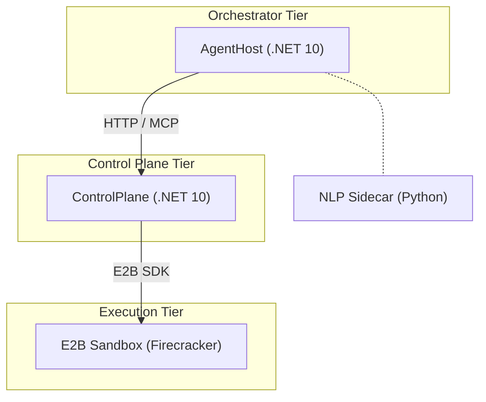

# Basileus System Index

Entry-point reference mapping every named concept to its authoritative location.

---

## Named Components

| Name | Role | Document Reference |
|------|------|--------------------|
| **Basileus** | Platform engine / backend | [Platform Architecture &sect;1](./platform-architecture.md#1-system-overview) |
| **Exarchos** | Local agent governance bridge (MCP server for Claude Code + MCP client for Basileus) | [SDLC Pipeline &sect;4](./distributed-sdlc-pipeline.md#4-local-tier-exarchos) |
| **Strategos** | Agentic.Workflow library (campaign orchestration) | [Platform Architecture &sect;4](./platform-architecture.md#4-agenticworkflow-library) |
| **Bifrost** | Channel infrastructure (standalone repo); referenced in platform-architecture for OpenTelemetry integration only | [Platform Architecture &sect;5](./platform-architecture.md#5-infrastructure-layer) |
| **Agentic Coder** (Kataphraktos/Vestiarites) | Remote autonomous coding agent (containerized) | [SDLC Pipeline &sect;6](./distributed-sdlc-pipeline.md#6-remote-tier-agentic-coder) |
| **NLP Sidecar** | Python service for embeddings, text segmentation, and signal evaluation; deployed alongside AgentHost | -- (code: `apps/nlp-sidecar/Basileus.NlpSidecar`) |
| **Graphite** | Stacked PR infrastructure (external tool); integrated into SDLC pipeline for progressive stacking and merge queue | [SDLC Pipeline &sect;9](./distributed-sdlc-pipeline.md#9-invocation-paths) |
| **E2B Infrastructure** | Self-hosted Firecracker sandbox platform on Azure; provides isolated micro-VM execution for agent-generated code | [Platform Architecture &sect;9](./platform-architecture.md#9-deployment--infrastructure) |
| **Workflow MCP Server** | New MCP server co-located with AgentHost, exposing workflow event streams and command interfaces to external MCP clients (Exarchos instances) via MCP streamable HTTP. Separate endpoint from the ControlPlane MCP server. | [SDLC Pipeline &sect;12](./distributed-sdlc-pipeline.md#12-basileus-integration), [Remote Notification Bridge](../designs/2026-02-19-remote-notification-bridge.md) |
| **Panoptikon** | Production observability loop: GitOps CD pipeline (ACA revisions + progressive traffic shifting), instant rollback, agent-driven incident triage (IncidentWorkflow), and Loop 6 production feedback into Thompson Sampling / Task Router / Knowledge Enrichment | [Panoptikon Design](../designs/2026-02-24-panoptikon-production-observability.md), [Platform Architecture &sect;9.4](./platform-architecture.md#94-observability-strategy) |
| **Agentic.Ontology** | Semantic type system for all agentic operations. Fluent DSL for declaring Object Types, Properties, Links, Actions, and Interfaces. Source-generated compile-time descriptors and cross-domain link validation. Enhances progressive disclosure with ontology-aware tool discovery. NuGet packages in the Agentic.Workflow repository. | [Platform Architecture &sect;4.14](./platform-architecture.md#414-ontology-layer-agenticontology), [Ontology Design](https://github.com/levelup-software/agentic-workflow/blob/main/docs/designs/2026-02-24-ontology-layer.md) |

See [SDLC Pipeline &sect;3 Naming](./distributed-sdlc-pipeline.md#naming-and-identity) for the full Byzantine naming family.

---

## Concept Glossary

| Term | Definition | Authoritative Section |
|------|------------|-----------------------|
| Phronesis Pattern | Reflective execution loop: Plan → (Think → Act → Observe → Reflect)* → Synthesize. Uses composable execution profiles instead of specialist agents. Named after Aristotle's concept of practical wisdom. Replaces the earlier Magentic-One specialist taxonomy. | [Platform Architecture &sect;3](./platform-architecture.md#3-application-layer-phronesis-pattern) |
| Reflective Execution Loop | The core Phronesis cycle: Think (context assembly + approach decision), Act (code generation + sandbox execution), Observe (zero-cost result capture), Reflect (tiered evaluation). Expressed declaratively via the Agentic.Workflow fluent DSL as a `RepeatUntil` loop. | [Platform Architecture &sect;3.1](./platform-architecture.md#31-the-reflective-execution-loop) |
| Execution Profile | Declarative, composable configuration that shapes the Think step — specifying instructions, tool subsets, RAG collections, and quality gates. Profiles replace specialist agents as the customization mechanism. Multiple profiles compose via `ExecutionProfile.Compose()`. | [Platform Architecture &sect;3.2](./platform-architecture.md#32-execution-profiles-everything-is-a-coder) |
| Task Ledger | Immutable structure tracking what needs to be done | [Platform Architecture &sect;2](./platform-architecture.md#2-core-concepts--terminology) |
| Progress Ledger | Mutable structure recording what has been completed; input to loop detection | [Platform Architecture &sect;2](./platform-architecture.md#2-core-concepts--terminology) |
| WorkflowSaga | Wolverine saga generated from Agentic.Workflow definitions; auto-persisted to PostgreSQL | [Platform Architecture &sect;7.6](./platform-architecture.md#76-infrastructure-integration) |
| Event Stream | Append-only Marten event sequence per workflow instance | [Platform Architecture &sect;7.1](./platform-architecture.md#71-events-as-the-source-of-truth) |
| Projection | Asynchronous read model built from the event stream (e.g. `PhronesisProjection`) | [Platform Architecture &sect;7.5](./platform-architecture.md#75-projections-and-read-models) |
| MCP (Model Context Protocol) | Standardized tool integration protocol over streamable HTTP; ControlPlane hosts servers, sandboxes use filesystem-based progressive disclosure with envd callbacks | [Platform Architecture &sect;5.3](./platform-architecture.md#53-tool-virtualization-and-mcp) |
| Execution Hairpin | AgentHost -> ControlPlane -> E2B Sandbox call chain; HTTP POST triggers E2B SDK sandbox creation, streamable HTTP returns results | [Platform Architecture &sect;5.2](./platform-architecture.md#52-the-execution-hairpin) |
| Code Execution Bridge | `ExecuteCode` workflow step connecting specialist workflows to physical infrastructure | [Platform Architecture &sect;2](./platform-architecture.md#2-core-concepts--terminology) |
| Budget Algebra | Multi-dimensional resource vector `{steps, tokens, executions, tool_calls, wall_time}` with scarcity levels | [Platform Architecture &sect;10](./platform-architecture.md#10-resource-management) |
| Loop Detection | Progress Ledger analysis for stuck workflows (exact/semantic repetition, oscillation, no-progress). Embedded within the ReflectStep's Reflection Tier 2 (NLP Sidecar) evaluation. | [Platform Architecture &sect;5.8](./platform-architecture.md#58-loop-detection-and-recovery) |
| Thompson Sampling | Contextual bandit algorithm for execution strategy selection via Beta distributions per (strategy, taskCategory) pair. Outcomes feed back into the SDLC verification flywheel via CodeQualityView. | [Platform Architecture &sect;4.7](./platform-architecture.md#47-agent--strategy-patterns) |
| Confidence Routing | Auto-escalation to human review when agent confidence falls below threshold. Shares a unified escalation protocol with the SDLC pipeline's context quality scoring — both trigger `ReflectionOutcome.Escalate` and follow the same AwaitApproval → GracefulDegrade path. | [Platform Architecture &sect;4.7](./platform-architecture.md#47-agent--strategy-patterns) |
| Task Router | Exarchos component deciding local vs. remote task dispatch using score-based heuristics | [SDLC Pipeline &sect;5](./distributed-sdlc-pipeline.md#5-task-router) |
| CQRS Views | Materialized read models merging local and remote activity (PipelineView, UnifiedTaskView, etc.) | [SDLC Pipeline &sect;8](./distributed-sdlc-pipeline.md#8-cqrs-views) |
| Agentic Coder | Autonomous coding agent running in containers with bounded plan-code-test-review loop | [SDLC Pipeline &sect;6](./distributed-sdlc-pipeline.md#6-remote-tier-agentic-coder) |
| Tiered Reflection | Three-tier evaluation model within the Reflect step. Reflection Tier 1: deterministic rules (0 tokens). Reflection Tier 2: NLP Sidecar semantic analysis (0 tokens). Reflection Tier 3: LLM meta-reasoning (~500 tokens). Higher tiers only run when lower tiers are inconclusive. Note: uses "Reflection Tier" prefix to distinguish from the SDLC pipeline's "Context Tier" nomenclature. | [Platform Architecture &sect;3.6](./platform-architecture.md#36-step-responsibilities) |
| Execution Strategy | An approach to executing a task, selected by Thompson Sampling. Strategies include SearchThenCode, CodeDirectly, DecomposeFirst, ExemplarBased, and InteractiveProbe. | [Platform Architecture &sect;4.7](./platform-architecture.md#47-agent--strategy-patterns) |
| ReflectionOutcome | The result of the Reflect step: Continue, Retry, Escalate, or Synthesize. Shared escalation semantics with SDLC context quality scoring — Escalate triggers the same AwaitApproval path regardless of source. | [Platform Architecture &sect;3.6](./platform-architecture.md#36-step-responsibilities) |
| Tool Virtualization | Filesystem-based progressive disclosure system for MCP tool access; ControlPlane provisions wrapper scripts into sandboxes via E2B SDK, tool invocations route back through envd vsock callbacks | [Platform Architecture &sect;5.3](./platform-architecture.md#53-tool-virtualization-and-mcp) |
| Streamable HTTP | MCP transport protocol replacing SSE; provides bidirectional real-time communication between AgentHost and ControlPlane within the MCP protocol | [Platform Architecture &sect;2](./platform-architecture.md#2-core-concepts--terminology) |
| E2B Sandbox | Firecracker micro-VM providing isolated, stateless code execution with zero internet access; managed via E2B SDK | [Platform Architecture &sect;1](./platform-architecture.md#1-system-overview) |
| Firecracker | Lightweight VMM (Virtual Machine Monitor) that creates micro-VMs for sandbox isolation; each sandbox runs its own Linux kernel | [Platform Architecture &sect;2](./platform-architecture.md#2-core-concepts--terminology) |
| envd | Agent process inside each E2B sandbox; provides filesystem, process, and code execution APIs over WebSocket/vsock; routes tool callbacks to ControlPlane | [Platform Architecture &sect;2](./platform-architecture.md#2-core-concepts--terminology) |
| Sandbox Manager | ControlPlane component managing E2B sandbox lifecycle (create, reuse, extend, destroy, reconnect) with pre-warming and timeout management | [Platform Architecture &sect;5.4](./platform-architecture.md#54-sandbox-manager) |
| Policy Engine | ControlPlane component enforcing pre-execution (auth, validation, rate limiting) and post-execution (output filtering, audit) checks on all tool invocations | [Platform Architecture &sect;5.5](./platform-architecture.md#55-policy-engine) |
| Tool Callback Hairpin | Pattern where sandbox tool invocations route through envd vsock to ControlPlane, which executes the tool and returns results; credentials never enter the sandbox | [Platform Architecture &sect;5.2](./platform-architecture.md#52-the-execution-hairpin) |
| Layered Quality Gates | Four-layer gate pipeline (Security, Governance, Integration, Review) with agent-side shift-left enforcement and CI-side verification | [SDLC Pipeline &sect;11](./distributed-sdlc-pipeline.md#11-layered-quality-gates) |
| Tiered Context Assembly | Two-tier context pipeline: deterministic file reads (Tier 1, always available) + RAG-augmented knowledge retrieval (Tier 2, optional) with two-stage retrieve-then-rerank and quality scoring | [SDLC Pipeline &sect;6](./distributed-sdlc-pipeline.md#6-remote-tier-agentic-coder) |
| Two-Stage Retrieval | RAG pipeline pattern: broad vector search (high recall, permissive thresholds) followed by Cohere Rerank (`rerank-v4.0-pro`) for precision filtering. Configured per-profile via `RerankConfiguration`. Parameters (`TopN`, `MinRelevanceScore`) auto-tune via Profile Evolution. | [Platform Architecture &sect;3.6](./platform-architecture.md#36-step-responsibilities), [SDLC Pipeline &sect;6](./distributed-sdlc-pipeline.md#6-remote-tier-agentic-coder) |
| Context Quality Scoring | Score-based evaluation of assembled context sufficiency (High >= 0.7, Sufficient >= 0.4, Low >= 0.2, Insufficient < 0.2); routes to planning or escalation | [SDLC Pipeline &sect;6](./distributed-sdlc-pipeline.md#6-remote-tier-agentic-coder) |
| Auto-Remediation | Bounded retry loop (default 3 attempts) for CI gate failures on agent-authored PRs; escalates to Exarchos on exhaustion | [SDLC Pipeline &sect;11](./distributed-sdlc-pipeline.md#11-layered-quality-gates) |
| SARIF | Static Analysis Results Interchange Format; standard output format for all gate results enabling unified reporting | [SDLC Pipeline &sect;11](./distributed-sdlc-pipeline.md#11-layered-quality-gates) |
| Stacked PRs | Feature decomposed into a sequence of small, focused, independently-reviewable PRs that merge in dependency order through a stack-aware merge queue; replaces monolithic feature PRs | [SDLC Pipeline &sect;9](./distributed-sdlc-pipeline.md#9-invocation-paths) |
| Progressive Stacking | Pattern where completed agent work is placed into a Graphite stack at pre-determined positions as agents finish, enabling progressive review while preserving parallel execution | [SDLC Pipeline &sect;9](./distributed-sdlc-pipeline.md#9-invocation-paths) |
| Stack Ledger | Workflow state structure tracking stack positions, their fill status (in-progress, completed-pending, placed), agent branches, and PR numbers | [SDLC Pipeline &sect;9](./distributed-sdlc-pipeline.md#9-invocation-paths) |
| Stack-Aware Merge Queue | Graphite merge queue that validates the full stack as a unit via `merge_group` CI gates before fast-forward merging each PR to main in order | [SDLC Pipeline &sect;11](./distributed-sdlc-pipeline.md#11-layered-quality-gates) |
| CI Gate Stratification | Split of quality gates into per-PR (fast, focused, &lt;3 min), per-stack deterministic (comprehensive, ~15-30 min), and per-stack advisory (agent-based review) tiers | [SDLC Pipeline &sect;11](./distributed-sdlc-pipeline.md#11-layered-quality-gates) |
| Streaming Sync Engine | Exarchos component that replaces polling-based sync with an MCP-client-based streaming engine. Opens an MCP streamable HTTP connection to the Basileus Workflow MCP Server, subscribes to workflow event streams via SSE, and processes events in real-time. Falls back to REST polling after >5 minutes of persistent MCP failure. | [SDLC Pipeline &sect;12](./distributed-sdlc-pipeline.md#12-basileus-integration), [Remote Notification Bridge](../designs/2026-02-19-remote-notification-bridge.md) |
| Notification Delivery Layer | Three-layer system closing the "last mile" gap between events-in-Exarchos and developer-awareness-in-Claude-Code. Layer 1: MCP tool response piggyback (passive, zero cost). Layer 2: Claude Code `UserPromptSubmit` hook + status line (semi-active, zero cost). Layer 3: Watcher teammate with `exarchos_notify_wait` long-polling (active, bidirectional, ~$0.01/relay). Layers are concurrent channels, not fallbacks. | [SDLC Pipeline &sect;12](./distributed-sdlc-pipeline.md#12-basileus-integration), [Remote Notification Bridge](../designs/2026-02-19-remote-notification-bridge.md) |
| Watcher Teammate | Dedicated Claude Code agent team teammate (Haiku model) whose sole job is relaying events between remote Agentic Coders and the developer. Spawned during `/delegate` when the Task Router dispatches remote tasks; shut down when all remote tasks complete. Uses `exarchos_notify_wait()` which blocks until an event arrives (zero tokens while waiting), then sends DM to lead. Provides the only true bidirectional push channel within Claude Code. | [SDLC Pipeline &sect;12](./distributed-sdlc-pipeline.md#12-basileus-integration), [Remote Notification Bridge](../designs/2026-02-19-remote-notification-bridge.md) |
| Notification Priority Model | Five-level priority classification (`info`, `success`, `warning`, `action-required`, `critical`) that determines batching, delivery timing, and notification surface across the three delivery layers. `info` events are batched; `action-required` events persist until responded to; `critical` triggers desktop notifications. | [SDLC Pipeline &sect;12](./distributed-sdlc-pipeline.md#12-basileus-integration), [Remote Notification Bridge](../designs/2026-02-19-remote-notification-bridge.md) |
| Two-Hop MCP Chain | Connectivity pattern where Exarchos acts as both MCP server (for Claude Code, existing role) and MCP client (for Basileus, new role). Events stream from Basileus to Exarchos in real-time via MCP streamable HTTP; developer commands flow back through the same MCP channel. Chosen over WebSocket/SSE/A2A for architectural consistency and bidirectional design. | [SDLC Pipeline &sect;12](./distributed-sdlc-pipeline.md#12-basileus-integration), [Remote Notification Bridge](../designs/2026-02-19-remote-notification-bridge.md) |
| Loop 6 (Production Feedback) | Sixth feedback loop connecting production runtime outcomes to agent learning. Production signals (incidents, rollbacks, health metrics) feed CodeQualityView, which informs Thompson Sampling priors (delayed negative penalty for incident-correlated strategies), Task Router scoring (rollback rate per task category), and Knowledge Enrichment (incident patterns indexed into RAG). Operates at two timescales: immediate (incident-driven) and continuous (trend-driven). | [Panoptikon &sect;8](../designs/2026-02-24-panoptikon-production-observability.md#8-loop-6-production-feedback), [Platform Architecture &sect;13](./platform-architecture.md#13-future-considerations) |
| Incident Workflow | Phronesis workflow type (`incident`) for automated production incident triage. Spawned by `SentinelDispatcher` when `IncidentOpened` events occur. Steps: AssembleIncidentContext (Sentry + logs + traces + Marten history) → DiagnoseRootCause (LLM-assisted RCA) → GenerateFix / EscalateToHumanQueue → ResolveIncident. Impact-based HITL: low = auto-fix, medium = notify, high = human approval required. | [Panoptikon &sect;6](../designs/2026-02-24-panoptikon-production-observability.md#6-incident-workflow) |
| DeploymentController | AgentHost component orchestrating GitOps CD via Azure Container Apps revision management. Progressive traffic shifting (10% → 50% → 100%) with configurable verification window. Instant rollback (< 5s) on health degradation. Emits deployment events to Marten stream. | [Panoptikon &sect;4](../designs/2026-02-24-panoptikon-production-observability.md#4-gitops-cd-pipeline) |
| ProductionHealthSnapshot | Periodic metric capture recording error rate, latency percentiles (P50/P95/P99), Sentry issue counts, resource utilization, and request rate. Sampled at adaptive intervals: 30s during deployments/incidents, 5min during stable periods. Stored as `ProductionHealthSampled` events in Marten stream. | [Panoptikon &sect;7](../designs/2026-02-24-panoptikon-production-observability.md#7-production-event-taxonomy) |
| Instant Incident Response | Zero-agent, infrastructure-only response to production degradation. Deployment-correlated issues trigger ACA revision rollback; feature-tagged issues trigger feature flag disable via Azure App Configuration. Executes in < 5s. Agent triage follows asynchronously via IncidentWorkflow. | [Panoptikon &sect;5](../designs/2026-02-24-panoptikon-production-observability.md#5-instant-incident-response) |
| SentinelDispatcher | AgentHost component handling production alert intake. Receives Sentry webhooks, correlates alerts with active deployments, executes instant response (rollback or feature flag disable), and spawns IncidentWorkflow for async agent triage. | [Panoptikon &sect;5](../designs/2026-02-24-panoptikon-production-observability.md#5-instant-incident-response) |
| Domain Ontology | A `DomainOntology` subclass declared per domain assembly (e.g., `TradingOntology`, `KnowledgeOntology`). Maps existing domain types into the ontology via a fluent builder API parsed by a Roslyn source generator at compile time. | [Platform Architecture &sect;4.14](./platform-architecture.md#414-ontology-layer-agenticontology) |
| Cross-Domain Link | Typed relationship between object types in different domain assemblies. Declared via `builder.CrossDomainLink("name").From<T>().ToExternal("domain", "Type")`, resolved and validated at composition time by the host assembly's source generator. | [Platform Architecture &sect;4.14](./platform-architecture.md#414-ontology-layer-agenticontology) |
| Ontology Interface | Polymorphic shape backed by a C# interface (e.g., `ISearchable`). Object types from different domains implement shared interfaces, enabling cross-domain queries. | [Platform Architecture &sect;4.14](./platform-architecture.md#414-ontology-layer-agenticontology) |
| Ontology Action | An operation declared on an object type, bound to either a workflow (`BoundToWorkflow`) or MCP tool (`BoundToTool`). Agents discover available actions through ontology queries rather than flat tool lists. | [Platform Architecture &sect;4.14](./platform-architecture.md#414-ontology-layer-agenticontology) |
| ComposedOntology | Source-generated type in the host assembly that merges all domain ontologies, resolves cross-domain links, and validates workflow chain type compatibility (`Produces<T>` ↔ `Consumes<T>`). | [Platform Architecture &sect;4.14](./platform-architecture.md#414-ontology-layer-agenticontology) |

---

## Architecture Layers (Quick Reference)

| Layer | Components | Role |
|-------|-----------|------|
| Orchestrator | AgentHost | Agentic.Workflow runtime, Phronesis reflective execution loop, Wolverine sagas, Marten events, Workflow MCP Server, DeploymentController (GitOps CD + instant rollback), SentinelDispatcher (incident response) |
| Control Plane | ControlPlane | MCP server, security boundary, E2B lifecycle management, streamable HTTP streaming |
| Execution | E2B Sandbox | Firecracker micro-VMs, stateless code execution, envd tool callbacks |
| Sidecar | NlpSidecar | Embeddings, text segmentation, signal evaluation |
| Shared | Basileus.Core + Basileus.Infrastructure | Contracts, primitives, plumbing |
| Domains | Trading, StyleEngine, Knowledge | Independent domain assemblies |
| Orchestration | Basileus.AppHost | .NET Aspire orchestration |

---

## Implementation Status Matrix

| Component | Status | Key Dependencies | Document |
|-----------|--------|-----------------|----------|
| AgentHost (three-tier) | Built | PostgreSQL, Marten, Wolverine | [Platform Architecture &sect;3](./platform-architecture.md#3-application-layer-phronesis-pattern) |
| ControlPlane MCP | Built | E2B SDK, Sandbox | [Platform Architecture &sect;5.3](./platform-architecture.md#53-tool-virtualization-and-mcp) |
| Sandbox (Python) | Superseded | -- | Replaced by E2B Firecracker sandboxes |
| Basileus.Core | Built | (none) | [Platform Architecture &sect;1](./platform-architecture.md#1-system-overview) |
| Basileus.Infrastructure | Built | Bifrost, Polly | [Platform Architecture &sect;5](./platform-architecture.md#5-infrastructure-layer) |
| Trading Domain | Built | Core, Infrastructure | -- |
| StyleEngine Domain | Built | Core, Infrastructure | -- |
| Knowledge Domain | Built | Core, Infrastructure | -- |
| Agentic.Workflow DSL | Built (NuGet) | Wolverine, Marten | [Platform Architecture &sect;4](./platform-architecture.md#4-agenticworkflow-library) |
| Basileus.NlpSidecar | Built | Python, sentence-transformers | -- (code: `apps/nlp-sidecar/`) |
| Basileus.ServiceDefaults | Built | Aspire | -- (code: `shared/Basileus.ServiceDefaults/`) |
| Basileus.AppHost | Built | Aspire | -- (code: `orchestration/Basileus.AppHost/`) |
| Basileus.Integration.Tests | Built | TUnit | -- (code: `tests/Basileus.Integration.Tests/`) |
| PR Red Team Agent | Scaffolded | PhronesisWorkflowDefinition, PrRedTeam profile, LlmCodeGenerator, GitHubReviewPublisher | [Design Doc](../designs/2026-02-21-phronesis-migration-pr-red-team.md) |
| WorkflowRouter | Scaffolded | WorkflowOptions.UsePhronesis flag | [Platform Architecture &sect;3](./platform-architecture.md#3-application-layer-phronesis-pattern) |
| DevSandbox Template | Scaffolded | ControlPlane, E2B SDK | [Design Doc](../designs/2026-02-21-phronesis-migration-pr-red-team.md) |
| Exarchos MCP Server | Designed | Claude Code agent teams, TypeScript | [SDLC Pipeline &sect;4](./distributed-sdlc-pipeline.md#4-local-tier-exarchos) |
| Task Router | Designed | Exarchos, Basileus API | [SDLC Pipeline &sect;5](./distributed-sdlc-pipeline.md#5-task-router) |
| Agentic Coder | Designed | Containers, Marten | [SDLC Pipeline &sect;6](./distributed-sdlc-pipeline.md#6-remote-tier-agentic-coder) |
| CQRS Views | Designed | Marten projections, Exarchos | [SDLC Pipeline &sect;8](./distributed-sdlc-pipeline.md#8-cqrs-views) |
| Unified Event Stream | Designed | Marten, Exarchos sync engine | [SDLC Pipeline &sect;7](./distributed-sdlc-pipeline.md#7-unified-event-stream) |
| Layered Quality Gates | Designed | Trufflehog, Endor Labs, ArchUnit, Stryker, Kyverno, SARIF | [SDLC Pipeline &sect;11](./distributed-sdlc-pipeline.md#11-layered-quality-gates) |
| Tiered Context Assembly | Designed | Knowledge domain, NLP Sidecar, IVectorSearchAdapter | [SDLC Pipeline &sect;6](./distributed-sdlc-pipeline.md#6-remote-tier-agentic-coder) |
| CI Auto-Remediation | Designed | GitHub Actions, Agentic Coder, Exarchos | [SDLC Pipeline &sect;11](./distributed-sdlc-pipeline.md#11-layered-quality-gates) |
| Graphite Stacked PR Integration | Designed | Graphite CLI, GitHub App | [SDLC Pipeline &sect;9](./distributed-sdlc-pipeline.md#9-invocation-paths) |
| Workflow MCP Server | Designed | AgentHost, Marten ISubscription, MCP C# SDK | [SDLC Pipeline &sect;12](./distributed-sdlc-pipeline.md#12-basileus-integration), [Remote Notification Bridge](../designs/2026-02-19-remote-notification-bridge.md) |
| Streaming Sync Engine | Designed | Exarchos, MCP TypeScript SDK, Basileus Workflow MCP Server | [SDLC Pipeline &sect;12](./distributed-sdlc-pipeline.md#12-basileus-integration), [Remote Notification Bridge](../designs/2026-02-19-remote-notification-bridge.md) |
| Notification Delivery Layer | Designed | Exarchos, Claude Code hooks, Claude Code agent teams | [SDLC Pipeline &sect;12](./distributed-sdlc-pipeline.md#12-basileus-integration), [Remote Notification Bridge](../designs/2026-02-19-remote-notification-bridge.md) |
| DeploymentController | Designed | Azure.ResourceManager.AppContainers, Marten, ProductionHealthMonitor | [Panoptikon &sect;4](../designs/2026-02-24-panoptikon-production-observability.md#4-gitops-cd-pipeline) |
| SentinelDispatcher | Designed | Sentry webhooks, DeploymentController, IncidentWorkflow | [Panoptikon &sect;5](../designs/2026-02-24-panoptikon-production-observability.md#5-instant-incident-response) |
| IncidentWorkflow | Designed | Agentic.Workflow (Phronesis), Sentry API, Azure Monitor, E2B Sandbox | [Panoptikon &sect;6](../designs/2026-02-24-panoptikon-production-observability.md#6-incident-workflow) |
| ProductionHealthView | Designed | Marten projections, ProductionHealthSampled events | [Panoptikon &sect;9](../designs/2026-02-24-panoptikon-production-observability.md#9-cqrs-view-extensions) |
| Production Feedback Loop (Loop 6) | Designed | CodeQualityView, Thompson Sampling, Task Router, Knowledge domain | [Panoptikon &sect;8](../designs/2026-02-24-panoptikon-production-observability.md#8-loop-6-production-feedback) |
| E2B Infrastructure (Dev) | Planned | Azure VM, Firecracker | [Platform Architecture &sect;9.2](./platform-architecture.md#92-development-deployment-45month) |
| E2B Infrastructure (Prod) | Planned | Azure VMs, Nomad, Firecracker | [Platform Architecture &sect;9.3](./platform-architecture.md#93-production-deployment-25003300month) |

**Status key:** Built = code exists in repo or published package. Scaffolded = initial types and tests exist but implementation is incomplete (see plan doc for remaining tasks). Superseded = replaced by newer approach. Designed = ADR/design doc exists. Planned = referenced but no design doc.

---

## Cross-Cutting Concerns

| Concern | Pattern | Where Defined |
|---------|---------|---------------|
| Event Sourcing | Marten append-only streams per workflow | [Platform Architecture &sect;7](./platform-architecture.md#7-event-sourcing--state-durability) |
| Saga Orchestration | Wolverine sagas with transactional outbox | [Platform Architecture &sect;7.6](./platform-architecture.md#76-infrastructure-integration) |
| Resilience | Polly retry / timeout / circuit-breaker via `ResiliencyPolicyGenerator` | [Platform Architecture &sect;5](./platform-architecture.md#5-infrastructure-layer) |
| Observability | OpenTelemetry to Honeycomb + Azure Monitor | [Platform Architecture &sect;9.4](./platform-architecture.md#94-observability-strategy) |
| Security Isolation | ControlPlane as mandatory boundary; AgentHost never contacts Sandbox; Firecracker VM isolation | [Platform Architecture &sect;8](./platform-architecture.md#8-security-model) |
| Resource Management | Budget Algebra with scarcity-aware routing | [Platform Architecture &sect;10](./platform-architecture.md#10-resource-management) |
| Backup / DR | Azure backup strategy with managed disk snapshots | [Platform Architecture &sect;9](./platform-architecture.md#9-deployment--infrastructure) |
| Quality Gates | Layered gate pipeline with agent-side shift-left + CI verification; SARIF output; bounded auto-remediation | [SDLC Pipeline &sect;11](./distributed-sdlc-pipeline.md#11-layered-quality-gates) |
| Notification Delivery | Three-layer system (piggyback, hooks+status, watcher teammate) delivering remote workflow events to the developer in Claude Code. Priority-based batching and routing. Bidirectional command channel via watcher teammate. | [SDLC Pipeline &sect;12](./distributed-sdlc-pipeline.md#12-basileus-integration), [Remote Notification Bridge](../designs/2026-02-19-remote-notification-bridge.md) |
| Verification Flywheel | Closed-loop system where gate results, benchmark measurements, and strategy outcomes feed CodeQualityView, which informs Thompson Sampling priors, execution profile evolution, and Task Router scoring | [SDLC Pipeline &sect;11](./distributed-sdlc-pipeline.md#verification-flywheel), [Platform Architecture &sect;13](./platform-architecture.md#13-future-considerations) |
| Unified Escalation Protocol | Shared escalation semantics: low confidence (platform) and low context quality (SDLC) both produce `ReflectionOutcome.Escalate`, triggering the same AwaitApproval → GracefulDegrade path | [Platform Architecture &sect;3.6](./platform-architecture.md#36-step-responsibilities), [SDLC Pipeline &sect;6](./distributed-sdlc-pipeline.md#6-remote-tier-agentic-coder) |
| Production Observability (Panoptikon) | Closed-loop production monitoring: GitOps CD with progressive traffic shifting, instant rollback (< 5s, zero-agent), agent-driven incident triage (IncidentWorkflow), continuous health sampling with adaptive rate, production signals feeding Loop 6 (Thompson Sampling penalties, Task Router risk scoring, Knowledge Enrichment with incident patterns). Three implementation phases: CD + rollback → incident triage → continuous feedback. | [Panoptikon Design](../designs/2026-02-24-panoptikon-production-observability.md), [Platform Architecture &sect;9.4](./platform-architecture.md#94-observability-strategy) |

---

## Theoretical Foundations

Documents in `docs/ai-theory/`:

| Document | Topic |
|----------|-------|
| `agentic-workflow-theory.md` | Formal framework: CMDP, HSM, Thompson Sampling, Budget Algebra |
| `core-mdp-concepts.md` | Markov Decision Process foundations |
| `core-rl-concepts.md` | Reinforcement learning fundamentals |
| `core-rl-concepts-cont.md` | RL concepts (continued) |
| `core-bn-concepts.md` | Bayesian network concepts |
| `core-hmm-concepts.md` | Hidden Markov Model concepts |
| `core-search-concepts.md` | Search algorithm concepts |
| `exploration-exploitation-tradeoff.md` | Thompson Sampling and bandit theory for specialist selection |
| `deterministic-agentic-workflows.md` | Deterministic orchestration of probabilistic agents |
| `theory-to-practice-mapping.md` | Mapping theoretical constructs to implementation |

---

## Active Designs

Documents in `docs/designs/`:

| Document | Topic |
|----------|-------|
| `2026-01-05-workflow-library-decomposition.md` | Workflow library package decomposition |
| `2026-01-09-paper-trading-validation.md` | Paper trading validation strategy |
| `2026-01-16-paper-trading-remediation.md` | Paper trading issue remediation |
| `2026-01-17-personal-finance-automation.md` | Personal finance automation feature |
| `2026-01-17-wealthfolio-integration.md` | Wealthfolio integration design |
| `2026-01-18-agentic-coder.md` | Full Agentic Coder design (remote tier) |
| `2026-01-18-developer-adoption-strategy.md` | Developer adoption strategy |
| `2026-02-03-agenthost-restructure.md` | AgentHost restructuring plan |
| `2026-02-05-unified-docs-consolidation.md` | Documentation consolidation design |
| `2026-02-07-agentic-sdlc-pipeline.md` | Agentic SDLC pipeline: layered quality gates, tiered context assembly, auto-remediation (incorporated into SDLC Pipeline ADR) |
| `2026-02-07-graphite-sdlc-integration.md` | Graphite stacked PR integration for SDLC pipeline |
| `2026-02-19-remote-notification-bridge.md` | Remote Notification Bridge: MCP streamable HTTP channel from Basileus to Exarchos, three-layer notification delivery (piggyback + hooks + watcher teammate), bidirectional developer commands. Supersedes SDLC Pipeline Phases 4-5 transport (polling → MCP streaming). |
| `2026-02-21-phronesis-migration-pr-red-team.md` | Phronesis AgentHost migration and PR Red Team agent: execution profiles, LLM code generation, GitHub review publishing, DevSandbox templates, and M1 deprecation feature flag. |
| `2026-02-24-panoptikon-production-observability.md` | Panoptikon Production Observability Loop: GitOps CD pipeline (ACA revisions + progressive traffic shifting), instant rollback, agent-driven incident triage (IncidentWorkflow with Phronesis), production event taxonomy, Loop 6 production feedback, ProductionHealthView CQRS projection. Three-phase build: CD + rollback → Sentry + incident workflow → continuous feedback loop. |

---

## Document Map

| Document | Purpose |
|----------|---------|
| [Platform Architecture](./platform-architecture.md) | Three-tier runtime, Agentic.Workflow, event sourcing, deployment, resources |
| [Distributed SDLC Pipeline](./distributed-sdlc-pipeline.md) | Exarchos, Task Router, Agentic Coder, unified events, CQRS views |
| [Self-Hosting Plan](./self-hosting-plan.md) | Archived -- superseded by Azure/E2B deployment; preserved as historical reference |
| [E2B Azure Migration Guide](../decisions/e2b-azure-migration-guide.md) | Deployment guide for self-hosting E2B on Azure (dev and production paths) |
| **This document** | Entry-point index mapping concepts to authoritative locations |
