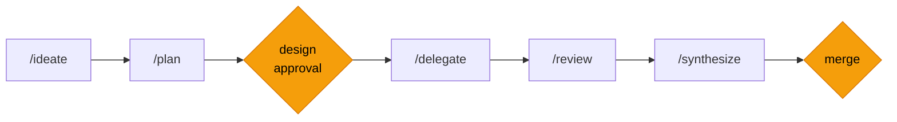

# Visual Asset Production Guide

Visual assets referenced by the README. Create these before the general release.

## 1. Hero Demo GIF — `demo-rehydrate.gif`

**Owner:** Reed (manual recording)

**What to record:** A terminal session showing checkpoint → rehydrate flow.

**Script:**
1. Show an active workflow mid-feature (e.g., delegate phase, 3/5 tasks complete)
2. Run `/checkpoint` — show state being saved
3. Cut to a fresh session (clear terminal, new timestamp)
4. Run `/rehydrate` — show workflow state restored (phase, tasks, design doc path, next action)
5. Agent continues from where it left off

**Specs:**
- Width: 720px (retina: 1440px)
- Duration: 15-20 seconds
- Dark terminal theme (match GitHub dark mode)
- No typing delays > 50ms
- Format: GIF (for GitHub rendering) + MP4 (for potential video embed)

**Tools (pick one):**
- [vhs](https://github.com/charmbracelet/vhs) — scripted terminal recordings, reproducible
- [asciinema](https://asciinema.org) + [agg](https://github.com/asciinema/agg) — record then convert to GIF
- [Gifox](https://gifox.app) / [LICEcap](https://www.cockos.com/licecap/) — screen capture to GIF

**vhs script example:**
```tape
Set Theme "Dracula"
Set Width 1440
Set Height 800
Set FontSize 16

Type "/checkpoint"
Enter
Sleep 2s

# ... (expand with full scenario)
```

## 2. Architecture Animation — `architecture.svg`

**What to create:** CSS-animated SVG showing the Exarchos workflow cycle, similar to the [CAS homepage animation](https://cas.dev/).

**Narrative loop (~14s cycle):**
1. **Claude Code (Lead)** dispatches tasks downward to Exarchos MCP
2. **Exarchos MCP** records state, spawns teammates
3. **Task packets** flow down to 3 teammate worktrees (labeled with animal-style names like CAS does, e.g., `keen-panther`, `wise-lynx`)
4. **Progress bars** scale horizontally in each worktree showing implementation progress
5. **Terminal text** fades in/out within worktrees simulating active work
6. **PR packets** flow back up from worktrees to Exarchos MCP
7. **Quality gates** flash green on the MCP box (convergence verification)
8. **Repository glow** pulses emerald when all gates pass
9. Loop restarts

**Animation technique:** Pure CSS `@keyframes` driving SVG elements. No JavaScript. Staggered timing across the 14-second cycle so different phases overlap naturally.

**Key visual elements:**
- Task packets flowing downward (labeled P1, P2, P3)
- PR packets flowing upward (labeled PR)
- Dashed connection lines with `stroke-dashoffset` animation for continuous flow
- Progress bars in each worktree using `transform: scaleX()`
- State labels fading in/out (`phase: delegate`, `3/5 tasks complete`)
- Repository glow using `stroke` color transition (gray → emerald)

**Layout:**
```
┌─────────────────────────────┐
│    Claude Code (Lead)       │  ← orchestrator
│    /ideate, /plan, /delegate│
└──────────────┬──────────────┘
               │
      ┌────────┴────────┐
      │   Exarchos MCP  │       ← state + quality gates
      │   ░░░░░░░░ ✓    │       ← convergence gate animation
      └────────┬────────┘
               │
    ┌──────────┼──────────┐
    ↓          ↓          ↓
┌────────┐ ┌────────┐ ┌────────┐
│ keen-  │ │ wise-  │ │ solid- │  ← teammates
│ panther│ │ lynx   │ │ newt   │
│ ▓▓▓░░ │ │ ▓▓▓▓░ │ │ ▓▓░░░ │  ← progress bars
└────────┘ └────────┘ └────────┘
    (wt-1)    (wt-2)    (wt-3)
```

**Style:**
- Dark background (#1a1a2e or similar)
- Monospace labels (JetBrains Mono, Fira Code, SF Mono, or system monospace)
- Muted grays (#D1D5DB) for default states, emerald (#10B981) for success/completion
- Clean connecting lines, no unnecessary decoration
- Width: 720px
- Supports both dark and light GitHub themes via `prefers-color-scheme` media query

**Tools:**
- Hand-code the SVG + CSS (CAS approach — most control over timing)
- [Figma](https://figma.com) for layout → hand-add CSS animations
- [SVG.js](https://svgjs.dev) if dynamic generation is needed

**Reference:** View source on [cas.dev](https://cas.dev/) for the CSS keyframe pattern. Their approach uses `@keyframes` with opacity, `scaleX()`, and `translate()` transforms orchestrated across a single cycle duration.

## 3. Competitive Comparison — `superpowers-comparison.png`

**What to create:** Side-by-side comparison of Obra Superpowers vs. Exarchos, showing what happens when context compaction hits.

**Left side (Superpowers):**
- Screenshot or mockup of a Claude Code session using Superpowers
- Indicators showing: stateless (no persistence), behavioral suggestions, no verification
- After compaction: agent starts fresh, previous workflow knowledge gone
- Caption: "Superpowers shapes behavior. Until compaction wipes it."

**Right side (Exarchos):**
- Screenshot or mockup of a Claude Code session using Exarchos
- Indicators showing: `/rehydrate` restoring state, convergence gate passing, audit trail
- After compaction: full workflow awareness restored in ~2-3k tokens
- Caption: "Exarchos persists and verifies. Compaction changes nothing."

**Content to highlight:**

| Capability | Superpowers | Exarchos |
|------------|-------------|----------|
| After compaction | Starts over | `/rehydrate` in ~2-3k tokens |
| Quality checks | Agent self-review (skippable) | Deterministic scripts (enforced) |
| State | Markdown files (session-scoped) | Event-sourced MCP (persistent) |
| Agent coordination | Manual tmux | Automated worktree delegation |

**Visual approach options:**
1. **Split-screen terminal mockup** — Two dark terminals side by side, left showing Superpowers losing context, right showing Exarchos restoring it
2. **Annotated screenshots** — Actual Claude Code sessions with callout annotations
3. **Diagram** — Abstract comparison with icons and short labels (faster to produce, less visceral)

**Specs:**
- Width: 1200px (600px per side)
- Dark theme matching GitHub dark mode
- Neutral, factual tone — competitive but not hostile (remember: "They're complementary — use both")

**Tools:**
- [Figma](https://figma.com) — layout + annotation
- Terminal screenshots + annotation overlay
- [Excalidraw](https://excalidraw.com) — quick diagrammatic version

## 4. Feature Workflow — Mermaid diagram

**What to create:** Replace the ASCII feature workflow in the README with a Mermaid diagram. GitHub renders ```` ```mermaid ```` blocks natively.

**Mermaid source:**


**Rendering notes:**
- GitHub applies its own theme (light/dark) to Mermaid diagrams automatically
- No custom fonts or colors are guaranteed — GitHub overrides most styling
- The `style` directives above highlight the two human checkpoints in amber
- Test rendering by pushing to a branch and viewing on GitHub before merging

**Fallback:** If Mermaid styling is too limited or the diagram renders poorly, keep the ASCII version. The ASCII workflow diagram is compact and renders consistently.

**Integration:** If the Mermaid diagram looks good, replace the feature workflow code block in the README:

````markdown

````

---

## Asset Checklist

- [ ] `demo-rehydrate.gif` — Hero demo recording (Reed, manual)
- [ ] `architecture.svg` — CSS-animated architecture diagram (CAS-style)
- [ ] `superpowers-comparison.png` — Competitive comparison vs. Obra Superpowers
- [ ] Feature workflow — Mermaid diagram (test on GitHub, fall back to ASCII if needed)
