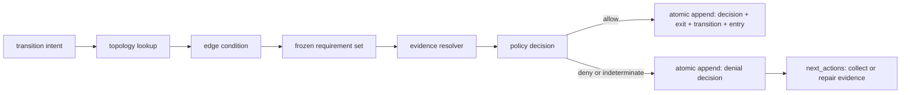

# Spec: Evidence-Backed Phase Transition Admission

**Date:** 2026-07-21 · **Feature:** `phase-gate-redesign` · **Depth:** deep  
**Inputs:** `docs/research/2026-07-21-phase-gate-redesign-strategy.md`; `docs/system-design.html`; `.exarchos/invariants.md`; issues [#1608](https://github.com/lvlup-sw/exarchos/issues/1608), [#1258](https://github.com/lvlup-sw/exarchos/issues/1258), [#1247](https://github.com/lvlup-sw/exarchos/issues/1247), [#1646](https://github.com/lvlup-sw/exarchos/issues/1646); Strategos issues [#100](https://github.com/lvlup-sw/strategos/issues/100), [#150](https://github.com/lvlup-sw/strategos/issues/150), [#151](https://github.com/lvlup-sw/strategos/issues/151)

> One unified artifact: `## Design & Rationale` is the DR-N source; `## Decomposition` maps tasks to DR-N within this same document.

## Design & Rationale

### Constraints

Anchored to `.exarchos/invariants.md`:

- **INV-1:** The append-only event log is the source of truth. Requirements, evidence, decisions, waivers, and transitions must replay without re-running tools or current policy.
- **INV-2, #1608 target:** The CLI is a presentation client over the MCP contract. Admission behavior lives once in the shared dispatch core.
- **INV-4, #1608 target:** Emit standard-conformant artifacts, with a thin shim only where no standard exists.
- **INV-5a/5b:** Inputs are schema-constrained; decisions and failures use fixed, self-correcting envelopes.
- **INV-6:** Substrate concepts are workload-neutral. Workflow-specific phase shapes stay in topology and the generated IR.
- **INV-8/INV-9:** Attempts are idempotent, and the HSM remains the sole authority for legal sequencing.
- **INV-12:** Missing proof and safe remediation are published as `next_actions`.
- **INV-15:** Admission is synchronous and in-process over SQLite.
- **Epic #1258:** The design lowers into declarative `WorkflowDefinitionV1` and the shared Strategos TypeSpec contract. It must not create another closed registry.

INV-11 has a documented source conflict. Issue #1608 claims launcher process-boundary enforcement, while the later #1601 text narrows the launcher to lifecycle rather than filesystem-space enforcement. This design relies only on the defensible dispatch/transition chokepoint.

### Problem Statement

Exarchos phase transitions are guarded by hand-written TypeScript predicates over `Record<string, unknown>`. These predicates mix six distinct responsibilities: routing, evidence collection, policy evaluation, enforcement severity, operator override, and remediation. Many accept mutable booleans or non-null fields as proof. Some suggest patching state directly to a passing value. Custom guards execute shell commands. The phase-kind layer freezes required gates on entry, but phase exit does not evaluate those frozen obligations. `phase.exited.allRequiredGatesPassed` is inferred from edge direction rather than gate evidence.

This creates brittle and sometimes misleading enforcement. A missing risk classification becomes `low`; an absent task list satisfies `allTasksComplete`; `implementationComplete` always passes; a review or approval can be represented by a patched status field. Gate events lack mandatory subject, producer, policy, and evidence digests. Some evidence writes are best-effort. `next_actions` lists legal edges without distinguishing currently admissible transitions from blocked ones.

The redesign must also align with epic #1258. The planned Workflow Builder SDK deletes the hand-written HSM and playbook registries and lowers workflows into the declarative, cross-product `WorkflowDefinitionV1`. The shared Strategos contract already defines `GateClass`, `GateDeclaration`, and `GateStep.gateId`, but it lacks an admission-policy contract that explains how evidence permits a transition. Preserving the current `(states, transitions, guards)` triple bit-for-bit would preserve the defect.

### Chosen Approach

Adopt **evidence-backed transition admission**. The HSM owns legal topology. Pure edge conditions select a route. Gate steps and handlers produce typed evidence. A declarative admission policy, frozen for the current phase, defines which evidence is required. The canonical transition command is the sole policy enforcement point.

The transition path becomes:

```text
intent -> legal edge -> edge condition -> frozen requirements
       -> evidence resolution -> policy decision -> atomic append
```

The policy decision returns `allow`, `deny`, or `indeterminate`, with reasons, satisfied and unsatisfied requirements, evidence references, policy identity, and safe remediation actions. `indeterminate` denies in enforce mode. Replay folds recorded requirements, evidence, decisions, waivers, and transitions. It never invokes tools or loads current policy.

The contract is shared. `Strategos.Contracts` gains additive admission-policy definitions and a transition reference to them. Exarchos generates Zod from the same TypeSpec. The TypeScript builder may offer ergonomic combinators, but every admission rule must lower to declarative IR. Arbitrary closures cannot cross the wire.

Risk and gate reliability are monotonic inputs. Higher risk and boundary status add obligations. Poor or uncertain gate reliability can require corroboration or human review, but it cannot remove a requirement or turn failure into pass. Human exceptions are scoped, attributable, expiring waiver evidence, never a generic force transition or patched pass state.

### Runtime Semantics and Performance

Admission remains inside the existing event-sourced, single-machine runtime. A transition attempt folds the stream at an expected version, evaluates a pure policy over frozen requirements and recorded evidence, and commits through SQLite. Replay only folds requirement, evidence, waiver, decision, and lifecycle events. It performs no tool execution, filesystem/VCS inspection, current-policy load, LLM call, or clock read.

Concurrency remains two-tiered. The in-process stream lock serializes same-stream calls in one process. Across CLI, MCP, orchestrator, and worktree processes, SQLite WAL plus `BEGIN IMMEDIATE`, the stream sequence key, and optimistic retry serialize writes while readers continue. `operationId` plus a canonical request digest is checked before decision evaluation, so a retry returns the persisted decision rather than observing a new phase or policy.

Gate execution is outside the transition hot path. Admission consumes a bounded active-evidence projection indexed by phase attempt, requirement, subject, and policy digest, then performs one pure evaluation and one transaction. The initial performance target is p99 under 15 ms for admission itself, excluding gate execution and content-addressed report generation.

### Delivery Milestone Split

**v2.12.0 is the additive proof-substrate release.** It can land characterization, trusted caller identity, reserved admission events, phase-attempt identity, pre-decision idempotency, evidence subjects/digests, the canonical gate runner, evidence supersession/contradiction, gate-reliability projection, and cancellation process-manager hardening. These changes run in audit/shadow mode. They do not add a workflow-definition registry, change legal phase behavior, enable strict admission, or delete legacy surfaces.

**v3.0.0 is the shared-IR consolidation and cutover.** It extends Strategos.Contracts, consumes generated Zod, adds Workflow Builder admission combinators and runtime lowering, integrates the policy evaluator, generates CLI presentation from the MCP contract, migrates built-in workflows, completes quantitative shadow soak, enables enforcement through an event, and deletes the legacy guard/HSM/playbook registries.

The cut line prevents an interim v2.12 authoring model that #1258 would immediately replace.

### MCP 2026-07-28 Contract

Public admission actions land only after #1604 migrates Exarchos to the MCP 2026-07-28 contract and #1606 establishes the generated CLI presentation path. `exarchos_workflow.transition`, waiver issue/revoke, and policy reassessment retain the existing composite tool and action discriminator.

Each action registers a total `outputSchema` covering allow, deny, indeterminate, degraded, and error shapes and returns `structuredContent`. CLI flags, help, and rendering are generated from the same action schemas, making equivalence hold by construction. Adapter-local admission behavior is prohibited. Long-running gate execution uses MCP Tasks where needed; transition admission remains a short synchronous decision over already-recorded evidence.

v2.12 may add internal event schemas and runtime primitives, but it must not freeze a temporary public result carrier that v3.0 would need to migrate again.

### Requirements (DR-N)

#### DR-1: Separate topology conditions from transition admission

The runtime must model route selection and proof enforcement as different contracts. An edge condition is a pure, declarative selector over projected facts or event identities. An admission policy evaluates frozen requirements against typed evidence. Neither contract may read arbitrary mutable state or execute I/O.

**Acceptance criteria:**
- Given a transition with a routing condition, when the condition selects an edge, then admission is evaluated separately before any phase mutation.
- Edge conditions cannot declare severity, remediation, shell commands, or evidence collection.
- Admission policies cannot create new topology edges or change HSM sequencing.
- Every legacy guard is classified and migrated as an edge condition, admission requirement, bounded-loop rule, approval, waiver, or obsolete predicate.

#### DR-2: Extend the shared declarative workflow IR

The admission contract must be an additive extension to the Strategos `WorkflowDefinitionV1` TypeSpec consumed by epic #1258. The shared contract reuses `GateClass`, `GateDeclaration`, and `GateStep.gateId` and adds admission-policy definitions rather than an Exarchos-only registry.

**Acceptance criteria:**
- `WorkflowDefinitionV1` can carry versioned `admissionPolicies`.
- `TransitionDefinition` can carry the closed edge-condition AST and reference an admission policy by stable ID.
- The IR contains no executable code, shell command, or untyped predicate expression used for enforcement.
- Exarchos-generated Zod and Strategos JSON Schema round-trip the same admission-policy fixture.
- A dangling gate, policy, or requirement reference and any unsupported condition node is rejected at compile/import time with a structured diagnostic.
- Exarchos consumes a pinned Strategos.Contracts schema revision with an attributable lock file and drift gate.

#### DR-3: Make gate evidence typed, immutable, and subject-bound

All enforceable gate outcomes must be represented as evidence statements tied to immutable subjects such as a commit, diff, task, wave, artifact digest, or phase attempt. Evidence records include producer identity/version, invocation ID, normalized verdict, policy identity/digest, content digest, and creation time.

**Acceptance criteria:**
- A bare mutable boolean or status field cannot satisfy an admission requirement.
- Evidence for source or artifact verification carries at least one digest-identified subject.
- Every evidence statement carries a stable `phaseAttemptId` when its requirement is phase-scoped.
- Producer identity is stamped from trusted dispatch context; callers cannot self-assert issuer, role, timestamp, or policy provenance.
- Generic event append rejects reserved requirement, evidence, decision, waiver, contradiction, and reassessment event types.
- Large reports are stored as content-addressed artifacts and referenced by digest.
- Re-running the same gate under the same operation ID is idempotent and returns the canonical persisted evidence.
- No enforceable gate can return success if durable evidence append fails.

#### DR-4: Resolve and freeze a complete requirement set

At phase entry, the resolver must produce and append a complete, versioned requirement set from phase kind, workflow context, risk tier, boundary status, project policy, gate declarations, and available gate-reliability telemetry. The exact input and output are hashed.

**Acceptance criteria:**
- Unknown risk remains `unknown`; it never defaults to `low`.
- The resolver defines a requirement-strength partial order over gate identity, subject scope, cardinality, freshness, effect, and corroboration.
- For every supported configuration, low requirements are no stronger than medium, and medium no stronger than high under that order.
- Boundary-touching requirements are no weaker than the same tier's non-boundary requirements.
- Poor or unknown reliability may add corroboration or approval but cannot remove a requirement or convert failure to pass.
- Policy changes do not retroactively alter an in-flight phase's frozen requirement set.
- Initial workflow creation allocates a phase attempt and freezes its requirement set before returning an actionable workflow.

#### DR-5: Enforce admission at one atomic transition chokepoint

The canonical transition command must fold state at an expected version, validate topology and conditions, evaluate admission, and atomically append the decision and resulting lifecycle events. No adapter, skill, hook, or gate implementation may bypass this path.

**Acceptance criteria:**
- An allowed transition appends the decision, `phase.exited`, `workflow.transition`, and target `phase.entered` in one atomic appender decision.
- A denied or indeterminate transition appends a structured denial decision and no transition event.
- The public transition action requires an operation ID; the idempotency claim is checked before state fold and policy evaluation so retries return the canonical prior decision.
- Concurrent attempts serialize through the existing SQLite/OCC substrate.
- Cancel and cleanup route through the same transition-admission primitive and cannot patch reviews, cleanup flags, or phase directly.
- `phase.exited` records `transitionAllowed` and `allUnwaivedRequiredEvidencePassed` from the decision, avoiding a false pass when a waiver permits failed evidence.
- CLI is generated as a presentation client from the MCP action contract; both surfaces call the same dispatch implementation.
- Admission reads a bounded active-evidence projection and meets p99 under 15 ms excluding gate execution and report generation.

#### DR-6: Return explainable decisions and actionable affordances

Every admission attempt must return a fixed decision shape with policy identity, reasons, requirement results, evidence references, and remediation actions. `next_actions` must distinguish legal transitions from presently actionable remediation.

**Acceptance criteria:**
- A denial identifies each missing, failed, stale, malformed, or contradictory requirement.
- Active evidence is selected by subject, phase attempt, policy digest, and explicit supersession chain; a valid rerun supersedes its prior result without erasing history.
- Contradiction means two active, non-superseding evidence statements or a typed downstream contradiction event disagree on the same requirement/subject/policy.
- Remediation actions are schema-constrained verbs such as `run_gate`, `collect_evidence`, `classify_risk`, `request_approval`, `request_waiver`, or `retry_transition`.
- No remediation action patches a task, review, approval, or validation status directly to pass.
- Unknown policy, malformed evidence, evaluator failure, and stale evidence return `indeterminate` with a stable error code.
- `describe` exposes the admission-policy schema and decision output without adding a new visible composite tool.

#### DR-7: Model approvals and overrides as scoped evidence

Human approvals are ordinary attributable evidence when policy requires them. Policy weakening is represented by a distinct waiver statement carrying approver, rationale, scope, subject digest, expiry, waived requirement IDs, and policy digest. There is no generic force-transition action.

**Acceptance criteria:**
- A waiver cannot apply outside its declared workflow/phase/subject scope or after expiry.
- A waiver names the exact requirements it weakens and never rewrites their evidence verdicts.
- The transition decision records which waiver evidence affected the outcome.
- Waiver creation and revocation use registered, schema-constrained actions that derive issuer identity from dispatch context and append atomically after capability authorization.
- Waiver evidence freezes the caller identity and capability/posture snapshot used for authorization; replay never re-queries current capabilities.
- Revocation or supersession is append-only and replay-deterministic.

#### DR-8: Replace the legacy guard system through shadow evaluation

All built-in workflows must migrate from `workflow/guards.ts` and custom shell guards to declarative conditions and admission policies. Migration proceeds by shadow-evaluating the new engine beside legacy guards and recording disagreements before enforcement flips.

**Acceptance criteria:**
- A characterization corpus covers every built-in transition, including denial, fix loop, approval, waiver, stale evidence, and unknown-risk cases.
- Shadow mode records legacy/new disagreements with both explanations and no phase behavior change.
- Each migrated workflow reaches zero unexplained disagreements before enforce mode.
- Enforcement cannot flip until the complete deterministic corpus passes and at least 20 live shadow attempts cover every phase kind with at least one allow and deny outcome.
- Intentional disagreement dispositions are typed, reviewed records tied to a fixture or operation ID; free-form labels do not satisfy the rollout gate.
- Shadow-attempt, disagreement-disposition, rollout-decision, and enforcement-enabled events are reserved typed events.
- The rollout decision and enforcement enablement are one atomic event-sourced operation, not a later config edit.
- Epic #1258 built-in migration compares transition-decision fixtures, not bit-identical legacy guard objects.
- The final slice deletes `workflow/guards.ts`, custom shell transition guards, and direct pass-state suggested fixes.

#### DR-9: Fail closed without breaking replay or recovery

Policy absence, resolver failure, malformed references, evidence corruption, and atomic append failure must not advance the workflow. Recovery is explicit and event-sourced. Reassessment under a new policy is a new operation, not an implicit replay behavior change.

**Acceptance criteria:**
- Any policy/evidence evaluation error produces `indeterminate` and blocks an enforce-mode transition.
- Replay performs no filesystem, VCS, toolchain, LLM, clock, or current-policy I/O.
- A registered reassessment action emits requested/completed events, selects an explicit policy version, and preserves the prior decision.
- Reassessment cannot select a semantically weaker policy unless the same operation includes an authorized scoped waiver.
- Existing in-flight workflows receive an event-sourced bootstrap requirement set and phase-attempt identity before enforcement; no mutable backfill is permitted.
- Cancellation is a two-event process manager: intent and compensation outcomes are recorded before final transition admission, so retries recover without replaying completed effects.
- A content-addressed evidence artifact missing or digest-mismatched is treated as invalid evidence.
- Partial decision/transition sibling events are impossible at the atomic append boundary.

#### DR-10: Preserve platform and workload agnosticity

The core model must use cross-runtime concepts and provider references, not harness commands, workflow names, languages, or operating-system shell syntax. Gate implementations resolve through the existing toolchain/provider substrate.

**Acceptance criteria:**
- The admission IR contains no Claude/Codex/Copilot-specific identifier or command syntax.
- No transition policy contains a shell command or language-specific test command.
- Adding a new workflow type requires only topology, phase-kind, and policy declarations; the decision engine gains no workflow-type branch.
- Adding a new gate provider does not change the admission-policy schema or transition evaluator.
- The design adds no visible MCP tool and preserves the action-discriminator surface.
- CLI flags, help, and result rendering for admission actions are generated from the MCP registry contract in coordination with issue #1606.

### Technical Design



The current `Guard` interface is replaced by declarative contracts and typed providers:

- `ConditionEvaluator`: one pure evaluator over the closed fact/event AST.
- `RequirementResolver`: phase-kind and context to frozen requirements.
- `EvidenceProvider`: gate runner output to subject-bound evidence.
- `AdmissionPolicyProvider`: requirements plus evidence to `TransitionDecision`.
- `CallerIdentity`: a trusted dispatch-boundary identity and authorization snapshot derived from the MCP session/agent specification or the local CLI operator context, never from action arguments.

The default provider is embedded TypeScript over typed policy data. The decision API remains provider-neutral, but no external policy engine is required. OPA/Rego or WASM could be added later only behind the same interface.

`AtomicAppender.decide` supplies the transaction boundary. The decision input includes stream version, phase attempt, policy digest, requirement-set digest, evidence refs, risk, and boundary status. The appended decision is the authoritative proof of why a transition did or did not occur.

Gate reliability from #1646 remains a projection. It is sampled into requirement resolution and frozen by value plus source. It never changes replayed decisions.

### Integration Points

- `servers/exarchos-mcp/src/workflow/state-machine.ts` - topology and condition evaluation only; no evidence policy.
- `servers/exarchos-mcp/src/workflow/hsm-transition-guard.ts` - replaced by transition admission over `AtomicAppender.decide`.
- `servers/exarchos-mcp/src/workflow/phase-kind.ts` - retains kind-level obligation resolver dispatch and gains the shared requirement-set carrier.
- `servers/exarchos-mcp/src/workflow/guards.ts` - migration source, then deleted.
- `servers/exarchos-mcp/src/orchestrate/gate-utils.ts` - evolves into the single evidence-producing gate runner.
- `servers/exarchos-mcp/src/event-store/schemas.ts` - evidence, requirement, decision, waiver, and reassessment events.
- `servers/exarchos-mcp/src/views/workflow-state-projection.ts` - folds the active requirement set and latest admission decision.
- `servers/exarchos-mcp/src/next-actions-computer.ts` - derives admissible remediation from decisions.
- `Strategos.Contracts/WorkflowDefinitionV1` - additive admission-policy definitions and transition references.
- Epic #1258 P1/P5/P7 - schema extension, IR-to-runtime lowering, and decision-fixture built-in migration.
- Issue #1604 - MCP 2026-07-28 adapter migration and total structured output schemas.
- Issue #1606 - CLI generated as a presentation client over the MCP action contract.
- Issue #1646 - gate-class reliability projection consumed as monotonic corroboration input.

### Exploration

Research report: `docs/research/2026-07-21-phase-gate-redesign-strategy.md`  
Discovery workflow: `phase-gate-redesign-research`  
Correlation ID: `4c76a189-67e6-446b-902f-7c5da23e8937`

Three approaches were compared:

1. **Typed guard registry:** lowest migration cost, but keeps topology, evidence, policy, and remediation coupled and does not lower cleanly into the declarative shared IR.
2. **Explicit gate steps:** makes verification visible and reuses the shared gate taxonomy, but still lacks an independent rule for evidence composition, freshness, contradiction, risk, and bypass prevention.
3. **Evidence-backed transition admission:** gate steps produce proof; declarative policies consume it at the sole transition chokepoint.

The third approach was selected. The user confirmed a shared IR contract, full legacy-guard replacement, scoped expiring waivers, and monotonic reliability that can add corroboration but never weaken requirements.

### Alternatives considered

- **Embed OPA/Rego as the core evaluator:** rejected for the first implementation. It adds a policy runtime and packaging surface where a pure local TypeScript provider suffices. The decision interface remains provider-neutral.
- **Use Cedar:** rejected as the primary model. Authorization semantics and skip-on-policy-error behavior do not map cleanly to quality evidence and fail-closed transition admission.
- **Keep custom shell guards as an escape hatch:** rejected. They are platform-sensitive, weakly typed, not declarative IR, and cannot produce standardized subject-bound evidence.
- **Treat approvals as mutable state:** rejected. Approval and waiver are evidence with identity, scope, provenance, and expiry.

### Decisions resolved during decomposition

- The additive shared contract keeps `schemaVersion: "1.0"` under the existing additive-minor rule. Each admission policy carries its own version.
- The initial closed condition vocabulary is `eventObserved`, `factEquals`, `factPresent`, `counterCompare`, `all`, `any`, and `not`. Version 1 has no named-provider escape hatch.
- Initial evidence subjects are workflow, phase attempt, wave, task, commit, diff, and artifact.
- Contradictory evidence denies admission and invokes a diagnostic fork only when the workflow declares the `gate_contradiction` trigger.

## Technical Design

This section is the coverage-oriented technical map consumed by `check_plan_coverage`. The detailed rationale and contracts remain in `## Design & Rationale`.

### Shared IR contract

Strategos TypeSpec owns admission-policy, evidence-requirement, waiver, and transition-reference wire models. Exarchos consumes generated Zod from the same schema.

### Edge conditions

A closed declarative AST selects legal routes without I/O, policy, severity, remediation, or arbitrary executable expressions.

### Evidence and gate runner

All gate providers execute through one runner that persists subject-bound evidence before returning success.

### Requirement resolution

Phase kind, risk, boundary status, project policy, gate declarations, and reliability resolve into one complete frozen requirement set.

### Admission decisions and atomic transitions

The evaluator returns allow, deny, or indeterminate. `AtomicAppender.decide` commits the decision and lifecycle events without partial siblings.

### Waivers

Approvals and scoped expiring waivers are attributable evidence. They never rewrite failed requirements or fabricate passing gate output.

### Affordances and facade parity

Structured decisions drive remediation `next_actions`, and CLI/MCP expose byte-equivalent contracts through the shared dispatch core.

### Shadow migration

Legacy and new decisions run side by side in audit mode until every built-in workflow reaches zero unexplained disagreements.

### Gate reliability

Issue #1646's pure projection feeds measured reliability into requirement resolution. Reliability can add corroboration but cannot weaken policy.

### Runtime retirement and conformance

After migration, legacy guard closures and custom shell transition guards are deleted. Cross-runtime CTK, replay, and performance evidence gate enforcement.

## Decomposition

### Scope

**Target:** Full design. Replace the legacy phase-guard abstraction, extend the shared workflow IR, integrate the risk-verification and gate-reliability pipelines, migrate every built-in workflow, and retire custom shell transition guards.

**Excluded:**
- An OPA, Rego, Cedar, or WASM policy provider. The first provider is embedded TypeScript behind a provider-neutral interface.
- Cryptographic signing of local evidence. Evidence carries content and subject digests now; signing can be added without changing admission semantics.
- Remote policy evaluation or cross-host transition admission. Exarchos remains inside INV-15's single-machine frame.
- Strategos runtime admission evaluation. This slice extends the shared wire contract and validates import/round-trip behavior; Exarchos owns the first evaluator.

### External delivery gates

- Tasks 004-005 land through a new linked Strategos.Contracts admission-policy issue and PR.
- Tasks 006, 033, and 047 do not dispatch until #1258 P1-P5 (#1247-#1251) provide the schema/codegen, SDK package, compile pipeline, and registration substrate.
- Tasks 029-034 coordinate with #1258 P7 (#1253) rather than creating a competing built-in migration.
- Tasks 026 and 048 do not dispatch until #1604 provides total MCP output schemas and #1606 establishes the generated CLI presentation pipeline.

### Milestone allocation

| Milestone | Posture | Tasks | Exit condition |
|-----------|---------|-------|----------------|
| **v2.12.0** | Additive proof substrate; audit/shadow only; no legacy deletion | 001, 007-008, 011-016, 035, 039-041, 043, 049, 052-053 | Trusted evidence can be produced, replayed, superseded, and measured across processes without changing transition behavior |
| **v3.0.0** | Shared IR, generated public surfaces, admission enforcement, and cutover | 002-006, 009-010, 017-034, 036-038, 042, 044-048, 050-051 | Shared-contract CTK and quantitative shadow soak pass; event-sourced enforcement enabled; legacy registries removed |

The v2.12 task set defines versioned runtime event contracts and reusable storage/identity primitives, not a second workflow-definition format. v3.0 replaces hand-authored policy aliases with generated shared-IR types while preserving event compatibility.

### Open-question resolutions

- Keep `WorkflowDefinitionV1.schemaVersion` at `"1.0"` under the existing additive-minor rule. Each `AdmissionPolicyDefinition` carries its own `policyVersion`.
- Ship a closed edge-condition AST with `eventObserved`, `factEquals`, `factPresent`, `counterCompare`, `all`, `any`, and `not`. Version 1 has no named-provider escape hatch.
- Ship initial evidence subjects for workflow, phase attempt, wave, task, commit, diff, and artifact.
- A contradiction emits a typed contradiction event and denies admission. It triggers the existing Strategos diagnostic fork only when the workflow declares `gate_contradiction`.

### Traceability matrix (DR-N to tasks)

| DR | Requirement | Tasks |
|----|-------------|-------|
| DR-1 | Separate topology conditions from transition admission | 001, 009, 010, 027, 028, 029, 030, 031, 032, 037, 047 |
| DR-2 | Extend the shared declarative workflow IR | 002, 004, 005, 006, 009, 026, 033, 034, 046, 047, 048 |
| DR-3 | Make gate evidence typed, immutable, and subject-bound | 003, 007, 008, 011, 012, 013, 014, 015, 016, 035, 039, 043, 049, 052 |
| DR-4 | Resolve and freeze a complete requirement set | 003, 007, 008, 017, 018, 019, 020, 035, 040, 042, 050 |
| DR-5 | Enforce admission at one atomic transition chokepoint | 001, 003, 013, 016, 021, 023, 024, 026, 038, 041, 045, 047, 053 |
| DR-6 | Return explainable decisions and actionable affordances | 003, 007, 008, 021, 025, 026, 043, 048 |
| DR-7 | Model approvals and overrides as scoped evidence | 003, 007, 008, 022, 039, 044, 052 |
| DR-8 | Replace the legacy guard system through shadow evaluation | 001, 015, 016, 027, 028, 029, 030, 031, 032, 033, 034, 037, 038, 047, 049, 050, 051 |
| DR-9 | Fail closed without breaking replay or recovery | 001, 003, 007, 008, 010, 011, 012, 013, 015, 016, 019, 020, 021, 022, 023, 034, 038, 039, 040, 041, 043, 044, 045, 050, 051, 052, 053 |
| DR-10 | Preserve platform and workload agnosticity | 002, 004, 006, 009, 010, 014, 017, 026, 033, 034, 037, 038, 046, 047, 048, 049, 052 |

### Tasks

`Acceptance Test Ref` is a provenance link, not an execution-order dependency. Tasks 002 and 003 are final executable north-star tests and deliberately depend on the substrate they verify. This is consistent with the verification ladder's outcome-based, test-after policy.

### Task 001: Capture legacy transition-decision characterization corpus

**Risk Tier:** high  
**Boundary Touching:** true  
**Test Layer:** acceptance  
**Implements:** DR-1, DR-5, DR-8, DR-9

**Files:**
- `servers/exarchos-mcp/src/workflow/__fixtures__/transition-admission-corpus.ts`
- `servers/exarchos-mcp/src/workflow/hsm-transition-guard.test.ts`

**Test file:** `servers/exarchos-mcp/src/workflow/hsm-transition-guard.test.ts`

**Testing Strategy:** `exampleTests: true`, `propertyTests: true`, `benchmarks: false`, `testLayer: acceptance`, `characterizationRequired: true`; property: every fixture has one deterministic legacy verdict and stable explanation.
**Tests:** `LegacyTransitionCorpus_AllFixtures_HaveStableVerdicts`

**Steps:**
1. Enumerate every built-in transition and representative pass/fail state.
2. Add bypass fixtures for empty tasks, always-pass implementation, patched approvals, unknown risk, and stale gate events.
3. Serialize the expected legacy result as the migration baseline.

**Dependencies:** None  
**Parallelizable:** Yes

### Task 002: Add shared-IR admission round-trip acceptance fixture

**Risk Tier:** high  
**Boundary Touching:** true  
**Test Layer:** acceptance  
**Implements:** DR-2, DR-10

**Files:**
- `servers/exarchos-mcp/src/workflow-ir/__fixtures__/transition-admission.workflow.json`
- `servers/exarchos-mcp/src/workflow-ir/admission-contract.acceptance.test.ts`

**Testing Strategy:** `exampleTests: true`, `propertyTests: true`, `benchmarks: false`, `testLayer: acceptance`, `characterizationRequired: false`; property: Strategos JSON Schema and Exarchos Zod accept and round-trip the same fixture.
**Tests:** `SharedAdmissionFixture_BothSchemas_RoundTrips`

**Steps:**
1. Author one declarative workflow fixture with conditions, gate declarations, requirements, waiver policy, and transition policy.
2. Assert cross-product schema acceptance and value identity.
3. Add a rejected dangling-reference fixture.

**Dependencies:** 005, 006, 046  
**Parallelizable:** No

### Task 003: Add end-to-end transition admission acceptance test

**Risk Tier:** high  
**Boundary Touching:** true  
**Test Layer:** acceptance  
**Implements:** DR-3, DR-4, DR-5, DR-6, DR-7, DR-9, DR-10

**Files:**
- `servers/exarchos-mcp/src/workflow/transition-admission.acceptance.test.ts`

**Testing Strategy:** `exampleTests: true`, `propertyTests: true`, `benchmarks: false`, `testLayer: acceptance`, `characterizationRequired: false`; properties: deny without evidence, allow with matching evidence, indeterminate on corruption, waiver scope and expiry hold.
**Tests:** `TransitionAdmission_EvidenceAndWaiver_ProducesAtomicOutcome`

**Steps:**
1. Drive a real event store through phase entry, gate evidence, and transition attempt.
2. Assert atomic allow and deny event batches.
3. Assert the returned remediation and replayed projection.

**Dependencies:** 023, 025, 026, 039, 040, 041, 043, 044, 045, 050, 053  
**Parallelizable:** No

### Task 004: Define admission-policy TypeSpec models

**Risk Tier:** high  
**Boundary Touching:** true  
**Test Layer:** integration  
**Implements:** DR-2, DR-10

**Files:**
- `lvlup-sw/strategos/src/Strategos.Contracts/Workflow/AdmissionPolicy.tsp`
- `lvlup-sw/strategos/src/Strategos.Contracts/Workflow/EdgeCondition.tsp`
- `lvlup-sw/strategos/src/Strategos.Contracts/schemas/json-schema/AdmissionPolicyDefinition.json`
- `lvlup-sw/strategos/src/Strategos.Contracts/schemas/json-schema/EvidenceRequirement.json`
- `lvlup-sw/strategos/src/Strategos.Contracts/schemas/json-schema/WaiverPolicy.json`

**Testing Strategy:** `exampleTests: true`, `propertyTests: true`, `benchmarks: false`, `testLayer: integration`, `characterizationRequired: false`; property: TypeSpec emit is schema-valid and contains no executable leaf.
**Tests:** `AdmissionTypeSpec_ValidModels_EmitSchemas`

**Steps:**
1. Open/link the Strategos admission-contract issue and define versioned policy, requirement, condition, subject, freshness, cardinality, effect, and waiver models.
2. Constrain all closed vocabularies with wire-stable values.
3. Emit JSON Schema and add contract examples.

**Dependencies:** None  
**Parallelizable:** Yes

### Task 005: Link admission policies from workflow and transition definitions

**Risk Tier:** high  
**Boundary Touching:** true  
**Test Layer:** integration  
**Implements:** DR-2

**Files:**
- `lvlup-sw/strategos/src/Strategos.Contracts/Workflow/WorkflowDefinitionV1.tsp`
- `lvlup-sw/strategos/src/Strategos.Contracts/Workflow/Structural.tsp`
- `lvlup-sw/strategos/src/Strategos.Contracts/schemas/json-schema/WorkflowDefinitionV1.json`
- `lvlup-sw/strategos/src/Strategos.Contracts/schemas/json-schema/TransitionDefinition.json`
- `lvlup-sw/strategos/src/Strategos.Contracts.Tests/Pipeline/SchemaDiffTests.cs`
- `lvlup-sw/strategos/src/Strategos.Contracts.Tests/Workflow/StructuralDefsTests.cs`

**Testing Strategy:** `exampleTests: true`, `propertyTests: true`, `benchmarks: false`, `testLayer: integration`, `characterizationRequired: true`; property: absent additive fields preserve every existing v1 fixture.
**Tests:** `WorkflowDefinition_AdditiveAdmissionFields_PreservesFixtures`

**Steps:**
1. Add optional `admissionPolicies` and `admissionPolicyId`.
2. Add the closed edge-condition AST to `TransitionDefinition`.
3. Keep `schemaVersion: "1.0"` with per-policy versioning and pin additions as non-breaking.

**Dependencies:** 004  
**Parallelizable:** No

### Task 006: Consume generated admission schemas in Exarchos

**Risk Tier:** high  
**Boundary Touching:** true  
**Test Layer:** integration  
**Acceptance Test Ref:** 002  
**Implements:** DR-2, DR-10

**Files:**
- `servers/exarchos-mcp/src/workflow-ir/generated/admission-policy.ts`
- `servers/exarchos-mcp/src/workflow-ir/generated/workflow-definition.ts`
- `servers/exarchos-mcp/src/workflow-ir/codegen-guard.test.ts`

**Testing Strategy:** `exampleTests: true`, `propertyTests: true`, `benchmarks: false`, `testLayer: integration`, `characterizationRequired: false`; property: generated Zod accepts all Strategos importable fixtures and rejects the same invalid references.
**Tests:** `AdmissionSchemaCodegen_StrategosFixtures_MatchZod`

**Steps:**
1. Extend JSON Schema to Zod generation inputs.
2. Export generated types from the workflow-IR boundary and map them to the versioned v2.12 runtime event contracts.
3. Add drift, compatibility, and cross-product fixture tests.

**Dependencies:** 005, 007, 008, 046  
**External Dependencies:** #1247 and #1250  
**Parallelizable:** No

### Task 007: Add requirement, evidence, decision, and waiver domain types

**Risk Tier:** high  
**Boundary Touching:** true  
**Test Layer:** unit  
**Acceptance Test Ref:** 003  
**Implements:** DR-3, DR-4, DR-6, DR-7, DR-9

**Files:**
- `servers/exarchos-mcp/src/workflow/admission/types.ts`
- `servers/exarchos-mcp/src/workflow/admission/types.test.ts`

**Testing Strategy:** `exampleTests: true`, `propertyTests: true`, `benchmarks: false`, `testLayer: unit`, `characterizationRequired: false`; properties: discriminated unions are exhaustive and invalid mixed outcomes are unrepresentable.
**Tests:** `AdmissionDomain_InvalidOutcome_IsRejected`

**Steps:**
1. Define branded IDs and discriminated unions.
2. Add `allow | deny | indeterminate` decision outcomes.
3. Add typed remediation actions and waiver provenance as versioned runtime event contracts, not a workflow-definition registry.

**Dependencies:** None  
**Parallelizable:** No

### Task 008: Add admission and evidence event schemas

**Risk Tier:** high  
**Boundary Touching:** true  
**Test Layer:** integration  
**Acceptance Test Ref:** 003  
**Implements:** DR-3, DR-4, DR-6, DR-7, DR-9

**Files:**
- `servers/exarchos-mcp/src/event-store/schemas.ts`
- `servers/exarchos-mcp/src/event-store/schemas.test.ts`
- `servers/exarchos-mcp/src/event-store/__tests__/transition-admission-events.test.ts`

**Testing Strategy:** `exampleTests: true`, `propertyTests: true`, `benchmarks: false`, `testLayer: integration`, `characterizationRequired: true`; property: every serialized event validates and round-trips without losing policy or evidence references.
**Tests:** `AdmissionEvents_MalformedPayload_IsRejected`

**Steps:**
1. Add requirement-resolved, evidence-recorded, transition-decided, waiver, contradiction, and reassessment schemas.
2. Require policy and input digests on decisions.
3. Add strict malformed-event fixtures.

**Dependencies:** 007  
**Parallelizable:** No

### Task 009: Define the closed edge conditions AST

**Risk Tier:** high  
**Boundary Touching:** true  
**Test Layer:** unit  
**Implements:** DR-1, DR-2, DR-10

**Files:**
- `servers/exarchos-mcp/src/workflow/admission/condition.ts`
- `servers/exarchos-mcp/src/workflow/admission/condition.test.ts`
- `servers/exarchos-mcp/src/workflow-ir/generated/edge-condition.ts`

**Testing Strategy:** `exampleTests: true`, `propertyTests: true`, `benchmarks: false`, `testLayer: unit`, `characterizationRequired: false`; property: AST serialization is total and contains no command or executable expression.
**Tests:** `EdgeConditionAst_ExecutableLeaf_IsRejected`

**Steps:**
1. Define the seven approved condition nodes.
2. Prove every built-in routing condition lowers to the closed AST.
3. Reject provider references, shell commands, and free-form enforcement expressions.

**Dependencies:** 007  
**Parallelizable:** No

### Task 010: Implement pure edge-condition evaluation

**Risk Tier:** high  
**Boundary Touching:** false  
**Test Layer:** property  
**Acceptance Test Ref:** 003  
**Implements:** DR-1, DR-9, DR-10

**Files:**
- `servers/exarchos-mcp/src/workflow/admission/evaluate-condition.ts`
- `servers/exarchos-mcp/src/workflow/admission/evaluate-condition.test.ts`

**Testing Strategy:** `exampleTests: true`, `propertyTests: true`, `benchmarks: false`, `testLayer: property`, `characterizationRequired: false`; properties: deterministic evaluation, De Morgan consistency, no mutation, unknown fact is indeterminate.
**Tests:** `EvaluateCondition_EquivalentInputs_ReturnSameResult`

**Steps:**
1. Evaluate the closed AST over projected facts and event identities.
2. Return indeterminate for unknown or malformed facts.
3. Add seeded invalid-condition and unknown-fact tests.

**Dependencies:** 009  
**Parallelizable:** No

### Task 011: Validate evidence subjects and digests

**Risk Tier:** high  
**Boundary Touching:** true  
**Test Layer:** property  
**Acceptance Test Ref:** 003  
**Implements:** DR-3, DR-9

**Files:**
- `servers/exarchos-mcp/src/workflow/admission/evidence-subject.ts`
- `servers/exarchos-mcp/src/workflow/admission/evidence-subject.test.ts`

**Testing Strategy:** `exampleTests: true`, `propertyTests: true`, `benchmarks: false`, `testLayer: property`, `characterizationRequired: false`; properties: canonicalization is stable, digest changes on content change, unsupported algorithms fail closed.
**Tests:** `EvidenceSubject_ContentChange_ChangesDigest`

**Steps:**
1. Canonicalize workflow, phase-attempt, wave, task, commit, diff, and artifact subjects.
2. Validate digest algorithms and values.
3. Add mismatch and malformed-subject cases.

**Dependencies:** 007  
**Parallelizable:** Yes

### Task 012: Resolve content-addressed evidence artifacts

**Risk Tier:** high  
**Boundary Touching:** true  
**Test Layer:** integration  
**Acceptance Test Ref:** 003  
**Implements:** DR-3, DR-9

**Files:**
- `servers/exarchos-mcp/src/workflow/admission/evidence-artifact.ts`
- `servers/exarchos-mcp/src/workflow/admission/evidence-artifact.test.ts`
- `servers/exarchos-mcp/src/artifacts/content-addressed-store.ts`

**Testing Strategy:** `exampleTests: true`, `propertyTests: true`, `benchmarks: false`, `testLayer: integration`, `characterizationRequired: true`; property: stored content resolves iff its digest matches.
**Tests:** `EvidenceArtifact_DigestMismatch_IsRejected`

**Steps:**
1. Add evidence artifact references over the existing content-addressed store.
2. Reject missing and digest-mismatched content.
3. Keep reports out of event payloads.

**Dependencies:** 011  
**Parallelizable:** No

### Task 013: Add durable evidence emission to the gate runner

**Risk Tier:** high  
**Boundary Touching:** true  
**Test Layer:** integration  
**Acceptance Test Ref:** 003  
**Implements:** DR-3, DR-5, DR-9

**Files:**
- `servers/exarchos-mcp/src/orchestrate/gate-runner.ts`
- `servers/exarchos-mcp/src/orchestrate/gate-runner.test.ts`
- `servers/exarchos-mcp/src/orchestrate/gate-utils.ts`

**Testing Strategy:** `exampleTests: true`, `propertyTests: true`, `benchmarks: false`, `testLayer: integration`, `characterizationRequired: true`; properties: same operation ID yields one canonical evidence record; reruns stamp the canonical predecessor and current phase attempt; append failure cannot return success.
**Tests:** `GateRunner_AppendFailure_ReturnsFailure`

**Steps:**
1. Introduce the one evidence-producing gate-runner path.
2. Resolve and stamp `phaseAttemptId` plus the canonical predecessor evidence ID for reruns.
3. Persist normalized evidence before returning success and remove fire-and-forget behavior.

**Dependencies:** 008, 011, 012, 040, 043  
**Parallelizable:** No

### Task 014: Add gate-class provider registry

**Risk Tier:** high  
**Boundary Touching:** true  
**Test Layer:** unit  
**Implements:** DR-3, DR-10

**Files:**
- `servers/exarchos-mcp/src/orchestrate/gate-provider-registry.ts`
- `servers/exarchos-mcp/src/orchestrate/gate-provider-registry.test.ts`
- `servers/exarchos-mcp/src/registry.ts`

**Testing Strategy:** `exampleTests: true`, `propertyTests: true`, `benchmarks: false`, `testLayer: unit`, `characterizationRequired: true`; property: every declared GateClass resolves exactly one provider or fails with structured suggestions.
**Tests:** `GateProvider_UnknownClass_ReturnsSuggestions`

**Steps:**
1. Map shared GateClass values to local provider implementations.
2. Keep toolchain commands outside policy definitions.
3. Add exhaustive registration and unknown-class tests.

**Dependencies:** 007  
**Parallelizable:** Yes

### Task 015: Migrate per-task verification gates to evidence statements

**Risk Tier:** high  
**Boundary Touching:** true  
**Test Layer:** integration  
**Acceptance Test Ref:** 003  
**Implements:** DR-3, DR-8, DR-9

**Files:**
- `servers/exarchos-mcp/src/orchestrate/static-analysis.ts`
- `servers/exarchos-mcp/src/orchestrate/test-adequacy-handler.ts`
- `servers/exarchos-mcp/src/orchestrate/check-integration-suite.ts`
- `servers/exarchos-mcp/src/orchestrate/contract-drift-handler.ts`
- `servers/exarchos-mcp/src/orchestrate/mock-boundary-handler.ts`
- co-located tests

**Testing Strategy:** `exampleTests: true`, `propertyTests: true`, `benchmarks: false`, `testLayer: integration`, `characterizationRequired: true`; property: each handler emits evidence bound to the intended task/diff subject.
**Tests:** `LadderGate_TaskSubject_EmitsEvidence`

**Steps:**
1. Route all ladder gates through the runner.
2. Preserve existing carrier fields while adding evidence references.
3. Fail closed on evidence persistence failure without changing phase-transition behavior in v2.12.

**Dependencies:** 013, 014, 040, 043  
**Parallelizable:** No

### Task 016: Migrate plan, review, and synthesis gates to evidence statements

**Risk Tier:** high  
**Boundary Touching:** true  
**Test Layer:** integration  
**Acceptance Test Ref:** 003  
**Implements:** DR-3, DR-5, DR-8, DR-9

**Files:**
- `servers/exarchos-mcp/src/orchestrate/plan-coverage.ts`
- `servers/exarchos-mcp/src/orchestrate/provenance-chain.ts`
- `servers/exarchos-mcp/src/orchestrate/review-verdict.ts`
- `servers/exarchos-mcp/src/orchestrate/prepare-synthesis.ts`
- co-located tests

**Testing Strategy:** `exampleTests: true`, `propertyTests: true`, `benchmarks: false`, `testLayer: integration`, `characterizationRequired: true`; property: no successful gate result can exist without a durable evidence reference.
**Tests:** `PhaseGate_EvidenceAppendFailure_BlocksSuccess`

**Steps:**
1. Route all phase-level gates through the runner.
2. Replace swallowed gate-event errors with structured failures.
3. Preserve advisory versus blocking carrier semantics and keep admission in audit/shadow mode in v2.12.

**Dependencies:** 013, 014, 040, 043  
**Parallelizable:** No

### Task 017: Define complete requirement-resolution context

**Risk Tier:** high  
**Boundary Touching:** true  
**Test Layer:** unit  
**Implements:** DR-4, DR-10

**Files:**
- `servers/exarchos-mcp/src/workflow/admission/requirement-context.ts`
- `servers/exarchos-mcp/src/workflow/admission/requirement-context.test.ts`
- `servers/exarchos-mcp/src/workflow/phase-kind.ts`

**Testing Strategy:** `exampleTests: true`, `propertyTests: true`, `benchmarks: false`, `testLayer: unit`, `characterizationRequired: true`; property: absent risk remains unknown and cannot serialize as low.
**Tests:** `RequirementContext_MissingRisk_RemainsUnknown`

**Steps:**
1. Add workflow, phase kind, risk, boundary, config, declarations, and reliability inputs.
2. Remove default-low/default-non-boundary coercions.
3. Add explicit unknown and malformed-input outcomes.

**Dependencies:** 007, 014, 035  
**Parallelizable:** No

### Task 018: Implement monotonic requirement resolution

**Risk Tier:** high  
**Boundary Touching:** false  
**Test Layer:** property  
**Acceptance Test Ref:** 003  
**Implements:** DR-4

**Files:**
- `servers/exarchos-mcp/src/workflow/admission/resolve-requirements.ts`
- `servers/exarchos-mcp/src/workflow/admission/resolve-requirements.test.ts`

**Testing Strategy:** `exampleTests: true`, `propertyTests: true`, `benchmarks: false`, `testLayer: property`, `characterizationRequired: false`; properties: low subset medium subset high; boundary supersets non-boundary; unreliable gates only add corroboration.
**Tests:** `RequirementResolution_HigherRisk_IsMonotonic`

**Steps:**
1. Resolve declarations and project policy into requirements.
2. Add unknown-risk classification and consume Task 035 reliability only as monotonic corroboration.
3. Prove monotonicity across generated policy cells and reliability states.

**Dependencies:** 017, 035, 042  
**Parallelizable:** No

### Task 019: Freeze requirement sets for initial entry and transitions

**Risk Tier:** high  
**Boundary Touching:** true  
**Test Layer:** integration  
**Acceptance Test Ref:** 003  
**Implements:** DR-4, DR-9

**Files:**
- `servers/exarchos-mcp/src/workflow/admission/freeze-requirements.ts`
- `servers/exarchos-mcp/src/workflow/admission/freeze-requirements.test.ts`
- `servers/exarchos-mcp/src/workflow/state-machine.ts`
- `servers/exarchos-mcp/src/workflow/tools.ts`

**Testing Strategy:** `exampleTests: true`, `propertyTests: true`, `benchmarks: false`, `testLayer: integration`, `characterizationRequired: true`; property: later policy edits never change replayed frozen requirements.
**Tests:** `FreezeRequirements_PolicyChange_PreservesSnapshot`

**Steps:**
1. Canonicalize and hash resolution input/output.
2. Freeze the complete requirement set at workflow initialization and every target phase entry.
3. Remove hardcoded `policySource` and `mode` values and prove initial entry cannot return actionable without requirements.

**Dependencies:** 008, 018, 019  
**Parallelizable:** No

### Task 020: Fold active requirements and decisions into workflow state

**Risk Tier:** high  
**Boundary Touching:** true  
**Test Layer:** property  
**Acceptance Test Ref:** 003  
**Implements:** DR-4, DR-9

**Files:**
- `servers/exarchos-mcp/src/views/workflow-state-projection.ts`
- `servers/exarchos-mcp/src/views/workflow-state-projection.test.ts`
- `servers/exarchos-mcp/src/projections/rehydration/reducer.ts`

**Testing Strategy:** `exampleTests: true`, `propertyTests: true`, `benchmarks: false`, `testLayer: property`, `characterizationRequired: true`; properties: pure fold, replay identity, immutable state, event-order determinism.
**Tests:** `WorkflowProjection_Replay_MatchesLiveState`

**Steps:**
1. Fold active requirement set, latest decision, waivers, and contradictions.
2. Keep evidence references, not mutable pass summaries, as authority.
3. Add reconcile-from-zero parity tests.

**Dependencies:** 008, 019  
**Parallelizable:** No

### Task 021: Implement the admission policy evaluator

**Risk Tier:** high  
**Boundary Touching:** false  
**Test Layer:** property  
**Acceptance Test Ref:** 003  
**Implements:** DR-5, DR-6, DR-9

**Files:**
- `servers/exarchos-mcp/src/workflow/admission/evaluate-admission.ts`
- `servers/exarchos-mcp/src/workflow/admission/evaluate-admission.test.ts`

**Testing Strategy:** `exampleTests: true`, `propertyTests: true`, `benchmarks: false`, `testLayer: property`, `characterizationRequired: false`; properties: default deny, forbid-style failure precedence, indeterminate on malformed or stale evidence, stable input digest.
**Tests:** `AdmissionEvaluator_MalformedEvidence_ReturnsIndeterminate`

**Steps:**
1. Match evidence to requirement subject, policy, and freshness.
2. Produce allow, deny, or indeterminate with full reasons.
3. Add contradiction and stale-evidence cases.

**Dependencies:** 010, 011, 018, 020, 040, 042, 043  
**Parallelizable:** No

### Task 022: Implement scoped waiver evaluation

**Risk Tier:** high  
**Boundary Touching:** true  
**Test Layer:** property  
**Acceptance Test Ref:** 003  
**Implements:** DR-7, DR-9

**Files:**
- `servers/exarchos-mcp/src/workflow/admission/evaluate-waiver.ts`
- `servers/exarchos-mcp/src/workflow/admission/evaluate-waiver.test.ts`
- `servers/exarchos-mcp/src/dispatch/caller-identity.ts`

**Testing Strategy:** `exampleTests: true`, `propertyTests: true`, `benchmarks: false`, `testLayer: property`, `characterizationRequired: true`; properties: scope containment, expiry, requirement specificity, frozen authorization snapshot, append-only revocation, replay independent of current capabilities.
**Tests:** `WaiverEvaluator_ExpiredWaiver_IsRejected`

**Steps:**
1. Validate waiver scope, subject, policy digest, expiry, and the recorded authorization snapshot.
2. Apply waivers without rewriting evidence verdicts.
3. Add revocation and supersession folding.

**Dependencies:** 008, 011, 021, 043, 052  
**Parallelizable:** No

### Task 023: Make transition admission atomic with `AtomicAppender.decide`

**Risk Tier:** high  
**Boundary Touching:** true  
**Test Layer:** acceptance  
**Acceptance Test Ref:** 003  
**Implements:** DR-5, DR-9

**Files:**
- `servers/exarchos-mcp/src/workflow/transition-admission.ts`
- `servers/exarchos-mcp/src/workflow/transition-admission.test.ts`
- `servers/exarchos-mcp/src/workflow/hsm-transition-guard.ts`
- `servers/exarchos-mcp/src/event-store/atomic-appender.ts`
- `servers/exarchos-mcp/src/workflow/tools.ts`
- `servers/exarchos-mcp/src/registry.ts`

**Testing Strategy:** `exampleTests: true`, `propertyTests: true`, `benchmarks: true`, `testLayer: acceptance`, `characterizationRequired: true`; properties: one linearizable outcome per expected version, no partial sibling events, and every entered target phase has its requirement-resolved event in the same transaction; SLA: p99 admission overhead under 15 ms excluding gate execution.
**Tests:** `TransitionAdmission_ConcurrentAttempts_CommitOneOutcome`

**Steps:**
1. After #1604, require `operationId` on the public transition action and invoke Task 041's `decideOnce` primitive.
2. Append denial alone or allow plus exit, transition, target requirement resolution, and target entry atomically.
3. Fold topology/condition/requirements/evidence inside the transaction and add concurrent/retry tests.

**Dependencies:** 019, 020, 021, 022, 040, 041, 043, 053  
**External Dependencies:** #1604  
**Parallelizable:** No

### Task 024: Derive phase exit status from the recorded decision

**Risk Tier:** high  
**Boundary Touching:** true  
**Test Layer:** integration  
**Acceptance Test Ref:** 003  
**Implements:** DR-5

**Files:**
- `servers/exarchos-mcp/src/workflow/state-machine.ts`
- `servers/exarchos-mcp/src/workflow/hsm-transition-guard.ts`
- co-located tests

**Testing Strategy:** `exampleTests: true`, `propertyTests: true`, `benchmarks: false`, `testLayer: integration`, `characterizationRequired: true`; property: `transitionAllowed` reflects the decision while `allUnwaivedRequiredEvidencePassed` stays false for an allowed-but-waived failure.
**Tests:** `PhaseExited_WaivedFailure_SeparatesAllowedFromPassed`

**Steps:**
1. Remove edge-direction inference.
2. Carry decision ID, transition allowance, and unwaived evidence aggregate into `phase.exited`.
3. Add fix-loop and allowed-but-waived tests.

**Dependencies:** 023  
**Parallelizable:** No

### Task 025: Derive admissible remediation in `next_actions`

**Risk Tier:** medium  
**Boundary Touching:** true  
**Test Layer:** integration  
**Acceptance Test Ref:** 003  
**Implements:** DR-6

**Files:**
- `servers/exarchos-mcp/src/next-actions-computer.ts`
- `servers/exarchos-mcp/src/next-actions-computer.test.ts`
- `servers/exarchos-mcp/src/next-action.ts`

**Testing Strategy:** `exampleTests: true`, `propertyTests: true`, `benchmarks: false`, `testLayer: integration`, `characterizationRequired: true`; property: every unsatisfied reason maps to a valid schema-constrained action or an explicit non-remediable marker.

**Steps:**
1. Separate legal targets from actionable remediation.
2. Add run-gate, collect-evidence, classify-risk, approval, waiver, and retry actions.
3. Remove descriptions that imply a blocked edge is immediately callable.

**Dependencies:** 021, 023  
**Parallelizable:** No

### Task 026: Implement affordances and facade parity

**Risk Tier:** high  
**Boundary Touching:** true  
**Test Layer:** acceptance  
**Implements:** DR-2, DR-5, DR-6, DR-10

**Files:**
- `servers/exarchos-mcp/src/registry.ts`
- `servers/exarchos-mcp/src/describe/handler.ts`
- `servers/exarchos-mcp/src/adapters/schema-to-flags.ts`
- `servers/exarchos-mcp/src/adapters/generated-transition-admission.test.ts`
- `servers/exarchos-mcp/src/dispatch/core/dispatch.ts`

**Testing Strategy:** `exampleTests: true`, `propertyTests: true`, `benchmarks: false`, `testLayer: acceptance`, `characterizationRequired: true`; property: the generated CLI presentation and MCP action expose the same canonical contract by construction.
**Tests:** `GeneratedFacade_DeniedDecision_MatchesContract`

**Steps:**
1. Register output schemas for decision and remediation shapes.
2. Extend `describe` without adding a visible tool.
3. Generate CLI flags/help/rendering from the MCP registry contract in coordination with #1606.

**Dependencies:** 006, 023, 025, 048  
**Parallelizable:** No

### Task 027: Add legacy-versus-admission shadow evaluation

**Risk Tier:** high  
**Boundary Touching:** true  
**Test Layer:** integration  
**Acceptance Test Ref:** 001  
**Implements:** DR-8

**Files:**
- `servers/exarchos-mcp/src/workflow/admission/shadow-evaluator.ts`
- `servers/exarchos-mcp/src/workflow/admission/shadow-evaluator.test.ts`
- `servers/exarchos-mcp/src/event-store/schemas.ts`

**Testing Strategy:** `exampleTests: true`, `propertyTests: true`, `benchmarks: false`, `testLayer: integration`, `characterizationRequired: true`; property: shadow mode never changes phase behavior and always records attributable disagreement.
**Tests:** `ShadowEvaluation_Disagreement_EmitsAuditEvent`

**Steps:**
1. Evaluate both systems from the same transition attempt.
2. Emit agreement/disagreement with both explanations.
3. Add a config-resolved audit/enforce rollout mode.

**Dependencies:** 001, 021, 023, 040, 043  
**Parallelizable:** No

### Task 028: Classify every legacy guard into the new model

**Risk Tier:** medium  
**Boundary Touching:** false  
**Test Layer:** unit  
**Implements:** DR-1, DR-8

**Files:**
- `servers/exarchos-mcp/src/workflow/admission/legacy-guard-migration.ts`
- `servers/exarchos-mcp/src/workflow/admission/legacy-guard-migration.test.ts`
- `docs/migrations/phase-guard-mapping.md`

**Testing Strategy:** `exampleTests: true`, `propertyTests: true`, `benchmarks: false`, `testLayer: unit`, `characterizationRequired: true`; property: every exported legacy guard has exactly one disposition.

**Steps:**
1. Inventory all atomic, composed, inline merge, cleanup, and custom guards.
2. Assign condition, requirement, loop bound, approval, waiver, or delete.
3. Fail the test when a guard is added without a migration disposition.

**Dependencies:** 001  
**Parallelizable:** Yes

### Task 029: Migrate feature workflow transitions

**Risk Tier:** high  
**Boundary Touching:** true  
**Test Layer:** acceptance  
**Acceptance Test Ref:** 001  
**Implements:** DR-1, DR-8

**Files:**
- `servers/exarchos-mcp/src/workflow/hsm-definitions.ts`
- `servers/exarchos-mcp/src/workflows/builtin/feature.workflow.ts`
- `servers/exarchos-mcp/src/workflow/feature-admission.test.ts`

**Testing Strategy:** `exampleTests: true`, `propertyTests: true`, `benchmarks: false`, `testLayer: acceptance`, `characterizationRequired: true`; property: feature decisions match the approved corpus except intentional defect closures.
**Tests:** `FeatureAdmission_Corpus_MatchesExpectedDecisions`

**Steps:**
1. Migrate plan, review, delegate, merge-pending, synthesize, and blocked edges.
2. Replace patched approval/task/review statuses with evidence.
3. Run shadow disagreement analysis to zero unexplained differences.

**Dependencies:** 027, 028, 040, 043, 045, 047  
**External Dependencies:** #1253  
**Parallelizable:** Yes

### Task 030: Migrate debug workflow transitions

**Risk Tier:** high  
**Boundary Touching:** true  
**Test Layer:** acceptance  
**Acceptance Test Ref:** 001  
**Implements:** DR-1, DR-8

**Files:**
- `servers/exarchos-mcp/src/workflows/builtin/debug.workflow.ts`
- `servers/exarchos-mcp/src/workflow/debug-admission.test.ts`

**Testing Strategy:** `exampleTests: true`, `propertyTests: true`, `benchmarks: false`, `testLayer: acceptance`, `characterizationRequired: true`; property: hotfix/thorough routing remains exclusive and validation/review require evidence.
**Tests:** `DebugAdmission_TrackRouting_IsExclusive`

**Steps:**
1. Lower track selection to conditions.
2. Lower RCA/design/validation/review completion to admission requirements.
3. Remove `implementationComplete` always-pass behavior.

**Dependencies:** 027, 028, 040, 043, 045, 047  
**External Dependencies:** #1253  
**Parallelizable:** Yes

### Task 031: Migrate refactor workflow transitions

**Risk Tier:** high  
**Boundary Touching:** true  
**Test Layer:** acceptance  
**Acceptance Test Ref:** 001  
**Implements:** DR-1, DR-8

**Files:**
- `servers/exarchos-mcp/src/workflows/builtin/refactor.workflow.ts`
- `servers/exarchos-mcp/src/workflow/refactor-admission.test.ts`

**Testing Strategy:** `exampleTests: true`, `propertyTests: true`, `benchmarks: false`, `testLayer: acceptance`, `characterizationRequired: true`; property: polish/overhaul routing remains exclusive and goals/docs/reviews are evidence-backed.
**Tests:** `RefactorAdmission_TrackRouting_IsExclusive`

**Steps:**
1. Lower scope and track selection to conditions.
2. Replace validation and docs booleans with evidence.
3. Preserve bounded overhaul plan-review and fix loops.

**Dependencies:** 027, 028, 040, 043, 045, 047  
**External Dependencies:** #1253  
**Parallelizable:** Yes

### Task 032: Migrate oneshot and discovery workflow transitions

**Risk Tier:** high  
**Boundary Touching:** true  
**Test Layer:** acceptance  
**Acceptance Test Ref:** 001  
**Implements:** DR-1, DR-8

**Files:**
- `servers/exarchos-mcp/src/workflows/builtin/oneshot.workflow.ts`
- `servers/exarchos-mcp/src/workflows/builtin/discovery.workflow.ts`
- `servers/exarchos-mcp/src/workflow/oneshot-discovery-admission.test.ts`

**Testing Strategy:** `exampleTests: true`, `propertyTests: true`, `benchmarks: false`, `testLayer: acceptance`, `characterizationRequired: true`; property: synthesis choices remain exclusive; artifacts require typed existence evidence; audit-mode behavior remains explicit.
**Tests:** `OneshotDiscovery_ArtifactEvidence_ControlsAdmission`

**Steps:**
1. Lower synthesis policy selection to conditions.
2. Replace plan/source/report presence predicates with artifact evidence.
3. Verify discovery stays code-gate free while still using admission.

**Dependencies:** 027, 028, 040, 043, 045, 047  
**External Dependencies:** #1253  
**Parallelizable:** Yes

### Task 033: Add Workflow Builder admission combinators and lowering

**Risk Tier:** high  
**Boundary Touching:** true  
**Test Layer:** integration  
**Acceptance Test Ref:** 002  
**Implements:** DR-2, DR-8, DR-10

**Files:**
- `packages/sdk/package.json`
- `packages/sdk/tsconfig.json`
- `packages/sdk/src/admission.ts`
- `packages/sdk/src/workflow-builder.ts`
- `packages/sdk/src/compiler/lower-admission.ts`
- `packages/sdk/src/compiler/lower-admission.test.ts`
- `package.json`
- `scripts/build-binary.ts`

**Testing Strategy:** `exampleTests: true`, `propertyTests: true`, `benchmarks: false`, `testLayer: integration`, `characterizationRequired: false`; property: every builder combinator lowers to declarative IR and no closure body reaches the wire.
**Tests:** `AdmissionBuilder_DeclarativePolicy_LowersToIr`

**Steps:**
1. Enter only after #1258 P2-P4 provide the buildable SDK package and compile pipeline.
2. Add `requires`, `admitWhen`, and waiver-policy builder surfaces.
3. Wire package exports/build inclusion, lower to the shared model, and reject non-lowerable runtime closures with AGWF diagnostics.

**Dependencies:** 005, 006, 009, 018, 046  
**External Dependencies:** #1248, #1249, and #1250  
**Parallelizable:** No

### Task 034: Replace #1258 guard parity with decision-fixture parity

**Risk Tier:** high  
**Boundary Touching:** true  
**Test Layer:** acceptance  
**Acceptance Test Ref:** 002  
**Implements:** DR-2, DR-8, DR-9, DR-10

**Files:**
- `servers/exarchos-mcp/src/workflow-ir/builtin-decision-parity.test.ts`
- `docs/designs/archive/2026-05-06-workflow-builder-sdk.md`
- issue #1258 P5/P7 acceptance metadata

**Testing Strategy:** `exampleTests: true`, `propertyTests: true`, `benchmarks: false`, `testLayer: acceptance`, `characterizationRequired: true`; property: built-in IR decisions match the approved corpus, not legacy guard object identity.
**Tests:** `BuiltinDecisionParity_MigratedIr_MatchesCorpus`

**Steps:**
1. Replace `(states, transitions, guards)` golden comparison with decision fixtures.
2. Preserve topology parity independently.
3. Document intentional defect closures.

**Dependencies:** 002, 029, 030, 031, 032, 033, 047  
**External Dependencies:** #1253  
**Parallelizable:** No

### Task 035: Implement gate-reliability projection and provenance

**Risk Tier:** high  
**Boundary Touching:** true  
**Test Layer:** property  
**Implements:** DR-3, DR-4

**Files:**
- `servers/exarchos-mcp/src/views/gate-reliability-view.ts`
- `servers/exarchos-mcp/src/views/gate-reliability-view.test.ts`
- `servers/exarchos-mcp/src/orchestrate/gate-runner.ts`

**Testing Strategy:** `exampleTests: true`, `propertyTests: true`, `benchmarks: false`, `testLayer: property`, `characterizationRequired: false`; properties: projection is a pure fold with attributable source/sample/time; no unobserved gate execution can affect the metric.
**Tests:** `GateReliability_VerdictAndContradiction_FoldsAttributably`

**Steps:**
1. Implement issue #1646's verdict-plus-contradiction projection.
2. Enforce the gate-runner as the sole observed gate execution path.
3. Expose reliability value, sample size, timestamp, and source without changing admission behavior in v2.12.

**Dependencies:** 013, 014, 043  
**Parallelizable:** No

### Task 036: Validate custom workflow imports and references

**Risk Tier:** high  
**Boundary Touching:** true  
**Test Layer:** integration  
**Acceptance Test Ref:** 002  
**Implements:** DR-2, DR-8, DR-9, DR-10

**Files:**
- `servers/exarchos-mcp/src/workflow-ir/validate-admission.ts`
- `servers/exarchos-mcp/src/workflow-ir/validate-admission.test.ts`
- `servers/exarchos-mcp/src/workflow-ir/diagnostics.ts`

**Testing Strategy:** `exampleTests: true`, `propertyTests: true`, `benchmarks: false`, `testLayer: integration`, `characterizationRequired: false`; property: every invalid reference class is rejected with an IR path and no silent fallback.
**Tests:** `AdmissionImport_DanglingReference_IsRejected`

**Steps:**
1. Validate dangling gate/policy/subject references and unsupported condition nodes.
2. Reject shell guards and executable policy leaves.
3. Add diagnostics for cycles through admission dependencies.

**Dependencies:** 006, 009, 033, 047  
**Parallelizable:** No

### Task 037: Complete runtime retirement and conformance

**Risk Tier:** high  
**Boundary Touching:** true  
**Test Layer:** integration  
**Implements:** DR-1, DR-8, DR-10

**Files:**
- `servers/exarchos-mcp/src/workflow/guards.ts` (delete)
- `servers/exarchos-mcp/src/config/guards.ts` (delete transition use)
- `servers/exarchos-mcp/src/config/define.ts`
- `servers/exarchos-mcp/src/config/register.ts`
- `servers/exarchos-mcp/src/workflow/hsm-definitions.ts` (delete under #1258 migration)
- `servers/exarchos-mcp/src/workflow/playbooks.ts` (delete closed registry under #1258 migration)
- `servers/exarchos-mcp/src/workflow/state-machine.ts`
- `servers/exarchos-mcp/src/workflow/hsm-transition-guard.ts`
- `servers/exarchos-mcp/src/workflow/guards.test.ts`
- `servers/exarchos-mcp/src/workflow/guards.legacy.test.ts`
- `servers/exarchos-mcp/src/workflow/state-machine.legacy.test.ts`
- `servers/exarchos-mcp/src/tasks/tools.test.ts`
- `servers/exarchos-mcp/src/orchestrate/finalize-oneshot.ts`
- `servers/exarchos-mcp/src/orchestrate/prepare-review.ts`
- `.exarchos/invariants.md`
- `docs/system-design.html`
- `docs/architecture/runtime.md`

**Testing Strategy:** `exampleTests: true`, `propertyTests: true`, `benchmarks: false`, `testLayer: integration`, `characterizationRequired: true`; property: repository census finds no transition guard closure or custom shell admission path.
**Tests:** `LegacyGuardCensus_MigratedTree_HasNoMatches`

**Steps:**
1. Delete legacy guard and shell-transition code after all built-ins migrate.
2. Reframe INV-2, INV-4, INV-9, and INV-11 consistently with #1608, #1601, and the generated facade/shared-IR architecture.
3. Update the canonical system diagram and #1258 lowering contract.

**Dependencies:** 029, 030, 031, 032, 034, 035, 036, 045, 047, 048, 049, 050, 051, 053  
**Parallelizable:** No

### Task 038: Run shared-contract CTK, replay, performance, and final conformance

**Risk Tier:** high  
**Boundary Touching:** true  
**Test Layer:** acceptance  
**Implements:** DR-1, DR-2, DR-3, DR-4, DR-5, DR-6, DR-7, DR-8, DR-9, DR-10

**Files:**
- `servers/exarchos-mcp/src/workflow/admission/admission-ctk.test.ts`
- `servers/exarchos-mcp/src/workflow/admission/admission-replay.test.ts`
- `servers/exarchos-mcp/src/workflow/admission/admission.bench.ts`
- `docs/baselines/phase-gate-admission-rollout.md`

**Testing Strategy:** `exampleTests: true`, `propertyTests: true`, `benchmarks: true`, `testLayer: acceptance`, `characterizationRequired: true`; properties: all workflow types pass the same CTK, cold replay equals live state, no partial events; SLA: p99 admission overhead under 15 ms excluding gate execution.
**Tests:** `AdmissionCtk_AllWorkflows_PassReplayAndAtomicity`

**Steps:**
1. Run the shared IR fixture CTK against the pinned Strategos schema and Exarchos runtime lowering.
2. Replay legacy, shadow, and enforced histories from event zero.
3. Verify the recorded rollout decision, final performance baseline, and post-retirement repository census.
4. Run root build/typecheck, the full MCP test suite, invariant lint, and packaging/binary smoke tests.

**Dependencies:** 026, 034, 037, 051  
**Parallelizable:** No

### Task 039: Protect reserved admission events and trusted issuer fields

**Risk Tier:** high  
**Boundary Touching:** true  
**Test Layer:** acceptance  
**Acceptance Test Ref:** 003  
**Implements:** DR-3, DR-7, DR-9

**Files:**
- `servers/exarchos-mcp/src/event-store/tools.ts`
- `servers/exarchos-mcp/src/registry.ts`
- `servers/exarchos-mcp/src/dispatch/core/dispatch.ts`
- `servers/exarchos-mcp/src/event-store/admission-event-authorization.test.ts`

**Testing Strategy:** `exampleTests: true`, `propertyTests: true`, `benchmarks: false`, `testLayer: acceptance`, `characterizationRequired: true`; property: generic append can never create reserved admission facts or self-assert trusted issuer metadata.
**Tests:** `AdmissionEventAppend_UntrustedCaller_IsRejected`

**Steps:**
1. Reserve requirement, evidence, decision, waiver, contradiction, reassessment, shadow-attempt, disagreement-disposition, rollout-decision, and enforcement-enabled event types to typed handlers.
2. Stamp issuer, role, operation ID, and timestamp from dispatch context.
3. Reject caller-supplied trusted provenance fields.

**Dependencies:** 007, 008, 052  
**Parallelizable:** No

### Task 040: Add phase-attempt identity to every phase entry

**Risk Tier:** high  
**Boundary Touching:** true  
**Test Layer:** acceptance  
**Acceptance Test Ref:** 003  
**Implements:** DR-3, DR-4, DR-9

**Files:**
- `servers/exarchos-mcp/src/workflow/tools.ts`
- `servers/exarchos-mcp/src/workflow/state-machine.ts`
- `servers/exarchos-mcp/src/event-store/schemas.ts`
- `servers/exarchos-mcp/src/views/workflow-state-projection.ts`
- `servers/exarchos-mcp/src/workflow/phase-attempt.test.ts`

**Testing Strategy:** `exampleTests: true`, `propertyTests: true`, `benchmarks: false`, `testLayer: acceptance`, `characterizationRequired: true`; property: every phase entry, including init and re-entry, has a unique stable attempt ID that survives replay.
**Tests:** `WorkflowInit_InitialPhase_AllocatesStableAttemptId`

**Steps:**
1. Allocate `phaseAttemptId` at init and every atomic phase entry.
2. Fold the active attempt ID through live and rehydrated projections.
3. Expose the attempt ID to gate evidence producers without changing transition behavior.

**Dependencies:** 008  
**Parallelizable:** No

### Task 041: Add transactional `decideOnce` idempotency primitive

**Risk Tier:** high  
**Boundary Touching:** true  
**Test Layer:** integration  
**Acceptance Test Ref:** 003  
**Implements:** DR-5, DR-9

**Files:**
- `servers/exarchos-mcp/src/event-store/atomic-appender.ts`
- `servers/exarchos-mcp/src/event-store/atomic-appender.test.ts`
- `servers/exarchos-mcp/src/storage/sqlite-backend.ts`
- `servers/exarchos-mcp/src/storage/sqlite-backend.test.ts`

**Testing Strategy:** `exampleTests: true`, `propertyTests: true`, `benchmarks: false`, `testLayer: integration`, `characterizationRequired: true`; property: a retried operation ID returns the canonical committed result before re-folding or rerunning the decision closure.
**Tests:** `DecideOnce_ExistingOperationId_ReturnsCanonicalResult`

**Steps:**
1. Add a generic `decideOnce(operationId, requestDigest, closure)` substrate primitive without changing the public transition schema in v2.12.
2. Lookup the completed claim before fold, then evaluate and append inside one `BEGIN IMMEDIATE` transaction so a crash rolls back the claim and events together.
3. Reject operation-ID reuse with a different request digest and prove retries do not rerun the closure.

**Dependencies:** None  
**Parallelizable:** No

### Task 042: Define the requirement-strength partial order

**Risk Tier:** high  
**Boundary Touching:** true  
**Test Layer:** property  
**Implements:** DR-4

**Files:**
- `servers/exarchos-mcp/src/workflow/admission/requirement-strength.ts`
- `servers/exarchos-mcp/src/workflow/admission/requirement-strength.test.ts`

**Testing Strategy:** `exampleTests: true`, `propertyTests: true`, `benchmarks: false`, `testLayer: property`, `characterizationRequired: false`; properties: reflexive, antisymmetric, transitive, fieldwise monotonic, and semantic implication where `allow(high,evidence)` implies `allow(medium,evidence)` and `allow(low,evidence)`.
**Tests:** `RequirementStrength_RiskIncrease_NeverWeakensPolicy`

**Steps:**
1. Define ordering for every requirement field.
2. Define policy-level implication over composed requirements, effects, corroboration, and waivers.
3. Reject incomparable config overrides and rebase Task 018's generated properties on the strength relation.

**Dependencies:** 004, 007, 017  
**Parallelizable:** No

### Task 043: Define evidence supersession and contradiction semantics

**Risk Tier:** high  
**Boundary Touching:** true  
**Test Layer:** property  
**Acceptance Test Ref:** 003  
**Implements:** DR-3, DR-6, DR-9

**Files:**
- `servers/exarchos-mcp/src/workflow/admission/select-evidence.ts`
- `servers/exarchos-mcp/src/workflow/admission/select-evidence.test.ts`
- `servers/exarchos-mcp/src/event-store/schemas.ts`
- `servers/exarchos-mcp/src/views/workflow-state-projection.ts`

**Testing Strategy:** `exampleTests: true`, `propertyTests: true`, `benchmarks: false`, `testLayer: property`, `characterizationRequired: false`; properties: explicit supersession is acyclic; only active non-superseding disagreements contradict; history is never erased.
**Tests:** `EvidenceSelection_ValidRerun_SupersedesPriorResult`

**Steps:**
1. Add `supersedesEvidenceId` and active-evidence selection rules.
2. Scope matching by requirement, subject, phase attempt, and policy digest.
3. Define typed downstream contradiction events and diagnostic-fork eligibility.

**Dependencies:** 008, 011  
**Parallelizable:** No

### Task 044: Add authorized waiver issue and revoke actions

**Risk Tier:** high  
**Boundary Touching:** true  
**Test Layer:** acceptance  
**Acceptance Test Ref:** 003  
**Implements:** DR-7, DR-9

**Files:**
- `servers/exarchos-mcp/src/workflow/waiver-actions.ts`
- `servers/exarchos-mcp/src/workflow/composite.ts`
- `servers/exarchos-mcp/src/registry.ts`
- `servers/exarchos-mcp/src/workflow/waiver-actions.test.ts`

**Testing Strategy:** `exampleTests: true`, `propertyTests: true`, `benchmarks: false`, `testLayer: acceptance`, `characterizationRequired: false`; property: only authorized postures can issue/revoke waivers and issuer provenance cannot be forged.
**Tests:** `WaiverIssue_UnauthorizedPosture_IsRejected`

**Steps:**
1. Register schema-constrained issue and revoke actions under the existing workflow composite tool.
2. Authorize via capability resolver and stamp trusted identity.
3. Freeze the identity/posture/capability snapshot and append waiver lifecycle events atomically.

**Dependencies:** 008, 022, 039, 052  
**Parallelizable:** No

### Task 045: Route cleanup through transition admission

**Risk Tier:** high  
**Boundary Touching:** true  
**Test Layer:** acceptance  
**Acceptance Test Ref:** 003  
**Implements:** DR-5, DR-9

**Files:**
- `servers/exarchos-mcp/src/workflow/cleanup.ts`
- `servers/exarchos-mcp/src/workflow/transition-admission.ts`
- `servers/exarchos-mcp/src/workflow/cleanup-admission.test.ts`

**Testing Strategy:** `exampleTests: true`, `propertyTests: true`, `benchmarks: false`, `testLayer: acceptance`, `characterizationRequired: true`; property: cleanup cannot mutate phase/passing state outside admission and cannot satisfy merge readiness from a caller-supplied boolean.
**Tests:** `Cleanup_BareMergeVerifiedBoolean_IsRejected`

**Steps:**
1. Remove direct `executeTransition`, `_cleanup.mergeVerified`, and phase writes from cleanup.
2. Require digest-bound merge result evidence and replace review/status patching.
3. Route cleanup through operation-ID admission.

**Dependencies:** 023, 024, 039, 044  
**Parallelizable:** No

### Task 046: Pin and synchronize the Strategos workflow contract

**Risk Tier:** high  
**Boundary Touching:** true  
**Test Layer:** integration  
**Implements:** DR-2, DR-10

**Files:**
- `contracts/strategos-workflow-ir/strategos-contracts.lock.json`
- `contracts/strategos-workflow-ir/schemas/WorkflowDefinitionV1.json`
- `scripts/sync-strategos-workflow-contracts.mjs`
- `scripts/check-strategos-contract-drift.mjs`
- `package.json`

**Testing Strategy:** `exampleTests: true`, `propertyTests: true`, `benchmarks: false`, `testLayer: integration`, `characterizationRequired: false`; property: vendored schemas are attributable to one Strategos commit/version and drift is reproducible.
**Tests:** `StrategosContractSync_PinnedRevision_IsReproducible`

**Steps:**
1. Define the cross-repo handoff and lock format.
2. Vendor generated schemas from a pinned Strategos revision.
3. Add CI drift and schema-diff checks before Zod generation.

**Dependencies:** 005  
**Parallelizable:** No

### Task 047: Register and lower admission-capable workflow IR

**Risk Tier:** high  
**Boundary Touching:** true  
**Test Layer:** acceptance  
**Acceptance Test Ref:** 002  
**Implements:** DR-1, DR-2, DR-5, DR-8, DR-10

**Files:**
- `servers/exarchos-mcp/src/workflow-ir/register-workflow.ts`
- `servers/exarchos-mcp/src/workflow-ir/lower-to-hsm.ts`
- `servers/exarchos-mcp/src/workflow-ir/lower-playbook.ts`
- `servers/exarchos-mcp/src/workflow-ir/register-workflow.test.ts`
- `servers/exarchos-mcp/src/workflow/state-machine.ts`

**Testing Strategy:** `exampleTests: true`, `propertyTests: true`, `benchmarks: false`, `testLayer: acceptance`, `characterizationRequired: false`; property: built-in and custom IR use one registration/lowering path and admission policies cannot lower back into legacy guard closures.
**Tests:** `RegisterWorkflow_AdmissionPolicy_LowersToCanonicalRuntime`

**Steps:**
1. Coordinate with #1258 P5/#1251 and make its runtime registration path explicit.
2. Lower states, transitions, closed conditions, phase kinds, policy references, and playbook bindings.
3. Reject guard-object and shell-command lowering.

**Dependencies:** 006, 009, 033, 046  
**External Dependencies:** #1251  
**Parallelizable:** No

### Task 048: Generate CLI admission presentation from the MCP contract

**Risk Tier:** high  
**Boundary Touching:** true  
**Test Layer:** integration  
**Implements:** DR-2, DR-6, DR-10

**Files:**
- `servers/exarchos-mcp/src/adapters/schema-to-flags.ts`
- `servers/exarchos-mcp/src/adapters/generate-cli-actions.ts`
- `servers/exarchos-mcp/src/adapters/generate-cli-actions.test.ts`
- `servers/exarchos-mcp/src/registry.ts`

**Testing Strategy:** `exampleTests: true`, `propertyTests: true`, `benchmarks: false`, `testLayer: integration`, `characterizationRequired: true`; property: generated CLI input/output is a total presentation of the registered MCP schema.
**Tests:** `GeneratedCli_AdmissionAction_MatchesRegistryContract`

**Steps:**
1. Enter only after #1604 and coordinate this slice with issue #1606.
2. Generate transition, waiver, and reassessment CLI presentation from action schemas.
3. Replace parity-by-hand with codegen golden tests.

**Dependencies:** 006, 014  
**External Dependencies:** #1604 and #1606  
**Parallelizable:** No

### Task 049: Enforce gate-runner and guard-migration ownership by census

**Risk Tier:** high  
**Boundary Touching:** true  
**Test Layer:** integration  
**Implements:** DR-3, DR-8, DR-10

**Files:**
- `scripts/check-gate-runner-ownership.mjs`
- `scripts/check-gate-runner-ownership.test.sh`
- `servers/exarchos-mcp/src/config/define.ts`
- `servers/exarchos-mcp/src/config/register.ts`
- `servers/exarchos-mcp/src/config/validation.ts`
- `servers/exarchos-mcp/src/workflow/state-machine.ts`
- `servers/exarchos-mcp/src/workflow/hsm-transition-guard.ts`
- `servers/exarchos-mcp/src/workflow/playbooks.ts`
- `servers/exarchos-mcp/src/orchestrate/assess-stack.ts`
- `servers/exarchos-mcp/src/orchestrate/mutation-adequacy.ts`
- `servers/exarchos-mcp/src/orchestrate/security-scan.ts`
- `servers/exarchos-mcp/src/orchestrate/task-decomposition.ts`
- `servers/exarchos-mcp/src/orchestrate/check-exploration-depth.ts`
- `servers/exarchos-mcp/src/orchestrate/check-invariant-conformance.ts`
- `servers/exarchos-mcp/src/orchestrate/post-merge.ts`
- `servers/exarchos-mcp/src/orchestrate/check-convergence.ts`
- `servers/exarchos-mcp/src/telemetry/middleware.ts`

**Testing Strategy:** `exampleTests: true`, `propertyTests: true`, `benchmarks: false`, `testLayer: integration`, `characterizationRequired: true`; property: every gate emission and transition guard definition has one approved owner or fails the census.
**Tests:** `GateRunnerCensus_DirectEmitter_IsRejected`

**Steps:**
1. Inventory every direct `emitGateEvent`, manual `gate.executed`, GuardDefinition, registry, playbook, telemetry, and custom-shell path.
2. Migrate every enforceable caller; permit only typed non-enforceable telemetry exemptions.
3. Wire a self-testing repository gate that prevents recurrence.

**Dependencies:** 013, 014, 015, 016, 039  
**Parallelizable:** No

### Task 050: Add policy reassessment and legacy workflow bootstrap

**Risk Tier:** high  
**Boundary Touching:** true  
**Test Layer:** acceptance  
**Acceptance Test Ref:** 003  
**Implements:** DR-4, DR-8, DR-9

**Files:**
- `servers/exarchos-mcp/src/workflow/reassess-policy.ts`
- `servers/exarchos-mcp/src/workflow/admission/bootstrap-legacy-phase.ts`
- `servers/exarchos-mcp/src/workflow/composite.ts`
- `servers/exarchos-mcp/src/workflow/reassess-policy.test.ts`

**Testing Strategy:** `exampleTests: true`, `propertyTests: true`, `benchmarks: false`, `testLayer: acceptance`, `characterizationRequired: false`; property: reassessment preserves prior decisions, rejects weaker policy without a same-operation waiver, and bootstrap adds events without mutating history.
**Tests:** `LegacyWorkflow_AdmissionBootstrap_PreservesHistory`

**Steps:**
1. Register an explicit policy reassessment action with requested/completed events.
2. Authorize reassessment from the frozen caller snapshot and reject semantically weaker policy selection unless an authorized scoped waiver is included.
3. Add event-sourced bootstrap for in-flight phases and block enforce rollout until it completes.

**Dependencies:** 019, 020, 021, 023, 039, 040, 042, 044, 052  
**Parallelizable:** No

### Task 051: Gate enforcement on quantitative shadow-soak evidence

**Risk Tier:** high  
**Boundary Touching:** true  
**Test Layer:** acceptance  
**Implements:** DR-8, DR-9

**Files:**
- `servers/exarchos-mcp/src/workflow/admission/rollout-policy.ts`
- `servers/exarchos-mcp/src/workflow/admission/rollout-policy.test.ts`
- `servers/exarchos-mcp/src/views/admission-rollout-view.ts`
- `servers/exarchos-mcp/src/workflow/composite.ts`
- `servers/exarchos-mcp/src/registry.ts`
- `docs/baselines/phase-gate-shadow-soak.md`

**Testing Strategy:** `exampleTests: true`, `propertyTests: true`, `benchmarks: false`, `testLayer: acceptance`, `characterizationRequired: false`; property: enforce mode is unreachable until corpus, live-attempt, outcome-coverage, and disposition requirements all pass.
**Tests:** `AdmissionRollout_UnexplainedDisagreement_BlocksEnforcement`

**Steps:**
1. Count deterministic corpus and live shadow attempts by workflow and phase kind.
2. Require at least 20 live attempts with allow/deny coverage and typed disagreement dispositions.
3. Append the attributable rollout decision and `admission.enforcement-enabled` in one authorized operation; the resolver reads only that event to enter enforce mode.

**Dependencies:** 015, 016, 026, 027, 029, 030, 031, 032, 035, 036, 043, 048, 049, 050, 052  
**Parallelizable:** No

### Task 052: Introduce trusted caller identity and authorization snapshots

**Risk Tier:** high  
**Boundary Touching:** true  
**Test Layer:** acceptance  
**Acceptance Test Ref:** 003  
**Implements:** DR-3, DR-7, DR-9, DR-10

**Files:**
- `servers/exarchos-mcp/src/dispatch/dispatch-context.ts`
- `servers/exarchos-mcp/src/dispatch/caller-identity.ts`
- `servers/exarchos-mcp/src/dispatch/caller-identity.test.ts`
- `servers/exarchos-mcp/src/capabilities/resolver.ts`
- `servers/exarchos-mcp/src/dispatch/core/dispatch.ts`
- `servers/exarchos-mcp/src/adapters/mcp.ts`
- `servers/exarchos-mcp/src/adapters/cli.ts`

**Testing Strategy:** `exampleTests: true`, `propertyTests: true`, `benchmarks: false`, `testLayer: acceptance`, `characterizationRequired: true`; property: caller identity and authorization posture derive from trusted session context and cannot be overridden by action arguments.
**Tests:** `CallerIdentity_UntrustedOverride_IsIgnored`

**Steps:**
1. Define a non-PII caller identity derived from MCP initialize/session context or a stable local-operator installation identity.
2. Thread identity and resolved authorization posture through DispatchContext.
3. Snapshot the identity, posture, capabilities, policy, and resolver version on privileged decisions.

**Dependencies:** None  
**Parallelizable:** Yes

### Task 053: Make cancellation an event-sourced process manager

**Risk Tier:** high  
**Boundary Touching:** true  
**Test Layer:** acceptance  
**Acceptance Test Ref:** 003  
**Implements:** DR-5, DR-9

**Files:**
- `servers/exarchos-mcp/src/workflow/cancel.ts`
- `servers/exarchos-mcp/src/workflow/compensation.ts`
- `servers/exarchos-mcp/src/workflow/transition-admission.ts`
- `servers/exarchos-mcp/src/workflow/cancel-process-manager.test.ts`

**Testing Strategy:** `exampleTests: true`, `propertyTests: true`, `benchmarks: false`, `testLayer: acceptance`, `characterizationRequired: true`; property: each compensation effect executes at most once, completed effects survive retry, and phase cancellation occurs only after recorded readiness evidence.
**Tests:** `CancelRetry_CompletedCompensation_IsNotRepeated`

**Steps:**
1. Append `cancel.requested` before compensation and record each compensation intent/result with idempotency keys.
2. Resume incomplete compensation from the event log after crashes or retries.
3. Produce `cancel.ready` evidence; v2.12 preserves the current final transition path, and Task 023 consumes this evidence when v3.0 admission lands.

**Dependencies:** 039, 041, 052  
**Parallelizable:** No

### Parallelization

The critical path is:

```text
v2.12: 007 -> 008 -> 040/011 -> 043 -> 013 -> 015/016 -> 035/049
        041 and 052 start independently; 039/053 consume them

v3.0: 004 -> 005 -> 046 -> 006 -> 009/010 -> 017 -> 042 -> 018
      -> 019/020 -> 021/022 -> 023 -> 044/045 -> 047
      -> 027 -> 029..032 -> 050 -> 051 -> 037 -> 038
```

Parallel-safe groups:

- **v2.12 Wave A:** 001, 007, 041, and 052 establish characterization, runtime contracts, idempotency, and trusted identity
- **v2.12 Wave B:** 008, 011, 014, and 040 add events, subjects, providers, and phase attempts
- **v2.12 Wave C:** 012, 039, 043, and 053 add artifact resolution, reserved events, supersession, and cancel recovery
- **v2.12 Wave D:** 013 then 015/016 establish the runner and migrate gate producers; 035 and 049 close reliability and ownership
- **v3.0 Wave E:** 004-005 land in Strategos; 046 pins the revision; 006 consumes it; 009/010 and 048 fan out
- **v3.0 Wave F:** 017 -> 042 -> 018 -> 019/020 -> 021/022 -> 023 builds requirement resolution and admission
- **v3.0 Wave G:** 033, 036, 044, 045, and 047 complete SDK/lowering and privileged actions
- **v3.0 Wave H:** 027 then 029-032 migrate built-ins; 002/034 verify the shared contract and migration
- **v3.0 Wave I:** 050 bootstraps/reassesses; 051 gates enforcement; 003 runs the north star; 037 retires legacy surfaces; 038 is final conformance

Cross-repo tasks 004 and 005 must land in Strategos.Contracts before Task 046 pins the resulting revision and Exarchos Task 006 consumes it. Task 047 is the explicit #1258 P5/#1251 registration dependency. Task 048 waits for #1604 and coordinates with #1606. Shared integration branches must use the repository's single-writer merge discipline.

### Completion checklist

- [ ] Every DR-N maps to at least one task
- [ ] Every task maps to one or more existing DR-N identifiers
- [ ] Every task carries a risk tier, test layer, and explicit testing strategy
- [ ] High-tier tasks include scoped tests, adequacy verification, and seam-level integration coverage
- [ ] Shared TypeSpec changes land before Exarchos Zod consumption
- [ ] Strategos schema revision is pinned and reproducibly synchronized
- [ ] v2.12 proof-substrate tasks ship additively in audit/shadow mode with no public carrier or transition behavior change
- [ ] Initial and re-entered phases carry unique phase-attempt IDs; v3.0 freezes requirements in the same entry transaction
- [ ] Generic event append cannot forge admission evidence, decisions, or waivers
- [ ] Transition retries return the canonical decision before policy re-evaluation
- [ ] Shadow evaluation reaches zero unexplained disagreements for every built-in workflow
- [ ] Quantitative shadow-soak and bootstrap gates pass before enforcement or retirement
- [ ] Gate reliability can only add corroboration
- [ ] No enforceable gate succeeds without durable evidence
- [ ] v2.12 cancel compensation is replayable; v3.0 cancel and cleanup use the canonical admission transaction
- [ ] No custom shell transition guard remains
- [ ] Generated CLI presentation and cross-product IR round-trip pass
- [ ] MCP 2026-07-28 registered output schemas are total over all admission outcomes
- [ ] Policy reassessment and waiver issue/revoke actions are registered and authorized
- [ ] Replay and atomicity tests prove deterministic, partial-write-free transitions
- [ ] Ready for `plan-review`
