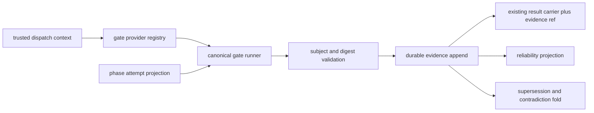

# Spec: Phase-Gate v2.12 Proof Substrate

**Date:** 2026-07-21 · **Feature:** `phase-gate-v212-proof-substrate` · **Depth:** standard
**Inputs:** `docs/specs/2026-07-21-phase-gate-transition-admission-roadmap.md`; `docs/research/2026-07-21-phase-gate-redesign-strategy.md`; `.exarchos/invariants.md`; issues [#1608](https://github.com/lvlup-sw/exarchos/issues/1608) and [#1646](https://github.com/lvlup-sw/exarchos/issues/1646)

> One unified artifact: `## Design & Rationale` is the DR-N source; `## Decomposition` maps tasks to DR-N within this same document.

## Design & Rationale

### Constraints

- **INV-1:** The append-only event log remains the source of truth. Evidence, identity snapshots, retries, contradictions, reliability, and cancellation recovery must replay without current-process state.
- **INV-7:** Cross-process writes remain serialized through SQLite WAL, `BEGIN IMMEDIATE`, and the per-stream sequence gate.
- **INV-8:** Gate execution, decision claims, and compensation effects are idempotent at their dispatch and storage boundaries.
- **INV-9:** The HSM remains the sole authority for legal phase sequencing. This release cannot alter transition admission or phase legality.
- **INV-11:** Trusted caller identity and authorization posture are derived at the capability boundary, not accepted from action arguments.

### Problem Statement

The full transition-admission roadmap spans an additive proof substrate and a later v3.0 enforcement cutover. Treating both releases as one implementation workflow creates 53 tasks with incompatible delivery gates. The v2.12 release needs a complete, independently shippable slice that improves the integrity and observability of gate evidence without introducing a temporary workflow-definition format or changing transition outcomes.

Today, gate results can lack immutable subjects, trusted issuer identity, phase-attempt scope, durable persistence, explicit supersession, and attributable reliability. Some event writes are best effort. Retries can recompute work, generic append surfaces can forge security-sensitive facts, and cancellation recovery is not modeled as a durable process manager. These defects must be corrected before v3.0 can safely consume evidence for strict admission.

### Chosen Approach

Ship an additive, internal proof substrate in audit/shadow posture. Define versioned runtime evidence contracts, trusted identity snapshots, phase-attempt identity, content-addressed evidence references, and explicit supersession and contradiction semantics. Route every enforceable gate through one durable evidence-producing runner. Add transactional `decideOnce` as a reusable idempotency primitive, but do not expose a new public transition result or evaluate admission policy in v2.12.

Preserve current transition behavior. Existing gate result carriers remain compatible while gaining evidence references. The HSM and legacy guards continue deciding legal transitions. The release records enough trusted, replayable proof to measure reliability, characterize current behavior, prevent forged evidence, and support the later v3.0 cutover.

### Requirements (DR-N)

#### DR-1: Preserve transition behavior while establishing a migration baseline

The release must be additive. It may record proof and diagnostics, but it cannot change which phase transitions are allowed, enable strict admission, or delete legacy guard surfaces.

**Acceptance criteria:**
- A deterministic characterization corpus covers every built-in transition and representative bypass case.
- Existing gate result carriers and transition outcomes remain compatible.
- All v2.12 proof features run in audit/shadow posture.
- No workflow-definition registry, public admission result carrier, enforcement switch, or legacy deletion ships in this slice.

#### DR-2: Record typed, immutable, subject-bound evidence

Gate outcomes must use versioned runtime contracts with stable identities, immutable subjects, digests, phase-attempt scope, and append-only lifecycle semantics.

**Acceptance criteria:**
- Evidence supports workflow, phase-attempt, wave, task, commit, diff, and artifact subjects.
- Evidence and referenced content fail validation when malformed, missing, unsupported, or digest-mismatched.
- Initial and re-entered phases receive unique, replay-stable `phaseAttemptId` values.
- Explicit supersession selects the active rerun without erasing history.
- Active non-superseding disagreements produce typed contradiction facts.

#### DR-3: Derive trusted provenance at the dispatch boundary

Issuer identity, role, authorization posture, operation identity, and timestamps must come from trusted runtime context. Callers cannot forge reserved admission facts or provenance fields.

**Acceptance criteria:**
- MCP and CLI dispatch create a non-PII caller identity and resolved authorization snapshot.
- Action arguments cannot override issuer, role, posture, capability, resolver version, or trusted timestamp fields.
- Generic event append rejects reserved requirement, evidence, decision, waiver, contradiction, reassessment, shadow, rollout, and enforcement event types.
- Privileged records freeze the identity and authorization snapshot used when they were created.

#### DR-4: Make gate evidence durable and idempotent

One canonical runner must persist normalized evidence before reporting success. A generic transactional decision primitive must collapse retries before recomputing work.

**Acceptance criteria:**
- No enforceable gate returns success when evidence persistence fails.
- Repeating a gate operation returns or supersedes the canonical persisted evidence according to the explicit rerun contract.
- `decideOnce` checks operation ID and request digest before state fold or closure evaluation.
- Operation-ID reuse with a different request digest fails explicitly.
- A crash rolls back the operation claim and event append together.

#### DR-5: Centralize gate production without adding policy coupling

Every gate class and enforceable producer must route through the shared runner while keeping toolchain commands and workload-specific behavior outside evidence contracts.

**Acceptance criteria:**
- Every declared gate class resolves exactly one provider or returns structured suggestions.
- Per-task, plan, review, and synthesis gates persist evidence through the same runner.
- A repository census rejects new direct gate emitters and unowned guard or shell paths.
- The substrate contains no Claude, Codex, Copilot, language, operating-system, or workflow-type policy branch.

#### DR-6: Measure gate reliability as an attributable projection

Reliability must be a pure event fold over observed verdicts and contradictions. It is diagnostic in v2.12 and cannot affect transition behavior.

**Acceptance criteria:**
- Reliability exposes value, sample size, timestamp, and source.
- Only executions observed through the canonical runner affect the metric.
- Contradictions are folded deterministically and remain attributable.
- Reliability cannot weaken a gate result or alter transition behavior in this release.

#### DR-7: Make cancellation recovery event-sourced and retry-safe

Cancellation must record intent, compensation progress, and readiness so interrupted cleanup resumes without repeating completed side effects.

**Acceptance criteria:**
- `cancel.requested` is recorded before compensation begins.
- Every compensation intent and outcome has an idempotency key.
- Retry resumes incomplete effects and never repeats completed effects.
- `cancel.ready` evidence is recorded before the existing final transition path runs.
- Crashes, malformed compensation results, and append failures do not report cancellation success.

### Technical Design



The new `workflow/admission/` module owns versioned internal domain types, evidence subjects, artifact resolution, and active-evidence selection. Event schemas remain in the existing event-store registry. `DispatchContext` supplies trusted caller identity. The gate runner resolves a provider, stamps trusted context and phase-attempt identity, persists evidence, and only then returns the compatible gate result.

`AtomicAppender.decideOnce` is a substrate primitive, not a public admission API. It checks an operation claim and request digest before evaluation, then commits the claim and events in one SQLite transaction. Cancellation uses the same idempotency foundation for compensation progress, while its final phase transition continues through the current v2.12 path.

### Integration Points

- `servers/exarchos-mcp/src/event-store/` - versioned event schemas, reserved-event protection, transactional idempotency.
- `servers/exarchos-mcp/src/workflow/admission/` - runtime proof types, subjects, artifacts, and evidence selection.
- `servers/exarchos-mcp/src/workflow/` - phase-attempt projection and cancellation process manager.
- `servers/exarchos-mcp/src/dispatch/` and adapters - trusted caller identity and authorization snapshots.
- `servers/exarchos-mcp/src/orchestrate/` - provider registry, canonical runner, migrated gate producers.
- `servers/exarchos-mcp/src/views/` - replayable active-evidence and reliability projections.
- `scripts/check-gate-runner-ownership.mjs` - repository census preventing new bypasses.

### Alternatives considered

- **Keep the combined v2.12/v3.0 workflow:** rejected because completion would require deferred shared-IR and enforcement tasks.
- **Use the refactor workflow:** rejected because this slice introduces new event contracts, identity, durability, reliability, and recovery behavior rather than only restructuring working code.
- **Implement a temporary v2.12 policy registry:** rejected because Strategos issue #1258 will own the shared declarative workflow IR in v3.0.
- **Delay all proof work until v3.0:** rejected because trusted replayable evidence and cancellation hardening are prerequisites for a safe enforcement cutover.

### Open Questions

- The v3.0 admission-policy wire contract remains deferred to the roadmap and Strategos issue #1258.
- Public admission actions remain deferred until Exarchos issues #1604 and #1606 provide total MCP schemas and generated CLI presentation.

## Technical Design

This compatibility map is consumed by the deterministic plan-coverage gate. Detailed rationale remains in `## Design & Rationale`.

### Legacy transition characterization

The legacy transition corpus freezes current decisions and bypass behavior before proof-producing seams change.

### Runtime proof contracts

Versioned internal types, event schemas, subject digests, artifact references, phase attempts, and evidence lifecycle rules provide replayable proof without a public admission carrier.

### Trusted dispatch provenance

Dispatch context derives caller identity and authorization posture. Typed handlers protect reserved facts and stamp trusted metadata.

### Canonical gate execution

The provider registry and one durable gate runner produce evidence for per-task and phase-level gates. The ownership census prevents new bypasses.

### Transactional idempotency

`AtomicAppender.decideOnce` collapses retries by operation ID and request digest inside the existing SQLite transaction boundary.

### Reliability projection

Gate verdicts and contradictions fold into an attributable diagnostic reliability view that cannot affect v2.12 transition behavior.

### Cancellation process manager

Cancellation records intent, compensation progress, and readiness as an event-sourced process manager while preserving the existing final transition path.

## Decomposition

### Scope

**Target:** The complete v2.12 additive proof substrate in audit/shadow posture.

**Excluded:**
- Strategos TypeSpec admission-policy models and generated Exarchos Zod.
- Closed edge-condition AST, requirement resolution, policy evaluation, waivers, and atomic transition admission.
- Public admission result schemas, generated CLI presentation, strict enforcement, built-in workflow cutover, and legacy deletion.
- Any transition behavior change or second workflow-definition registry.

### Traceability matrix (DR-N -> tasks)

| DR | Requirement | Tasks |
|----|-------------|-------|
| DR-1 | Preserve transition behavior and migration baseline | 001, 008, 009, 015, 017 |
| DR-2 | Typed, immutable, subject-bound evidence | 002-006, 012, 014 |
| DR-3 | Trusted dispatch provenance | 003, 011, 016 |
| DR-4 | Durable and idempotent gate evidence | 006, 012-014 |
| DR-5 | Centralized gate production | 007-009, 015-016 |
| DR-6 | Attributable reliability projection | 010, 014 |
| DR-7 | Event-sourced cancellation recovery | 017 |

### Tasks

Task numbers are local to this feature. `Roadmap Task` preserves provenance to the original combined roadmap.

### Task 001: Capture the legacy transition-decision characterization corpus

**Roadmap Task:** 001
**Risk Tier:** high
**Boundary Touching:** true
**Test Layer:** acceptance
**Implements:** DR-1

**Files:**
- `servers/exarchos-mcp/src/workflow/__fixtures__/transition-admission-corpus.ts`
- `servers/exarchos-mcp/src/workflow/hsm-transition-guard.test.ts`

**Testing Strategy:** Example and property tests over deterministic legacy verdicts; characterization required.
**Tests:** `LegacyTransitionCorpus_AllFixtures_HaveStableVerdicts`

**Steps:**
1. Enumerate every built-in transition and representative pass/fail state.
2. Add bypass fixtures for empty tasks, always-pass implementation, patched approvals, unknown risk, and stale gate events.
3. Serialize expected legacy results as the migration baseline.

**Dependencies:** None
**Parallelizable:** Yes

### Task 002: Add runtime proof domain types

**Roadmap Task:** 007
**Risk Tier:** high
**Boundary Touching:** true
**Test Layer:** unit
**Implements:** DR-2

**Files:**
- `servers/exarchos-mcp/src/workflow/admission/types.ts`
- `servers/exarchos-mcp/src/workflow/admission/types.test.ts`

**Testing Strategy:** Example and property tests proving discriminated unions are exhaustive and invalid mixed outcomes are unrepresentable.
**Tests:** `AdmissionDomain_InvalidOutcome_IsRejected`

**Steps:**
1. Define branded IDs and discriminated runtime unions.
2. Add internal `allow | deny | indeterminate` record shapes for versioned events without exposing a public transition carrier.
3. Add typed remediation and waiver provenance records needed for event compatibility.

**Dependencies:** None
**Parallelizable:** No

### Task 003: Add proof and admission event schemas

**Roadmap Task:** 008
**Risk Tier:** high
**Boundary Touching:** true
**Test Layer:** integration
**Implements:** DR-2, DR-3

**Files:**
- `servers/exarchos-mcp/src/event-store/schemas.ts`
- `servers/exarchos-mcp/src/event-store/schemas.test.ts`
- `servers/exarchos-mcp/src/event-store/__tests__/transition-admission-events.test.ts`

**Testing Strategy:** Example and property round-trip tests plus malformed-event fixtures; characterization required.
**Tests:** `AdmissionEvents_MalformedPayload_IsRejected`

**Steps:**
1. Add requirement, evidence, decision, waiver, contradiction, reassessment, shadow, and rollout event schemas.
2. Require policy, input, subject, and evidence digests where applicable.
3. Keep the events internal and additive in v2.12.

**Dependencies:** 002
**Parallelizable:** No

### Task 004: Validate evidence subjects and digests

**Roadmap Task:** 011
**Risk Tier:** high
**Boundary Touching:** true
**Test Layer:** property
**Implements:** DR-2

**Files:**
- `servers/exarchos-mcp/src/workflow/admission/evidence-subject.ts`
- `servers/exarchos-mcp/src/workflow/admission/evidence-subject.test.ts`

**Testing Strategy:** Property tests for stable canonicalization, content-sensitive digests, and fail-closed algorithm validation.
**Tests:** `EvidenceSubject_ContentChange_ChangesDigest`

**Steps:**
1. Canonicalize workflow, phase-attempt, wave, task, commit, diff, and artifact subjects.
2. Validate digest algorithms and values.
3. Add mismatch and malformed-subject cases.

**Dependencies:** 002
**Parallelizable:** Yes

### Task 005: Resolve content-addressed evidence artifacts

**Roadmap Task:** 012
**Risk Tier:** high
**Boundary Touching:** true
**Test Layer:** integration
**Implements:** DR-2

**Files:**
- `servers/exarchos-mcp/src/workflow/admission/evidence-artifact.ts`
- `servers/exarchos-mcp/src/workflow/admission/evidence-artifact.test.ts`
- `servers/exarchos-mcp/src/artifacts/content-addressed-store.ts`

**Testing Strategy:** Integration tests proving stored content resolves only when its digest matches; characterization required.
**Tests:** `EvidenceArtifact_DigestMismatch_IsRejected`

**Steps:**
1. Add evidence artifact references over the existing content-addressed store.
2. Reject missing and digest-mismatched content.
3. Keep large reports out of event payloads.

**Dependencies:** 004
**Parallelizable:** No

### Task 006: Add durable evidence emission to the canonical gate runner

**Roadmap Task:** 013
**Risk Tier:** high
**Boundary Touching:** true
**Test Layer:** integration
**Implements:** DR-2, DR-4

**Files:**
- `servers/exarchos-mcp/src/verbs/gates/gate-runner.ts`
- `servers/exarchos-mcp/src/verbs/gates/gate-runner.test.ts`
- `servers/exarchos-mcp/src/verbs/gates/gate-utils.ts`

**Testing Strategy:** Integration and property tests for canonical retries, predecessor links, phase-attempt stamping, and append-failure behavior; characterization required.
**Tests:** `GateRunner_AppendFailure_ReturnsFailure`

**Steps:**
1. Introduce the one evidence-producing gate-runner path.
2. Stamp trusted identity, `phaseAttemptId`, subjects, digests, and predecessor evidence.
3. Persist normalized evidence before returning success and remove fire-and-forget behavior.

**Dependencies:** 003, 004, 005, 012, 014
**Parallelizable:** No

### Task 007: Add the gate-class provider registry

**Roadmap Task:** 014
**Risk Tier:** high
**Boundary Touching:** true
**Test Layer:** unit
**Implements:** DR-5

**Files:**
- `servers/exarchos-mcp/src/verbs/gates/gate-provider-registry.ts`
- `servers/exarchos-mcp/src/verbs/gates/gate-provider-registry.test.ts`
- `servers/exarchos-mcp/src/registry.ts`

**Testing Strategy:** Exhaustive provider-resolution tests with structured unknown-class suggestions; characterization required.
**Tests:** `GateProvider_UnknownClass_ReturnsSuggestions`

**Steps:**
1. Map shared `GateClass` values to local provider implementations.
2. Keep toolchain commands outside proof contracts.
3. Add exhaustive registration and unknown-class tests.

**Dependencies:** 002
**Parallelizable:** Yes

### Task 008: Migrate per-task verification gates to evidence statements

**Roadmap Task:** 015
**Risk Tier:** high
**Boundary Touching:** true
**Test Layer:** integration
**Implements:** DR-1, DR-5

**Files:**
- `servers/exarchos-mcp/src/verbs/pure/static-analysis.ts`
- `servers/exarchos-mcp/src/verbs/gates/test-adequacy-handler.ts`
- `servers/exarchos-mcp/src/verbs/gates/check-integration-suite.ts`
- `servers/exarchos-mcp/src/verbs/gates/contract-drift-handler.ts`
- `servers/exarchos-mcp/src/verbs/gates/mock-boundary-handler.ts`
- co-located tests

**Testing Strategy:** Integration and property tests proving each ladder gate emits evidence for the intended task or diff while preserving carrier semantics; characterization required.
**Tests:** `LadderGate_TaskSubject_EmitsEvidence`

**Steps:**
1. Route all ladder gates through the runner.
2. Preserve existing carrier fields while adding evidence references.
3. Fail closed on evidence persistence failure without changing transition behavior.

**Dependencies:** 006, 007, 012, 014
**Parallelizable:** No

### Task 009: Migrate plan, review, and synthesis gates to evidence statements

**Roadmap Task:** 016
**Risk Tier:** high
**Boundary Touching:** true
**Test Layer:** integration
**Implements:** DR-1, DR-5

**Files:**
- `servers/exarchos-mcp/src/verbs/gates/plan-coverage.ts`
- `servers/exarchos-mcp/src/verbs/pure/provenance-chain.ts`
- `servers/exarchos-mcp/src/verbs/review/review-verdict.ts`
- `servers/exarchos-mcp/src/verbs/team/prepare-synthesis.ts`
- co-located tests

**Testing Strategy:** Integration and property tests proving no successful phase gate exists without durable evidence; characterization required.
**Tests:** `PhaseGate_EvidenceAppendFailure_BlocksSuccess`

**Steps:**
1. Route all phase-level gates through the runner.
2. Replace swallowed evidence-write errors with structured failures.
3. Preserve advisory versus blocking carrier semantics and audit/shadow posture.

**Dependencies:** 006, 007, 012, 014
**Parallelizable:** No

### Task 010: Implement the gate-reliability projection and provenance

**Roadmap Task:** 035
**Risk Tier:** high
**Boundary Touching:** true
**Test Layer:** property
**Implements:** DR-6

**Files:**
- `servers/exarchos-mcp/src/views/gate-reliability-view.ts`
- `servers/exarchos-mcp/src/views/gate-reliability-view.test.ts`
- `servers/exarchos-mcp/src/verbs/gates/gate-runner.ts`

**Testing Strategy:** Property tests proving reliability is a pure attributable fold and unobserved executions cannot affect it.
**Tests:** `GateReliability_VerdictAndContradiction_FoldsAttributably`

**Steps:**
1. Implement issue #1646's verdict-plus-contradiction projection.
2. Enforce the gate runner as the sole observed execution path.
3. Expose value, sample size, timestamp, and source without changing transition behavior.

**Dependencies:** 006, 007, 014
**Parallelizable:** No

### Task 011: Protect reserved proof events and trusted issuer fields

**Roadmap Task:** 039
**Risk Tier:** high
**Boundary Touching:** true
**Test Layer:** acceptance
**Implements:** DR-3

**Files:**
- `servers/exarchos-mcp/src/event-store/tools.ts`
- `servers/exarchos-mcp/src/registry.ts`
- `servers/exarchos-mcp/src/dispatch/core/dispatch.ts`
- `servers/exarchos-mcp/src/event-store/admission-event-authorization.test.ts`

**Testing Strategy:** Acceptance and property tests proving generic append cannot create reserved proof facts or self-assert trusted metadata; characterization required.
**Tests:** `AdmissionEventAppend_UntrustedCaller_IsRejected`

**Steps:**
1. Reserve proof, contradiction, reassessment, shadow, rollout, and enforcement event types to typed handlers.
2. Stamp issuer, role, operation ID, and timestamp from dispatch context.
3. Reject caller-supplied trusted provenance fields.

**Dependencies:** 002, 003, 016
**Parallelizable:** No

### Task 012: Add phase-attempt identity to every phase entry

**Roadmap Task:** 040
**Risk Tier:** high
**Boundary Touching:** true
**Test Layer:** acceptance
**Implements:** DR-2, DR-4

**Files:**
- `servers/exarchos-mcp/src/workflow/tools.ts`
- `servers/exarchos-mcp/src/workflow/state-machine.ts`
- `servers/exarchos-mcp/src/event-store/schemas.ts`
- `servers/exarchos-mcp/src/views/workflow-state-projection.ts`
- `servers/exarchos-mcp/src/workflow/phase-attempt.test.ts`

**Testing Strategy:** Acceptance and property tests proving every initial and re-entered phase has a unique replay-stable attempt ID; characterization required.
**Tests:** `WorkflowInit_InitialPhase_AllocatesStableAttemptId`

**Steps:**
1. Allocate `phaseAttemptId` at initialization and every atomic phase entry.
2. Fold the active attempt through live and rehydrated projections.
3. Expose it to evidence producers without changing transition behavior.

**Dependencies:** 003
**Parallelizable:** No

### Task 013: Add transactional `decideOnce` idempotency

**Roadmap Task:** 041
**Risk Tier:** high
**Boundary Touching:** true
**Test Layer:** integration
**Implements:** DR-4

**Files:**
- `servers/exarchos-mcp/src/event-store/atomic-appender.ts`
- `servers/exarchos-mcp/src/event-store/atomic-appender.test.ts`
- `servers/exarchos-mcp/src/storage/sqlite-backend.ts`
- `servers/exarchos-mcp/src/storage/sqlite-backend.test.ts`

**Testing Strategy:** Integration and property tests proving canonical retry results, digest mismatch rejection, and transactional rollback; characterization required.
**Tests:** `DecideOnce_ExistingOperationId_ReturnsCanonicalResult`

**Steps:**
1. Add `decideOnce(operationId, requestDigest, closure)` without changing the public transition schema.
2. Check completed claims before fold, then evaluate and append inside one `BEGIN IMMEDIATE` transaction.
3. Reject operation-ID reuse with a different digest and prove retries do not rerun the closure.

**Dependencies:** None
**Parallelizable:** No

### Task 014: Define evidence supersession and contradiction semantics

**Roadmap Task:** 043
**Risk Tier:** high
**Boundary Touching:** true
**Test Layer:** property
**Implements:** DR-2, DR-4, DR-6

**Files:**
- `servers/exarchos-mcp/src/workflow/admission/select-evidence.ts`
- `servers/exarchos-mcp/src/workflow/admission/select-evidence.test.ts`
- `servers/exarchos-mcp/src/event-store/schemas.ts`
- `servers/exarchos-mcp/src/views/workflow-state-projection.ts`

**Testing Strategy:** Property tests for acyclic supersession, active-evidence selection, contradiction, and immutable history.
**Tests:** `EvidenceSelection_ValidRerun_SupersedesPriorResult`

**Steps:**
1. Add `supersedesEvidenceId` and active-evidence selection rules.
2. Scope matching by subject, phase attempt, requirement identity, and policy digest.
3. Add typed downstream contradiction events and diagnostic-fork eligibility.

**Dependencies:** 003, 004
**Parallelizable:** No

### Task 015: Enforce gate-runner ownership with a repository census

**Roadmap Task:** 049
**Risk Tier:** high
**Boundary Touching:** true
**Test Layer:** integration
**Implements:** DR-1, DR-5

**Files:**
- `scripts/check-gate-runner-ownership.mjs`
- `scripts/check-gate-runner-ownership.test.sh`
- `servers/exarchos-mcp/src/config/define.ts`
- `servers/exarchos-mcp/src/config/register.ts`
- `servers/exarchos-mcp/src/config/validation.ts`
- `servers/exarchos-mcp/src/workflow/state-machine.ts`
- `servers/exarchos-mcp/src/workflow/hsm-transition-guard.ts`
- `servers/exarchos-mcp/src/workflow/playbooks.ts`
- `servers/exarchos-mcp/src/orchestrate/`
- `servers/exarchos-mcp/src/telemetry/middleware.ts`

**Testing Strategy:** Integration census proving every gate emission and guard definition has one approved owner; characterization required.
**Tests:** `GateRunnerCensus_DirectEmitter_IsRejected`

**Steps:**
1. Inventory direct gate event, manual evidence, guard, registry, playbook, telemetry, and shell paths.
2. Migrate enforceable callers and document typed non-enforceable telemetry exemptions.
3. Add a self-testing repository gate preventing recurrence.

**Dependencies:** 006, 007, 008, 009, 011
**Parallelizable:** No

### Task 016: Introduce trusted caller identity and authorization snapshots

**Roadmap Task:** 052
**Risk Tier:** high
**Boundary Touching:** true
**Test Layer:** acceptance
**Implements:** DR-3, DR-5

**Files:**
- `servers/exarchos-mcp/src/dispatch/dispatch-context.ts`
- `servers/exarchos-mcp/src/dispatch/caller-identity.ts`
- `servers/exarchos-mcp/src/dispatch/caller-identity.test.ts`
- `servers/exarchos-mcp/src/capabilities/resolver.ts`
- `servers/exarchos-mcp/src/dispatch/core/dispatch.ts`
- `servers/exarchos-mcp/src/adapters/mcp.ts`
- `servers/exarchos-mcp/src/adapters/cli.ts`

**Testing Strategy:** Acceptance and property tests proving identity and posture derive from trusted context and ignore action overrides; characterization required.
**Tests:** `CallerIdentity_UntrustedOverride_IsIgnored`

**Steps:**
1. Define a non-PII caller identity from MCP session context or a stable local-operator installation identity.
2. Thread identity and resolved posture through `DispatchContext`.
3. Snapshot identity, posture, capabilities, policy, and resolver version on privileged records.

**Dependencies:** None
**Parallelizable:** Yes

### Task 017: Make cancellation an event-sourced process manager

**Roadmap Task:** 053
**Risk Tier:** high
**Boundary Touching:** true
**Test Layer:** acceptance
**Implements:** DR-1, DR-7

**Files:**
- `servers/exarchos-mcp/src/workflow/cancel.ts`
- `servers/exarchos-mcp/src/workflow/compensation.ts`
- `servers/exarchos-mcp/src/workflow/transition-admission.ts`
- `servers/exarchos-mcp/src/workflow/cancel-process-manager.test.ts`

**Testing Strategy:** Acceptance and property tests proving each effect executes at most once, completed effects survive retry, and readiness precedes the existing final transition; characterization required.
**Tests:** `CancelRetry_CompletedCompensation_IsNotRepeated`

**Steps:**
1. Append `cancel.requested` before compensation and record every compensation intent and result with idempotency keys.
2. Resume incomplete compensation from the event log after crashes or retries.
3. Produce `cancel.ready` evidence while preserving the current final transition path.

**Dependencies:** 011, 013, 016
**Parallelizable:** No

### Parallelization

Critical paths:

```text
002 -> 003 -> 012/004 -> 014 -> 006 -> 008/009 -> 010/015
013 + 016 -> 011 -> 017
```

- **Wave A:** 001, 002, 013, and 016 establish characterization, runtime types, idempotency, and trusted identity.
- **Wave B:** 003, 004, 007, and 012 add schemas, subjects, providers, and phase attempts.
- **Wave C:** 005, 011, and 014 add artifact resolution, reserved-event protection, and evidence lifecycle semantics.
- **Wave D:** 006 establishes the canonical durable runner.
- **Wave E:** 008, 009, and 017 migrate producers and harden cancellation.
- **Wave F:** 010 and 015 close reliability and ownership enforcement.

### Completion checklist

- [ ] Every DR-N maps to at least one task.
- [ ] Every task maps to an existing DR-N.
- [ ] Every task carries risk tier, boundary status, test layer, and adequacy-judged verification.
- [ ] The legacy transition characterization corpus is deterministic.
- [ ] Every phase entry has a replay-stable phase-attempt ID.
- [ ] Generic append cannot forge reserved proof events or trusted provenance.
- [ ] No enforceable gate succeeds without durable evidence.
- [ ] Gate reliability is an attributable pure fold and cannot alter behavior.
- [ ] Cancellation compensation is replayable and at-most-once across retries.
- [ ] No public admission carrier, strict enforcement, shared-IR policy registry, or legacy deletion ships in v2.12.
- [ ] Ready for approved plan-review bypass and delegation.
