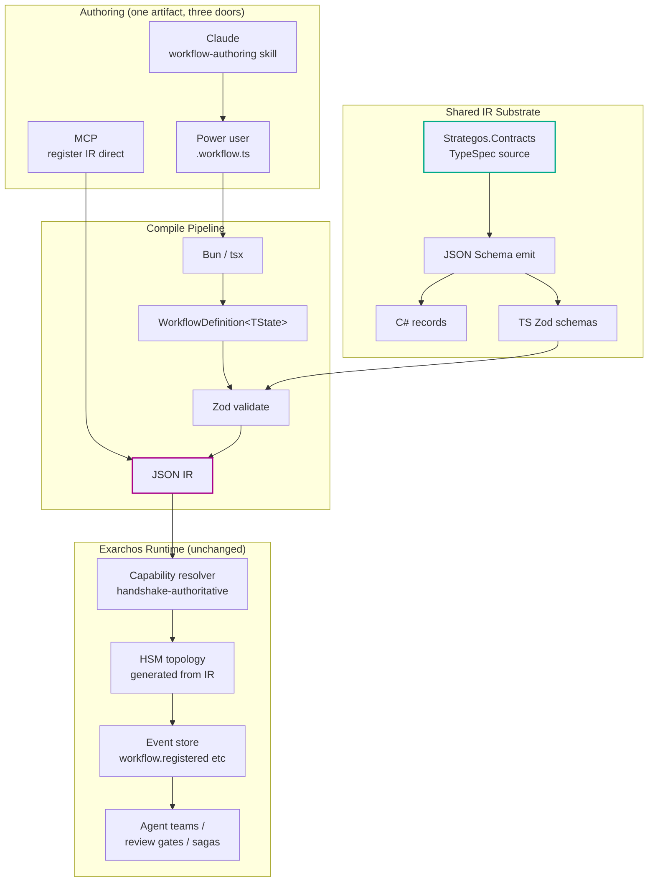
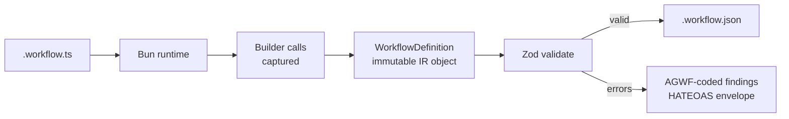

# Workflow Builder SDK

## Executive Summary

Exarchos ships six built-in SDLC workflows (`feature`, `oneshot`, `debug`, `refactor`, `hotfix`, `discovery`) defined as closed-form TypeScript HSM topologies and playbook registries. Adopters who want a custom workflow today must fork the codebase and hand-edit five files. This design replaces that closed surface with a TypeScript **fluent builder SDK** (`@exarchos/sdk`) that mirrors Strategos's `IWorkflowBuilder<TState>` API method-for-method, compiles to a typed JSON IR shared with Strategos via the `Strategos.Contracts` TypeSpec pipeline, and registers through the existing event-sourced HSM engine.

The SDK is the *only* way to define a workflow. Built-in workflows are migrated to the SDK during v3.1.0 — they become the first consumers and the canonical examples. The closed `hsm-definitions.ts` / `playbooks.ts` registries are deleted. There is no "two systems" problem because there is one system.

Authoring is **agent-first**: a `workflow-authoring` skill takes a natural-language brief, queries the runtime registry for available skills/handlers/gates, and emits a `.workflow.ts` file. Power users hand-author the same file with full TypeScript LSP feedback. Both paths emit the identical IR. There is no GUI.

The IR substrate extends `Strategos.Contracts` (issue #1125) from events-only to events + workflow definitions. Strategos and exarchos converge on a single canonical IR; cross-runtime dispatch (a step in an exarchos workflow executed by Strategos's Wolverine/Marten runtime) becomes possible in v3.3.0 via Remote MCP federation. v3.1.0 ships the contract surface and intra-runtime execution; v3.3.0 wires the federation.

## Problem Statement

Three forces converge:

1. **Competitor narrative.** Archon's pitch — "the first open-source harness builder for AI coding" — wins on user-defined workflows even though their runtime is structurally weaker than ours (no event sourcing, no agent-team coordination, no multi-dimension review, no merge gates beyond a manual approval node). Adopters comparing tools without our runtime depth see "Archon: build any workflow" vs "Exarchos: pick from six." That framing loses on customizability even when we win on substance.

2. **Authoring is gated behind code changes.** A team wanting a "security-audit" or "incident-response" workflow today must edit `hsm-definitions.ts` (states + transitions + guards), `playbooks.ts` (skill/tool/event bindings), `commands/<name>.md` (slash command), `skills-src/<name>/SKILL.md` (skill content), and frequently new orchestrate handlers. Five files; TypeScript expertise; a fork. We have power-user adopters who give up.

3. **Strategic alignment with Strategos.** Per the [strategic framing](2026-04-18-strategic-framing-exarchos-basileus.md), Strategos owns the deterministic-orchestration layer for .NET; exarchos owns the agent-coordination layer for Claude Code / Codex / generic clients. Today these products share an event-schema contract via `Strategos.Contracts` (issue #1125). They do *not* yet share the workflow IR, even though Strategos's `WorkflowDefinition<TState>` is exactly the shape exarchos needs. We are independently designing the same object.

The combined gap: **exarchos has the runtime, lacks the authoring surface; Strategos has the authoring surface, lacks the agent-coordination runtime; users want both**. A SDK that mirrors Strategos's API on exarchos's substrate closes both gaps with one artifact.

## Strategic Context

This feature has been re-slotted as **v3.1.0**, displacing the original Phronesis Code Review Integration (folded into v3.2.0 alongside Ontology, since both surface review/dimension data through the same NotificationPipeline). The reorg reflects priority: an authoring surface unblocks adoption; review integration is a refinement of an existing capability.

**Adjacent already-funded work that this feature *uses*:**

- **#1125 — Strategos.Contracts TypeSpec pipeline.** The event contract pipeline is in spike validation. v3.1.0 extends it to cover workflow IR models.
- **#1164 — Host-owned PromptService.** The CLI authoring verb (`exarchos workflow author`) docks onto PromptService for interactive synthesis.
- **#1092 — Pluggable IInteractionService.** The same abstraction lets the SDK surface validation findings consistently across CLI/MCP.
- **#1109 cross-cutting invariants.** Every authoring action emits events, returns the HATEOAS envelope, respects handshake-authoritative capability resolution.

**Adjacent work that this feature *enables*:**

- **#1137 / v3.3.0 — `exarchos watch` sideband daemon.** Custom workflows registered at workspace level become live-reloadable.
- **v3.3.0 Remote MCP.** Cross-runtime dispatch (T4) — an exarchos workflow whose `execute-saga` step is a Strategos workflow on a remote .NET host — becomes wireable once the IR contract is shared and the Remote MCP transport ships.
- **#1163 — per-task `WithCommand`.** Custom workflow steps can register per-task commands, surfaced via the same `WithCommand` mechanism.

## Design Principles

The design follows the [extensibility & authoring envelope](#) committed to in this conversation:

1. **Agent-first authoring is primary.** The first-class authoring path is "Claude reads a NL brief and emits the artifact." Power-user hand-authoring is the secondary path. Both produce the *same* artifact through the *same* validation pipeline.
2. **No GUI.** CLI + file + MCP only. No web canvas, TUI builder, or DAG visualizer (a Mermaid render is fine; an interactive canvas is not).
3. **Facade unification.** Built-in and custom workflows are facades over the same engine. The SDK is the only way to define a workflow. No closed-form parallel registry.
4. **axiom backend-quality envelope.** DIM-1 (single source of truth = the IR), DIM-3 (TypeSpec → JSON Schema → Zod, single contract), DIM-4 (built-ins exercise the same registration path as custom), DIM-7 (retries/timeouts/loops are bounded combinators).
5. **#1109 invariants apply.** Event-sourcing integrity (`workflow.registered`, `workflow.scaffold-created`, `workflow.unregistered` events; replay reconstructs the registry), MCP parity (HATEOAS envelope on every CLI/MCP verb pair), Basileus-forward (capability resolution handshake-authoritative; `runtime: "exarchos" | "strategos" | "remote"` field on steps for future federation), config consolidates in `.exarchos.yml`.
6. **Strategos parity by mirror, not by port.** API shape mirrors `IWorkflowBuilder<TState>` method-for-method; runtime stays exarchos-native. We don't re-implement Wolverine/Marten in TS.

## Options Considered

Four approaches were explored before converging on the chosen approach. Honest comparison of trade-offs to make the choice auditable.

**Option A — Playbook DSL (composition over invention).** A YAML/TS file declares (phases, skills, gates, transitions) drawn from the existing exarchos primitive registry. Runtime: existing HSM, no new code. *Pros:* fits #1109 cleanly; no new runtime; smallest scope. *Cons:* expressivity ceiling at "linear with fix-cycles + branch-on-guard." No closures, no parallel branches, no compensation/retry combinators. YAML can't express functions over state.

**Option B — Action Graph (DAG of existing verbs).** A YAML DAG where nodes are existing skills/handlers/gates and edges carry conditions; new DAG executor sits alongside HSM. *Pros:* more expressive than A; matches Archon's UX. *Cons:* dual state model (HSM + DAG) violates DIM-1 single source of truth; new event types complicate #1109 reconstructability; still YAML, still stringly-typed conditions.

**Option C — Recipe + Macro generator.** User authors a tiny recipe; a macro expands to a full HSM topology. *Pros:* smallest authoring surface for agents. *Cons:* two-tier abstraction (recipe → HSM → events) makes errors hard to diagnose; locked to a small library of recipe templates.

**Option D — Fluent TypeScript SDK (chosen).** Mirrors Strategos's `IWorkflowBuilder<TState>` API in TS; compiles to typed JSON IR; IR registered to existing HSM engine. *Pros:* matches Strategos expressivity (true combinators with closures over state, type-safe step composition, full retry/compensation/approval/escalation surface); reuses existing runtime; agent-first authoring is strongest because Claude is excellent at TS with LSP feedback. *Cons:* new SDK package surface; Bun/tsx as compile-time runtime; built-ins must be migrated to SDK form for facade unification.

**Why D wins.** A/B/C all hit the same wall: YAML/recipe formats can't express closures over state, which means combinators like `RepeatUntil(state => state.tests.passed, body, max)` and `Branch(state => state.mode, cases)` degenerate into stringly-typed expressions that can't be type-checked. Strategos's expressivity comes from leveraging the host language as the DSL; for TS that means the SDK IS the artifact. The choice is between matching Strategos's expressivity (D) or accepting a weaker authoring surface (A/B/C). Per the strategic framing — convergence not overlap — D is the only choice consistent with treating exarchos and Strategos as one product on two runtimes.

## Chosen Approach

Power users author a `.workflow.ts` file against `@exarchos/sdk`. Claude generates the same `.workflow.ts` from a NL brief via the `workflow-authoring` skill. Both paths invoke `exarchos workflow compile`, which executes the file via Bun/`tsx`, captures the `WorkflowDefinition<TState>` returned from `.finally()`, and emits a Zod-validated JSON IR. The IR is registered to the existing HSM engine; transitions, fork/join, branches, loops, approvals, compensations all map to the existing event-sourced runtime.

**Concrete authoring example** (mirroring Strategos's `CoderWorkflow` shape):

```ts
// .exarchos/workflows/security-audit.workflow.ts
import { Workflow, Step } from '@exarchos/sdk';
import { brainstorming, phronesisReview } from '@exarchos/skills';
import { runStaticAnalysis, runDepAudit } from '@exarchos/handlers';

interface SecurityState {
  findings: { critical: number; high: number; resolved: string[] };
  unresolved: string[];
  approver?: 'security-lead' | 'ciso';
}

export default Workflow
  .create<SecurityState>('security-audit')
  .startWith(brainstorming)
  .fork(
    path => path.then(runStaticAnalysis).withRetry({ max: 2 }),
    path => path.then(runDepAudit).withTimeout(5 * 60_000),
  ).join(state => ({
    findings: state.findings,
    unresolved: state.findings.critical > 0 ? state.criticals : []
  }))
  .branch(state => state.findings.critical > 0, {
    true: path => path
      .repeatUntil(
        state => state.unresolved.length === 0,
        body => body.then(Step.delegate('fixer', { goal: 'fix-vuln' }))
                    .then(Step.gate('check_findings_severity')),
        { maxIterations: 3 },
      )
      .awaitApproval('security-lead', a => a
        .withContext('Approve security audit findings before close')
        .onTimeout(esc => esc.escalateTo('ciso'))
        .onRejection(r => r.then(brainstorming).complete()),
      ),
    false: path => path,
  })
  .onFailure(f => f.compensate(Step.handler('rollback_audit')))
  .finally(phronesisReview);
```

**This is a real workflow.** Parallel scan, conditional remediation loop with bounded iterations, two-tier approval with timeout escalation, rejection rollback, compensation on failure. None of YAML / DAG-config / recipe-template approaches express it without inventing a programming language inside their format.

## Technical Design

### Architecture Overview



The IR (highlighted) is the system's pivot point. Three authoring doors converge on it; one runtime consumes it; one TypeSpec source defines it.

### The IR Substrate

The IR is defined in `Strategos.Contracts` (issue #1125) via TypeSpec, and emitted as JSON Schema. Strategos generates C# records (Roslyn); exarchos generates TS Zod schemas (`json-schema-to-zod`). The shape mirrors the 18 typed `*Definition` records already in `strategos/src/Strategos/Definitions/` — `WorkflowDefinition`, `StepDefinition`, `TransitionDefinition`, `BranchPointDefinition`, `BranchPathDefinition`, `BranchCase`, `LoopDefinition`, `ForkPointDefinition`, `ForkPathDefinition`, `ApprovalDefinition`, `ApprovalEscalationDefinition`, `ApprovalRejectionDefinition`, `FailureHandlerDefinition`, `StepConfigurationDefinition`, `RetryConfiguration`, `CompensationConfiguration`, `ValidationDefinition`, `LowConfidenceHandlerDefinition`.

**TypeSpec sketch** (extends the existing #1125 spike):

```typespec
@jsonSchema
namespace LevelUp.Sdlc.Contracts.Workflow;

@discriminator("kind")
union StepKind {
  skill:    SkillStepData,
  handler:  HandlerStepData,
  gate:     GateStepData,
  delegate: DelegateStepData,
  approval: ApprovalStepData,
}

model WorkflowDefinitionV1 {
  name: string;
  version: string;
  workflowType: WorkflowType;
  stateSchema: JsonSchema;
  steps: StepDefinition[];
  transitions: TransitionDefinition[];
  branches: BranchPointDefinition[];
  loops: LoopDefinition[];
  forks: ForkPointDefinition[];
  approvals: ApprovalDefinition[];
  failureHandlers: FailureHandlerDefinition[];
  entryStep: string;
  terminalSteps: string[];
}

model StepDefinition {
  id: string;
  kind: StepKind;
  runtime?: "exarchos" | "strategos" | "remote";  // for T4 federation, v3.3.0
  configuration?: StepConfigurationDefinition;
}
```

The `runtime` field is the seam for v3.3.0 cross-runtime dispatch. v3.1.0 accepts only `"exarchos"` (default); the field is reserved.

**Why TypeSpec, not Zod-as-source-of-truth.** TypeSpec is the canonical *cross-product* contract. C# can't emit from Zod; TS can't easily emit C# records from Zod. TypeSpec's emitter ecosystem solves this. The single TypeSpec source feeds both.

### The Fluent Builder

`@exarchos/sdk` exports the builder types. The API surface mirrors Strategos's `IWorkflowBuilder<TState>` method-for-method (camelCased for TS conventions):

```ts
class WorkflowBuilder<TState extends Record<string, unknown>> {
  static create<TState>(name: string): WorkflowBuilder<TState>;

  startWith<S extends StepRef<TState>>(step: S): this;
  startWith<S extends StepRef<TState>>(step: S, instanceName: string): this;

  then<S extends StepRef<TState>>(step: S): this;
  then<S extends StepRef<TState>>(step: S, configure: StepConfigurer<TState>): this;

  branch<TDiscriminator>(
    discriminator: (state: TState) => TDiscriminator,
    cases: BranchCases<TState, TDiscriminator>,
  ): this;

  repeatUntil(
    condition: (state: TState) => boolean,
    body: (loop: LoopBuilder<TState>) => LoopBuilder<TState>,
    options?: { maxIterations?: number; loopName?: string },
  ): this;

  fork(
    ...paths: ForkPathConfigurer<TState>[]
  ): ForkJoinBuilder<TState>;

  awaitApproval<TApprover extends string>(
    approver: TApprover,
    configure: ApprovalConfigurer<TState, TApprover>,
  ): this;

  onFailure(configure: FailureConfigurer<TState>): this;

  finally<S extends StepRef<TState>>(step: S): WorkflowDefinition<TState>;
}
```

Sub-builders (`LoopBuilder`, `ForkJoinBuilder`, `BranchBuilder`, `ApprovalBuilder`, `ApprovalEscalationBuilder`, `ApprovalRejectionBuilder`, `FailureBuilder`, `StepConfiguration`) follow Strategos's structure 1:1.

**Type-safety leverage.** `<TState>` is generic; every step in a workflow operates on the same state type. `StepRef<TState>` resolves to either a `SkillRef` (string ID into the skill registry, type-checked at compile via codegen from the registry) or a `Step.X(...)` constructor for inline steps. The TypeScript compiler enforces step↔state compatibility at author time. Errors surface in the IDE, not at compile pipeline.

**Why mirror Strategos exactly.** The combinator semantics (Branch pattern matching, Fork/Join synchronization rules, RepeatUntil iteration bounds, Approval timeout escalation chains) are non-trivial design. Strategos has 3,400+ unit tests validating them. Mirroring lets us reuse that body of test fixtures (T5) and lets users — and Claude — carry intuitions across both products.

### The Compile Pipeline

`exarchos workflow compile <file>` runs the file via Bun (preferred) or `tsx`/Node fallback, captures the `WorkflowDefinition<TState>` returned from `.finally()`, validates it through the Zod schema (derived from `Strategos.Contracts` TypeSpec), and emits a JSON IR sibling to the source.



**Bun vs tsx.** Bun is already in the build pipeline (`npm run build` uses it). Default to Bun; fall back to `tsx` (already a dev dep) when Bun isn't available. The fallback path runs through `node --import tsx/esm` and is functionally equivalent for SDK users (slightly slower).

**Failure modes handled in the pipeline:**

- **Type errors at author time** — TS LSP surfaces, no compile invocation needed.
- **Runtime errors during compile** — captured, formatted as `AGWF`-coded findings (T6 reuse).
- **Zod validation failures** — point to specific IR fields; reference the TypeSpec source path.
- **Capability resolution failures** — a `SkillRef` or `HandlerRef` that doesn't exist in the runtime registry surfaces as a structured finding with suggested neighbors (Levenshtein-1 matches).
- **Topology violations** — unreachable terminal steps, dangling transitions, loops without exit conditions, fork without join — all caught at validate time, before register.

The pipeline is invoked the same way by `exarchos workflow validate` (no IR emit), `exarchos workflow compile` (IR emit), and `exarchos workflow register` (IR emit + persist + capability resolve + emit `workflow.registered`).

### Built-in Workflows as Dogfood

The closed-form `hsm-definitions.ts` and `playbooks.ts` registries are deleted in v3.1.0. Built-in workflows are migrated to the SDK as `.workflow.ts` files shipped with the binary.

Each migration is a *behavior-preserving* rewrite: the rendered IR's HSM topology must match the original `hsm-definitions.ts` topology bit-identically when normalized. A migration validation test (`feature-builtin-parity.test.ts`, etc.) compares the generated IR's `(states, transitions, guards)` against a golden reference captured from the pre-migration HSM. This is DIM-4 test fidelity in practice — we don't allow the migration to silently change semantics.

**Migration order:**

1. `oneshot` (smallest topology — 4 states) — first, validates the migration tooling
2. `discovery` — second, validates branch handling
3. `feature` — third, validates compound states + maxFixCycles + multi-phase
4. `debug`, `refactor`, `hotfix` — last, leverage patterns established in 1–3

Each built-in's rewrite is tracked as its own task in the v3.1.0 plan. The rewrites land *before* the SDK is published as a public package — built-ins prove the SDK's expressivity envelope before adopters see it.

**Side benefit.** Built-in `.workflow.ts` files become living documentation. Adopters learning the SDK read them as canonical examples. Today, the equivalent — reading `hsm-definitions.ts` and `playbooks.ts` — requires understanding HSM internals.

### Authoring Skills

Four skills support the authoring lifecycle. All live in `skills-src/` with `metadata.mcp-server: exarchos` and use the SDK as their toolkit.

**`workflow-authoring`** *(primary, agent-first)*. NL brief → `.workflow.ts`. Reads `exarchos workflow describe --primitives` to enumerate available skills, handlers, gates. Emits fluent TS code with imports resolved against the runtime registry. Validates via `compile`. Phase-affinity: `ideate`. Used by `exarchos workflow author <brief>`. Inherits the questioning discipline from the existing brainstorming skill — clarifies ambiguity before generating.

**`workflow-evolution`** *(refactor existing workflow)*. Takes existing IR + change brief ("add a parallel dep-check before review"). Emits a TS+IR diff. Reuses the brainstorming "are you sure?" pattern before structural changes.

**`workflow-debugging`** *(diagnose failures)*. Triggered when compile/register/run fails. Classifies findings against axiom dimensions: contract violation (DIM-3), unreachable state (DIM-1), missing capability (DIM-3 + handshake), retry-loop divergence (DIM-7). Emits findings in axiom format (`@skills/backend-quality/references/findings-format.md`).

**`workflow-introspection`** *(read-only Q&A)*. "What gates does security-audit have?" "Where would I add a security review?" Used by Claude during regular conversation when the user asks about a custom workflow. No mutation; emits no events. Reads IR + capability registry.

The skills are *built-in* exarchos skills, not user-authored workflows. They orchestrate the SDK; they are not themselves SDK consumers. (Distinction matters for #1109 verification — these skills don't need their own `workflow.registered` events.)

### CLI Surface

Eleven verbs under `exarchos workflow ...`. Every verb has an `exarchos_workflow({ action: "..." })` MCP analog returning the same HATEOAS envelope (#1109 parity).

| Verb | Args | Behavior | Skill | Events |
|---|---|---|---|---|
| `new <name>` | `--from <template>` | Scaffold `.exarchos/workflows/<name>.workflow.ts` from template | — | `workflow.scaffold-created` |
| `compile <file>` | `--out <path>` | Run via Bun/tsx, capture IR, emit JSON | — | — |
| `validate <file-or-ir>` | `--strict` | Lint without persisting | — | — |
| `register <ir>` | `--name <override>` | Persist IR; capability-resolve; emit event | — | `workflow.registered` |
| `list` | `--filter <type>` | Built-in + custom; columns: name, type, source, version | — | — |
| `describe <name>` | `--format text\|json\|mermaid` | Render topology (Mermaid for PR/doc embedding) | — | — |
| `run <name>` | `--feature-id <id> --input <state-json>` | Execute against new featureId | — | (existing run events) |
| `author <brief>` | `--interactive` | Agent-first synthesis | `workflow-authoring` | `workflow.scaffold-created` |
| `evolve <name>` | `<change-brief>` | Refactor existing workflow | `workflow-evolution` | `workflow.evolved` |
| `doctor <name>` | — | Diagnose compile/register/run failures | `workflow-debugging` | `diagnostic.executed` |
| `rm <name>` | `--archive` | Unregister; archive IR to `.exarchos/workflows/archive/` | — | `workflow.unregistered` |

**Storage layout:**

```
.exarchos/workflows/
├── security-audit.workflow.ts       # source (committed)
├── security-audit.workflow.json     # IR (committed; CI-validated against source)
├── archive/                         # post-rm IR snapshots
└── registry/                        # per-feature registration cache (gitignored)
```

The `.workflow.ts` source and the `.workflow.json` IR are both committed. CI validates that source compiles to IR — drift between them is a contract violation.

## Integration Points

### Strategos Integration

Four tiers ship in v3.1.0; one tier (T4) is reserved for v3.3.0.

**T1: Schema substrate (v3.1.0)**. Extend `Strategos.Contracts` TypeSpec to cover workflow IR (in addition to events). Single canonical schema; both products derive. Validates the cross-product contract pipeline established in spike #1125.

**T2: API design parity (v3.1.0)**. TS `WorkflowBuilder<TState>` mirrors C# `IWorkflowBuilder<TState>` method-for-method. Combinator vocabulary identical. Claude trained on one DSL operates on both. Naming discipline only — no runtime coupling.

**T5: Test fixture reuse (v3.1.0)**. Strategos's `Strategos.Tests/Builders/*.cs` test cases are translated once to JSON IR (manual or via a one-shot tool) and consumed as Zod validation fixtures. ~3,400 test inputs; we don't write them from scratch.

**T6: Diagnostic codes (v3.1.0)**. Adopt Strategos's `AGWF001`–`AGWF014` diagnostic identifiers for our compile-time errors. Unified error catalog across both products. Documentation cross-links.

**T4: Cross-runtime dispatch (v3.3.0, deferred)**. The IR's `runtime: "exarchos" | "strategos" | "remote"` field on steps is reserved in v3.1.0. v3.3.0's Remote MCP epic wires it: an exarchos workflow whose `train-model` step has `runtime: "strategos"` dispatches via Remote MCP to a Strategos host running Wolverine; the result returns through the bridge; events are mirrored across both event stores. Saga compensation across runtimes is the hardest piece and is the gating risk for v3.3.0.

This integration depth is intentionally non-trivial. It establishes that exarchos and Strategos are *the same product, two runtimes* at the contract layer — not competitors with similar APIs.

### Adjacent Exarchos Integration Points

- **#1125 (Strategos.Contracts TypeSpec pipeline)** — extended from events-only to events + workflow IR. The TypeSpec source remains in `Strategos.Contracts`; exarchos consumes emitted JSON Schema as today.
- **#1164 (Host-owned PromptService)** — `exarchos workflow author` docks onto PromptService for interactive synthesis; same abstraction across Claude Code, Codex, generic clients.
- **#1092 (Pluggable IInteractionService)** — SDK validation findings surface through this abstraction across CLI/MCP, no presentation-layer duplication.
- **#1109 cross-cutting invariants** — every authoring action emits events, returns the HATEOAS envelope, respects handshake-authoritative capability resolution. PR descriptions include the explicit invariant verification block established by PR #1178/#1193.
- **Existing skill registry** (`skills-src/<name>/SKILL.md`) — new authoring skills (`workflow-authoring`, `workflow-evolution`, `workflow-debugging`, `workflow-introspection`) ship through the existing build pipeline (`npm run build:skills`).
- **Existing capability resolver** (per ADR §2.8) — `SkillRef`/`HandlerRef`/`GateRef` resolve through the same handshake-authoritative path as today's runtime calls.
- **Existing event store** — new event types (`workflow.registered`, `workflow.unregistered`, `workflow.scaffold-created`, `workflow.evolved`) added to `customEventTypes`. Backward-compatible.
- **`.exarchos.yml` consolidation** (per ADR §2.7) — optional `workflows:` block specifies registration scope, compile preferences. No separate config file.

## Testing Strategy

The testing approach validates three independent claims: (1) the SDK produces a valid IR matching the contract, (2) the IR registers to the runtime equivalently for built-in and custom workflows, (3) error paths emit structured findings without silent fallbacks.

### Unit-level (SDK)

- **Builder method coverage.** Every `WorkflowBuilder<TState>` method has unit tests asserting the captured IR matches expected shape. Mirrors Strategos's `Strategos.Tests/Builders/*.cs` test cases (T5 fixture reuse — translated once to JSON IR fixtures, validated against our Zod schema).
- **Type-safety regression.** A `tsd`-style test asserts that misused generics produce TS compile errors (e.g., a `Then<S>` step requiring a state shape incompatible with the workflow's `<TState>` fails to type-check).
- **Combinator semantics.** `repeatUntil` enforces `maxIterations`; `fork`/`join` synchronization rules; `awaitApproval` timeout escalation chains; `onFailure` compensation order.

### Integration (Compile Pipeline)

- **Compile happy path.** Reference workflow (`security-audit.workflow.ts`) compiles to IR; IR validates against Zod schema; round-trip emit-then-parse is identity.
- **Compile failure modes.** Each error class (TS compile error, Zod validation failure, capability resolution failure, topology violation) has a fixture that produces the expected AGWF-coded structured finding.
- **Bun vs tsx parity.** The same source compiles to byte-identical IR under both runtimes; CI tests both paths.

### Integration (Registration & Runtime)

- **Built-in parity.** Per built-in workflow, `<name>-builtin-parity.test.ts` confirms the rendered IR's HSM topology matches the pre-migration `(states, transitions, guards)` triple bit-identically (DR-4).
- **Single registration path (DIM-4).** A grep test asserts the test suite calls only the production `registerWorkflow` export, never an internal helper. Built-in startup registration uses the same code as runtime custom registration (DR-11).
- **Event-store reconstructability (DR-6, #1109).** A test deletes any cached registry, restarts the runtime, replays `workflow.{registered,unregistered}` events, and confirms the registered set matches before-restart.

### CLI / MCP Parity (#1109)

- `cli-mcp-parity.test.ts` confirms byte-identical HATEOAS envelope output for at least one happy-path and one error-path per verb (22 cases minimum, DR-7).
- Event emissions: per verb, exactly the documented event(s) fire; zero undocumented events.
- HATEOAS `next_actions` chain validity: every advertised next-action verb is callable with the returned context.

### End-to-End (Authoring)

- NL brief → `workflow-authoring` skill → emitted `.workflow.ts` → `compile` → `register` → `run` for a representative brief, asserting all phases complete and emit expected events (DR-8).
- Cross-product round-trip: an exarchos-emitted IR JSON parses successfully against the Strategos.Contracts JSON Schema (DR-2 acceptance).

### Adversarial / Quality Gates

- DR-10's structured-findings guarantee is enforced by a custom lint that flags `catch` blocks in the SDK + compile pipeline that don't either re-throw or emit a structured finding (DIM-2 invariant).
- Strategos API mirror drift detection: `strategos-api-mirror.test.ts` parses the Strategos C# interface signatures via a one-shot script and asserts the TS builder's method signatures match (R4 mitigation).

## Requirements

### DR-1 — Fluent SDK with full Strategos combinator surface

`@exarchos/sdk` exports `Workflow.create<TState>(name)` returning a `WorkflowBuilder<TState>` with the Strategos combinator set: `startWith`, `then`, `branch`, `repeatUntil`, `fork`/`join`, `awaitApproval` (with `withContext`/`withOption`/`onTimeout`/`onRejection`/`escalateTo`), `onFailure` (with `compensate`), per-step `withRetry`/`withTimeout`/`withContext`/`requireConfidence`/`onLowConfidence`, `finally`. All methods preserve the `<TState>` generic chain.

**Acceptance criteria:**
- Every method on Strategos's `IWorkflowBuilder<TState>`, `IBranchBuilder<TState>`, `ILoopBuilder<TState>`, `IForkJoinBuilder<TState>`, `IApprovalBuilder<TState>`, `IFailureBuilder<TState>`, `IStepConfiguration<TState>` has a TS analog with the same name (camelCased) and equivalent semantics.
- `<TState>` is preserved through every chain; misuse produces a TS compile error in the author's IDE.
- A reference workflow (`security-audit.workflow.ts`) demonstrates parallel scan, conditional remediation loop, two-tier approval, compensation — and compiles.
- Reference workflow's IR validates against the Zod schema with zero diagnostics.

### DR-2 — Shared IR substrate via Strategos.Contracts (T1)

The workflow IR is defined in TypeSpec inside `Strategos.Contracts`. Exarchos consumes the emitted JSON Schema and generates Zod validators at build time. The IR shape matches Strategos's `WorkflowDefinition<TState>` 1:1.

**Acceptance criteria:**
- TypeSpec source extends `spikes/typespec-contracts/main.tsp` (or successor) with `WorkflowDefinitionV1`, `StepDefinition`, `TransitionDefinition`, `BranchPointDefinition`, `LoopDefinition`, `ForkPointDefinition`, `ApprovalDefinition`, `FailureHandlerDefinition`, `StepConfigurationDefinition`.
- `npm run build` regenerates Zod validators from JSON Schema; CI fails if generated types drift from checked-in.
- A workflow IR JSON authored by exarchos's compile pipeline parses successfully against Strategos.Contracts's emitted JSON Schema (cross-product round-trip).
- The IR shape includes the reserved `runtime` field on steps; defaulted to `"exarchos"` in v3.1.0.

### DR-3 — Compile pipeline (TS → IR)

`exarchos workflow compile <file>` executes the source via Bun (preferred) or `tsx` (fallback), captures the `WorkflowDefinition<TState>` returned from `.finally()`, and emits a Zod-validated JSON IR file.

**Acceptance criteria:**
- Compilation completes in ≤ 1500ms p50, ≤ 5s p99 for workflows with ≤ 50 steps.
- Bun is the default runtime; `tsx` fallback is automatic when Bun isn't on PATH.
- Output file path defaults to `<file-without-ext>.json` (sibling).
- Emits `workflow.scaffold-created` for `new`, no events for `compile` itself (compile is not a registry mutation).
- Compile errors return AGWF-coded findings (T6) in the HATEOAS envelope.

### DR-4 — Built-in workflows migrated to SDK (dogfooding facade)

All six built-in workflows (`feature`, `oneshot`, `debug`, `refactor`, `hotfix`, `discovery`) are rewritten as `.workflow.ts` files using the SDK. The closed-form `hsm-definitions.ts` and `playbooks.ts` registries are deleted.

**Acceptance criteria:**
- Each built-in has a `.workflow.ts` source under `src/workflows/builtin/`.
- A `feature-builtin-parity.test.ts` (and equivalents per workflow) confirms the rendered IR's HSM topology matches the pre-migration `(states, transitions, guards)` triple bit-identically (after canonical ordering normalization).
- `hsm-definitions.ts` and the closed `playbooks.ts` registry export are removed in the same PR that lands the last migrated built-in (DIM-5 hygiene).
- `exarchos workflow list` shows built-ins with `source: builtin` and custom workflows with `source: <repo-relative-path>`.

### DR-5 — HSM topology generated from IR (single execution engine)

The runtime executes a workflow by translating the IR into HSM states + transitions + guards at registration time, registering the playbook (skill bindings, tool instructions, event contract), and dispatching through the existing engine. No runtime-side switch on `source: builtin | custom`.

**Acceptance criteria:**
- A single `registerWorkflow(ir: WorkflowDefinitionV1): void` function handles both built-in and custom registration.
- Registration emits exactly one `workflow.registered` event per workflow, regardless of source.
- The rendered HSM topology for a custom workflow has the same shape constraints (single entry, reachable terminals, no orphan states) as built-ins.
- A test confirms that registering a built-in IR and a structurally-equivalent custom IR produces topologies that differ only by name (no other fields).

### DR-6 — Event-sourced workflow registry (#1109 invariant)

The set of registered workflows is reconstructable from `workflow.registered` and `workflow.unregistered` events alone. No state file is canonical; the event store is canonical.

**Acceptance criteria:**
- On startup, the workflow registry is built by replaying `workflow.{registered,unregistered}` events from the event store.
- A test deletes any cached registry state, restarts the runtime, and confirms the registered workflow set is identical (event-store reconstructability).
- The PR description includes the #1109 invariant verification block.

### DR-7 — CLI surface with MCP parity (#1109 invariant)

Eleven CLI verbs (`new`, `compile`, `validate`, `register`, `list`, `describe`, `run`, `author`, `evolve`, `doctor`, `rm`) each have an `exarchos_workflow({ action: "..." })` MCP analog. CLI and MCP return byte-identical HATEOAS envelopes.

**Acceptance criteria:**
- A `cli-mcp-parity.test.ts` confirms byte-identical envelope output for at least one happy-path and one error-path per verb (22 cases minimum).
- All verbs emit the documented event(s); zero verbs emit undocumented events.
- HATEOAS `next_actions` chains are populated correctly: e.g., `compile` → `[validate, register, run]`; `validate` → `[register, run]`; `register` → `[run, describe]`.

### DR-8 — Authoring skills aid agent-first synthesis

Four skills (`workflow-authoring`, `workflow-evolution`, `workflow-debugging`, `workflow-introspection`) ship in `skills-src/` with `metadata.mcp-server: exarchos`. The `workflow-authoring` skill is the canonical agent-first authoring path.

**Acceptance criteria:**
- Each skill has a SKILL.md with frontmatter, triggers, three-phase process (where applicable), references.
- `workflow-authoring` queries `exarchos workflow describe --primitives` to enumerate skills/handlers/gates.
- `workflow-debugging` classifies findings against axiom dimensions and emits in axiom findings-format.
- An end-to-end test: NL brief → `workflow-authoring` skill → emitted `.workflow.ts` → `compile` → `register` → `run` succeeds for a representative brief.

### DR-9 — Capability resolution handshake-authoritative (#1109 invariant)

`SkillRef`, `HandlerRef`, and `GateRef` in the IR resolve through the existing handshake-authoritative capability resolver. No `.exarchos.yml` capability fields are read at runtime.

**Acceptance criteria:**
- Registration calls `capabilityResolver.resolve(ref, handshakeContext)` for every ref in the IR.
- Unresolved refs surface as structured findings with Levenshtein-1 suggestions from the actual registry.
- A test confirms that disabling a capability via handshake (without changing `.exarchos/workflows/`) causes registration to fail with a clear error pointing at the offending ref.

### DR-10 — Failure-mode handling: structured findings + recoverable compile (error handling)

Compile, validate, register, and run failures emit structured findings with axiom-dimension classification, AGWF diagnostic codes (T6), file:line provenance for source errors, and IR-path provenance for IR errors. No silent fallbacks. No degraded fallthroughs.

**Acceptance criteria:**
- Every error path returns a HATEOAS envelope with `findings: Finding[]` matching `@skills/backend-quality/references/findings-format.md`.
- TS compile errors carry source `file:line:column`.
- Zod validation errors carry the IR JSON path (e.g., `steps[3].configuration.retry.maxAttempts`).
- Capability resolution errors carry the failing ref string and ≤ 5 nearest-neighbor suggestions.
- A circular dependency in the IR (state A → state A through a guard) is caught at validate time, not at run time.
- A test exercises every error class with a deliberately-broken fixture and asserts the structured finding shape.
- No catch block in the SDK or compile pipeline swallows errors silently (DIM-2 invariant).

### DR-11 — Test fidelity: built-ins and custom share the registration path (DIM-4)

There is no test-only registration shortcut. Tests for the registration path use real built-in IR files (or production-shaped custom IRs) and exercise the same `registerWorkflow` entrypoint as production.

**Acceptance criteria:**
- A grep for "registerWorkflow" in the test suite returns only calls to the production export, never an internal helper.
- The startup-time built-in registration loop is the same code as the runtime-time custom registration loop.
- A test asserts that 4,192-style false-positive scenarios (where mocked test wiring hides a production bug) cannot recur — captured as a regression fixture.

### DR-12 — Forward compatibility for cross-runtime dispatch (T4 reservation)

The IR's `StepDefinition.runtime` field is present in v3.1.0 with values constrained to `"exarchos" | "strategos" | "remote"`. v3.1.0 accepts only `"exarchos"` (default); `"strategos"` and `"remote"` are reserved and produce a clear "v3.3.0 feature; not yet wired" error.

**Acceptance criteria:**
- TypeSpec defines the union `runtime: "exarchos" | "strategos" | "remote"` as optional with default `"exarchos"`.
- v3.1.0 register-time validation rejects `"strategos"` and `"remote"` with a forward-pointing error message.
- v3.3.0 wiring does not require a TypeSpec schema change — only registration logic changes.

## Phased Delivery

| Milestone | Scope | Delivery exit criteria |
|---|---|---|
| **v3.1.0** | SDK, IR, compile pipeline, 4 skills, 11 CLI verbs, MCP parity, 6 built-in migrations, T1+T2+T5+T6 Strategos integration | All 12 DRs pass; built-ins migrated; closed-form registries deleted; cross-product schema round-trip verified |
| **v3.2.0** | Phronesis review integration absorbed; Strategos.Ontology federation surfaces custom-workflow capability registry to remote consumers | (out of scope for this design) |
| **v3.3.0** | T4 wired: cross-runtime dispatch via Remote MCP. exarchos workflows can dispatch steps to Strategos's Wolverine/Marten runtime; result/event bridging across both event stores; saga compensation across runtimes | (out of scope for this design) |

v3.1.0 is the load-bearing milestone for this feature. v3.2.0 and v3.3.0 build on the IR contract established here.

## Risks & Mitigations

**R1 — Built-in migration regresses behavior.** Mitigation: behavior-preserving rewrites are validated by per-workflow parity tests (DR-4). The `feature-builtin-parity.test.ts` (and per-workflow equivalents) compare rendered IR's `(states, transitions, guards)` triple against pre-migration golden references. Migration order proceeds from smallest topology to most complex, so tooling is validated on simpler cases first.

**R2 — TypeSpec extension blocks on #1125.** Mitigation: v3.1.0 work begins by extending the existing #1125 spike (`spikes/typespec-contracts/main.tsp`) directly in the strategos repo. The Exarchos-side consumption is tracked separately. If #1125 lands first, v3.1.0 just imports; if v3.1.0 lands first, the spike progresses with workflow IR included from the start.

**R3 — Bun-as-runtime-dep on user machines.** Mitigation: `tsx` fallback covers users without Bun installed. CI tests both paths. Documentation states Bun-recommended, tsx-supported.

**R4 — Strategos API drift after v3.1.0.** Mitigation: the API mirror is captured in a contract test (`strategos-api-mirror.test.ts`) that asserts the TS builder method signatures match the C# interface signatures (parsed from Strategos source via a one-shot script). Drift surfaces as a CI failure; the PR describing the drift either updates exarchos or files an upstream issue.

**R5 — User confusion about source-vs-IR commit.** Mitigation: documentation states clearly that both `.workflow.ts` and `.workflow.json` are committed; CI rebuilds IR from source on every PR and fails on drift. Power users get a single source of truth (.workflow.ts); audit/review consumers get a stable IR for diff inspection.

**R6 — Closed-registry deletion as a breaking change.** Mitigation: v3.1.0 is a major-version-eligible boundary. The migration is internal to the binary — adopters running `exarchos` see no API surface change. The MCP `exarchos_workflow` action set is preserved (only `register` is added).

## Migration & Backward Compatibility

The closed-form `hsm-definitions.ts` and `playbooks.ts` are removed in v3.1.0. From an adopter's perspective, this is invisible: workflows defined by the binary continue to work, accessed by name through `exarchos workflow run feature ...` / `exarchos_workflow init featureId ...`.

The MCP surface gains `exarchos_workflow({ action: "register" | "compile" | "validate" | "describe" })` as additions. No existing `exarchos_workflow` action is removed or has changed semantics. The `init` action continues to work for built-in workflows by name.

The CLI surface gains the `exarchos workflow ...` verb namespace. No existing CLI verb is removed.

The `.exarchos/workflows/` directory is new. Repositories without it run only the built-ins. Adopters upgrade by adding `.workflow.ts` files; nothing is forced.

The `.exarchos.yml` config gains an optional `workflows:` block specifying default workflow type, registration scope (`workspace` vs `user`), and compile options (Bun-vs-tsx preference). All fields are optional with sensible defaults.

**Event-store backward compatibility.** New event types (`workflow.registered`, `workflow.unregistered`, `workflow.scaffold-created`, `workflow.evolved`) are added to `customEventTypes`. Replay of old event streams continues to work; the absence of these events is interpreted as "registry is built-ins only."

## Open Questions

1. **Storage scope.** Should custom workflows default to per-repo (`<repo>/.exarchos/workflows/`) or per-user (`~/.exarchos/workflows/`)? Per-repo is the v3.1.0 default. Per-user requires careful ACL design and is deferred. Documented in the design but not implemented.

2. **Versioning of registered workflows.** A workflow's IR has a `version` field. What semantics on registration when an older version is already registered — replace, error, or branch? v3.1.0 default: replace; emit `workflow.unregistered` for the prior version then `workflow.registered` for the new. Adopters wanting concurrent versions specify distinct names.

3. **Type safety of skill/handler/gate refs.** The IR carries refs as strings; the SDK exports typed proxies (`brainstorming`, `runStaticAnalysis`, etc.). What's the codegen pipeline that produces the typed exports from the runtime registry? Two options: (a) static codegen on every registry change (commits a `@exarchos/skills` index), (b) `.d.ts` augmentation via `npm run build`. v3.1.0 uses (b); (a) is cleaner but requires more tooling.

4. **What about user-authored skills?** Custom workflows can reference built-in skills today. Custom skills (user-authored markdown skills) are out of scope for v3.1.0 but requested by some adopters. Tracked separately in #1164 / #1163. The IR is forward-compatible — `SkillRef` is just a string; once user-skills exist, the SDK exports them via the same codegen path.

5. **Diagrams in `describe`.** Mermaid output is the v3.1.0 format. Should we also emit DOT (Graphviz) for users with non-Mermaid pipelines? Optional flag, low priority.

## References

- [Strategic Framing: Exarchos × Basileus × Strategos](2026-04-18-strategic-framing-exarchos-basileus.md)
- [TypeSpec Contracts Pipeline](2026-04-18-typespec-contracts-pipeline.md)
- [GA Extensibility](2026-03-05-ga-extensibility.md)
- [Delegation Runtime Parity](2026-04-25-delegation-runtime-parity.md)
- Issue [#1125](https://github.com/lvlup-sw/exarchos/issues/1125) — Strategos.Contracts TypeSpec pipeline
- Issue [#1109](https://github.com/lvlup-sw/exarchos/issues/1109) — Cross-cutting invariants (event-sourcing, MCP parity, basileus-forward)
- Issue [#1164](https://github.com/lvlup-sw/exarchos/issues/1164) — Host-owned PromptService
- Issue [#1092](https://github.com/lvlup-sw/exarchos/issues/1092) — Pluggable IInteractionService
- Issue [#1087](https://github.com/lvlup-sw/exarchos/issues/1087) — CLI Ergonomic Infrastructure (P1)
- Strategos repo: `https://github.com/lvlup-sw/strategos` — `src/Strategos/Builders/`, `src/Strategos/Definitions/`
- Archon repo (competitor reference): `https://github.com/coleam00/Archon`
- axiom backend-quality: `lvlup-sw/axiom/skills/backend-quality/`
