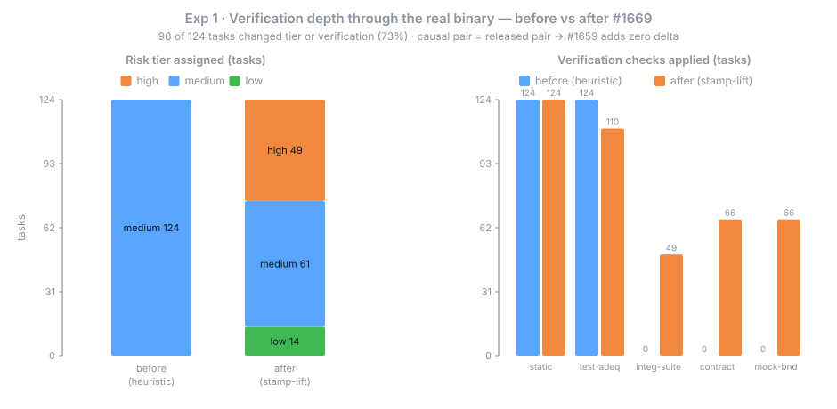

# Delegation Pipeline — Executed Empirical Benchmark (#1670)

**Date:** 2026-07-09

The properly-executed re-run of the #1636 delegation benchmark. The prior study (`2026-07-09-1636-plan-format-corpus.md`, `quality-ab/ANALYSIS.md`) **modeled** the system — it called the pure `classifyTask` directly, *assumed* the native model baseline (`NATIVE_FLAT_MODEL='opus'`), and tested only fully-specified tasks — so its conclusions were marked PROVISIONAL. This document replaces each modeled number with an **executed** one: three experiments driven through the real released binary, real headless Claude Code, and a mechanically-run mutation grader, charted to the bifrost benchmark standard.

Three findings, all now on measured ground:

1. **Verification depth** — through the real binary, the #1669 stamp-lift fix corrects the verification depth of **90 of 124** corpus tasks (73%); the causal pair (the fix alone) and the released pair are **identical**, so the co-resident #1659 adds zero delta.
2. **Model selection** — native Claude Code **did not assign distinct per-subagent models**: all 6 dispatched subagents (2 runs × 3) inherited the **session** model (`claude-sonnet-5`), the model each session was launched with. This retires the *assumed* flat-`opus` baseline — measured native is flat on the session model, not a fixed `opus`. **Caveat (N=2 spike):** both runs pinned `--model sonnet`, so this establishes that native did not *override* the pin per-subagent on a trivial plan; it does not measure native's default routing on an *unpinned* session (see Exp 2 below).
3. **Correctness under under-specification** — a **clean null**: with edge cases that must be *discovered*, the verification steer (E) and the bare arm (N) tie exactly on the hidden oracle. The steer's measured value is **process** — durable, mutation-adequate tests (E 12/12 vs opus-N 3/6, sonnet-N 0/6), now graded by the mutation gate rather than self-reported.

## Environment

| | |
|---|---|
| Exp 1 — binaries | Real single-file MCP binaries spawned per arm; `prepare_delegation` over the stamped `docs/specs/` corpus (124 tasks). **Model-free** (deterministic classification, no LLM). |
| Exp 1 — causal pair | `585c154c` (`a240b4d8^`, before) → `a240b4d8` (#1669, after) — differ by #1669 **alone** (fix-isolating) |
| Exp 1 — released pair | `f70b1e82` (`v2.12.0-preview.1`, before) → `5501cce6` (`v2.12.0-preview.2`, after) — ships #1669 **and** the co-resident #1659 (`585c154c`) confound |
| Exp 2 — native binary | `claude-code` CLI **2.1.206**, `claude -p --output-format stream-json`; harness at `b7dd0fce` |
| Exp 2 — session model | `claude-sonnet-5` (`--model sonnet`); 2 real runs, 3 `general-purpose` subagents each |
| Exp 3 — harness | `quality-ab` E-vs-N A/B over **under-specified** task variants; mechanical diff-scoped mutation grading. Drives `claude -p` as a text generator with the production steer note — **no exarchos binary is executed** (the `v2.12.0-preview.1` tag below is the repo pin, not a spawned binary). |
| Exp 3 — steer pin / models | `v2.12.0-preview.1` (`295c2523`, source of the steer note); **opus** (`claude-opus-4-8`) + **sonnet** (`claude-sonnet-5`); 24 cells |
| Integrity (DR-7) | Fail-honest, pinned provenance, mechanical-only grading — no assumed/modeled number substituted for a measured one |
| Raw data | [`data/2026-07-09/`](data/2026-07-09/) — [exp1 CSV](data/2026-07-09/exp1-before-after.csv), [exp2 CSV](data/2026-07-09/exp2-native-baseline.csv), [exp3 CSV](data/2026-07-09/exp3-underspec-ab.csv), [binaries provenance](data/2026-07-09/binaries.provenance.json) |

## Figures

Charts regenerate from the committed raw CSV with [`generate_charts.py`](data/2026-07-09/generate_charts.py) (pure stdlib, deterministic, no network).

<p align="center"></p>

**Figure 1 — Verification depth, before vs after #1669 (through the real binary).** Driven through each spawned MCP binary over the stamped `docs/specs/` corpus. Before the fix the heuristic (no `planPath`) collapses **all 124** tasks to a flat `medium` tier with two checks and no boundary. After, the plan's stamps lift depth to its true shape: **49** tasks gain `check_integration_suite`, **66** gain `check_contract_drift` + `check_mock_boundary`, and **14** low-risk tasks are relieved of the test-adequacy gate — **90 of 124 (73%)** change tier or verification. The **causal pair** (the fix alone) and the **released pair** are byte-identical on this diff, so the co-resident #1659 contributes **zero** delta; #1669 is the sole cause.

<p align="center"></p>

**Figure 2 — Measured native model distribution (2 real `claude -p` runs).** Native Claude Code, driven headless with a spec as its plan, dispatched **3 `general-purpose` subagents per run**, and **every one inherited the session model** (`claude-sonnet-5`) — one distinct model across all six, not a routed mix. This retires the prior benchmark's unmeasured `NATIVE_FLAT_MODEL='opus'` assumption: native is flat, but on **the session model** (whatever `--model` selects), not a fixed `opus`. Mechanics and the two attribution variants (direct vs. session-single) are documented in [`native-baseline/MECHANICS.md`](native-baseline/MECHANICS.md).

<p align="center"></p>

**Figure 3 — Correctness vs process under under-specification, E vs N.** On **under-specified** variants (edge cases stripped from the spec; the validated hidden oracle unchanged), the verification steer produces **no correctness delta**: E and N tie at a mean oracle pass rate of **0.921** in every model. Under-specification lowered *absolute* correctness (from the fully-specified round's 100%) but opened **no gap between the arms** — the clean null the provisional study could not probe. The steer's measured payoff is **process**: E left durable, **mutation-adequate** tests in **12/12** cells across both models, where the bare arm did so inconsistently (opus-N **3/6**) or never (sonnet-N **0/6**). Adequacy is scored by the diff-scoped mutation gate, not self-reported.

## Executed conclusions

### 1. Verification depth — real, and the fix is the sole cause

Exp 1 supersedes the deterministic arm's *modeled* "45/100 under-provisioned." Through the real tool surface, the pre-fix binary — which has **no `planPath` support** (added by #1669) — classifies every corpus task by heuristic to a flat `medium`, so the plan's `high`/`boundary` stamps never reach dispatch. The fixed binary lifts them: **90/124** tasks change tier or verification, **49** regaining the integration rung and **66** the boundary contract/mock steers. Because the **causal pair and released pair are identical**, the effect is attributable to #1669 alone — #1659, though co-resident in the released window and touching the same `prepare-delegation.ts` path, moves nothing here.

### 2. Model selection — no per-subagent override observed; the assumed baseline retired

Exp 2 re-grounds the "vs native" model baseline. Across both runs native dispatched every subagent on the single session model — it did **not** route a per-subagent mix. That measured result retires the `NATIVE_FLAT_MODEL='opus'` literal: pin "native" to the run's session model, not a constant. Against this baseline, exarchos's routing (which the *deterministic arm* modeled as 99/100 corpus tasks to `opus`, 1 to `haiku`) is ≈ undifferentiated.

**What this does and does not establish.** It is a spike (**N=2**, a trivial synthetic 3-task plan), and both runs **pinned `--model sonnet`** — so it shows native does not *override* an explicit session model per-subagent, not that native has *no* default routing on an unpinned session (the stronger question the spec posed remains open pending a default-model run). And the "≈ undifferentiated" comparison still leans on the *modeled* deterministic-arm routing, so read "the pipeline is not a model-cost optimizer" as **directional**, not as an executed result — the measured half is the native-side baseline, not the exarchos-side routing.

### 3. Correctness under under-specification — clean null; value is durable tests

Exp 3 closes the discriminator the provisional study flagged as untested (spec *completeness*, not difficulty). Even when the corners must be **discovered**, the E regime buys **no first-pass correctness** — E and N tie exactly on the hidden oracle on both a strong and a weak model. What the E regime reliably buys is **durable, mutation-adequate regression tests**: 12/12 for E vs 3/6 (opus) and 0/6 (sonnet) for N, now graded mechanically (the diff-scoped mutation gate, not a self-reported kill-probe). This confirms and hardens the provisional "process delta, not correctness delta" reading.

Two honesty notes on the durable-test delta. First, the E arm's prompt both carries the production steer note **and** explicitly asks for a `test.ts` file, whereas N ("implement it") is not asked for one — so the 12/12-vs-3/6/0/6 gap is an **E-regime** effect (steer + test request together), not proof that the note's *content* alone persuades a model to test. Second, what is unambiguously the steer's own contribution is the mechanical **adequacy** of the tests that E did write (every one killed its mutants), which the mutation gate scores independently of who was asked.

### Bottom line

On measured ground, the delegation pipeline earns its keep as a **verification-depth and durable-test mechanism**, not a one-shot-correctness optimizer. The #1669 stamp-lift is the load-bearing, *fully executed* fix (it makes verification depth track the plan for 90/124 tasks through the real binary); the correctness steer's measured payoff is durable, mutation-adequate regression tests, not a first-pass right-answer boost. The model-routing story is weaker evidence — the native baseline is now *measured* (flat on the session model) but the exarchos-side "≈ no-op" still rests on the modeled deterministic arm and a session-pinned spike, so treat "not a model-cost optimizer" as directional pending an unpinned native run.

## Integrity & provenance (DR-7)

Every raw-data artifact is stamped with `{ binaryTag, gitSha, modelIds, date }` and a `source` discriminant, and admits only `source: measured`. Exp 1 is model-free (deterministic classification; `modelIds: ['none']`). Exp 2 carries a structural fail-honest guarantee — a run where native does not delegate yields a **blocked** record with *no* model distribution, never a fabricated one. Exp 3 grades correctness, typecheck, and mutation-adequacy **only** when the harness runs them. The honest limit of the provenance backstop (it enforces presence and rejects self-declared `modeled`, but cannot detect a mislabeled pure-function result) is why the experiments drive the *real* binary / headless CC / mutation gate — the mechanism, not just the belt.

## Reproduce

```bash
# Exp 1 — before/after diff through the real binaries
npx vitest run servers/exarchos-mcp/src/evals/benchmarks/exp1-binary-driver.test.ts

# Exp 2 — native-baseline parser fidelity + fail-honest (vs captured fixtures)
npx vitest run docs/evals/native-baseline/harness.test.ts
#   live run: tsx docs/evals/native-baseline/harness.ts <specPath> --model sonnet

# Exp 3 — under-specified E-vs-N capture + mechanical grading
npx vitest run docs/evals/quality-ab/run-underspec.test.ts docs/evals/quality-ab/grade.test.ts

# Figures — regenerate the SVGs from the committed CSVs (pure stdlib, no network)
python3 docs/evals/data/2026-07-09/generate_charts.py
```

## Supersedes

- [`2026-07-09-1636-plan-format-corpus.md`](2026-07-09-1636-plan-format-corpus.md) — the modeled deterministic arm. Its **verification-depth** (Dimension 2) and **model-selection** (Dimension 1) conclusions are replaced by Exp 1 and Exp 2 here; its model×risk-tier cross-tab is retained for detail.
- [`quality-ab/ANALYSIS.md`](quality-ab/ANALYSIS.md) — the fully-specified A/B. Its **process-delta** finding is confirmed and its **correctness-null** is extended to under-specified tasks (Exp 3), with the self-reported kill-probe replaced by mechanical mutation grading.
- Full design & decomposition: [`../specs/2026-07-09-1670-delegation-empirical-testing.md`](../specs/2026-07-09-1670-delegation-empirical-testing.md).
