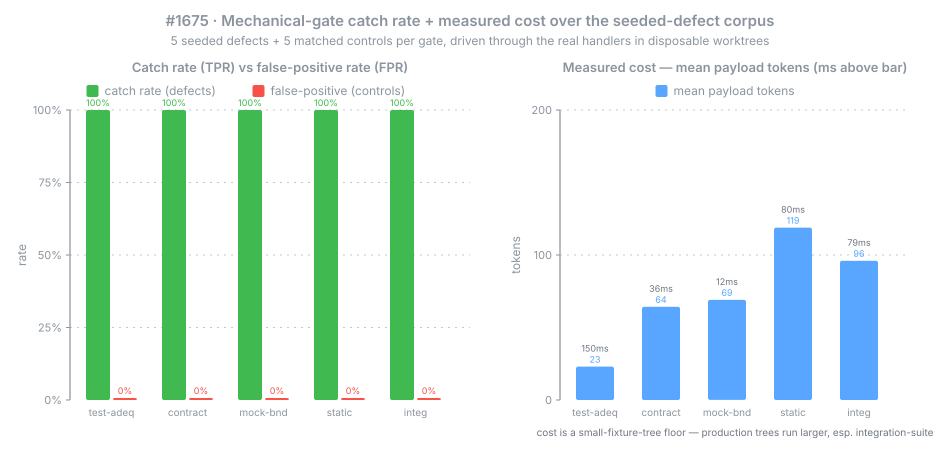

# Mechanical-Gate Catch-Rate Benchmark (#1675, Bundle A)

**Date:** 2026-07-10

The enforcement-floor measurement #1670 left open. #1670 measured verification *depth calibration* but never asked the prior question: **do the mechanical gates actually catch the defects they exist to catch?** This document answers it by driving the **five real `exarchos_orchestrate` gate handlers** over a purpose-built **seeded-defect corpus** — inputs that *should* fail verification, with matched known-good controls — and measuring, per gate, the true-positive catch rate on defects and the false-positive rate on controls, plus the per-cell cost columns the DR-5 Pareto plane consumes.

**Headline:** on this corpus every gate is a clean separator — **catch rate 100% (5/5) and false-positive rate 0% (0/5) for all five gates, with zero invalid cells** — so **no gate is flagged for redesign or removal**. Read this as a *floor on the easy center*, not a proof of gate quality: the seeded defects are **canonical clean-hits** for each gate's detector and the controls are authored to be **unambiguously clean** (they avoid each gate's known false-positive trigger), so 100%/0% here is close to guaranteed-by-construction — it establishes that no gate is anywhere near the redesign threshold, **not** that the gates are proven on the precision/recall **failure tail**. Probing that tail (harder defects, near-miss controls, non-saturating metrics) is the job of the Bundle-B harder corpus (DR-4); the DR-9 "which gates earn their keep" verdict must draw on that tail, not on this floor. §Verdict states the N=5 confidence bound and the one known precision caveat, and §Honest scope states what the small hermetic fixtures structurally cannot see.

## Summary

- **Five mechanical gates, all clean separators (N=5 defects + 5 controls each):**

| gate | defect class | catch rate (TPR) | false-positive rate (FPR) | invalid | verdict |
|---|---|---|---|---|---|
| `check_test_adequacy` | vacuous / tautological test | **100%** (5/5) | **0%** (0/5) | 0 | keep |
| `check_contract_drift` | broken seam contract | **100%** (5/5) | **0%** (0/5) | 0 | keep |
| `check_mock_boundary` | over-mocked (unowned) boundary | **100%** (5/5) | **0%** (0/5) | 0 | keep* |
| `check_static_analysis` | type / lint violation | **100%** (5/5) | **0%** (0/5) | 0 | keep |
| `check_integration_suite` | broad-blast regression | **100%** (5/5) | **0%** (0/5) | 0 | keep |

\* `check_mock_boundary` keeps its verdict but is **detection-only, not enforcement**: the gate is advisory by default (its handler forces `passed = true` unless severity is explicitly `blocking`), so a "catch" here (`findings > 0`) **blocks nothing in the shipped default config** — unlike the other four rows, whose `passed === false` is the same flag a blocking phase-gate acts on. It also carries a documented identifier-heuristic precision caveat (§Verdict). Read its 100% as *detection* coverage, not enforced protection.

- **Dropped-edge-case class — a declared deviation, not a gate row.** No production gate can catch a silently-dropped edge case, so this sixth class is detected by an eval-side **hidden oracle**, not a mechanical gate. Its hidden oracle correctly detected **5/5 seeded defects** and left **5/5 controls** clean, and it is recorded in the CSV as `ungated` pass-through — the escaped-defect substrate for the DR-5 gate-policy replay (task 006), **never a row in the catch-rate table above**. The rationale: a catch rate is only meaningful for a gate that exists.

## Environment

| | |
|---|---|
| Corpus | `servers/exarchos-mcp/src/evals/benchmarks/seeded-defects/` — 6 classes × (5 seeded defects + 5 matched controls) = **60 fixtures**; inert JSON file-map assets materialized into disposable worktrees at load time. **Deterministic, offline, model-free** (no LLM). |
| Tier stamps | Classifier-derived: `deriveRiskTier` / `deriveBoundaryTouching` over each fixture's real changed-file paths — never hand-assigned. Corpus spans **medium + high** tiers and **both** boundary states. |
| Driver | `.../seeded-defects/catch-rate-driver.ts` — each fixture materialized into a throwaway git worktree; its class's **real handler** (`handleTestAdequacy` / `handleStaticAnalysis` / `handleContractDrift` / `handleMockBoundary` / `handleCheckIntegrationSuite`) called directly against an **ephemeral event store** (never the project store). |
| Verdict convention | `check_mock_boundary` is advisory (a catch = `findings > 0`); the other four signal a catch via `passed === false`. A skipped/unparseable gate or a handler crash → an explicit `invalid` cell, never a fabricated verdict. |
| Measurement host | Linux x86-64, 32 cores; Node v24.12.0, Bun 1.3.12 (the driver reaches `bun:sqlite` through the real event store, so it runs under `bun`). Wall-clock ms below are a snapshot of THIS host. |
| Integrity (DR-8) | Fail-honest; ephemeral stores + disposable worktrees only; the committed CSV is provenance-stamped `{ binaryTag, gitSha, modelIds, date }` with `source: measured` via `src/evals/provenance.ts`. |
| Raw data | [`data/2026-07-10/gate-catch-rate.csv`](data/2026-07-10/gate-catch-rate.csv) — 60 per-cell rows with verdict + wall-clock ms + payload tokens. |

## Figure

The chart regenerates byte-for-byte from the committed CSV with [`generate_charts.py`](data/2026-07-10/generate_charts.py) (pure stdlib, deterministic, no network) — it reads only the committed CSV and never re-drives the gates.

<p align="center"></p>

**Figure 1 — Catch rate + measured cost per gate.** Left: every gate catches all five of its seeded defects (green, 100%) and flags none of its five controls (red, 0%) — a clean separation with no invalid cells. Right: the DR-5 cost columns, mean gate-result payload tokens per gate with the mean wall-clock ms annotated above. These costs are a **small-fixture-tree floor** — production trees run larger, especially `check_integration_suite` (§Honest scope).

## Per-gate detail

Cost columns are means over each gate's 10 cells (snapshot of the measurement host):

| gate | defects caught | controls flagged | mean payload tokens | mean wall-clock ms |
|---|---|---|---|---|
| `check_test_adequacy` | 5/5 | 0/5 | ~23 | ~132 |
| `check_contract_drift` | 5/5 | 0/5 | ~64 | ~23 |
| `check_mock_boundary` | 5/5 | 0/5 | ~69 | ~13 |
| `check_static_analysis` | 5/5 | 0/5 | ~119 | ~78 |
| `check_integration_suite` | 5/5 | 0/5 | ~96 | ~82 |

The seeded-defect mechanisms exercised are real and distinct within each class — e.g. `check_test_adequacy` defects are five different *vacuous* tests (pure tautology, constant fold, `typeof`-only, truthiness-only, never-equal sentinel) that each survive the kill-probe's source revert; `check_static_analysis` defects are five different parse/lint violations; `check_integration_suite` defects include the #1329 load-failure cascade (failed suites, zero failed tests) that per-task gates miss. Full mechanisms are in each fixture's `defectMechanism`.

## Verdict

**Flag rule:** flag any gate with a low catch rate (TPR materially below ~0.8) **or** a high false-positive rate (FPR above ~0.1) for redesign or removal.

**Result: no gate meets the flag rule.** All five separate their seeded defects from their matched controls perfectly on this corpus. Two honest bounds on that verdict:

- **Confidence at N=5 (Open Question 1).** A 5/5 point estimate has a wide interval: the Wilson 95% CI lower bound for 5/5 is ≈ **57%**, and for 0/5 the upper bound is ≈ **43%**. The perfect scores therefore establish that **no gate is anywhere near the redesign threshold**, not that each is exactly 100%. Because every gate *saturates* cleanly (there is no borderline gate whose verdict N would flip), raising N would tighten the interval but cannot change the keep/redesign decision — so N=5 is sufficient to answer this benchmark's question. A finer-grained follow-up (more defect *mechanisms* per class) is tracked for the harder-corpus work in DR-4, not blocking here.
- **`check_mock_boundary` precision caveat.** Its detector is a documented ~94%-precision identifier-boundary heuristic: an ordinary identifier that embeds a family word at a camelCase hump (e.g. `fakeServer`, `createStub`) trips it even with no mock present. This corpus's controls are authored to be unambiguously clean (so the measured 0% FPR reflects the gate on clean code), but a real codebase will surface some false positives from this heuristic — a precision limit to weigh before making the gate *blocking*, not a reason to remove it.

## Honest scope — what this benchmark structurally cannot see

1. **The dropped-edge-case deviation is declared, not hidden.** The sixth corpus class has **no production gate** — a silently-dropped edge case leaves no mechanical signature (types check, the test suite passes, the contract holds). It is detected only by an eval-side **hidden oracle** and is therefore recorded as `ungated` and **excluded from the catch-rate table** above. This is a deliberate deviation from #1675's original six-row table; the rationale is that a catch rate is only meaningful for a mechanical gate that exists. The class earns its keep as the **escaped-defect substrate** for the DR-5 gate-policy replay (task 006), which measures which policies let it through.
2. **Wall-clock cost is a machine-dependent snapshot.** The ms columns were measured on the host above (Linux, 32 cores, Node 24 / Bun 1.3). A re-run reproduces the **shape** of the cost ordering, not identical milliseconds. The provenance-stamped CSV pins the source state; the chart regenerates byte-identically from that CSV because it reads the *committed* numbers, never a fresh timing.
3. **Gate cost on small fixture trees understates production cost.** Each fixture is a few files, so these are a **floor**. `check_integration_suite` is the sharpest example: here it parses a tiny committed vitest-JSON blob, whereas in production it runs the *entire* suite (thousands of tests, tens of seconds). `check_static_analysis` likewise runs a one-file `node --check`, not a full `tsc` over a real tree. Read the token/ms columns as relative floors between gates, not as production budgets.
4. **Derived tiers are exogenous to the *replay*, not to corpus *construction*.** The tier stamps are computed by the production classifier from each fixture's file paths, so no downstream policy replay reassigns them (the anti-pinning contract). But the author's choice of file paths *does* steer the tiers — `contracts/openapi.json` derives high, `src/mod.js` derives medium. That steering is made **visible** by the multi-tier-span test and the per-tier escape breakdowns in the DR-5 replay, rather than eliminated.

## Integrity & provenance (DR-8)

The committed CSV is stamped `{ binaryTag: v2.12.0-preview.2, gitSha, modelIds: [none], date: 2026-07-10 }` with `source: measured`, validated through `src/evals/provenance.ts` (which rejects any non-`measured` discriminant). The benchmark is **model-free** — the mechanical gates are deterministic, so `modelIds` carries the `none` sentinel only to satisfy the provenance non-empty invariant. Every verdict is produced by a **real handler call**, never self-reported: a handler crash, a skipped gate, or an unparseable suite yields an explicit `invalid` cell that is counted separately and never inflated into a catch. Benchmark runs write their `gate.executed` emissions into an **ephemeral event store** under the OS temp dir — never the project event store — and use disposable worktrees only.

## Reproduce

```bash
cd servers/exarchos-mcp && npm install    # nested node_modules (fresh worktree)

# Unit + integration coverage (corpus loader, derived tiers, real-gate driver):
npx vitest run src/evals/benchmarks/seeded-defects/corpus.test.ts
npx vitest run src/evals/benchmarks/seeded-defects/catch-rate-driver.test.ts

# Re-drive the corpus through the five real gates and REGENERATE the CSV.
# (Run under `bun` — the gate handlers reach the real event store's `bun:sqlite`.)
bun run src/evals/benchmarks/seeded-defects/catch-rate-driver.ts

# Regenerate the figure byte-identically from the committed CSV (pure stdlib):
python3 docs/evals/data/2026-07-10/generate_charts.py
```

Note: the driver's wall-clock ms columns are host-dependent, so a re-drive reproduces the table **shape** (100% TPR / 0% FPR / 0 invalid across all five gates), not identical millisecond values. The chart, by contrast, reproduces byte-for-byte because it reads only the committed CSV.
