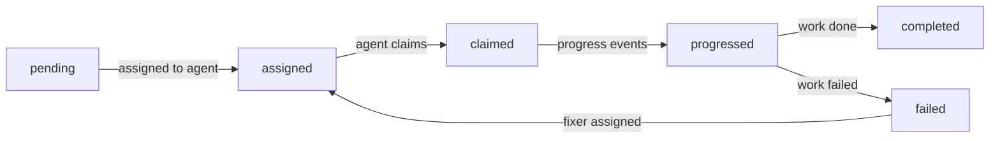

# Agent Model

## Typed agents vs. generic prompting

The simplest approach to agent-assisted development is one agent that does everything: reads code, writes code, runs tests, reviews its own work, fixes its own bugs. You guide it with a long system prompt and hope it stays on track.

This works for small tasks. For complex features spanning multiple files with testing and review, a single agent starts to drift. It "remembers" what it intended to write and reviews leniently. It tries to fix a test failure by modifying the test instead of the code. Under context pressure, it skips steps.

Exarchos takes a different approach: three focused agents, each with a specific role, scoped tools, and behavioral constraints.

Implementer (`exarchos-implementer`) writes code using TDD. Has read/write file access. Cannot spawn subagents. Follows red-green-refactor: write a failing test, write the minimum code to pass it, clean up. Reports a structured completion summary listing implemented requirements, test files, and changed files.

Reviewer (`exarchos-reviewer`) analyzes code for quality and design compliance. Has read-only file access: `Read`, `Grep`, `Glob`, and `Bash` (restricted to read-only commands). Cannot use `Write` or `Edit`. This is enforced at the tool level via `disallowedTools`, not just a prompt instruction. The reviewer checks design requirement coverage, test adequacy, and common anti-patterns, then produces a structured verdict.

Fixer (`exarchos-fixer`) diagnoses and repairs failures. Has read/write access like the implementer, but follows an adversarial protocol: reproduce the failure first, identify the root cause, apply a minimal fix, verify, run the full test suite for regressions. The fixer receives the full failure context from the failed task, so it starts with diagnostic information rather than guessing.

## Worktree isolation

Each subagent gets its own git worktree, a separate working directory backed by the same repository. This is specified in the agent definition with `isolation: worktree`.

Worktree isolation prevents several real problems:

- Two implementers working on different tasks can't overwrite each other's files.
- A fixer repairing a failed task doesn't interfere with work in progress on other tasks.
- The orchestrator's working directory stays clean for coordination tasks.
- If an agent produces bad output, its worktree can be discarded without affecting anything else.

After a subagent completes, its changes exist on a branch in the worktree. The orchestrator merges them back via standard git operations. When the workflow completes or is cancelled, worktrees are cleaned up.

## Runbook protocol

Each workflow phase has a runbook: a machine-readable sequence of steps the agent should follow. Agents retrieve their runbook via:

```json
{ "action": "runbook", "phase": "delegate" }
```

The runbook returns structured data, not prose. Each entry specifies the tool to call, the action, its purpose, which events to emit, the transition criteria, and guard prerequisites:

```
Skill: @skills/delegation/SKILL.md
Tools: exarchos_workflow (get: Read task list), exarchos_event (append: Emit task.assigned)
Events to emit: task.assigned -- On dispatch of each task, team.spawned -- After team creation
Transition: All tasks complete -> review | Guard: tasks[].status = 'complete'
```

The runbook also flags human checkpoints, phases where the agent should pause and wait for user input before proceeding. The feature workflow has two: plan-review (approve the approach) and synthesize (approve the merge).

This protocol means agents don't need to interpret long prose instructions about what to do in each phase. The runbook tells them exactly which tools to call and when, and the state machine enforces that they follow the prescribed transitions.

## Hook system

Eight lifecycle hooks automate verification at specific moments in the workflow. Hooks are defined in `hooks.json` and run as lightweight CLI subcommands with tight timeouts:

| Hook | When it fires | What it does | Timeout |
|------|--------------|--------------|---------|
| `SessionStart` | Session starts or resumes | Checks for active workflows, loads context | 10s |
| `PreCompact` | Before context compaction | Saves a workflow checkpoint to survive compaction | 30s |
| `PreToolUse` | Before any Exarchos MCP call | Phase/role guard -- blocks invalid tool calls | 5s |
| `TaskCompleted` | After a subagent task finishes | Runs convergence gates on the completed work | 120s |
| `TeammateIdle` | When a spawned teammate is idle | Verifies work quality before proceeding | 120s |
| `SubagentStart` | When a subagent is spawned | Injects workflow context into the subagent | 5s |
| `SubagentStop` | When an implementer/fixer finishes | Collects results from the subagent | 10s |
| `SessionEnd` | When the session ends | Records session metrics and cleanup | 30s |

Hooks run as fast-path subcommands that skip heavy initialization (no SQLite backend, no eval dependencies). They read stdin as JSON, perform their check, and write JSON to stdout. The `PreToolUse` guard is the most critical: it validates that the requested tool action is allowed in the current workflow phase and for the caller's role, preventing agents from calling tools they shouldn't have access to.

## Task lifecycle

Tasks are the unit of work within a workflow. They follow a defined lifecycle:



Tasks are created during the planning phase and assigned during delegation. When a subagent starts, it claims its assigned task. Progress events track TDD phases (red, green, refactor) as the implementer works. On completion, the task includes evidence (test output, build results) that convergence gates can verify.

Failed tasks can be reassigned to a fixer agent. The fixer receives the full failure context: the error message, diagnostic information, and the original task description. This gives the fixer a head start compared to starting from scratch.

Task events (`task.assigned`, `task.claimed`, `task.progressed`, `task.completed`, `task.failed`) are all recorded in the event store, providing a complete audit trail of who did what and when.
