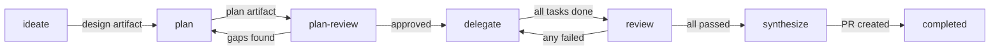
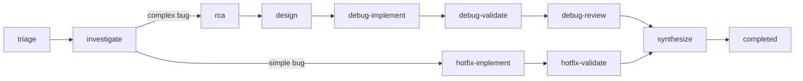
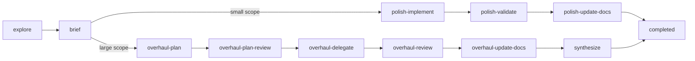
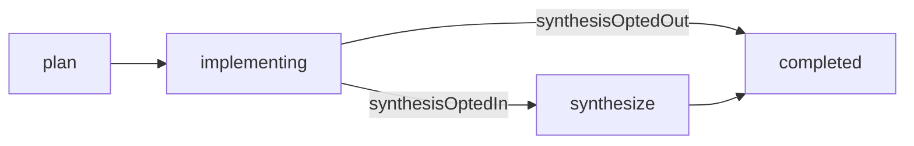

# State Machine

## What it is

Exarchos uses a hierarchical state machine (HSM) to control which workflow phases an agent can move between and what conditions must be met before each transition. The HSM is the gatekeeper: if the state machine rejects a transition, it doesn't happen.

Each workflow type (feature, debug, refactor) defines its own set of phases, valid transitions, and guard conditions. The state machine is a pure function. It takes the current state and a target phase, computes what should happen, and returns the result. It does not perform I/O. The caller handles persistence.

## Workflow phases

### Feature workflow



The feature workflow follows a linear path from idea to shipping code. The `plan-review` phase is a human checkpoint -- the agent pauses and waits for your approval before writing any code. The `delegate` to `review` loop is where fix cycles happen: if code review finds issues, work returns to delegation for fixes, up to a maximum of 3 cycles before the circuit breaker trips.

### Debug workflow



The debug workflow branches after investigation. Simple bugs take the hotfix track (implement, validate, done). Complex bugs take the thorough track (root cause analysis, fix design, implement, validate, review). The track selection is guard-controlled: `state.track` must be set to `"hotfix"` or `"thorough"` before the transition is allowed.

### Refactor workflow



Refactoring also branches by scope. Polish track is for small, focused changes done directly by the orchestrator. Overhaul track mirrors the feature workflow with planning, delegation, and review phases.

### Oneshot workflow



Introduced in v2.6.0. The oneshot workflow is a lightweight four-phase path for trivial changes that don't warrant the ceremony of the feature pipeline. Everything runs in-session — no subagent dispatch, no two-stage review, no compound state, no fix-cycle circuit breaker.

The fork after `implementing` is a **choice state** (UML terminology) implemented as two mutually-exclusive HSM transitions. The guards are pure functions of `state.oneshot.synthesisPolicy` (declared at init) and the count of `synthesize.requested` events on the stream. The `finalize_oneshot` orchestrate action evaluates the guards and calls `handleSet` with the resolved target phase. The HSM re-evaluates the guard at the transition boundary as a safety net.

| From | To | Guard | Prerequisite |
|------|----|-------|--------------|
| `plan` | `implementing` | `oneshot-plan-set` | Set non-empty `artifacts.plan` (`oneshot.planSummary` is optional metadata but does not satisfy the guard on its own) |
| `implementing` | `synthesize` | `synthesis-opted-in` | Policy `always` OR (`on-request` + at least one `synthesize.requested` event) |
| `implementing` | `completed` | `synthesis-opted-out` | Policy `never` OR (`on-request` + no `synthesize.requested` event) |
| `synthesize` | `completed` | `pr-url-exists` | Set `synthesis.prUrl` or `artifacts.pr` |

**Policy precedence.** `synthesisPolicy = "never"` causes `synthesis-opted-out` to short-circuit regardless of events — any `synthesize.requested` events on the stream are ignored. `synthesisPolicy = "always"` causes `synthesis-opted-in` to short-circuit to `synthesize` regardless of events. Only `"on-request"` (default) consults the event stream.

The policy value is embedded in the `workflow.started` event payload so it survives ES v2 rematerialization — rehydrating a oneshot workflow from events alone preserves the init-time routing intent.

## Guards

Guards are preconditions checked before a transition is allowed. Each guard is a pure function that inspects the current state and returns either `true` or a structured failure with an explanation, the expected state shape, and a suggested fix.

For example, the `plan-artifact-exists` guard checks for `state.artifacts.plan`. If it is missing, the guard returns:

```json
{
  "passed": false,
  "reason": "plan-artifact-exists not satisfied",
  "expectedShape": { "artifacts": { "plan": "<path-or-content>" } },
  "suggestedFix": {
    "tool": "exarchos_workflow",
    "params": { "action": "set", "featureId": "...", "updates": { "artifacts": { "plan": "..." } } }
  }
}
```

This pattern of structured failures with remediation hints is critical for agent workflows. The agent doesn't need to guess what went wrong or what to do about it. The guard tells it exactly which tool call will fix the problem.

Some commonly used guards:

| Guard | Checks | Used at |
|-------|--------|---------|
| `design-artifact-exists` | `artifacts.design` is set | ideate to plan |
| `plan-artifact-exists` | `artifacts.plan` is set | plan to plan-review |
| `plan-review-complete` | `planReview.approved` is true | plan-review to delegate |
| `all-tasks-complete` | every task has status `complete` | delegate to review |
| `all-reviews-passed` | every review has a passing status | review to synthesize |
| `pr-url-exists` | `synthesis.prUrl` or `artifacts.pr` is set | synthesize to completed |
| `merge-verified` | `_cleanup.mergeVerified` is true | any phase to completed (universal) |

Guards can be composed: the `delegate` to `review` transition requires both `all-tasks-complete` AND `team-disbanded-emitted` to pass. The `composeGuards` function combines multiple guards into one, returning the first failure encountered.

## Universal transitions

Two transitions are available from any non-final phase:

- Cancel. Any phase can transition to `cancelled`. Cancellation triggers saga compensation, cleaning up worktrees, recording the cancellation reason, and emitting compensation events.
- Cleanup. Any phase can transition to `completed` via the `merge-verified` guard. This is the universal "skip to done" path for workflows where PRs were merged outside the normal flow.

## Circuit breaker

The fix cycle between delegation and review can loop if the agent keeps producing code that fails review. To prevent infinite loops, compound states (like the feature workflow's `implementation` compound) have a `maxFixCycles` limit.

The circuit breaker counts `fix-cycle` events within the current compound entry. When the count hits the limit (3 for feature implementation, 2 for debug thorough track), the transition is rejected with a `CIRCUIT_OPEN` error. At this point, the workflow needs human intervention.

## Why a state machine

Agents under context pressure can drift. When the context window is 90% full and compaction is imminent, an agent might try to skip the review phase and jump straight to PR creation. The state machine prevents this: the transition from `delegate` to `synthesize` doesn't exist, so the attempt fails with a clear error listing the valid targets.

Each phase has explicit entry and exit criteria encoded as guards. Invalid requests get helpful error messages instead of silent failures. This means you can trust that a workflow in the `synthesize` phase actually went through planning, implementation, and review, because the state machine enforced it.
