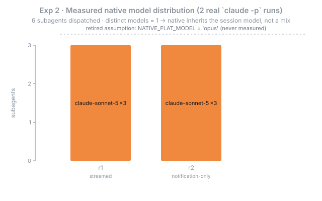
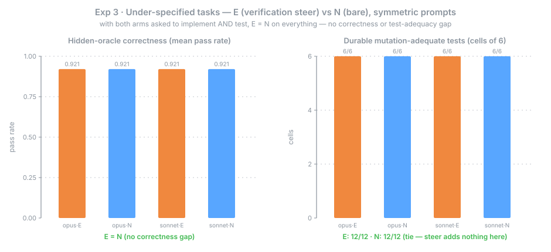

# Delegation Pipeline — Executed Empirical Benchmark (#1670)

**Date:** 2026-07-09

The properly-executed re-run of the #1636 delegation benchmark. The prior study (`2026-07-09-1636-plan-format-corpus.md`, `quality-ab/ANALYSIS.md`) **modeled** the system — it called the pure `classifyTask` directly, *assumed* the native model baseline (`NATIVE_FLAT_MODEL='opus'`), and tested only fully-specified tasks — so its conclusions were marked PROVISIONAL. This document replaces each modeled number with an **executed** one: three experiments driven through the real released binary, real headless Claude Code, and a mechanically-run mutation grader, charted to the bifrost benchmark standard.

Three experiments — **one conclusive, one deferred, one clean null**:

1. **Verification depth (Exp 1) — conclusive.** Through the real binary, the #1669 stamp-lift fix corrects the verification depth of **90 of 124** corpus tasks (73%); the causal pair (the fix alone) equals the released pair **exactly**, so the co-resident #1659 adds zero delta. This is the one executed, *positive* result.
2. **Model selection (Exp 2) — deferred, not concluded.** The spike **pinned `--model sonnet`**, which *forces* a flat per-subagent result, so it cannot measure native's routing — it proved only that the measurement harness works. (Native Claude Code **plan mode / dynamic workflows do route** haiku/sonnet/opus per subtask; they are not flat.) A real "vs native" comparison is blocked until exarchos's own routing defect — [#1672](https://github.com/lvlup-sw/exarchos/issues/1672): model selection is decoupled from the risk classifier and collapses to opus — is fixed **and** the harness is rebuilt to observe *unpinned* dynamic dispatch.
3. **Correctness under under-specification (Exp 3) — clean null.** With edge cases that must be *discovered* **and both arms asked to implement + test** (the corrected symmetric design), the verification steer shows **no measurable benefit**: E and N tie on the hidden oracle (**0.921**), on test-writing (**both 12/12**), and on mutation-adequacy (**both 12/12**). The first run's apparent "durable-test win" (E 12/12 vs N 3/6·0/6) was an artifact of asking *only* the E arm to test; holding the test request constant, the steer's *content* adds nothing here.

## Environment

| | |
|---|---|
| Exp 1 — binaries | Real single-file MCP binaries spawned per arm; `prepare_delegation` over the stamped `docs/specs/` corpus (124 tasks). **Model-free** (deterministic classification, no LLM). |
| Exp 1 — causal pair | `585c154c` (`a240b4d8^`, before) → `a240b4d8` (#1669, after) — differ by #1669 **alone** (fix-isolating) |
| Exp 1 — released pair | `f70b1e82` (`v2.12.0-preview.1`, before) → `5501cce6` (`v2.12.0-preview.2`, after) — ships #1669 **and** the co-resident #1659 (`585c154c`) confound |
| Exp 2 — native binary | `claude-code` CLI **2.1.206**, `claude -p --output-format stream-json`; harness at `b7dd0fce`. **⚠ DEFERRED** — pinned `--model sonnet`, so it measures the harness, not native routing (see [#1672](https://github.com/lvlup-sw/exarchos/issues/1672)). |
| Exp 2 — session model | `claude-sonnet-5` (`--model sonnet`, **pinned** — forces flat); 2 real runs, 3 `general-purpose` subagents each |
| Exp 3 — harness | `quality-ab` E-vs-N A/B over **under-specified** task variants; **symmetric prompts** (both arms implement + test, only the steer varies); mechanical diff-scoped mutation grading. Drives `claude -p` as a text generator — **no exarchos binary is executed** (the tag below is the repo pin, not a spawned binary). |
| Exp 3 — steer pin / models | `v2.12.0-preview.1` (`e96bafa6`, source of the steer note + symmetric harness); **opus** (`claude-opus-4-8`) + **sonnet** (`claude-sonnet-5`); 24 cells |
| Integrity (DR-7) | Fail-honest, pinned provenance, mechanical-only grading — no assumed/modeled number substituted for a measured one |
| Raw data | [`data/2026-07-09/`](data/2026-07-09/) — [exp1 CSV](data/2026-07-09/exp1-before-after.csv), [exp2 CSV](data/2026-07-09/exp2-native-baseline.csv), [exp3 CSV](data/2026-07-09/exp3-underspec-ab.csv), [binaries provenance](data/2026-07-09/binaries.provenance.json) |

## Figures

Charts regenerate from the committed raw CSV with [`generate_charts.py`](data/2026-07-09/generate_charts.py) (pure stdlib, deterministic, no network).

<p align="center"></p>

**Figure 1 — Verification depth, before vs after #1669 (through the real binary).** Driven through each spawned MCP binary over the stamped `docs/specs/` corpus. Before the fix the heuristic (no `planPath`) collapses **all 124** tasks to a flat `medium` tier with two checks and no boundary. After, the plan's stamps lift depth to its true shape: **49** tasks gain `check_integration_suite`, **66** gain `check_contract_drift` + `check_mock_boundary`, and **14** low-risk tasks are relieved of the test-adequacy gate — **90 of 124 (73%)** change tier or verification. The **causal pair** (the fix alone) and the **released pair** are byte-identical on this diff, so the co-resident #1659 contributes **zero** delta; #1669 is the sole cause.

<p align="center"></p>

**Figure 2 — Native spike distribution (2 real `claude -p` runs) — DEFERRED, does not measure native routing.** The spike dispatched 3 `general-purpose` subagents per run, all on `claude-sonnet-5` — but the session was launched with **`--model sonnet` pinned**, which *forces* that flat outcome, so the figure measures the pin, not native's choice. It establishes only that the transcript-measurement harness works and that native did not *override* an explicit pin per-subagent. It does **not** measure native's actual routing: Claude Code plan mode / dynamic workflows do dispatch different models per subtask. A real measurement is blocked on [#1672](https://github.com/lvlup-sw/exarchos/issues/1672) (fix exarchos's own opus-collapsed routing) plus an *unpinned* dynamic-dispatch harness. Mechanics + the honest scope limit are in [`native-baseline/MECHANICS.md`](native-baseline/MECHANICS.md).

<p align="center"></p>

**Figure 3 — Under-specification, E vs N with symmetric prompts.** On **under-specified** variants (edge cases stripped from the spec; the validated hidden oracle unchanged), with **both arms asked to implement and write a durable test** and only the verification steer varying, the steer produces **no measurable benefit on any axis**. Correctness: E and N tie at **0.921** on both models (under-specification lowered *absolute* correctness from the fully-specified round's 100%, but opened no arm gap). Test-writing: both **12/12**. Mutation-adequacy (diff-scoped kill-probe, not self-reported): both **12/12**. The first run's headline "durable-test win" (E 12/12 vs opus-N 3/6, sonnet-N 0/6) came entirely from asking *only* the E arm for a test; once that confound is removed, the bare arm writes equally mutation-adequate tests. **Scope:** small tasks and n=2; the adequacy gate saturates at 6/6 for any genuine test, so it cannot resolve *finer* differences in test quality — a harder corpus or a more sensitive metric could still separate the arms.

## Executed conclusions

### 1. Verification depth — real, and the fix is the sole cause

Exp 1 supersedes the deterministic arm's *modeled* "45/100 under-provisioned." Through the real tool surface, the pre-fix binary — which has **no `planPath` support** (added by #1669) — classifies every corpus task by heuristic to a flat `medium`, so the plan's `high`/`boundary` stamps never reach dispatch. The fixed binary lifts them: **90/124** tasks change tier or verification, **49** regaining the integration rung and **66** the boundary contract/mock steers. Because the **causal pair and released pair are identical**, the effect is attributable to #1669 alone — #1659, though co-resident in the released window and touching the same `prepare-delegation.ts` path, moves nothing here.

### 2. Model selection — deferred; the spike cannot measure native routing

Exp 2 does **not** conclude. Both runs pinned `--model sonnet`, which forces every subagent onto that one model, so "native ran a flat model" is an artifact of the pin, not an observation of native's choice. Retiring the literal `NATIVE_FLAT_MODEL='opus'` by *forcing* `sonnet` is near-tautological. What Exp 2 genuinely established is narrow: the transcript-measurement harness works, the fail-honest blocked path holds, and native does not *override* an explicit pin per-subagent.

Native Claude Code is in fact **not** flat where it matters — **plan mode and dynamic workflows dispatch `haiku`/`sonnet`/`opus` per subtask** as suitable. So the real comparison is exarchos-routing vs *native's differentiated* routing, and it cannot be run yet because exarchos's own routing is broken: model selection is computed from scaffolding-keyword / file-count / testLayer and is **decoupled from the risk tier the classifier already produces**, collapsing ~99/100 corpus tasks to `opus` (filed as [#1672](https://github.com/lvlup-sw/exarchos/issues/1672)). Exp 2 is therefore **blocked** on (a) fixing #1672 so exarchos differentiates at all, and (b) rebuilding the harness to drive native's real *unpinned* dynamic dispatch.

### 3. Correctness under under-specification — clean null on every axis

Exp 3 closes the discriminator the provisional study flagged as untested (spec *completeness*, not difficulty), with the **corrected symmetric design**: both arms are asked to implement **and** write a durable test, and only the verification steer's content varies. On this corpus the steer buys **nothing measurable**:

- **Correctness:** E and N tie exactly on the hidden oracle (0.921) on both a strong and a weak model — even when the corners must be *discovered*.
- **Test-writing:** both arms **12/12** — asked for a test, a capable model writes one, steer or not.
- **Mutation-adequacy:** both arms **12/12** killed — the bare arm's tests are as adequate as the steered arm's (diff-scoped kill-probe, not self-reported).

The first run reported a large "process win" (durable tests E 12/12 vs opus-N 3/6, sonnet-N 0/6). That delta was **entirely** the prompt asymmetry — only the E arm had been asked for a test. Holding the test request constant erases it. So on this evidence the verification steer's *content* (kill-probe mindset, edge-case coverage) does not improve correctness or test adequacy over simply asking for a durable test. **Scope:** small tasks, n=2, and the adequacy gate saturates at 6/6 for any genuine test — so this rules out a *large* steer effect on this corpus, not a subtle one a harder task or finer metric might surface.

### Bottom line

On measured ground, the delegation pipeline's demonstrated value narrows to **one thing: verification-depth calibration** (Exp 1) — the #1669 stamp-lift makes verification depth track the plan for 90/124 tasks through the real binary, and that is fully executed and causally isolated. The other two claimed benefits do **not** survive honest measurement here: the verification steer's *content* shows no correctness or test-adequacy benefit once the test request is held constant (Exp 3, clean null), and the model-routing comparison can't even be run until exarchos stops collapsing to `opus` ([#1672](https://github.com/lvlup-sw/exarchos/issues/1672)) and native's real differentiated routing is measured unpinned (Exp 2, deferred). The pipeline earns its keep as a depth-calibration mechanism; the steer-content and model-routing stories are, respectively, a null and an open question.

## Integrity & provenance (DR-7)

Every raw-data artifact is stamped with `{ binaryTag, gitSha, modelIds, date }` and a `source` discriminant, and admits only `source: measured`. Exp 1 is model-free (deterministic classification; `modelIds: ['none']`). Exp 2 carries a structural fail-honest guarantee — a run where native does not delegate yields a **blocked** record with *no* model distribution, never a fabricated one. Exp 3 grades correctness, typecheck, and mutation-adequacy **only** when the harness runs them. The honest limit of the provenance backstop (it enforces presence and rejects self-declared `modeled`, but cannot detect a mislabeled pure-function result) is why the experiments drive the *real* binary / headless CC / mutation gate — the mechanism, not just the belt.

## Reproduce

```bash
# Exp 1 — before/after diff through the real binaries
npx vitest run servers/exarchos-mcp/src/evals/benchmarks/exp1-binary-driver.test.ts

# Exp 2 — native-baseline parser fidelity + fail-honest (vs captured fixtures)
npx vitest run tests/evals/native-baseline/harness.test.ts
#   live run: tsx tests/evals/native-baseline/harness.ts <specPath> --model sonnet

# Exp 3 — under-specified E-vs-N capture + mechanical grading
npx vitest run tests/evals/quality-ab/run-underspec.test.ts tests/evals/quality-ab/grade.test.ts

# Figures — regenerate the SVGs from the committed CSVs (pure stdlib, no network)
python3 tests/evals/data/2026-07-09/generate_charts.py
```

## Supersedes

- [`2026-07-09-1636-plan-format-corpus.md`](2026-07-09-1636-plan-format-corpus.md) — the modeled deterministic arm. Its **verification-depth** (Dimension 2) conclusion is replaced by Exp 1 (executed). Its **model-selection** (Dimension 1) conclusion is **not** resolved here — Exp 2 is deferred and the routing behaviour it modeled is now tracked as a defect ([#1672](https://github.com/lvlup-sw/exarchos/issues/1672)); its model×risk-tier cross-tab is retained for detail.
- [`quality-ab/ANALYSIS.md`](quality-ab/ANALYSIS.md) — the fully-specified A/B. Its **correctness-null** is confirmed and extended to under-specified tasks (Exp 3). Its **process-delta** finding does **not** survive: that study, like the first Exp-3 run, asked only the E arm to test; under symmetric prompts the durable-test gap vanishes (both arms 12/12 mutation-adequate), so the steer's *content* shows no measured benefit on this corpus.
- Full design & decomposition: [`../specs/2026-07-09-1670-delegation-empirical-testing.md`](../specs/2026-07-09-1670-delegation-empirical-testing.md).
